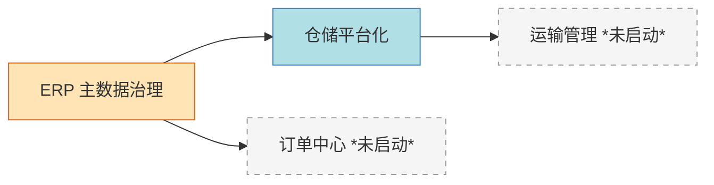

# 零售供应链项目组合看板（Portfolio Dashboard）

> 本仓库管理多个并行推进的零售供应链产品项目（仓储平台化、ERP 等）的非代码交付物：**系统方案 / PRD / 原型 / 汇报材料**。  
> 维护：江某某 ｜ 最近更新：2026-05-26

---

## 一、项目矩阵（一眼看全局）

| 项目代号 | 中文名 | 域 | 阶段 | 优先级 | 负责人 | 目标上线 | 核心指标 | 状态 |
|---|---|---|---|---|---|---|---|---|
| [wms-platform](projects/wms-platform/) | 仓储平台化 | WMS | 设计中 | P0 | 江某某 | 2026-09-30 | 人效 80→100 单/h | 🟡 |
| [erp-master-data](projects/erp-master-data/) | ERP 主数据治理 | ERP | 调研中 | P0 | 江某某 | 2026-12-31 | 主数据准确率 ≥99% | 🟡 |
| _（新增项目复制 `projects/_template/`）_ | | | | | | | | |

**状态图例**：🟢 按计划 ｜ 🟡 关注中 ｜ 🔴 有阻塞 ｜ ⚪ 暂停 ｜ ✅ 已上线

---

## 二、项目依赖关系



---

## 三、本月里程碑

| 日期 | 项目 | 事项 | 状态 |
|---|---|---|---|
| 2026-05-30 | wms-platform | 解决方案 v1.0 业务评审 | 待办 |
| 2026-06-15 | erp-master-data | 主数据现状调研报告 | 待办 |
| 2026-06-30 | wms-platform | PRD v1.0 评审 | 待办 |

---

## 四、目录导航

| 目录 | 内容 |
|---|---|
| [.kiro/steering/](.kiro/steering/) | Kiro 自动遵循的规范：[领域术语](.kiro/steering/domain-glossary.md) ｜ [写作风格](.kiro/steering/writing-style.md) ｜ [项目规范](.kiro/steering/project-conventions.md) |
| [projects/](projects/) | 各项目独立目录，含方案/PRD/原型/汇报 |
| [templates/](templates/) | 全局模板库（方案/PRD/Slidev 汇报/周报） |
| [reports/](reports/) | 跨项目汇报：[周报](reports/weekly/) ｜ [月报](reports/monthly/) ｜ [季度](reports/quarterly/) |
| [shared/](shared/) | 共享资源（图标、行业数据） |

---

## 五、如何使用本仓库

### 🆕 新建一个项目
```bash
cp -r projects/_template projects/{你的项目代号}
# 然后填写 meta.yaml，并在本文件"项目矩阵"中追加一行
```

### 📝 写一份新文档
1. 从 [`templates/`](templates/) 选合适的模板
2. 放到对应项目的 `01-solution / 02-prd / 04-reports` 子目录
3. **直接告诉 Kiro 你的草稿/纪要**，它会按 [写作风格规范](.kiro/steering/writing-style.md) 套结构

### 📊 做一份周报/月报
1. 从 [`templates/weekly-update.md`](templates/weekly-update.md) 复制
2. 放到 `reports/weekly/2026-W{周数}.md`
3. 让 Kiro 基于各项目 `meta.yaml` + 本周更新自动汇总

### 🎤 做一份汇报 PPT
1. 用 [`templates/biz-report-slidev.md`](templates/biz-report-slidev.md)
2. 让 Kiro 把方案/PRD 内容改写成业务语言幻灯片
3. 本地 `slidev export` 一键导出 PDF/PPTX

### 🌐 发布原型供 review
1. 在项目的 `03-prototype/` 写 HTML
2. 仓库 Settings → Pages → Source 选 `main` + `/(root)` 或指定路径
3. 几分钟后即可公网访问，链接发给评审人

---

## 六、给 Kiro 的常用提示词模板

| 场景 | 直接对 Kiro 说 |
|---|---|
| 把会议纪要变成方案初稿 | "把这份纪要按方案模板套结构出 v0.1 草稿，放到 `projects/wms-platform/01-solution/`" |
| PRD 改写为业务汇报 | "基于 `projects/xx/02-prd/xx-PRD-v1.0.md`，生成给业务总监看的 Slidev 汇报，10 页内" |
| 生成本周周报 | "汇总各项目 meta.yaml + 本周 git log，生成 `reports/weekly/2026-W22.md`" |
| 检查文档合规 | "检查 `xxx.md` 是否符合 `.kiro/steering/writing-style.md`，列出需修改项" |
| 跨项目对齐 | "对比 wms-platform 和 erp-master-data 在'商品档案'上的设计，列出冲突点" |

---

## 七、版本与变更

| 日期 | 变更 |
|---|---|
| 2026-05-26 | 初始化仓库脚手架，建立 Steering、模板、两个示例项目 |
