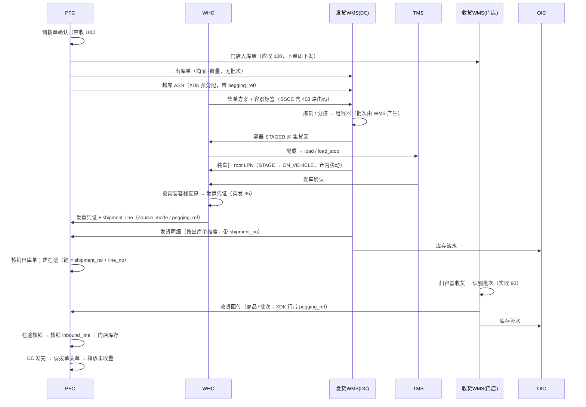

# 00 · 整体框架

> 全套文档的总纲。先读这一篇，再按需下钻到 01–11。

---

## 一、一句话

**用「五层分工 + 三条主线 + 五条红线」组织零售供应链的仓配架构，
使账实一致与履约可视成为结构性保证，而不是靠对账补救。**

---

## 二、纵向五层

| 层 | 职责 | 系统 | 核心对象 | 关键问题 |
| --- | --- | --- | --- | --- |
| **L1 计划与承诺** | 要什么、给谁、多少 | PFC | 调拨单、采购单 | **应收/应发是多少** |
| **L2 执行指令** | 谁去做这件事 | PFC → 各执行系统 | 出库单、入库单、ASN | 指令下给谁 |
| **L3 仓配协同** | 怎么组织物理流转 | **WHC（缺失，需新建）** | **容器标签、集单、装车单、发运凭证** | **跨节点怎么串起来** |
| **L4 作业执行** | 实际动手 | WMS / TMS / DMS | 波次、拣货任务、load、POD | 干完没有 |
| **L5 事实与账本** | 发生了什么、账怎么记 | WMS → OIC / PFC → 财务 | `inventory_ledger`、收发货流水、过账凭证 | 账平不平 |

### 2.1 为什么缺 L3 会出问题（当前架构的病根）

```
L3 缺失
  ↓
容器标签 / 集单 / 装车 这些「物理组织」能力无处安放
  ↓
被迫下沉到 L4（各 WMS 各自实现，跨仓不互通）
被迫上浮到 L2（PFC 硬造「按车」的单据）
  ↓
① 跨节点 pegging 没有归属方 → XDK 一单到底做不出来
② 单据结构被运输偶然性污染 → 入库单变成发货事实的镜像 → 承诺层丢失
③ 装车集单能力分散 → 跨仓作业无法统一
```

> **L3 不是「优化项」，是「结构缺失」。** 上面三个症状是同一个空洞的三种表现。

---

## 三、横向五个系统

| 系统 | 拥有的事实（SOR） | 明确不拥有 |
| --- | --- | --- |
| **PFC** | 调拨/采购主单、出入库单据（**商品+数量，无批次**）、货权、**在途库存** | 批次、货位、容器、车 |
| **OIC** | 全渠道库存视图（消费 WMS 流水）、可售库存 | 单据、作业 |
| **WHC** | **容器标签与 pegging、集单、装车单、发运凭证、跨仓编排** | 仓内作业、库存过账 |
| **WMS** | 物理库存、**批次（由 WMS 产生）**、货位、仓内作业 | 单据主控、跨仓协同、车 |
| **TMS / DMS** | 车、线路、运单、POD | 库存、单据 |

---

## 四、三条主线与它们的交汇点

```mermaid
flowchart TB
  subgraph A["单据线（承诺 → 指令 → 核销）"]
    A1["调拨单"] --> A2["出库单 / 入库单"] --> A3["核销与关单"]
  end
  subgraph B["实物线（容器 LPN 贯穿仓·运·配）"]
    B1["组容器"] --> B2["集货"] --> B3["装车"] --> B4["在途"] --> B5["到货"]
  end
  subgraph C["账本线（流水 → 库存视图 → 财务）"]
    C1["inventory_ledger"] --> C2["OIC 库存视图"] --> C3["财务过账"]
  end

  X1["container_content<br/>ref_doc + pegging"]
  X2["inventory_ledger"]
  X3["shipment 发运凭证"]

  A -.交汇.-> X1 <-.交汇.- B
  B -.交汇.-> X2 <-.交汇.- C
  A -.交汇.-> X3 <-.交汇.- C
```

| 交汇点 | 连接 | 作用 |
| --- | --- | --- |
| **`container_content` 的 `ref_doc` + `pegging_ref`** | 单据线 × 实物线 | 容器与单据解耦但保留行级溯源；XDK 一单到底的载体 |
| **`inventory_ledger`** | 实物线 × 账本线 | 一切数量变化的唯一真相源 |
| **`shipment` 发运凭证** | 单据线 × 账本线 | 发货事实的记账凭证，回传 ERP；在途库存的键 |

> 这三个对象是整个架构的**承重墙**。任何一个被弱化，对应的两条线就会脱节。

---

## 五、五条红线

| # | 红线 | 违反后果 |
| --- | --- | --- |
| **1** | **事实归属唯一**：批次归 WMS、在途归 PFC、容器归 WHC、可售归 OIC、物理库存归 WMS | 同一个数字多处维护，对不上 |
| **2** | **单据与流水分离**：单据可改可撤有状态机；流水 **append-only**，纠错走红字冲正 | 审计链断裂，历史无法重建 |
| **3** | **承诺与事实分离**：入库单载「应收」，发运凭证载「实发」，收货流水载「实收」 | 满足率算不出来（当前问题） |
| **4** | **平级单据不互相配对**：出库单与入库单是同一调拨单的两侧投影，配对走**共同父级 + 行级 pegging** | 出入库单 M:N 爆炸（当前问题） |
| **5** | **凭证由实物反算**：先装车后过账，`shipment_line` 从实装容器聚合而来 | 甩货/少装引发大量红字冲销 |

---

## 六、核心对象一览

| # | 对象 | 归属 | 语义 | 关键键 |
| --- | --- | --- | --- | --- |
| 1 | `transfer_order` 调拨单 | PFC | **承诺**：应收多少 | `transfer_no` |
| 2 | `outbound_order` 出库单 | PFC → 发货 WMS | DC 侧作业指令 | `outbound_no` |
| 3 | `inbound_order` 入库单 | PFC → 收货 WMS | **门店侧承诺（应收）** | `inbound_no` ← `transfer_no` 1:1 |
| 4 | `asn` 到货通知 | PFC → WMS | 上游来货预告（含 XDK 预分配） | `asn_no` |
| 5 | `container` / `container_content` | **WHC** | 物理货物单元 + **行级单据溯源** | `lpn` (SSCC) |
| 6 | `load` 装车单 | WHC / TMS | 一次运力的使用 | `load_no` |
| 7 | **`shipment` 发运凭证** | **WHC → PFC** | **一次发车×一门店×一货权的发货流水**，回传 ERP | `shipment_no` |
| 8 | `waybill` 运单 | TMS | 承运合同与计费 | `waybill_no` |
| 9 | `inventory_ledger` | WMS | **一切数量变化的唯一真相源** | `ledger_id`（append-only） |
| 10 | `pod` / `pod_diff` | DMS | 签收与差异 | `pod_id` |
| 11 | `cross_dock_alloc` | WHC / PFC | XDK 供需配对 | `xdk_alloc_id` |
| 12 | `cost_allocation` | TMS/BMS | 运输成本摊回 SKU/门店 | — |

---

## 七、端到端主流程（DC → 门店调拨）



---

## 八、三个数字，两个指标

| 数字 | 载体 | 产生时点 |
| --- | --- | --- |
| **应收 100** | 调拨单 → 门店入库单 | 下单时 |
| **实发 95** | 发运凭证 `shipment` | 发车后 |
| **实收 93** | 收货流水 | 到货时 |

| 指标 | 算法 | 责任方 |
| --- | --- | --- |
| **DC 满足率** | 实发 ÷ 应收 = 95% | DC / 补货计划 |
| **运输损耗率** | 实收 ÷ 实发 = 97.9% | 承运 / 配送 |

> **三个数字必须由三个不同对象承载。** 任意两个合并，就丢掉一个指标 ——
> 这是判断单据模型是否正确的最快检验法。

---

## 九、库存的三视图与对账

| 视图 | 归属 | 口径 |
| --- | --- | --- |
| **物理库存** | WMS | 货位上真实存在的量 |
| **财务库存** | PFC / 财务 | 已过账、带成本、按货权 |
| **可售库存** | OIC | 物理 − 占用 − 安全库存 + 可承诺在途 |

三条每日断言：

```
1) Σ inventory_ledger.qty_delta == inventory_stock.on_hand_qty     (仓内自洽)
2) WMS 物理量 == 财务量 + 在途未过账 ± 待处理差异池                 (仓财一致)
3) OIC 可售量 ≤ WMS 可用量                                          (不超卖)
```

---

## 十、落地路线

| 批次 | 内容 | 解决什么 | 依赖 |
| --- | --- | --- | --- |
| **P0** | ① 容器标签 + 发号 + pegging 承载<br/>② 发运凭证生成（按车×门店×货权反算）<br/>③ 入库单改为承诺层 + 调拨单关单 | 出入库单 M:N、XDK 一单到底、DC 满足率 | WHC 最小内核 |
| **P1** | ④ 装车集单 / 跨仓编排<br/>⑤ 先装车后过账的两段式库存移动<br/>⑥ 在途差异池与判责 | 作业效率、账务精度 | P0 |
| **P2** | ⑦ 配载与排线优化<br/>⑧ 成本归集到 SKU / 门店<br/>⑨ SSTK/XDK 模式决策规则引擎 | 降本、经营分析 | P1 |

> **P0 的三件事可以独立上线**，不必等整个 WHC 建完 ——
> 因为发运凭证按实装容器反算，集单在哪做都不影响账。

---

## 十一、文档索引

| 主题 | 文档 |
| --- | --- |
| **产品边界与系统交互（落地版）** | [11](11-product-boundary-whc.md) |
| 领域边界与争议裁决（通用版） | [01](01-domain-boundaries.md) |
| 库存单元键与流水账本 | [02](02-core-data-model.md) |
| 出入库单据与收发货流水 | [03](03-inbound-outbound.md) |
| 运输与配送模型 | [04](04-transport-delivery.md) |
| 容器与标签体系 | [05](05-container-label.md) |
| SSTK / XDK 作业模式 | [06](06-sstk-xdk.md) |
| 集成契约与领域事件 | [07](07-integration-events.md) |
| 货主企业视角（立场基线） | [08](08-shipment-vs-load.md) |
| 装车单的关联结构 | [09](09-load-relationships.md) |
| 发货过账时机 | [10](10-goods-issue-timing.md) |
| 参考 DDL | [ddl/schema.sql](ddl/schema.sql) |

---

## 十二、待决策项汇总

| # | 决策点 | 建议 | 影响面 |
| --- | --- | --- | --- |
| 1 | XDK 在 PFC 的过账口径（DC 瞬时进出 vs 供应商直送） | **A：DC 瞬时进出**，除非采购合同是「送到门店」 | 大，影响 P0 接口 |
| 2 | 发运凭证号由 WHC 还是 PFC 发号 | **WHC 发号** —— 切分依赖拼车结果 | 中 |
| 3 | 入库单生成时点与数量口径 | **下单时生成、数量 = 应收**；对多发运凭证 1:N，走行级 pegging | 大 |
| 4 | SSTK 的核销分配规则 | 按要求到货日 FIFO，同日按单号；余量进无主到货池 | 中，**必须定死** |
| 5 | 调拨单关单规则 | DC 标记发完后释放入库单未收量 | 中 |
| 6 | **出库单的数量口径**（下发应发 100 部分核销 vs 按可用库存下发 95） | 待讨论 —— 与 #3 是镜像问题 | 大 |
| 7 | 跨账期 `posting_date` 规则 | 按仓库作业日（有 cutoff），不按自然时间 | 小 |
