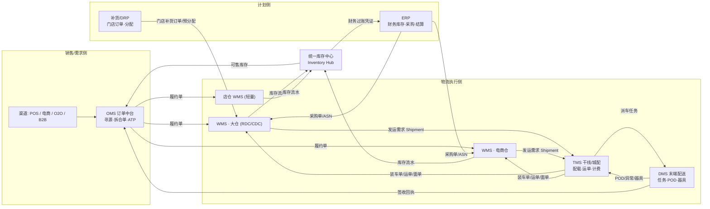

# 01 · 领域边界

## 0. 术语澄清：DMS

`DMS` 在零售供应链里有两种常见含义，本文按 **配送管理系统（Delivery Management System）** 展开：

- **配送管理系统**：末端配送执行域 —— 任务派发、司机 App、装卸交接、POD 签收、异常件、器具回收。
- **经销商管理系统（Dealer/Distributor Management System）**：渠道分销域 —— 经销商订单、渠道库存、返利、窜货管控。属于**销售域**而非物流域，与 TMS 无隶属关系。

如果贵司的 DMS 指后者，那它应挂在 OMS/ERP 之上、与 WMS/TMS 只有「订单 → 履约」一条单向边。

---

## 1. 一句话边界

| 域 | 一句话职责 | 拥有的事实（SOR） | 明确**不**拥有 |
| --- | --- | --- | --- |
| **ERP** | 这批货值多少钱、属于谁、税怎么算 | 财务库存、成本/计价、采购与销售合同、应收应付、组织与法人、结算 | 货位、批次的物理位置、作业过程 |
| **OMS / 订单中台** | 谁承诺了什么、由哪个节点履约 | 渠道订单、拆合单、寻源与库存分配、可售库存(ATP/ATS)、履约状态聚合、逆向发起 | 仓内作业、承运商选择、拣货策略 |
| **WMS** | 东西在哪儿、谁动过、现在能不能拣 | 物理库存（货位×批次×状态×货主×容器）、仓内作业与人效、盘点、容器(LPN) | 价格、成本、运费、承运商合同 |
| **TMS** | 用什么车、走什么线、运费多少 | 运力与线路、配载(Load Building)、订舱、运单、在途轨迹、运费计费与对账 | 库存、仓内作业、货主结算 |
| **DMS** | 最后一公里由谁送、送没送到 | 配送任务、司机与车辆在途执行、交接与 POD、异常件处理、器具（周转箱/托盘）回收 | 干线配载、运费主协议 |
| **BMS**（常从 TMS 拆出） | 计费与结算 | 计费规则、运费账单、承运商对账 | 执行过程 |

---

## 2. 上下文映射（Context Map）

**关键点：库存不是一份，是三份视图**，靠 Inventory Ledger 对账（见 [02](02-core-data-model.md)）。

---

## 3. 多仓形态的差异（同一套 WMS 内核，不同的策略包）

| 维度 | 大仓 RDC/CDC | 电商仓 | 门店全渠道仓（店仓） |
| --- | --- | --- | --- |
| 订单粒度 | 门店补货单，整箱/整托为主 | C 端小单，1~3 行、拆零为主 | 线上小单 + 门店自身销售 |
| 库存粒度 | 货位 + 托盘 LPN + 批次 | 货位 + 周转箱 + 批次/序列号 | 货区（后仓/货架），粒度粗 |
| 作业模式 | SSTK / XDK / PBYL 并存 | 播种、边拣边分、集单 | 店内拣（Ship-from-Store）、BOPIS |
| 出库单位 | 箱唛 Case Label + 托盘标签 | 包裹 + 快递面单 | 周转筐 / 顾客提货袋 |
| 承运 | 干线 + 城配（整车/零担） | 快递（多快递商路由） | 即时配（骑手 3PL）/ 自提 |
| 库存 SOR | WMS | WMS | 门店库存系统（POS 侧）；WMS 只托管履约中占用 |

> 店仓的红线：**门店库存 SOR 通常仍在门店/POS 系统**，轻量 WMS 只做「拣、找、包、交接」，
> 通过占用（reservation）而非过账（posting）来避免与 POS 抢库存所有权。

---

## 4. 边界争议裁决表（这些是实战中最容易扯皮的地方）

| # | 争议 | 裁决 | 理由 |
| --- | --- | --- | --- |
| 1 | 可售库存谁算？ | **OMS/库存中心**算，WMS 只提供物理量与占用量 | 可售 = 物理 − 占用 − 安全库存 + 在途，含商业策略，不是仓的事实 |
| 2 | 波次/拣货策略谁定？ | **WMS**。OMS 下发的是「出库单」不是「拣货任务」 | 波次是产能与人效问题，随仓型变化 |
| 3 | 配载（选车、拼车、排线）谁做？ | **TMS** | 需要跨仓、跨单、跨承运商的全局视角 |
| 4 | 装车（Load Confirm）谁做？ | 动作在 **WMS 月台**执行，事实回传 TMS | 扫码的人在仓里；装车单是二者共享契约 |
| 5 | 面单谁出？ | **TMS/承运商**出号与模板，**WMS**打印并贴 | 单号是承运商资源，打印是仓内动作 |
| 6 | XDK 的门店分配谁算？ | **OMS / DRP**，DC 只执行分拣 | 分配是需求计划问题 |
| 7 | 库存差异（盘盈亏）谁认账？ | **WMS** 认物理事实并出流水，**ERP** 认财务损益 | 一次事实、两次记账 |
| 8 | 批次/效期规则谁管？ | 主数据在 ERP/MDM，**执行（FEFO 拣选）在 WMS** | 规则与执行分离 |
| 9 | 运费谁算？ | **TMS/BMS** 算，**ERP** 认应付 | 计费规则变化频率远高于财务 |
| 10 | 退货判责与退款？ | **收货事实在 WMS**，判责与退款在 **OMS/ERP** | 仓不做商业判断 |
| 11 | 承运商轨迹谁存？ | **TMS** 存全量，**OMS** 只订阅关键节点 | 避免 OMS 被轨迹洪水淹没 |
| 12 | 器具（周转箱/托盘）账 | **DMS/TMS 持资产借还账**，WMS 只管仓内在库数 | 器具在路上的时间远长于在仓 |

---

## 5. 反腐层（ACL）建议

- WMS 不直接消费 ERP 的采购单结构，接 **ASN 契约**；ERP 字段改动不应穿透到仓内。
- TMS 不直接读 WMS 出库单，接 **Shipment（发运需求）契约**：只含地址、时效、体积重量、件数、温层。
- OMS 不订阅 WMS 的作业级事件（拣货完成/复核完成），只订阅 **里程碑事件**（已分配/已出库/已签收）。
