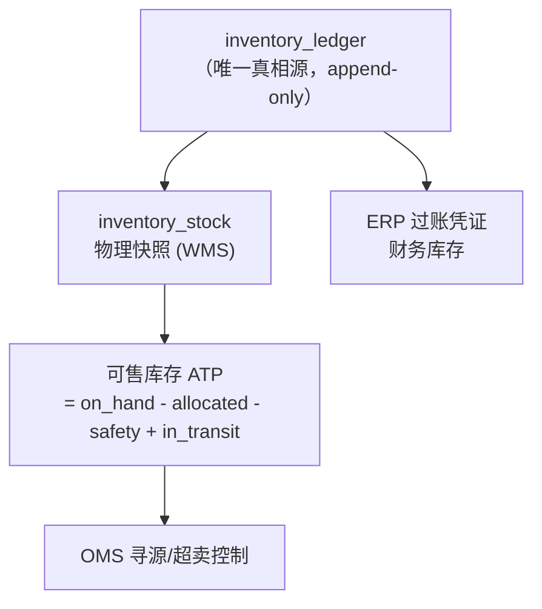

# 02 · 核心数据模型：主数据、库存单元与流水账本

## 1. 共享内核（Shared Kernel）

跨域共用、必须统一 ID 的最小集合。其余一律各域自治。

### 1.1 商品与包装层级

```
item (SKU)
  ├─ item_uom          单位与换算：EA / INR(内箱) / CS(箱) / PL(托)
  └─ pack_hierarchy    包装层级树：1 PL = 40 CS, 1 CS = 12 EA
```

| 表 | 关键字段 |
| --- | --- |
| `item` | `sku_id`, `sku_code`, `gtin`(EAN/UPC), `name`, `category_id`, `brand_id`, `temp_zone`(常温/冷藏/冷冻), `is_batch_ctrl`, `is_serial_ctrl`, `shelf_life_days`, `hazard_class`, `status` |
| `item_uom` | `sku_id`, `uom`, `base_qty`(折算到基本单位的数量), `length/width/height`, `gross_weight`, `volume`, `is_base`, `is_order_uom` |
| `pack_hierarchy` | `sku_id`, `level`(PL/CS/INR/EA), `parent_level`, `qty_of_parent`, `gtin`(该层级条码) |

> **红线**：所有单据行必须同时存 `qty / uom / base_qty`。
> `base_qty` 在单据创建时按当时的换算关系**冻结快照**，主数据后续改动不得回溯。

### 1.2 网络节点（Location / Node）

用**一张节点表**统一表达仓、门店、供应商、客户、中转场，避免多套地址体系。

`node`: `node_id`, `node_type`(WAREHOUSE/STORE/SUPPLIER/CUSTOMER/HUB/DOCK_YARD), `code`, `name`,
`parent_node_id`, `region_code`, `address`, `geo_lat/lng`, `contact`, `time_window`(收货时间窗),
`unload_capability`(月台/尾板/人力), `temp_zone_support`, `status`

### 1.3 仓内位置层级

```
warehouse → zone(区: 收货/存储/拣选/集货/发货/退货/次品) → aisle → location(货位)
```

`location`: `location_id`, `warehouse_id`, `zone_id`, `code`, `loc_type`
(RECEIVE / STORAGE / PICK / REPLEN / STAGE / DOCK / XDOCK_LANE / QC / DAMAGE / VIRTUAL),
`x/y/z`, `pick_seq`(拣货路径序), `capacity_volume`, `capacity_weight`, `allow_mix_sku`,
`allow_mix_lot`, `temp_zone`, `status`

> **虚拟货位**是关键设计：`IN_TRANSIT`、`XDOCK-LANE-{door}`、`ON_VEHICLE-{load_no}`、`DIFF`(差异池)。
> 有了它们，「货在车上」「货在越库道口」也能进库存等式，账才平。

---

## 2. 库存单元键（Stock Unit Key）—— 整个 WMS 的地基

**库存的唯一键必须一次定死**，后期加维度成本极高：

```
(warehouse_id, location_id, sku_id, lot_no, inv_status, owner_id, lpn, serial_no)
```

| 维度 | 说明 | 不需要时的取值 |
| --- | --- | --- |
| `lot_no` | 批次（含生产日期、效期、供应商批号） | `'*'` |
| `inv_status` | 质量状态：`AVAILABLE / QC_HOLD / DAMAGED / EXPIRED / RESERVED_HOLD / SCRAP` | 必填 |
| `owner_id` | 货主（多货主/寄售/联营必备） | 自营时填自有法人 |
| `lpn` | 容器号（托盘/箱/周转箱） | 散货填 `'*'` |
| `serial_no` | 序列号（手机/家电/IMEI） | `'*'` |

用 `'*'` 而不是 `NULL` 占位，避免唯一索引在 NULL 上失效。

### 2.1 库存快照表 `inventory_stock`

| 字段 | 含义 |
| --- | --- |
| 上述 8 个键字段 | 唯一索引 |
| `on_hand_qty` | 在库量（物理存在） |
| `allocated_qty` | 已分配未拣 |
| `picked_qty` | 已拣未发（在集货区） |
| `available_qty` | 派生 = `on_hand - allocated - picked - hold` |
| `hold_qty` | 冻结（质检/司法/促销锁） |
| `in_transit_qty` | 在途（调拨中，仅虚拟货位上有） |
| `uom` / `base_qty` | 基本单位 |
| `last_count_at`, `version`(乐观锁) | |

> 快照表是**可重建的派生物**，权威在下面的流水账本。任何对不上的时候，
> 以 `SUM(ledger.qty_delta)` 重算快照，而不是反过来改流水。

---

## 3. 库存流水账本 `inventory_ledger`（Append-Only）

**一切数量/状态/位置的变化都必须落这里，且只追加。**

```sql
inventory_ledger (
  ledger_id        BIGINT PK,          -- 全局单调递增
  txn_type         VARCHAR(32),        -- 见下表
  txn_time         TIMESTAMP,          -- 业务发生时间
  posted_time      TIMESTAMP,          -- 记账时间
  ref_doc_type     VARCHAR(32),        -- ASN/INBOUND/RECEIPT/OUTBOUND/PICK/SHIPMENT/COUNT/ADJUST/MOVE
  ref_doc_no       VARCHAR(64),
  ref_line_no      INT,
  warehouse_id, sku_id, lot_no, owner_id, serial_no,
  from_location_id, to_location_id,    -- 移动型流水两端都有
  from_status,     to_status,          -- 状态变更型流水
  from_lpn,        to_lpn,
  qty_delta        DECIMAL(18,4),      -- 带符号，+入 -出
  uom, base_qty_delta,
  operator_id, device_id,
  reversal_of      BIGINT NULL,        -- 红字冲正指向被冲的 ledger_id
  cost_ref         VARCHAR(64),        -- 供 ERP 计价关联
  idem_key         VARCHAR(128) UNIQUE -- 幂等键，防重放
)
```

### 3.1 txn_type 全集（建议）

| 分类 | txn_type |
| --- | --- |
| 入 | `RECEIPT`(收货)、`PUTAWAY`(上架)、`RETURN_IN`(退货入)、`TRANSFER_IN`(调拨入)、`PRODUCE_IN` |
| 出 | `PICK`(拣货)、`SHIP`(发货过账)、`RETURN_OUT`(退供)、`TRANSFER_OUT`、`SCRAP`(报废) |
| 移动 | `MOVE`(移库)、`REPLEN`(补货)、`CONSOLIDATE`(合托)、`XDOCK_SORT`(越库分拣) |
| 状态 | `QC_RELEASE`、`QC_HOLD`、`DAMAGE`、`EXPIRE`、`OWNER_CHANGE`(货权转移) |
| 调整 | `COUNT_GAIN`(盘盈)、`COUNT_LOSS`(盘亏)、`ADJUST`、`REVERSAL`(红字冲正) |

### 3.2 双分录（Double-Entry）约束

移库/上架/拣货这类**位置迁移**，必须成对写两条流水（或一条含 from/to 两端），保证：

```
∑ qty_delta over (warehouse, sku, lot, owner)  ==  仓库总量变化
∑ qty_delta over (location)                    ==  该货位量变化
```

任何时刻 `SUM(qty_delta) GROUP BY 库存单元键` 必须等于 `inventory_stock.on_hand_qty`，
这是**每日自动对账任务**的唯一断言。

### 3.3 冲正而非删除

单据作废/收货撤销，写一条 `REVERSAL` 反向流水并填 `reversal_of`，
原流水永久保留。审计、追溯、财务倒轧全靠这条纪律。

---

## 4. 库存三视图与对账

| 视图 | 归属 | 口径 | 典型差异来源 |
| --- | --- | --- | --- |
| **财务库存** | ERP | 已过账、带成本、按法人/货主 | 在途未过账、月台已收未过账 |
| **物理库存** | WMS | 货位上真实存在的量 | 破损未处理、盘点未确认 |
| **可售库存** | OMS/库存中心 | 物理 − 占用 − 安全库存 + 可承诺在途 | 超卖缓冲、渠道分货策略 |



对账三条断言（建议做成每日定时任务并告警）：

1. `Σledger == inventory_stock`（仓内自洽）
2. `WMS 期末物理量 == ERP 期末财务量 + 未过账在途`（仓财一致）
3. `可售 ≤ 物理可用`（不超卖，除非显式开启超卖池）
