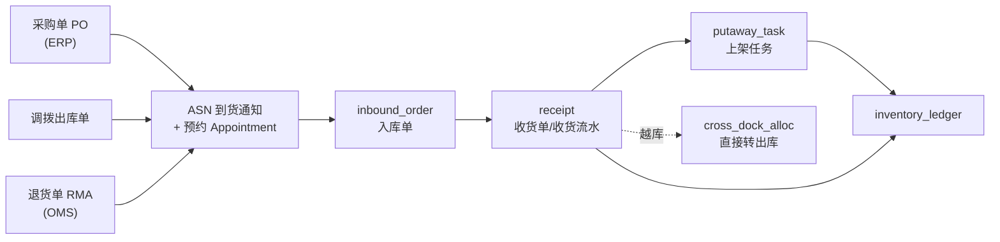
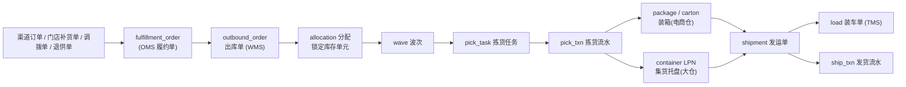

# 03 · 出入库单据与收发货流水

## 0. 单据分层：三层不要混

| 层 | 名称 | 归属 | 语义 | 可变性 |
| --- | --- | --- | --- | --- |
| L1 **意图层** | 采购单 / 销售单 / 调拨单 / 门店补货单 | ERP / OMS / DRP | 商业承诺 | 可改可撤 |
| L2 **执行层** | 入库单 / 出库单 / ASN / 波次 / 任务 | WMS | 仓内作业指令 | 有状态机，按状态限制修改 |
| L3 **事实层** | 收货流水 / 发货流水 / 库存流水 | WMS | 已经发生的事 | **只追加，永不修改** |

绝大多数系统的烂账，都来自把 L2 和 L3 揉成一张表。

---

## 1. 入库域

### 1.1 单据关系



### 1.2 `asn` 到货通知（供应商/上游 → 仓的契约）

**Header**：`asn_no`, `warehouse_id`, `source_type`(PO/TRANSFER/RETURN/PRODUCTION), `source_doc_no`,
`supplier_id`, `carrier_id`, `plate_no`, `expected_arrive_time`, `appointment_no`, `dock_id`,
`total_qty/cases/pallets`, `temp_zone`, `is_pre_labeled`(是否已贴 SSCC), `xdock_flag`, `status`

**Line**：`asn_no`, `line_no`, `sku_id`, `expected_qty`, `uom`, `base_qty`, `lot_no`, `production_date`,
`expire_date`, `sscc_list`(预贴容器), `po_line_ref`, `store_id`(XDK 预分配到门店时非空)

### 1.3 `inbound_order` 入库单（仓内执行主体）

`inbound_no`, `asn_no`, `warehouse_id`, `inbound_type`(PURCHASE/TRANSFER/RETURN/PRODUCTION/XDOCK),
`owner_id`, `dock_id`, `arrive_time`, `start_time`, `finish_time`, `status`, `qc_required`

Line：`inbound_no`, `line_no`, `sku_id`, `plan_qty`, `received_qty`, `qualified_qty`, `rejected_qty`,
`damaged_qty`, `putaway_qty`, `lot_no`, `expire_date`, `uom`, `base_qty`, `inv_status`

### 1.4 `receipt` 收货流水（L3，append-only）

**每一次扫码 = 一条收货流水**，不是「一张单一条汇总」。

`receipt_id`, `inbound_no`, `inbound_line_no`, `sku_id`, `qty`, `uom`, `base_qty`,
`lot_no`, `production_date`, `expire_date`, `serial_list`, `lpn`(收货容器/SSCC),
`to_location_id`(收货暂存位或越库道口), `inv_status`, `operator_id`, `device_id`,
`received_at`, `reversal_of`, `idem_key`

> 收货流水 → 一条 `inventory_ledger(txn_type=RECEIPT)`。二者一一对应。

### 1.5 入库状态机

```
CREATED → APPOINTED(已预约) → ARRIVED(到场) → UNLOADING(卸车)
        → RECEIVING(收货中) → RECEIVED(收货完成)
        → [QC_HOLD → QC_RELEASE]            (需质检时)
        → PUTAWAY_ING → PUTAWAY_DONE → CLOSED
                                        ↘ CANCELLED (仅 RECEIVED 之前)
```

XDK 路径在 `RECEIVED` 后不进 PUTAWAY，直接进 `SORTING → STAGED`（见 [06](06-sstk-xdk.md)）。

---

## 2. 出库域

### 2.1 单据关系



### 2.2 `outbound_order` 出库单

**Header**：`outbound_no`, `warehouse_id`, `outbound_type`
(`B2C_SALE` / `STORE_REPLEN` / `TRANSFER_OUT` / `RETURN_TO_VENDOR` / `XDOCK` / `SCRAP`),
`source_type`, `source_doc_no`(OMS 履约单号), `owner_id`,
`ship_to_node_id`, `consignee`(姓名/电话/地址，B2C 建议加密存储),
`required_ship_time`, `promised_delivery_time`, `service_level`(次日达/当日达/预约配),
`carrier_pref`, `temp_zone`, `priority`, `wave_no`, `shipment_no`, `status`

**Line**：`outbound_no`, `line_no`, `sku_id`, `order_qty`, `allocated_qty`, `picked_qty`,
`shipped_qty`, `short_qty`, `uom`, `base_qty`, `lot_strategy`(FEFO/FIFO/指定批次), `source_line_ref`

### 2.3 `allocation` 分配（软锁 → 硬锁）

`alloc_id`, `outbound_no`, `line_no`, `sku_id`, **库存单元键**（warehouse/location/lot/status/owner/lpn），
`alloc_qty`, `picked_qty`, `alloc_type`(SOFT 仅占量 / HARD 锁到具体货位), `alloc_time`, `status`

> 两段式分配是多仓必须的：OMS 下单时做 **SOFT 占量**（防超卖），
> 仓内波次时才做 **HARD 锁货位**（避免过早锁死影响拣选路径优化）。

### 2.4 `wave` 波次与 `pick_task`

`wave`: `wave_no`, `warehouse_id`, `wave_type`(单单拣/批量拣/播种/边拣边分/整箱波/拆零波),
`strategy_id`, `order_count`, `line_count`, `cutoff_time`, `carrier_cutoff`(承运商截单), `status`

`pick_task`: `task_id`, `wave_no`, `outbound_no`, `line_no`, `sku_id`, `from_location_id`,
`lot_no`, `plan_qty`, `picked_qty`, `to_lpn`(拣货容器/周转箱), `pick_seq`, `picker_id`,
`task_type`(CASE_PICK/PIECE_PICK/PALLET_PICK/REPLEN), `status`

`pick_txn`（L3 流水）：每次扫码一条，`task_id`, `sku_id`, `lot_no`, `from_location`, `to_lpn`,
`qty`, `short_reason`, `operator`, `picked_at`, `idem_key`

### 2.5 `package` 包裹（电商仓）与 `container` 集货（大仓）

- 电商仓：`package_no`(内部箱号) ↔ `waybill_no`(快递单号) 一般 1:1；
  含 `weight`(实称重), `dim_l/w/h`, `box_spec`, `packer_id`, `packed_at`, `sku_lines`
- 大仓/门店配送：拣完的箱贴 **Case Label**（含门店号+线路+波次），码托 → `container`(托盘 LPN)，
  托盘打 **Pallet Label**，推到集货位 `STAGE-{door}`

### 2.6 `shipment` 发运单（WMS ↔ TMS 的契约）

**这是仓与运的边界对象**，只描述「要把哪些货、从哪运到哪、什么时效」，不含仓内细节。

`shipment_no`, `warehouse_id`, `ship_from_node`, `ship_to_node`, `outbound_no_list`,
`total_packages`, `total_cases`, `total_pallets`, `gross_weight`, `volume`, `temp_zone`,
`required_pickup_time`, `promised_delivery_time`, `service_level`, `carrier_id`, `waybill_no`,
`load_no`, `status`, `special_req`(尾板/上楼/预约卸货)

### 2.7 `ship_txn` 发货流水（L3）

发车/交接的那一刻，按 **LPN 或 Package** 逐个扫码生成：

`ship_txn_id`, `shipment_no`, `load_no`, `lpn` 或 `package_no`, `outbound_no`, `line_no`,
`sku_id`, `lot_no`, `qty`, `uom`, `base_qty`, `from_location_id`(集货位),
`to_location_id`(虚拟位 `ON_VEHICLE-{load_no}` 或 `IN_TRANSIT`),
`operator_id`, `shipped_at`, `reversal_of`, `idem_key`

> 发货过账 = 一条 `inventory_ledger(txn_type=SHIP)`，把货从集货位移到在途虚拟位。
> **调拨场景下，在途库存的所有权仍在发货方**，直到收货方 `RECEIPT` 才转移 —— 这一点决定了调拨差异能否查清。

### 2.8 出库状态机

```
CREATED → ALLOCATED → WAVED → PICKING → PICKED
        → PACKED(电商) / PALLETIZED(大仓)
        → STAGED(集货完成) → LOADING → LOADED → SHIPPED
        → IN_TRANSIT → DELIVERED(POD) → CLOSED
   任一环节可分叉：SHORT(缺货短拣) / CANCELLED(SHIPPED 前) / REJECTED(客户拒收→退回)
```

---

## 3. 收发货流水的四条纪律

1. **一次扫码一条流水**，禁止「按单汇总一条」。汇总是查询层的事。
2. **流水不可更新**（无 `UPDATE`），纠错走 `REVERSAL` 红字。
3. **幂等键必填**：`idem_key = {设备号}:{单号}:{行号}:{客户端序号}`，
   PDA 弱网重传时靠它去重。
4. **流水与 ledger 一一对应**：业务流水（receipt/pick/ship）解释「做了什么」，
   ledger 解释「库存怎么变」。前者可有业务专属字段，后者结构统一，便于全局对账。
