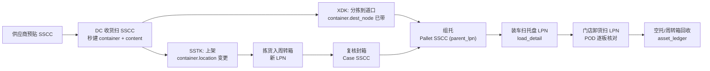

# 05 · 容器（LPN）与标签体系

## 1. 为什么容器是一等公民

没有容器模型的 WMS，只能按「货位 + SKU + 数量」记账。一旦货离开货位（在拣货车上、在集货区、
在车上、在门店后仓），账就断了。**LPN 让「一堆货」成为一个可扫描、可移动、可追溯的对象**，
是仓 → 运 → 配全链路唯一贯穿的物理主键。

---

## 2. 编码体系

### 2.1 LPN vs SSCC

| | LPN (License Plate Number) | SSCC (Serial Shipping Container Code) |
| --- | --- | --- |
| 范围 | 企业内部 | GS1 全球唯一 |
| 结构 | 自定义（建议 `{仓码}{类型}{日期}{流水}{校验位}`） | 18 位：扩展位(1) + GS1 厂商前缀 + 系列号 + 校验位(1) |
| 条码 | Code128 / QR | GS1-128，AI = `(00)` |
| 用途 | 仓内容器、拣货筐、集货托 | 对外发货容器、供应商预贴、跨企业交接 |

**建议**：内部统一用 `lpn` 字段，SSCC 作为 `lpn` 的一种编码形式存在（`lpn_type = SSCC`）。
对外（供应商送货、发往门店/客户）一律用 SSCC；纯仓内周转容器可用轻量 LPN。

### 2.2 GS1-128 常用应用标识符（AI）

| AI | 含义 | 示例 |
| --- | --- | --- |
| `00` | SSCC 容器序列号（18位） | `(00)106901234500000018` |
| `01` | GTIN（商品全球码，14位） | `(01)16901234500017` |
| `02` | 内含商品 GTIN（用于物流单元） | |
| `10` | 批次号 | `(10)LOT20260715A` |
| `11` / `13` / `15` / `17` | 生产日期 / 包装日期 / 最佳食用期 / 有效期 | `(17)261231` |
| `21` | 序列号 | |
| `37` | 内含数量 | `(37)240` |
| `400` | 客户采购单号 | |
| `403` | 路由码（门店/线路分拣码，XDK 关键） | `(403)ST0871-R12` |
| `410`/`413` | 收货方 GLN / 最终目的地 GLN | |
| `3100~3105` | 净重（kg，小数位由末位决定） | `(3102)001250` = 12.50kg |

> **XDK 场景强依赖 `(403)` 路由码 + `(410)` 收货方 GLN**：供应商预贴标签里带门店信息，
> DC 扫一枪就能分流到对应道口，不用查订单。

---

## 3. 容器数据模型

### 3.1 `container`（容器主表，支持嵌套）

| 字段 | 说明 |
| --- | --- |
| `lpn` | 主键，容器号 |
| `lpn_type` | `SSCC` / `INTERNAL` |
| `container_type` | `PALLET`(托盘) / `CASE`(箱) / `TOTE`(周转箱) / `CAGE`(笼车) / `ROLL_CAGE` / `COLD_BOX` |
| `parent_lpn` | 父容器（箱码在托盘上）→ 形成嵌套树 |
| `root_lpn` | 根容器（冗余，便于一次查整托） |
| `nest_level` | 层级深度 |
| `warehouse_id`, `current_location_id` | 当前位置（含虚拟位 `ON_VEHICLE-{load_no}`） |
| `status` | `EMPTY` / `BUILDING`(组板中) / `CLOSED`(封箱/封板) / `STAGED` / `LOADED` / `SHIPPED` / `DELIVERED` / `CONSUMED`(拆空) / `LOST` |
| `owner_id` | 货主 |
| `ref_doc_type` / `ref_doc_no` | 归属单据（入库单/出库单/波次） |
| `dest_node_id` | 目的门店/客户（组板时确定，XDK 必填） |
| `gross_weight`, `volume`, `case_count`, `piece_count` | 汇总量（组板时增量维护） |
| `is_homogeneous` | 是否单一 SKU 整托（影响上架与拣选策略） |
| `sealed_by`, `sealed_at`, `seal_no` | |
| `asset_no` | 物理器具编号（可复用托盘/周转箱与一次性 LPN 解耦） |

> **重要区分**：`lpn` 是「这一次装的这堆货」的标识（一次性、随货走）；
> `asset_no` 是「这块塑料托盘」的标识（长期复用、要回收）。二者一定要拆开，
> 否则托盘回收账和货物追溯账会互相污染。

### 3.2 `container_content`（容器内容明细）

`lpn`, `line_no`, `sku_id`, `lot_no`, `expire_date`, `qty`, `uom`, `base_qty`, `inv_status`,
`owner_id`, `serial_list`, `ref_doc_no`, `ref_line_no`, `dest_node_id`(混装发不同门店时按行区分)

### 3.3 `container_txn`（容器操作流水，append-only）

`txn_id`, `lpn`, `txn_type`(`CREATE`/`ADD_ITEM`/`REMOVE_ITEM`/`NEST`(套入父容器)/`UNNEST`/
`MOVE`/`CLOSE`/`OPEN`/`SPLIT`/`MERGE`/`SHIP`/`RECEIVE`/`CONSUME`),
`from_location`, `to_location`, `from_parent_lpn`, `to_parent_lpn`, `qty_delta`,
`operator`, `occurred_at`, `ref_doc_no`, `idem_key`

---

## 4. 标签清单（按环节）

| # | 标签 | 产生环节 | 载体内容 | 关键条码 |
| --- | --- | --- | --- | --- |
| 1 | **供应商发货标签 / ASN 标签** | 供应商发货前（或 DC 收货时补打） | SSCC、GTIN、批次、效期、数量、PO 号 | `(00)(01)(10)(17)(37)(400)` |
| 2 | **收货容器标签** | 卸车/收货 | 内部 LPN、SKU、批次、收货单号 | LPN |
| 3 | **上架/存储托盘标签** | 组板上架 | 托盘 LPN、混装标识、货位建议 | LPN |
| 4 | **拣货容器标签** | 波次下发 | 周转箱 LPN、波次号、订单号/门店号、格口号 | LPN + 波次 |
| 5 | **箱唛 / Case Label** | 复核封箱 | **门店号（大字）**、线路号、波次、箱号 x/y、SKU 摘要 | SSCC + `(403)` |
| 6 | **发货托盘标签** | 集货组板 | 托盘 LPN、门店号、箱数、载重、发运单号 | SSCC |
| 7 | **快递面单 / Shipping Label** | 电商仓打包 | 承运商单号、收件人（脱敏）、大头笔/分拣码、始发-目的 | 承运商条码 |
| 8 | **温控标签 / TTI** | 冷链装车 | 温层、时温指示 | — |
| 9 | **器具标签** | 器具入册 | `asset_no`、器具类型、归属方 | RFID / Code128 |
| 10 | **门店收货标签** | 门店签收 | 门店内货区、上架建议 | 复用 SSCC |

### 4.1 标签渲染的工程建议

- 标签模板与业务代码解耦：`label_template`(模板ID, 版本, 尺寸, ZPL/DPL 源, 变量清单) +
  `label_print_log`(打印流水，含重打次数与原因 —— **重打必须审计**，是常见的作弊/差错入口)。
- 打印走**打印服务**（云打印/客户端代理），业务系统只产出数据 + 模板 ID。
- 条码里放**标识**不放**数据副本**（除批次效期等 GS1 标准字段），避免标签与库存不一致。

---

## 5. 容器贯穿全链路的价值（一张图）

**一句话**：整条链路上，**人只扫容器，不数货**。数量在容器创建时就已确定并锁定，
后续每个节点只做「容器在不在、去哪了」的判断 —— 这是零售物流作业效率与准确率的根本来源。
