# 06 · 作业模式：SSTK / XDK / PBYL / DSD

术语源自沃尔玛体系的 DC 作业模式分类，现已成为零售配送中心的通用语言。

## 1. 模式全景

| 模式 | 全称 | 中文 | DC 是否持有库存 | 是否上架 | 停留时长 | 分配时点 |
| --- | --- | --- | --- | --- | --- | --- |
| **SSTK** | Staple Stock | 存储型 / 备货型 | ✅ 是 | ✅ 上架存储 | 数天~数周 | **收货之后**（门店订单驱动拣货） |
| **XDK-Pre** | Pre-allocated Cross Dock | 越库·供应商预分配 | ❌ 否（过账即走） | ❌ | < 24h（常 2~6h） | **采购下单时**（供应商按门店分箱贴标） |
| **XDK-Post** | Post-allocated Cross Dock / Break-bulk | 越库·DC 后分配 | ❌ 否 | ❌ | < 24h | **到货时/到货前**（DC 按门店订单拆分） |
| **PBYL** | Pick By Line / Flow-through | 流通加工型 / 按线拣 | ❌ 否 | ❌ | < 24h | 到货时（整托到货 → 按门店逐行分货） |
| **DSD** | Direct Store Delivery | 供应商直送门店 | — 不经 DC | — | — | 采购时 |

> XDK-Post 与 PBYL 在很多企业里是同一件事的两种叫法；严格区分时，
> **PBYL 强调「按订单行逐行分货」的作业手法**（Put-to-Store 播种墙），
> **XDK-Post 强调「不入存储」的库存性质**。建议在系统里：
> `operation_mode` 存库存性质（SSTK/XDK/DSD），`sort_method` 存作业手法（PUT_TO_STORE/SORT_TO_LANE/DIRECT）。

---

## 2. 流程对比

```mermaid
flowchart TD
  subgraph S["SSTK 存储型"]
    S1[采购单→供应商] --> S2[ASN 到货] --> S3[收货 RECEIPT] --> S4[上架 PUTAWAY<br/>进存储位]
    S4 --> S5[门店补货订单] --> S6[补货 REPLEN→拣选位] --> S7[波次拣货] --> S8[组托集货] --> S9[装车发运]
  end
  subgraph X1["XDK 预分配"]
    X11[采购时已按门店分配] --> X12[供应商按门店分箱<br/>预贴 SSCC 含 403 路由码]
    X12 --> X13[收货扫 SSCC<br/>系统直接识别目的门店] --> X14[分流到门店道口 LANE]
    X14 --> X15[组托 → 装车]
  end
  subgraph X2["XDK 后分配 / PBYL"]
    X21[供应商整托整箱送 DC] --> X22[收货到越库暂存区]
    X22 --> X23[按门店订单逐行分货<br/>Put-to-Store 播种墙]
    X23 --> X24[封箱贴门店箱唛] --> X25[组托 → 装车]
  end
```



---

## 3. 数据模型上的差异（核心）

### 3.1 SSTK：入库与出库**解耦**

- 收货 → `inventory_ledger(RECEIPT)` → 上架 `PUTAWAY` → 库存归入存储货位。
- 门店订单来了才 `allocation` → `wave` → `pick`。
- 入库单与出库单**没有直接引用关系**，只通过库存池间接关联。
- 需要：补货策略（`replen_rule`）、拣选位容量、库龄/效期管理、周转率指标。

### 3.2 XDK：入库与出库**直接配对（Pegging）**

这是 XDK 在模型上唯一但决定性的增量 —— **供需配对表**：

```sql
cross_dock_alloc (
  xdk_alloc_id     BIGINT PK,
  mode             VARCHAR(16),   -- PRE_ALLOCATED / POST_ALLOCATED / PBYL
  warehouse_id     VARCHAR(32),
  -- 供给侧（入）
  asn_no           VARCHAR(64),
  asn_line_no      INT,
  inbound_no       VARCHAR(64),
  inbound_line_no  INT,
  supplier_lpn     VARCHAR(64),   -- 预分配模式下供应商预贴的 SSCC
  -- 需求侧（出）
  outbound_no      VARCHAR(64),
  outbound_line_no INT,
  dest_node_id     VARCHAR(32),   -- 目的门店
  route_id         VARCHAR(32),
  -- 配对量
  sku_id, lot_no,
  planned_qty      DECIMAL(18,4),
  received_qty     DECIMAL(18,4),
  sorted_qty       DECIMAL(18,4),
  staged_qty       DECIMAL(18,4),
  short_qty        DECIMAL(18,4),
  -- 物理落点
  lane_id          VARCHAR(32),   -- 越库道口 / 播种墙格口
  dock_door        VARCHAR(16),
  status           VARCHAR(24),   -- PLANNED/RECEIVING/SORTING/STAGED/LOADED/SHORT/CLOSED
  created_at, updated_at
)
```

### 3.3 XDK 的库存流水路径

XDK **不产生 PUTAWAY 流水**，但**必须产生流水**（否则货在 DC 的那几小时是账外库存）：

```
RECEIPT      : 供应商 → RECV-DOCK-{door}        (+)
XDOCK_SORT   : RECV-DOCK → XDOCK-LANE-{store}   (移动，双分录)
CONSOLIDATE  : 散箱 → Pallet LPN                (容器流水)
SHIP         : XDOCK-LANE → ON_VEHICLE-{load}   (-)
```

关键：**`XDOCK-LANE-{store}` 是虚拟货位**，`inv_status` 保持 `AVAILABLE` 但被
`cross_dock_alloc` 硬占用，不参与其他订单分配。这样账既平、又不会被误拣。

### 3.4 短溢处理

XDK 最大的运营痛点是「供应商少送」。模型上必须支持：

| 情况 | 处理 |
| --- | --- |
| 收货量 < 计划量 | 按 `dest_node` 优先级（A/B/C 类门店、缺货天数）**重新按比例分摊**，写回 `cross_dock_alloc.planned_qty` 并留分摊日志 |
| 收货量 > 计划量 | 溢出部分转 SSTK（进存储位）或拒收，需 `overage_policy` 配置 |
| 到货晚于截单 | 转下一波次 / 转 SSTK / 直送门店（DSD 补救） |

建议加表 `xdk_reallocation_log`(原分配, 新分配, 分摊规则, 触发原因, 操作人)。

---

## 4. 两种模式的字段级差异速查

| 维度 | SSTK | XDK |
| --- | --- | --- |
| `inbound_order.inbound_type` | `PURCHASE` | `XDOCK` |
| `asn_line.store_id` | 空 | **必填**（PRE 模式） |
| `asn.is_pre_labeled` | false | PRE 模式 true |
| 上架任务 `putaway_task` | 有 | **无** |
| 库存驻留货位 | `STORAGE` | `XDOCK_LANE`（虚拟） |
| `allocation` 来源 | 库存池 | `cross_dock_alloc` 直接指定 |
| 拣货任务 | 有（CASE/PIECE PICK） | 无（PRE）/ 有分货任务（POST） |
| 补货 `REPLEN` | 有 | 无 |
| 关键 KPI | 库存周转、拣选 UPH、缺货率 | **停留时长 dwell time**、分拣准确率、当日流转率 |
| 库存成本归属 | DC 持有库存成本 | 几乎不持有 |

---

## 5. 混合仓的建模建议（现实中最常见）

一个 RDC 同时跑 SSTK + XDK + PBYL，甚至同一个 SKU 在不同订单上走不同模式。因此：

1. **`operation_mode` 打在「单据行」上，不是打在仓或 SKU 上。**
   `asn_line.operation_mode` / `inbound_line.operation_mode` / `outbound_line.operation_mode`。
2. **同一批到货可能拆两半**：50 箱预分给门店（XDK），20 箱转存储（SSTK）。
   收货时按 `cross_dock_alloc` 匹配，匹配不上的余量自动落 SSTK 路径。
3. **道口/区域按模式物理隔离**：`zone.operation_mode` 限制哪些作业能在哪个区做，
   避免越库货被误上架、存储货被误装车。
4. **模式决策规则表** `operation_mode_rule`：
   `(品类, 供应商, 门店群, 促销标识, 订单量阈值, 效期天数) → 推荐模式`，
   由补货/计划系统在下采购单时决策并写入 ASN。

---

## 6. 选型判断（业务视角，供规则表参考）

| 走 XDK | 走 SSTK |
| --- | --- |
| 高周转、大批量、可预测（快消、饮料、生鲜日配） | 低频、长尾、需拆零 |
| 效期短（生鲜、乳制品、烘焙） | 效期长、可囤 |
| 供应商配合度高、能预贴标（GS1 能力成熟） | 供应商无贴标能力 |
| 促销爆量、季节性铺货 | 需要安全库存缓冲的常规品 |
| 整箱倍数下单即可满足门店 | 门店需求量小于一箱，必须拆零 |
