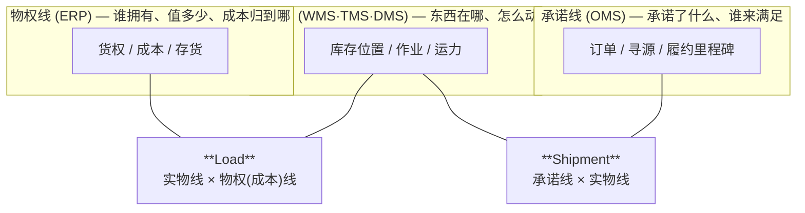
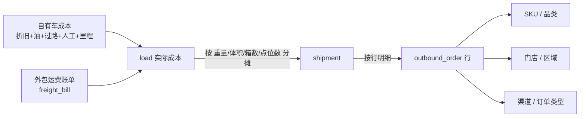

# 08 · Shipment 与 Load：货主企业视角

## 0. 视角声明（本套文档的立场）

**本套文档整体站在「货主企业」（零售商 / 品牌商）立场，而不是「物流服务商」（3PL / 4PL）立场。**
这不是措辞差别，它决定了整个架构的中轴对象是谁。

| | 货主企业视角（本文档） | 物流服务商 3PL/4PL 视角 |
| --- | --- | --- |
| 我是谁 | 运输的**买方**，货的**所有者** | 运输的**卖方**，货的**保管方** |
| 中轴对象 | 库存 + 履约承诺 | 委托单 + 运单 |
| 运输是什么 | 库存位置变化的**手段**（成本项） | **产品**（收入项） |
| 货权 | **必须建模**：在途归谁、跌价谁担、盘点算不算 | 不关心（不是我的货） |
| 计费的地位 | 应付 + **成本归集到 SKU / 门店** | 应收 + 利润核算 |
| 没有承运商的场景 | **大量存在**（自提、直送、自有车） | 不存在 |
| 核心 KPI | 门店到货准时率、单位物流成本（元/箱）、库存周转 | 毛利率、承运成本差、装载率 |

> **最常见的架构事故**：企业直接采购物流公司的 TMS，整个模型围绕「运单 + 计费」构建，
> 结果在途库存、货权转移、成本归集到商品/门店 —— 这些企业真正要的能力 —— 全成了二等公民。

---

## 1. 一句话定义

- **Shipment（发运单）= 一批货的一次位移承诺。** 需求侧、货的视角。
- **Load（装车单 / 车次）= 一次运力的使用。** 供给侧、车的视角。

**配载（Load Building）= 把 N 个 shipment 装进 M 个 load 的匹配过程。**

货主企业视角下，还要各加一层含义：

| | Shipment | Load |
| --- | --- | --- |
| 是什么的**容器** | **在途库存**的容器 | **运输成本**的容器 |
| 是什么的**载体** | **履约里程碑**的载体 | **资源效率**的度量单元 |
| 回答的经营问题 | 门店/客户能不能按时收到？在途的货算谁的资产？ | 这车装满没有？花多少钱？摊到哪个门店/品类？ |
| 谁在用这个数 | OMS、门店、客服、财务（存货） | 运输计划、车队管理、财务（费用） |

### 1.1 在企业架构三条主线中的位置



---

## 2. Shipment 的切分规则

### 2.1 必须拆的维度（任一不同 → 两个 shipment）

| 维度 | 为什么 |
| --- | --- |
| `ship_from_node` | 不同仓发的货不能算一票 |
| `ship_to_node` | 目的地是 shipment 的定义要素 |
| `service_level` / 时效窗 | 次日达与普通配混在一起，时效考核无从谈起 |
| `temp_zone` | 装车硬约束，冷冻不能与常温同票 |
| `owner_id` 货权 | 联营/寄售/多货主的在途库存归属不同 |
| 正向 / 逆向 | 退货是反向货权流动，不能与发货混 |

### 2.2 明确**不**拆的维度（企业视角特有）

| 不按什么拆 | 原因 |
| --- | --- |
| **不按订单拆** | 一个门店的 20 张补货单合成一个 shipment 是常态；按单拆会让配载与在途库存粒度碎掉 |
| **不按承运商拆** | 承运商是 **load 阶段**才决定的。过早绑定会让配载优化失去腾挪空间 |
| **不按车拆** | 那是 load 的职责；一个 shipment 装不下要上两台车，是 load 的事，不是拆 shipment 的理由 |
| **不按包裹拆** | 包裹是 WMS 打包结果，挂在 shipment 下面 |

### 2.3 计划态 shipment（企业视角必须有，4PL 没有）

企业需要**在拣货之前**就预生成 shipment（`status = PLANNED`），因为：

- 要提前订车 / 排线（外协运力需要提前 1~2 天锁定）
- 要用车辆装载能力**反向约束波次**（装不下的量不该放进今天的波次）
- 门店收货时间窗要提前排

所以 shipment 有两段生命：**先有预估量（按订单行体积重量估算）→ 再被实际包裹/托盘填充校正**。
4PL 是收到客户委托才有 shipment，没有这一段。

---

## 3. Load 的边界

**一个 load = 一台车 + 一次行程**（从离开起运点到行程结束）。

拆 load 的判据：换车、跨班次换司机、回到起点重新装载。

### 3.1 关键差异：企业视角下 load 可以不存在

| 场景 | shipment | load | waybill |
| --- | --- | --- | --- |
| 自有车队门店日配 | ✅ | ✅ **核心对象** | ❌ 无承运合同 |
| 合同承运整车 FTL | ✅ | ✅ | ✅ |
| 快递发 C 端 | ✅ | ❌ 承运商内部行为，企业不可见 | ✅ |
| 零担 LTL | ✅ | ❌ 或影子 load | ✅ |
| 门店自提 / 客户自提 | ✅ | ❌ | ❌ |
| 供应商直送门店 DSD | ✅（起点是供应商） | ❌ | ❌ |
| 店间调拨顺路带 | ✅ | 复用当日配送 load | ❌ |

> **结论：shipment 是必选对象，load 与 waybill 都是可选对象。**
>
> 4PL 模型通常把 waybill 当主键（因为那是它的收入凭证）。照搬到企业侧，
> 「自提」「供应商直送」「自有车队」这些高频场景会全部无处安放 ——
> 要么被迫造假运单，要么绕过系统线下操作。

### 3.2 影子 Load（Shadow Load）

外包给承运商后，企业看不到真实车次，但仍需要一个成本与时效归集的锚点时，
建一条 `load_source = SHADOW` 的记录：只有起点、目的地群、发运日期、承运商、总量与账单金额，
没有 `plate_no` / `driver` / 逐件 `load_detail`。用于成本分摊，不用于装车作业。

---

## 4. 多级网络：拆 shipment 还是拆 leg

**判据只有一条：中转点是不是企业自己的库存节点。**

| 中转点性质 | 处理 | 原因 |
| --- | --- | --- |
| **自有 RDC / 中转仓**（要收货、要过账、要重新组板） | **拆成两个 shipment**，中间一次入库或越库（XDK） | 库存节点变了，账必须落地 |
| **承运商分拨场 / 快递网点 / 甩挂点** | **一个 shipment，多个 leg** | 企业不持有该点库存，不落账 |

```
CDC ──shipment#1(干线)──> RDC ──shipment#2(城配)──> 门店      ← 自有 RDC，拆两票
仓  ──────────── shipment#1 ────────────────────> 客户
        leg1(揽收) → leg2(干线) → leg3(派送)                  ← 承运商内部，一票多段
```

`shipment_leg`：`shipment_no`, `leg_seq`, `from_node_id`, `to_node_id`, `leg_type`(PICKUP/LINEHAUL/DELIVERY),
`carrier_id`, `load_no`, `waybill_no`, `plan_depart`, `plan_arrive`, `actual_depart`, `actual_arrive`, `status`

> 这条判据 3PL/4PL 不会有 —— 对它们来说所有中转都是自己的场地，全部是 leg。

---

## 5. 在途库存与货权（企业视角的重头戏）

`shipment` 必须携带三个字段，缺一不可：

| 字段 | 取值 | 作用 |
| --- | --- | --- |
| `owner_id` | 货主 | 多货主/联营/寄售场景的库存归属 |
| `title_transfer_point` | `SHIP` / `RECEIPT` / `POD` | 货权在哪个节点转移 |
| `inventory_bucket` | `FROM_NODE` / `TO_NODE` / `IN_TRANSIT_POOL` | 在途期间这批货记在谁的库存上 |

### 5.1 典型场景对照

| 场景 | 货权转移点 | 在途库存记在 |
| --- | --- | --- |
| 仓间调拨 | `RECEIPT` | **发货仓**（发出方仍持有，直到收货方 RECEIPT） |
| 发货给加盟商 / 经销商 | `SHIP` 或 `POD`（看合同） | 转移后**不再是企业库存** |
| 退供给供应商 | `POD` | **企业**，直到供应商签收 |
| 电商发 C 端 | 签收 | **企业**（在途仍是企业资产，未确认收入） |
| 门店自提 | `SHIP`（交给门店即转） | 门店 |
| 供应商直送门店 DSD | `POD`（门店签收） | 供应商 |

> **没有这三个字段，月末库存必然对不上**：货已出仓、未到店，账上就「不见了」。
> 这恰恰是 4PL 模型不会有的部分 —— 因为货不是它的。

### 5.2 与库存流水的衔接

```
发货  ship_txn  → ledger(SHIP)     : STAGE-{door} → IN_TRANSIT-{shipment_no}
到货  receipt   → ledger(RECEIPT)  : IN_TRANSIT-{shipment_no} → 收货位
```

`inventory_bucket` 决定 `IN_TRANSIT-{shipment_no}` 这个虚拟货位挂在哪个 `warehouse_id` 名下 ——
这直接决定了各仓的账面库存和财务的存货科目。

---

## 6. 成本归集：从 load 摊回 SKU / 门店

4PL 算的是「这票货**收**客户多少钱」。企业算的是「这一车**花**了多少钱，该摊到哪个门店、哪个品类」。



`cost_allocation`：`source_type`(LOAD/WAYBILL/FREIGHT_BILL), `source_no`,
`target_type`(SHIPMENT/OUTBOUND_LINE/SKU/STORE), `target_no`,
`driver`(WEIGHT/VOLUME/CASE/STOP/EQUAL), `driver_value`, `amount`,
`cost_element`(FREIGHT/FUEL/WAITING/UNLOAD/RETURN/DETENTION), `period`

企业真正要的报表 —— **单位物流成本（元/箱、元/单、元/门店）、门店配送成本排名、
品类物流成本占比、履约成本对毛利的侵蚀** —— 只有走通这条链路才算得出来。
这是 4PL 系统结构上就不会提供的能力。

---

## 7. 状态口径：企业只要里程碑

`shipment` 状态（履约视角，对外可见）：

```
PLANNED(计划) → READY(集货完成) → HANDED_OVER(交接给承运/装车)
→ IN_TRANSIT → ARRIVED(到达目的节点) → DELIVERED(POD) → CLOSED
       ↘ CANCELLED / RETURNED(拒收退回)
```

`load` 状态见 [04 §2.4](04-transport-delivery.md#24-装车单状态机与落库副作用)（作业视角，对内）。

> 承运商的几十种轨迹码在 ACL 层映射后，只把**里程碑**投影到 shipment。
> 企业的客服和门店需要的是「到没到、几点到」，不是「已到达XX分拨中心」。

---

## 8. 对既有模型的调整清单

| 对象 | 增加 | 原因 |
| --- | --- | --- |
| `shipment` | `owner_id`, `title_transfer_point`, `inventory_bucket` | 在途库存与货权 |
| `shipment` | `plan_source`(ESTIMATED/ACTUAL), `est_weight/volume` | 支持计划态 shipment |
| `shipment` | `waybill_no` 允许为空、`load_no` 允许为空 | 自提/直送/自有车场景 |
| 新增 `shipment_leg` | | 承运商内部多段运输 |
| `load` | `load_source`(REAL/SHADOW) | 外包场景的成本锚点 |
| `load` | `actual_cost`, `mileage_m`, `duration_min`, `stop_count` | 自有车队成本核算基础 |
| 新增 `cost_allocation` | | 成本摊回 SKU/门店 |

---

## 9. 架构落点：企业该建什么系统

**不要建「承运商管理系统」，要建「运输计划与执行系统」。** 重心排序：

| 优先级 | 能力 | 服务的经营目标 |
| --- | --- | --- |
| 1 | **配载与排线优化** | 省钱（装载率、里程、点位数） |
| 2 | **时效管控与到货准时率** | 履约（门店缺货、客户体验） |
| 3 | **成本归集与单位成本分析** | 经营（元/箱、品类成本、渠道盈利） |
| 4 | 运费对账与结算 | 附属 —— 这是**应付**，不是应收 |

对应到组织：企业的运输系统对接的是**供应链计划部 + 门店运营部 + 财务成本中心**，
而不是像 4PL 那样对接**销售部 + 客户结算**。系统的报表、告警、权限模型都应按这个来。
