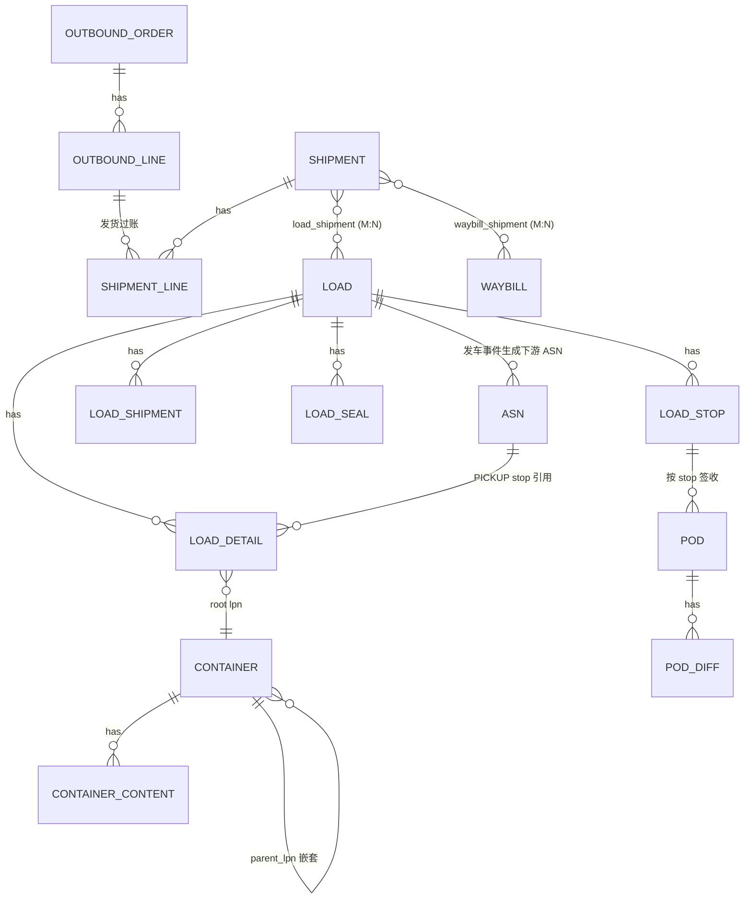

# 09 · 装车单的关联结构：Load × Shipment × Waybill × 单据 × 容器

## 0. 前置：Shipment 是发货过账凭证

**定位：`shipment` = 一批出库单的发货流水，需回传 ERP 过账。**

它不只是「给 TMS 的发运需求」，而是**记账凭证**。三个结构性后果：

### 0.1 shipment 必须有明细行

回传 ERP 过账需要 `SKU × 批次 × 数量 × 货主 × 成本参照`，头表承载不了。

`shipment_line`: `shipment_no`, `line_no`, `outbound_no`, `outbound_line_no`,
`sku_id`, `lot_no`, `qty`, `uom`, `base_qty`, `owner_id`, `inv_status`, `cost_ref`

### 0.2 shipment 过账后不可变

新增过账字段：`posting_status`(PENDING/POSTING/POSTED/FAILED)、`posted_at`、
`erp_doc_no`(ERP 凭证号)、`posting_batch`、`posting_error`。

> 一旦 `POSTED`，任何修改只能红字冲正。
> **load 侧的任何变更都不允许回写 shipment** —— 这条决定了下面所有关联关系的方向。

### 0.3 shipment 与 load 是多对多

- 一票分两车拉（超一车体积/载重）
- 一车拉多票（多门店配送）

两者都是常态，**必须桥接表**。

> ⚠️ **对既有模型的修正**：`shipment.load_no` 单值字段不成立，改为 `load_shipment` 桥接表。
> `shipment.load_no` 若保留，只能作为「主载车」冗余查询字段，不参与业务判断。

---

## 1. 总架构：load 只有两个连接面

```
outbound_order / outbound_line     仓储域 (WMS)   可拆、可合、可取消
        │  发货过账
        ▼
shipment / shipment_line           凭证域         不可变，回传 ERP
        │  承运需求
        ▼
load                               运力域 (TMS)   可换车、可重排
        ▲▼
container (LPN)                    物理域         真实的那堆货
```

| 连接面 | 通过什么 | 方向 |
| --- | --- | --- |
| **向上接凭证** | `load_shipment`（承运哪几票、各票份额） | 只读引用，不回写 |
| **向下接物理** | `load_detail.lpn` → `container` | 双向（装车改容器位置） |

`load_detail` 一行同时带 `ref_doc_no`(shipment/asn) 与 `lpn` ——
它是**凭证域与物理域的缝合点**，是整个运输模型里最关键的一行。

### 1.1 明令禁止：load 直接外键到 outbound_order

| # | 理由 |
| --- | --- |
| 1 | **生命周期不同**：出库单可取消，shipment 过账后不可变，load 可换车。三者变更节奏不一致 |
| 2 | **粒度差两次变换**：出库单 → shipment 是合并，shipment → load 是再合并 + 可能拆分 |
| 3 | **跨域强耦合**：出库单属 WMS，load 属 TMS，直连等于两个域绑死，任一方改结构都穿透 |
| 4 | **N×M 爆炸**：出库单分批发货 × 一车多票，直连的关联表规模不可控 |

---

## 2. 装车单结构：五张表

| 表 | 维度 | 职责 |
| --- | --- | --- |
| `load` | 资源 | 车、司机、承运商、时间、装载率、成本 |
| `load_stop` | 时空 | 到哪、几点到、时间窗、点位异常 |
| **`load_shipment`** | **凭证** | **本车承运哪几票、各票在本车的份额** |
| `load_detail` | 物理 | 哪个 LPN、第几个 stop 卸、谁扫的 |
| `load_seal` / `load_change_log` | 合规 / 审计 | 铅封、变更留痕 |

### 2.1 为什么必须有 `load_shipment`

只有 `load_detail`（LPN 级）不够：

1. **成本分摊需要落点** —— 一票分两车时，每车承担多少运费得有地方记
2. **散货 / 无 LPN 场景挂不住** —— 零担散箱没有容器号，但仍要归票
3. **POD 按 `shipment × stop` 出** —— 需要锚点
4. **汇总代价** —— 每次算「本车装了几票」都去 `load_detail` 做 DISTINCT，性能不可接受

```
load_shipment:
  load_no, stop_seq, shipment_no,
  planned_pallets / planned_cases / planned_weight_g / planned_volume_cm3,   -- 计划份额
  loaded_pallets  / loaded_cases  / loaded_weight_g  / loaded_volume_cm3,    -- 实装份额
  split_flag,     -- 该票是否跨车拆分
  split_ratio,    -- 成本分摊基数
  status
```

> **对账断言**：`split_flag = 1` 时，同一 `shipment_no` 在所有 load 上的
> `split_ratio` 之和必须 = 1。

---

## 3. 装车单 × 运单

### 3.1 核心结论：`waybill` 不挂在 `load` 上做外键

原因是**粒度的决定权不同**：

- `waybill` 的粒度由**承运商**决定（有的按票、有的按车、有的按包裹）
- `shipment` 的粒度由**企业**决定，是稳定的

把 waybill 直接绑 load，换一家承运商模型就崩。

### 3.2 正确连接：两者都通过 shipment，load↔waybill 是派生关系

```
load ──load_shipment──> shipment <──waybill_shipment── waybill
```

| 场景 | load : shipment | shipment : waybill | 派生 load : waybill |
| --- | --- | --- | --- |
| 整车 FTL | 1 : N | N : 1 | 1 : 1 |
| 门店城配（自有车） | 1 : N | N : 0 | 1 : 0（无运单） |
| 快递发 C 端 | 无 load | 1 : 1 | — |
| 零担 LTL | 1 : N | 1 : 1 | 1 : N |
| 一票分两车 | 2 : 1 | 1 : 1 | 2 : 1 |
| Milk-run 提货 | 1 : 0（挂 ASN） | — | — |

### 3.3 唯一例外

整车自营 / 合同承运场景，允许在 `load` 上冗余 `primary_waybill_no`
做便捷查询与面单打印。**它是派生字段，不是外键**，不参与任何业务逻辑判断。

---

## 4. 装车单 × 出入库单据

三个方向，出库侧只是其中之一。

### 4.1 出库侧（DELIVERY stop）—— 间接引用

```
outbound_order → shipment → load_shipment → load
                              ↑
                    load_detail.ref_doc_no
```

`load_detail` 用**通用单据引用**而不是写死 `shipment_no`：

```
ref_doc_type   SHIPMENT / ASN / RETURN_ORDER
ref_doc_no
```

### 4.2 提货侧（PICKUP stop）—— 挂的是入库单据

很多模型漏掉这一块：**Milk-run 循环取货、多仓拼车、供应商上门提货**，
`load` 的 `PICKUP` stop 装的货对应的是**上游 ASN / 采购单**，不是 shipment。

```
stop_type = PICKUP
  → load_detail.ref_doc_type = 'ASN'
    load_detail.ref_doc_no   = asn_no
    load_detail.lpn          = supplier_lpn (SSCC)
```

> 有了这个，**采购提货与门店配送共用同一套 load 模型**，不必另建一套「提货单」。

### 4.3 下游入库单：由发车事件触发，不是外键

```
Load.Departed 事件
    ↓
下游节点生成 ASN:
    asn.source_doc_no   = shipment_no
    asn.transport_ref   = load_no        ← 引用标记，不是外键
    asn.plate_no        = load.plate_no
    asn.expected_arrive = load_stop.plan_eta
    asn.is_pre_labeled  = 1              ← LPN 已存在
    asn_line 来源       = shipment_line
```

门店 / RDC 收货时**扫 LPN 直接从 ASN 带出内容**，不必点数 ——
这是容器体系的价值兑现点（见 [05 §5](05-container-label.md)）。

### 4.4 逆向：返仓入库

```
门店拒收 → pod_diff(diff_type = REJECT) → 货随车返回
         → load 结束时生成 inbound_order(inbound_type = RETURN)
         → 引用原 load_no + 原 shipment_no
         → ledger: ON_VEHICLE-{load_no} → 收货位
```

> **返仓必须走完整入库流程**（产生 `RETURN_IN` 流水），不能直接改库存数字。
> 同时 shipment 已过账，返仓要触发 ERP 的冲销或退货过账，
> 由 `shipment_reversal` 关联原 `erp_doc_no`。

---

## 5. 装车单 × 容器

### 5.1 只扫顶层容器（root LPN）

`container` 有 `parent_lpn` 嵌套树，装车**只扫 root LPN**：

```
扫托盘 PL0001
  → container 树展开: CS001..CS040 (40 箱)
  → container_content 展开: 12 个 SKU, 共 480 件
```

**`load_detail` 只存 root LPN**，不存展开后的每个箱 —— 否则一车几千行，
装车界面与并发写入都扛不住。展开视图靠容器树递归实时查询。

### 5.2 状态与位置联动

> **`load` 本身不动库存。是 `container` 的位置变更驱动 `inventory_ledger`。**

| load 事件 | container.status | container.current_location | inventory_ledger |
| --- | --- | --- | --- |
| 扫码装车 | `STAGED` → `LOADED` | `STAGE-{door}` → `ON_VEHICLE-{load_no}` | — （仅容器流水） |
| 发车 | `LOADED` → `SHIPPED` | `ON_VEHICLE-{load_no}` | `SHIP`: STAGE → IN_TRANSIT |
| 到店卸货 | `SHIPPED` → `DELIVERED` | 门店节点 | 下游 `RECEIPT` |
| 拆板消耗 | → `CONSUMED` | — | `container_txn` |
| 器具回收 | → `EMPTY` | 返程车 / 仓 | `asset_ledger` |

### 5.3 三个必须建模的边界情况

| 情况 | 处理 | 为什么不能不管 |
| --- | --- | --- |
| **散货装车（无 LPN）** | `load_detail.lpn = '*'`，改挂 `sku + lot + qty`，加 `is_bulk = 1` | 零担散箱、大件家电、生鲜筐装必须支持 |
| **混装托盘（一板多店）** | `container.dest_node_id` 置空，改在 `container_content` **行级**带 `dest_node_id`，卸货逐箱扫 | 门店小单量场景不可避免；需在配载策略里显式开关控制 |
| **中途拆板（甩挂 / 中转重组）** | 走 `container_txn` 的 `SPLIT` / `MERGE`，**产生新 LPN**；原 load 的 detail 不改，新增一段 load 或 leg | 直接改 detail 会让已发车的审计链断裂 |

### 5.4 容器与 shipment 的约束

组板时确定 `dest_node_id`，shipment 按 `dest_node` 聚合，所以正常情况：

```
container → shipment 是 N:1  (同一票的多个托盘)
```

**混装托盘破坏这个约束** —— 它让一行 `load_detail` 对应多个 shipment。
建模处理：混装托盘的 `load_detail.ref_doc_no` 留空，
改由 `container_content.ref_doc_no` **行级**承担归属。

---

## 6. 完整实体关系



---

## 7. 对既有模型的修正清单

| # | 原设计 | 修正为 | 原因 |
| --- | --- | --- | --- |
| 1 | `shipment` 无明细行 | 新增 `shipment_line` | 回传 ERP 过账需要 SKU×批次×数量 |
| 2 | `shipment` 无过账字段 | 增加 `posting_status/posted_at/erp_doc_no/posting_batch` | shipment 是记账凭证 |
| 3 | `shipment.load_no` 单值 | 新增 `load_shipment` 桥接表；原字段降级为冗余 | 一票分两车 / 一车多票 |
| 4 | `waybill.load_no` 外键 | 通过 `shipment` 间接关联；`load.primary_waybill_no` 仅冗余 | 运单粒度由承运商决定，不稳定 |
| 5 | `load_detail.shipment_no` | 改为 `ref_doc_type` + `ref_doc_no` | PICKUP stop 要挂 ASN |
| 6 | `load_detail` 假设必有 LPN | 增加 `is_bulk` + `sku_id/lot_no/qty` | 散货装车 |

---

## 8. 关键对账断言（加进每日任务）

```
1) Σ load_shipment.split_ratio  GROUP BY shipment_no  == 1        (拆车份额闭合)
2) Σ load_detail(实扫)          == load_shipment.loaded_*          (明细与汇总一致)
3) Σ shipment_line.qty          == Σ ship_txn.qty                  (凭证与流水一致)
4) shipment.posting_status=POSTED 的行, 必有 erp_doc_no            (过账无遗漏)
5) container.status=SHIPPED 的 LPN, 必在某个 load_detail 中        (容器不失联)
6) Σ pod.delivered + Σ pod_diff == Σ load_detail(该 stop)          (签收闭环)
```
