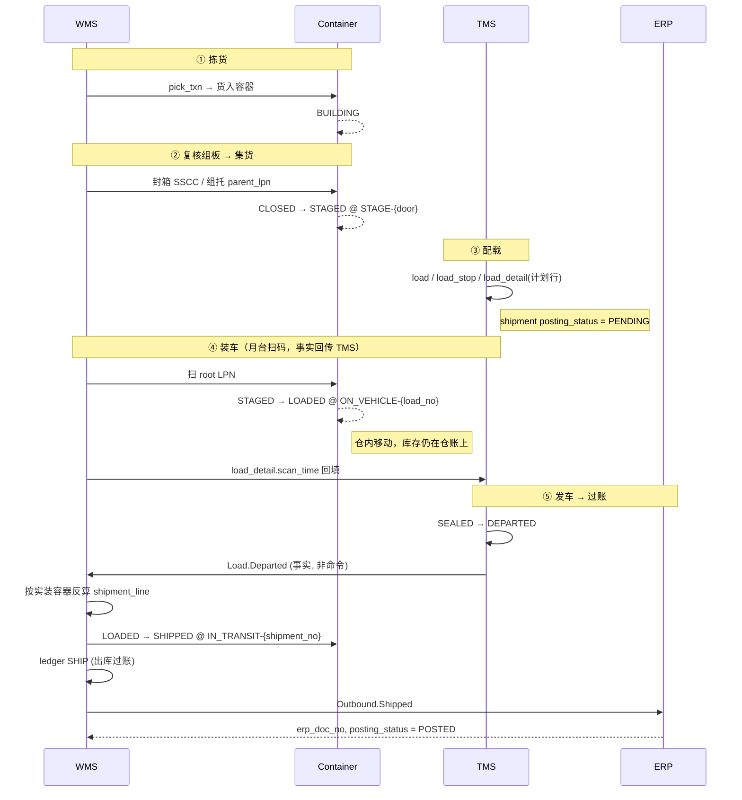

# 10 · 发货过账时机：先装车后过账（本架构采用）

## 0. 决策

**采用「先装车、后过账」：`Load.Departed`（发车确认）才触发 shipment 过账。**

三种候选方案的对比与取舍：

| 方案 | 过账时点 | 甩货/少装的代价 | ERP 在途库存及时性 | 冲销频率 |
| --- | --- | --- | --- | --- |
| **① 先装车后过账（采用）** | 发车确认 | **零**（过账前自然消化） | 延迟到发车 | **极低**（仅发车后纠错） |
| ② 先过账后装车 | 集货完成 | 红字冲销 + 重开凭证 | 及时 | 高 |
| ③ 按计划过账，次日调整 | 波次完成 | 悬账 | 最及时 | 月末批量悬账 |

> 选择 ① 的核心理由：**把凭证的产生时点推到实物事实确定之后**，
> 让绝大多数差异（甩货、少装、临时追加）在过账前就消化掉，冲销成为极低频的例外路径。

---

## 1. 实物与单据的完整时序



---

## 2. 三个关键设计点

### 2.1 `shipment_line` 由实物反算，不从 `outbound_line` 抄

**这是方式一最大的红利。** 发车时的生成逻辑：

```
遍历 load_detail (该 load, scan_time IS NOT NULL, ref_doc_type = 'SHIPMENT')
  → 展开 container 树 (root_lpn → 子容器)
  → 取 container_content
  → 按 (outbound_no, outbound_line_no, sku_id, lot_no, owner_id, inv_status) 聚合
  → 生成 shipment_line
  → is_bulk = 1 的行直接取 load_detail 的 sku_id / lot_no / qty
```

> **凭证由实物生成，不由计划生成。**
> 甩货、少装、临时追加全部在过账前自然消化，ERP 拿到的永远是真正发出去的量。

### 2.2 两段式库存移动（关键修正）

装车与发车必须是**两次独立的库存动作**，不能合并：

| 动作 | 位置变化 | ledger | 库存归属 |
| --- | --- | --- | --- |
| **装车扫码** | `STAGE-{door}` → `ON_VEHICLE-{load_no}` | `MOVE`（仓内移动） | **仍在仓账上** |
| **发车确认** | `ON_VEHICLE-{load_no}` → `IN_TRANSIT-{shipment_no}` | `SHIP`（出库过账） | **离仓，进在途** |

关键在于 **`ON_VEHICLE-{load_no}` 是归属该仓的虚拟货位** ——
货装上车但未发车，责任仍在仓库，没交接就不该出账。

> 由此：**甩货只需 `ON_VEHICLE → STAGE` 回退一步，完全不涉及冲销。**
> 这就是方式一存在的全部意义。

### 2.3 触发权在 TMS，执行权在 WMS

TMS 发布**事实**（`Load.Departed`：车已发出），WMS 订阅后**自主决定**执行过账。

> **不要设计成 TMS 调 WMS 的「发货接口」（命令式）** ——
> 那会让 TMS 隐性获得库存写权限，破坏「WMS 是库存 SOR」这条边界。

---

## 3. 模型简化：shipment : load 退化为 N : 1

**这是过账时机决策的衍生结论，不是无条件的模型事实。**

推理：shipment 是发货流水凭证，而**一次发车 = 一次发货事实 = 一次过账**，因此：

- 一车拉 5 个门店 → **5 个 shipment**（目的地不同必拆）→ `load : shipment = 1 : N`
- 一票货装不下分两车 → **配载时就拆成两个 shipment**（两次发车 = 两次发货事实）

**结论：shipment 永远不跨车。**

### 3.1 对 [09](09-load-relationships.md) 的修正

| [09](09-load-relationships.md) 的设计 | 方式一下修正为 |
| --- | --- |
| `load_shipment.split_flag` | **删除** |
| `load_shipment.split_ratio` | **删除**（运费直接摊到 shipment，无需二次分摊） |
| `load_shipment` 主键 `(load_no, stop_seq, shipment_no)` | `(load_no, shipment_no)`，`stop_seq` 降为属性 |
| `shipment.load_no` 是「错的冗余」 | **重新成为合法字段**：`load_no + stop_seq` 单值即可 |
| 对账断言「split_ratio 之和 = 1」 | **删除** |

`load_shipment` 表**仍然保留**，但存在理由变了 —— 不再是解决 M:N，而是：

1. 计划份额 vs 实装份额的对比（配载准确率）
2. POD 的锚点（POD 按 `shipment × stop` 出）
3. 避免对 `load_detail` 做 DISTINCT 汇总

> ⚠️ **这个简化只在方式一成立。** 若将来改为「先过账后装车」，
> M:N 与 split 逻辑必须加回来。做技术选型或换 TMS 时要重新审视这一条。

---

## 4. 状态联动总表

| 阶段 | container.status | container.location | load.status | shipment.status / posting | ledger |
| --- | --- | --- | --- | --- | --- |
| 拣货 | `BUILDING` | 拣货容器 | — | — | `PICK` |
| 组板封箱 | `CLOSED` | 复核区 | — | — | — |
| 集货 | `STAGED` | `STAGE-{door}` | `PLANNED` | `READY` / `PENDING` | `MOVE` |
| 装车 | `LOADED` | `ON_VEHICLE-{load}` | `LOADING`→`LOADED` | `READY` / `PENDING` | `MOVE` |
| **甩货回退** | `STAGED` | `STAGE-{door}` | `LOADED` | 不变 | `MOVE`（反向） |
| **发车** | `SHIPPED` | `IN_TRANSIT-{shp}` | `DEPARTED` | `SHIPPED` / `POSTING` | **`SHIP`** |
| ERP 确认 | 不变 | 不变 | 不变 | `SHIPPED` / `POSTED` | — |
| 到店收货 | `DELIVERED` | 门店节点 | `POD_STOP` | `DELIVERED` | 下游 `RECEIPT` |
| 拒收返仓 | `SHIPPED` | `ON_VEHICLE-{load}` | `POD_STOP` | `RETURNED` | 返仓 `RETURN_IN` |
| 器具回收 | `EMPTY` | 返程车 / 仓 | `COMPLETED` | `CLOSED` | `asset_ledger` |

---

## 5. 五个必须处理的工程细节

| # | 问题 | 处理 |
| --- | --- | --- |
| 1 | **`Load.Departed` 重复投递** | WMS 侧 `idem_key = {load_no}:DEPART`。已过账直接忽略并返回成功 |
| 2 | **发车事件丢失**（车走了，WMS 没过账） | **超时补偿必须有**：`load.actual_depart` 超过 N 分钟仍无过账确认 → 告警 + 自动重推。否则会出现「货没了但账上还在仓里」 |
| 3 | **跨账期**（23:50 发车算哪天的账） | 显式定义 `posting_date` 规则。**建议按仓库作业日**（有 cutoff 定义），不按自然时间 —— 否则月末最后一天晚上发的车会掉到下月 |
| 4 | **过账失败** | `posting_status = FAILED` + `posting_error`，挂起等人工介入。**不能自动跳过，也不能阻塞发车**（车已经走了，这是既成事实） |
| 5 | **发车后才发现装错** | 走 `shipment_reversal` 红字冲销，关联原 `erp_doc_no`。方式一把冲销压缩到「发车后」，频率极低 |

### 5.1 超时补偿的具体规则（建议）

```
每 5 分钟扫描:
  load.status = DEPARTED
  AND actual_depart < NOW() - 15min
  AND EXISTS(load_shipment WHERE shipment.posting_status = 'PENDING')
→ 重推 Load.Departed（幂等，安全）
→ 连续 3 次仍未过账 → 升级告警至仓库主管 + 运输调度
```

---

## 6. 对账断言（替换 [09 §8](09-load-relationships.md#8-关键对账断言加进每日任务)）

```
1) Σ shipment_line.qty  == Σ ship_txn.qty                          (凭证与流水一致)
2) Σ shipment_line.qty  == Σ 实装 container_content.qty            (凭证与实物一致)
3) load.status=DEPARTED 的所有 shipment, posting_status != PENDING (无漏过账)
4) posting_status=POSTED 的行必有 erp_doc_no                       (过账闭环)
5) container.status=LOADED 的 LPN, 其 location 必为 ON_VEHICLE-*   (装车未发车)
6) container.status=SHIPPED 的 LPN, 其 location 必为 IN_TRANSIT-*  (已发车)
7) ON_VEHICLE-* 虚拟位的库存, 必归属起运仓                          (未交接不出账)
8) Σ pod.delivered + Σ pod_diff == Σ load_detail(该 stop)          (签收闭环)
```

> 断言 5/6/7 是方式一的专属检查 —— 它们保证「装车」与「发车」这两段没有被实现代码悄悄合并。
