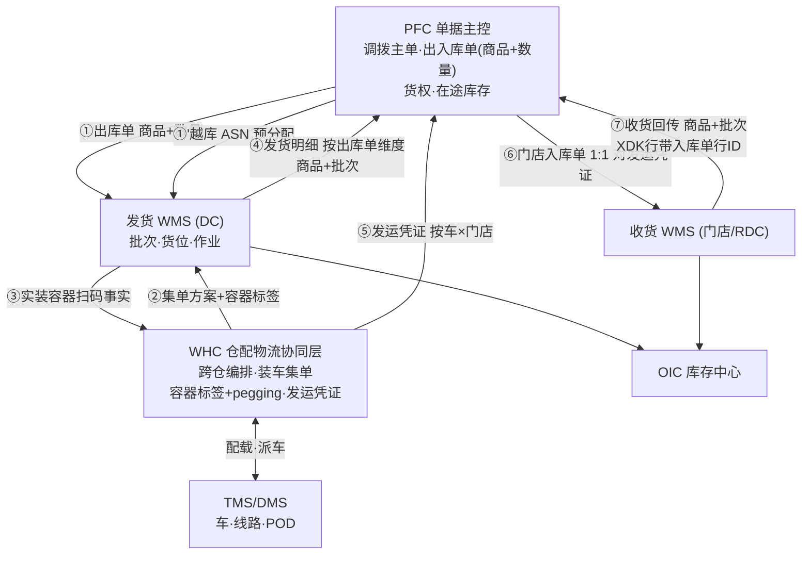
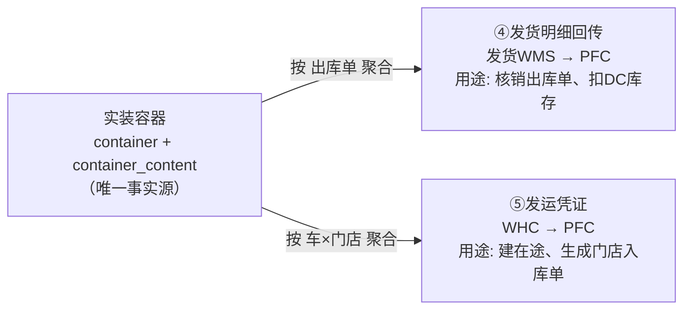
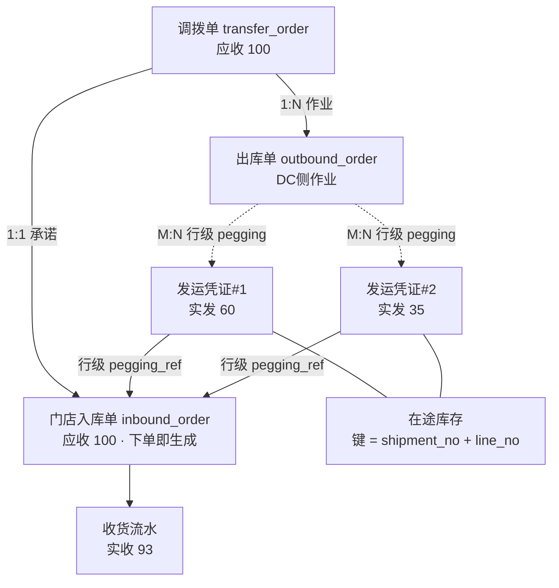

# 11 · 产品边界与系统交互：PFC / WHC / WMS / OIC

> 本文档对齐实际系统命名，是 [01 领域边界](01-domain-boundaries.md) 的落地版本。
> 解决的核心问题：**DC → 门店调拨场景下，出库单与入库单的多对多。**

## 0. 术语对齐

| 实际系统 | 本套文档中的对应物 | 定位 |
| --- | --- | --- |
| **PFC** | ERP + OMS 的单据部分 | 单据主控 + 逻辑库存调度 |
| **OIC** | 库存中心 | 全渠道库存视图，消费 WMS 实物流水 |
| **WHC** | （原文档未独立建模） | **仓配物流协同层 —— 需新建的那一层** |
| **WMS** | WMS（发货 WMS / 收货 WMS，各仓独立） | 仓内执行 |
| **发运凭证** | `shipment` | 一批出库单的发货流水凭证 |

---

## 1. 产品边界

### 1.1 五个系统的职责

| 系统 | 拥有的事实（SOR） | 明确不拥有 |
| --- | --- | --- |
| **PFC** | 调拨主单、出入库单据（**只有商品+数量，无批次**）、货权、逻辑库存调度、**在途库存** | 批次、货位、容器、车 |
| **OIC** | 全渠道库存视图（消费 WMS 流水）、可售库存 | 单据、作业 |
| **WHC** | **跨仓作业编排、装车集单、容器标签与 pegging、发运凭证、承运协调** | 仓内作业、库存过账 |
| **WMS** | 物理库存、**批次（由 WMS 产生）**、仓内作业、货位 | 单据主控、跨仓协同、车 |
| **TMS / DMS** | 车、线路、运单、POD | 库存、单据 |

### 1.2 已确定的五条边界

1. **批次归 WMS**：PFC 下发单据不带批次，WMS 收发货产生批次，可回传但 **PFC 不用批次调度库存**
2. **实物库存流水归 OIC**：WMS → OIC 是**流水**，不是快照
3. **发货 WMS 按出库单维度回传发货明细**
4. **发货 WMS 与收货 WMS 相互独立，不感知彼此差异**
   → **推论：差异比对只能在 PFC 层做，不能在 WMS 之间做**
5. **容器与单据解耦** —— 见 §1.3 的精确化

### 1.3 「容器与单据解耦」必须精确化

否则会被实现成灾难 —— XDK「一单到底」将无法实现。

| | 内容 | 判断 |
| --- | --- | --- |
| ✅ **要解耦的** | 容器与**出库单的强绑定**：一个容器可装多张出库单的货，容器不再「属于」某张单 | 正确，这是集单与拼车的效率来源 |
| ❌ **不能解耦的** | 容器**内容的单据溯源**：`container_content` **行级**必须能追到来源单据行 | 这个不能丢 |

由此得出 WHC 最重要的一条职责定义：

> **容器标签是跨节点 pegging 的物理载体。WHC 拥有容器标签，因此 WHC 是跨仓单据关联的 SOR。**

这一条把「缺失协同层」与「XDK 回传方式无共识」两个问题连起来了 ——
**后者之所以没有共识，是因为前者那一层还不存在，pegging 没有归属方。**

### 1.4 系统交互全景



---

## 2. 核心方案：用发运凭证打断出入库单的 M:N

### 2.1 现状诊断：那张单不是入库单，是 ASN

```
PFC → 多张 out 单 → DC WMS
DC WMS 拼车 → 一车多出库单 → 回传 PFC
PFC 按【车 × 门店】维度发货明细流水 → 门店入库单
PFC 用「出库单 ↔ 入库单」配对调拨库存
```

> **按「车 × 门店」产生的那张单，语义上是「到货通知 / 发运凭证」，不是「入库单」。**
> 把它命名为入库单，就把**承诺层**挤掉了。

一次调拨里有**三个数字**：

| 数字 | 含义 | 应归属的对象 |
| --- | --- | --- |
| 100 箱 | **应收**（门店要的） | 调拨单 → 门店入库单 |
| 95 箱 | **实发**（DC 发的，缺货 5） | 发运凭证 |
| 93 箱 | **实收**（路上损 2） | 收货流水 |

按车产生入库单时，门店入库单的计划量 = **95**，于是两个关键指标里丢了一个：

| 指标 | 算法 | 按车产生入库单时 |
| --- | --- | --- |
| **DC 满足率**（缺货责任） | 实发 ÷ 应收 | ❌ **算不出来**（应收 = 实发） |
| 运输损耗率（承运责任） | 实收 ÷ 实发 | ✅ 能算 |

### 2.1.1 五个问题

| # | 问题 | 后果 |
| --- | --- | --- |
| 1 | **用事实覆盖了承诺** | 「应收 100 → 实发 95」在门店侧不可见；DRP 拿不到真实满足率，缺货分析断链 |
| 2 | **货到前门店没有单据** | 车是发车时才定的，入库单也只能发车后才有 → 无法预约、排班、备货位 |
| 3 | **凭证结构被运输偶然性驱动** | 换车/加车/甩货改变入库单的张数与数量，财务凭证跟着运输调度抖动 |
| 4 | **一店一天多趟车 → 多张入库单** | 门店收货与盘点期望按天，单据碎片化 |
| 5 | **与「发/收货 WMS 互不感知差异」自相矛盾** | 入库单来自发货事实，收货 WMS 实际一直在跟发货量对账，只是它不知道；真正的应收基准丢了 |
| 6 | **SSTK / XDK 混发** | 门店入库单有些行**根本没有对应出库单**（货来自供应商 ASN 越库）→ M:N 且部分行无对应 |

### 2.2 正确分层：三层不能压成两层

| 层 | 对象 | 数量含义 | 谁产生 | 时点 |
| --- | --- | --- | --- | --- |
| **承诺** | 调拨单 → 门店入库单 | **应收** | PFC | **下单时** |
| **发货事实** | 发运凭证 `shipment` | **实发** | WHC | 发车后 |
| **收货事实** | 收货流水 | **实收** | 收货 WMS | 到货时 |

**门店入库单必须在下单时生成、数量 = 调拨量。** 发运凭证挂在它下面作为「到货批次」 ——
这就是标准的 `STO + ASN` 模式。

**配套需要关单机制**：DC 侧标记调拨单「已发完 / 部分发完关闭」后，
入库单的未收量（那 5 箱）释放，否则会永久悬账。

### 2.3 M:N 不是消除，是降级

**出库单与入库单本来就不该互相配对** —— 它们是同一张调拨单的两侧投影：

```
              调拨单 transfer_order
             ╱                      ╲
      出库单(DC侧)              入库单(门店侧)
         │ 实发                       ↑ 实收
         └──── 发运凭证 shipment ──────┘
                （在途载体）
```

**配对发生在共同父级（调拨单）+ 共同事实层（发运凭证行）上，
不在两个平级执行单据之间。** 于是 M:N 分成两类，只有一类需要精确：

| 关系 | 基数 | 需要精确配对吗 |
| --- | --- | --- |
| **库存调拨配对** | 调拨单 1:1 两侧；在途键 = 发运凭证行 | ✅ **必须精确** |
| **作业核销关联** | 出库单 × 发运凭证 = M:N | ❌ **无所谓**，行级 pegging 足够 |

> **M:N 本身不可怕，可怕的是拿 M:N 去做库存过账配对。**

### 2.3.1 修正后的完整基数

| 关系 | 基数 | 说明 |
| --- | --- | --- |
| 调拨单 : 门店入库单 | 1 : 1 | 承诺层，下单即生成 |
| 调拨单 : 出库单 | 1 : N | DC 可按温层 / 波次拆 |
| 门店入库单 : 发运凭证 | 1 : N | 分多车 / 多天到货 |
| 发运凭证 : 门店入库单 | 1 : N | 一票可含多张调拨单的货 |
| ⇒ 头层面 | **M : N** | **不做头配对，走行级 pegging** |
| `shipment_line` : `inbound_line` | N : 1 | 多次到货核销同一行 |
| **在途库存键** | **`shipment_no + line_no`** | 行级 |

> ⚠️ **修正**：早期版本写的「发运凭证 : 门店入库单 = 1:1，并在 `inbound_order.shipment_no`
> 加唯一索引」是错的 —— 那会强迫入库单退化成发货事实的镜像，丢掉承诺层。
> 该唯一索引应去掉。

### 2.4 最关键的一处改动

> **PFC 的在途库存键，从 `出库单号` 改为 `发运凭证号 + 行号`。**

```
DC 库存 ──发车──> 在途 (键 = shipment_no + line_no) ──门店收货──> 门店库存
```

出库单只负责**核销 DC 侧的库存扣减**，不再承担「配对入库单」的职责 ——
一个是仓储域的作业完结，一个是货权域的位移配对，本不该由一个对象承担。

### 2.4 发运凭证由 WHC 生成，PFC 消费

发运凭证的切分依赖「车 × 门店」，这是 WHC 独有的信息（拼车结果），PFC 不知道。

PFC 拿到后做三件事：① 在途过账 ② 1:1 生成门店入库单 ③ 下发收货 WMS。

### 2.5 两条回传并存，但同源

「按出库单维度回传发货明细」与「按车×门店的发运凭证」是**同一批实物事实的两个视角**：



> **两条回传都由实装容器反算，所以必然对得上。**
> 这是一致性的**结构性保证**，不靠对账补救。

---

## 3. SSTK / XDK 混发：行级 pegging

### 3.1 分歧的根因：混淆了两个不同的问题

「收货 WMS 到底按不按入库单行 ID 回传」把两件事混成了一件：

> **pegging 必须存在（在发运凭证行上）；
> 但「收货 WMS 是否需要传递它」是另一个问题。**

### 3.2 pegging 一律存在，传递方式按模式分

| | pegging 存在于 | 收货 WMS 回传内容 | 谁做核销匹配 |
| --- | --- | --- | --- |
| **SSTK** | `shipment_line.pegging_ref`（**WHC 发车时从 `container_content.ref_doc_no` 推导补齐**） | 只报 **商品 + 批次 + 数量** | **PFC** 用发运凭证的 pegging 核销 |
| **XDK** | 容器标签 SSCC `(403)` + `shipment_line.pegging_ref` | 报 **商品 + 批次 + 入库单行 ID** | 直接按行 ID 核销 |

> **这样「收货 WMS 在非 XDK 场景不需要关心入库单行 ID」与
> 「XDK 一单到底」两个要求同时成立，不冲突。**
> SSTK 场景 pegging 并没有丢 —— 它在发运凭证上，只是不经过收货 WMS。

### 3.3 为什么 XDK 仍要靠容器标签带行 ID

| | pegging 的性质 |
| --- | --- |
| **XDK** | 采购预分配时就**真实存在**的业务事实，不可替换；且同一供应商批次可能分给多个门店，「商品+批次」在门店内可能无法区分来自哪张调拨单 |
| **SSTK** | 发货时才建立、**可替换**（同商品同批次的库存是同质的）→ 让 PFC 匹配即可 |

### 3.4 报文结构：统一，行级条件必填

| 字段 | SSTK 行 | XDK 行 |
| --- | --- | --- |
| `sku_id` | 必填 | 必填 |
| `batch_no` | 必填（WMS 产生） | 必填（沿用供应商批次） |
| `qty` | 必填 | 必填 |
| `source_mode` | `SSTK` | `XDK` |
| `pegging_type` | `NONE` | `INBOUND_LINE` |
| `pegging_ref` | **空** | **必填**：门店入库单行 ID |

一张回传里可以混两种模式的行。不拆两个接口，不给 XDK 造批次，也不要求 SSTK 硬凑行 ID。

### 3.5 必须显式定义：SSTK 的核销分配规则

若一个门店有**两张入库单都含 SKU-A**，收到 100 箱批次 X，PFC 按什么规则核销？

**必须定死**，否则会出现随机核销、月末对账查不清。建议：

```
按 调拨单 required_arrive_date 升序 (FIFO)
  → 同日按 transfer_no 升序
  → 单行未收量不足时溢出到下一行
  → 全部核销完仍有余量 → 进「无主到货」差异池, 不自动挂单
```

### 3.3 XDK 的行 ID 从哪来 —— 容器标签

```
PFC 越库预分配 → 生成门店入库单行 ID → 下发给 WHC
WHC 生成容器标签, SSCC 编码: 门店号 + inbound_line_id  (GS1 AI 403 路由码)
供应商预贴 / DC 分拣时贴
门店收货扫容器 → 读出 pegging → 按行 ID 回传
```

**这是「一单到底」的实现机制，也是 WHC 必须拥有容器标签的原因。**

### 3.4 XDK 在 PFC 侧的过账口径（待决策）

| 方案 | 过账 | DC 库存 | 适用 |
| --- | --- | --- | --- |
| **A. 视为 DC 瞬时进出** | 供应商→DC（收货）、DC→门店（发货），两次 | 瞬时进出，周转率虚高 | **采购合同是「送到 DC」，货权在 DC 转移**（自营零售通常如此） |
| **B. 视为供应商直送** | 供应商→门店，一次；DC 仅中转 | 干净 | 采购合同是「送到门店」，DC 只提供分拣服务 |

> **判据：货权在哪转移，就在哪过账。**
> 若 DC 要对供应商短溢负责、要与供应商结算，必须走 A —— 否则 DC 的收货差异无处记账。

---

## 4. 单据数据模型与上下游关键字段

### 4.1 调拨主单 `transfer_order`（PFC 内部）

`transfer_no`, `from_node_id`, `to_node_id`, `owner_id`, `required_arrive_date`

行：`sku_id`, `qty`, `uom`, `operation_mode`(SSTK/XDK) —— **无批次**

### 4.2 出库单 `outbound_order`（PFC → 发货 WMS）

**上游**：`transfer_no` + 行

| 字段 | 关键性 |
| --- | --- |
| `outbound_no` | |
| `source_doc_type`/`source_doc_no` = `TRANSFER`/`transfer_no` | 溯源 |
| **`ship_to_node_id`** | **门店 —— 发运凭证按此切分** |
| `owner_id` | 货权 |
| `required_ship_time` | 波次截单依据 |
| 行：`sku_id`, `order_qty`, `uom`，**无 `lot_no`** | 批次归 WMS |
| 行：**`operation_mode`** = SSTK/XDK | **必须打在行上** —— 混发的前提 |
| 行：`pegging_ref`（XDK 才有） | 门店入库单行 ID |

**下游**：`outbound_no + line_no` → 容器内容溯源 → 发货明细回传

### 4.3 越库 ASN（PFC → 发货 WMS，XDK 路径）

与出库单**并列**，是发运凭证的第二个来源。

`asn_no`, `supplier_id`；
行：`sku_id`, `expected_qty`, **`dest_node_id`（预分配门店）**, **`pegging_ref`（门店入库单行 ID）**, `is_pre_labeled`

### 4.4 容器 `container` / `container_content`（WHC 拥有）★ 枢纽

| 层 | 关键字段 |
| --- | --- |
| `container` | `lpn`(SSCC), `parent_lpn`, `container_type`, **`dest_node_id`(门店)**, `status`, `current_location` |
| `container_content` | `lpn`, `line_no`, `sku_id`, **`batch_no`**(WMS 产生), `qty`, **`ref_doc_type`**(OUTBOUND/ASN), **`ref_doc_no`**, **`ref_line_no`**, **`source_mode`**, **`pegging_ref`** |

> `container_content` 行级的 `ref_doc_*` + `source_mode` + `pegging_ref`
> **就是「容器与单据解耦但保留溯源」的落地方式**：容器头不绑单据，内容行绑。

**标签编码（GS1-128）**

```
(00)  SSCC 容器号
(01)  GTIN
(10)  批次                              ← WMS 产生
(17)  效期
(37)  数量
(403) 路由码 = 门店号 [+ inbound_line_id]  ← XDK 一单到底的载体
(410) 收货方 GLN
```

### 4.5 装车单 `load`（WHC / TMS）

结构见 [04 §2](04-transport-delivery.md) 与 [09 §2](09-load-relationships.md)。与本方案相关的三个字段：

| 字段 | 交互作用 |
| --- | --- |
| `load_no` | 发运凭证的切分维度之一 |
| `load_stop.node_id` | **门店** —— 发运凭证的另一个切分维度 |
| `load_detail.lpn` | **只存 root LPN**，展开靠容器树 |

### 4.6 发运凭证 `shipment`（WHC → PFC）★ 核心新增对象

**上游**：`load` + 实装容器（发车时反算，见 [10](10-goods-issue-timing.md)）

| 字段 | 上下游作用 |
| --- | --- |
| **`shipment_no`** | **PFC 的在途库存键** |
| `load_no`, `stop_seq` | 来自 WHC |
| `ship_from_node_id` / `ship_to_node_id` | DC / **门店** |
| `owner_id`, `title_transfer_point`, `inventory_bucket` | 货权与在途归属 |
| `plate_no`, `carrier_id`, `seal_no` | 门店核对依据 |
| `actual_depart_time` | **过账时点** |
| `posting_date` | 账期归属（按仓库作业日） |
| `total_pallets` / `total_cases` / `container_list` | 门店点收依据 |

**`shipment_line`**

| 字段 | 说明 |
| --- | --- |
| `sku_id`, `batch_no`, `qty`, `uom` | **由实装容器反算，不抄出库单** |
| **`source_mode`** | `SSTK` / `XDK` |
| `ref_doc_type` / `ref_doc_no` / `ref_line_no` | 来源出库单行 或 ASN 行 |
| `pegging_type` / `pegging_ref` | XDK 必填：门店入库单行 ID |
| `owner_id` | |

**下游**：PFC 用它 ① 建在途 ② 1:1 生成门店入库单 ③ 下发收货 WMS

### 4.7 发货明细回传（发货 WMS → PFC，按出库单维度）

| 字段 | 说明 |
| --- | --- |
| `outbound_no`, `line_no` | **按出库单维度** |
| `sku_id`, `batch_no`, `shipped_qty` | 商品 + 批次 |
| **`shipment_no`** | **关联发运凭证 —— 让 PFC 能把两个视角对起来** |
| `container_list` | 可选，追溯用 |
| `idem_key` | 幂等 |

> 加 `shipment_no` 这一个字段，PFC 就能验证「出库单核销视角」与「在途配对视角」一致，
> 不需要额外的对账作业。

### 4.8 门店入库单 `inbound_order`（PFC → 收货 WMS）★ 承诺层

**上游**：`transfer_order`（**1:1**）；**下单时生成，数量 = 应收**

| 字段 | 说明 |
| --- | --- |
| `inbound_no` | |
| **`transfer_no`** | **1:1 溯源 —— 调拨配对的锚点（不是 shipment_no）** |
| `inbound_type` = `TRANSFER` | |
| `from_node_id` | DC |
| `expected_arrive_date` | 来自调拨单，供门店预约排班 |
| `close_status` | 关单状态：`OPEN` / `PARTIAL_CLOSED` / `CLOSED` —— DC 发完后释放未收量 |
| 行：`sku_id`, **`plan_qty`（= 应收，来自调拨量）**, `uom` | **无批次** |
| 行：`received_qty`, `open_qty` | 累计实收 / 未收 |
| 行：`source_mode` | SSTK / XDK |
| 行：`line_id` | **供上游 pegging 引用**（XDK 编入容器标签；SSTK 由 WHC 写进 `shipment_line.pegging_ref`） |

> **`shipment_no` 不放在入库单头上** —— 一张入库单对多个发运凭证（分多车/多天到货），
> 关联在 `shipment_line.pegging_ref` → `inbound_line.line_id` 的**行级**上。

### 4.8.1 到货批次（发运凭证在收货侧的呈现）

门店需要「今天这车来了什么」的视图，它由 `shipment` 提供，**不新建单据**：

`shipment_no`, `plate_no`, `seal_no`, `expected_arrive`, `container_list`,
`total_pallets/cases` + `shipment_line`（含 `pegging_ref` 指向入库单行）

收货 WMS 扫容器 → 定位 `shipment` → 核销对应 `inbound_line`。

### 4.9 收货回传（收货 WMS → PFC）

| 字段 | SSTK | XDK |
| --- | --- | --- |
| `inbound_no` | ✅ | ✅ |
| `sku_id` + `batch_no` + `received_qty` | ✅ | ✅ |
| `source_mode` | `SSTK` | `XDK` |
| `pegging_ref`（入库单行 ID） | 空 | **必填** |
| `container_list` | ✅ 扫容器识别 | ✅ |
| `idem_key` | ✅ | ✅ |

---

## 5. 正常流时序

### 5.0 单据关系全图



### 5.1 时序

```mermaid
sequenceDiagram
  participant P as PFC
  participant H as WHC
  participant A as 发货WMS(DC)
  participant T as TMS
  participant B as 收货WMS(门店)

  P->>P: 调拨单确认
  P->>B: ⓿ 门店入库单(应收=调拨量, 下单即下发)
  P->>A: ① 出库单(商品+数量, ship_to=门店, mode=SSTK)
  P->>A: ①' 越库ASN(dest_node=门店, pegging_ref)
  P->>H: 集单需求
  H->>A: ② 集单方案 + 容器标签(SSCC 含 403 路由码)
  A->>A: 拣货/分拣 → 组容器(batch 由WMS产生)
  A->>H: ③ 容器 STAGED
  H->>T: 配载 → load / load_stop
  A->>H: ③ 装车扫 root LPN
  T->>H: 发车确认
  H->>H: 按实装容器反算, 生成发运凭证(车×门店×货权)
  H->>P: ⑤ 发运凭证 + shipment_line(含 source_mode/pegging_ref)
  A->>P: ④ 发货明细(按出库单, 带 shipment_no)
  P->>P: 核销出库单 / 建在途(键=shipment_no+line_no)
  P->>B: ⑥ 到货批次视图(发运凭证, 非新单据)
  B->>B: 扫容器收货 → 识别批次
  B->>P: ⑦ 收货回传(商品+批次; XDK行带 pegging_ref)
  P->>P: 在途核销 → 核销 inbound_line → 门店库存
  P->>P: DC 发完 → 调拨单关单 → 释放入库单未收量
```

> 与之前版本的差别只在两处：**⓿ 入库单提前到下单时下发**（承载应收），
> **⑥ 不再新建单据**（发运凭证即到货批次）。

---

## 6. 异常处理（清单与归属）

| 异常 | 归属 | 处理原则 |
| --- | --- | --- |
| **DC 缺货未发足**（应收 100 实发 95） | PFC | 调拨单关单释放未收量；计入 **DC 满足率** —— 这正是承诺层不能丢的原因 |
| **发/收货 WMS 数量不一致** | **PFC**（两个 WMS 互不感知） | 比对 `shipment_line` vs 收货回传行，差异挂 `shipment` 做在途差异池；计入**运输损耗率** |
| **无主到货**（收到货但核销不上任何入库单行） | PFC | 进「无主到货」差异池，**不自动挂单**（见 §3.5） |
| **XDK 供应商短送** | PFC / 补货 | 按门店优先级重分摊 `pegging_ref`，重发容器标签方案 |
| **门店拒收 / 部分拒收** | WHC + PFC | 货随车返仓 → 反向发运凭证 → 返仓入库单 |
| **甩货（计划装未装上）** | WHC | 发运凭证按实装反算 → **天然无此问题**（见 [10](10-goods-issue-timing.md)） |
| **批次匹配不上（SSTK）** | PFC | 门店收到批次应等于 DC 发出批次；不一致说明中途换货，走差异流程 |
| **发车事件丢失** | WHC | 超时补偿重推（[10 §5](10-goods-issue-timing.md#5-五个必须处理的工程细节)） |
| **容器失联** | WHC | `container.status=SHIPPED` 但无 POD → 在途异常告警 |

---

## 7. 待决策项

| # | 决策点 | 建议 |
| --- | --- | --- |
| 1 | XDK 在 PFC 的过账口径 | **方案 A**（DC 瞬时进出），除非采购合同是「送到门店」 |
| 2 | 发运凭证号由 WHC 还是 PFC 发号 | **WHC 发号**，PFC 接受 —— 切分依赖拼车结果 |
| 3 | 门店入库单的生成时点与数量口径 | **下单时生成、数量 = 应收（调拨量）**；一张入库单**允许**对多个发运凭证（1:N），关联走行级 pegging |
| 4 | SSTK 的核销分配规则 | 按调拨单要求到货日 FIFO，同日按单号；余量进无主到货池（见 §3.5）—— **必须定死** |
| 5 | 调拨单关单规则 | DC 标记发完后释放入库单未收量；否则悬账 |
| 6 | WHC 建设范围的第一批 | 容器标签 + pegging + 发运凭证（解 M:N 的最小集）；装车集单与跨仓编排可第二批 |
