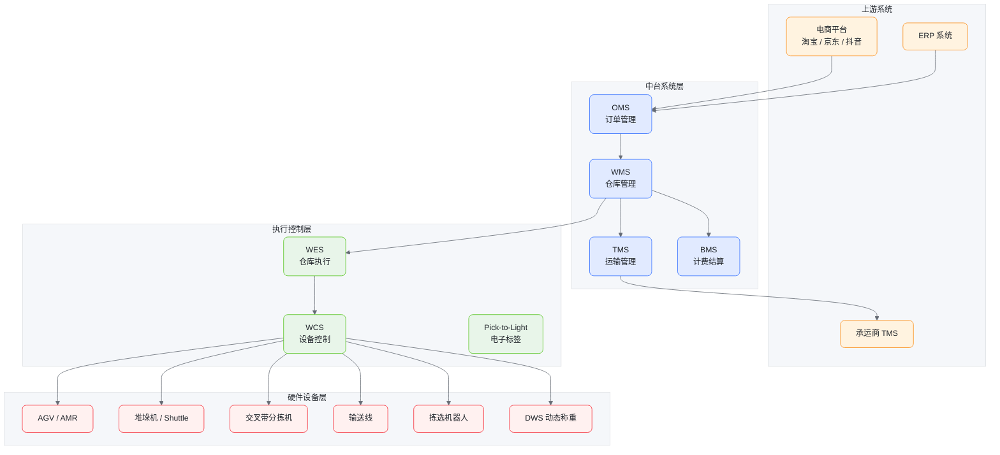
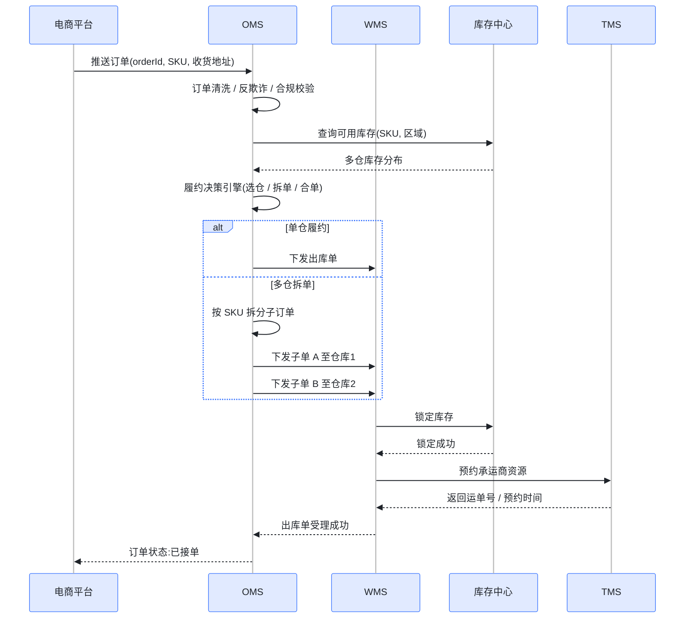
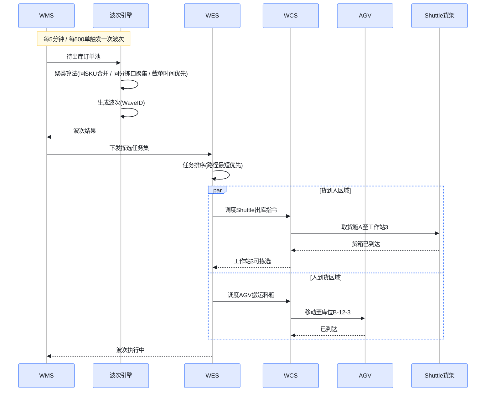
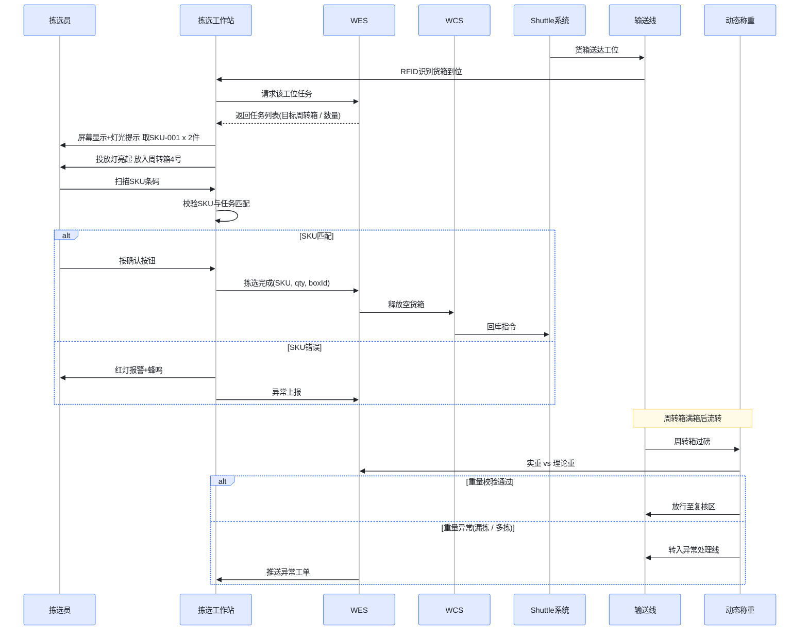
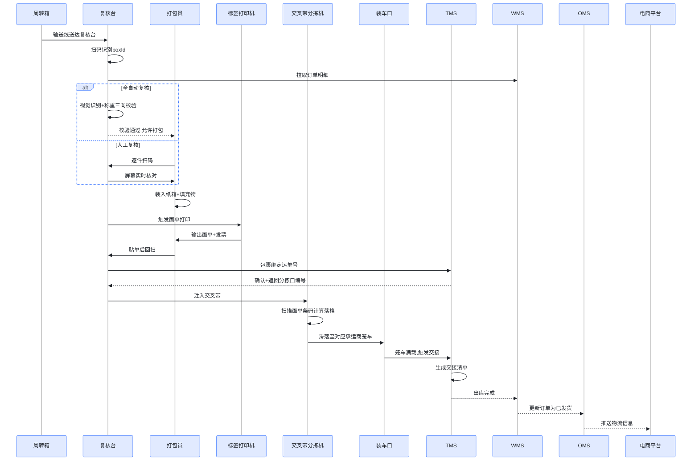
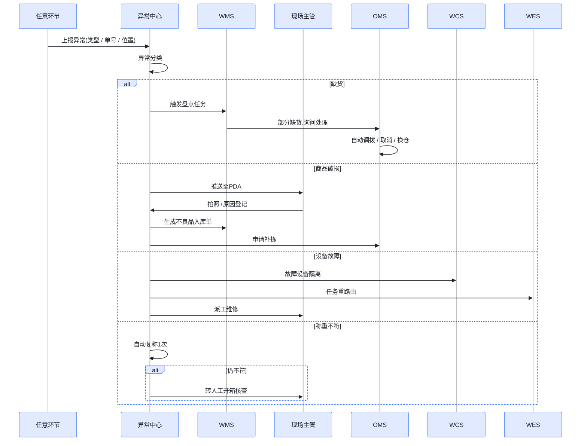
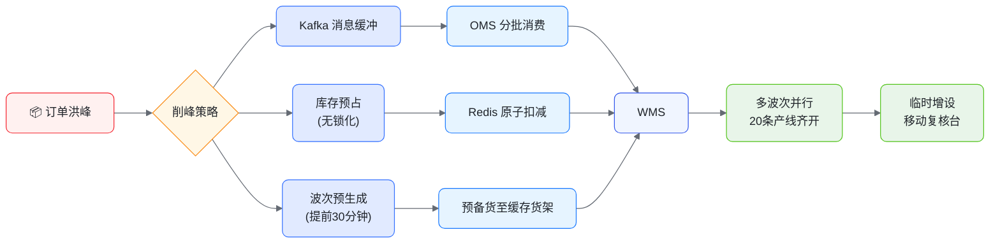
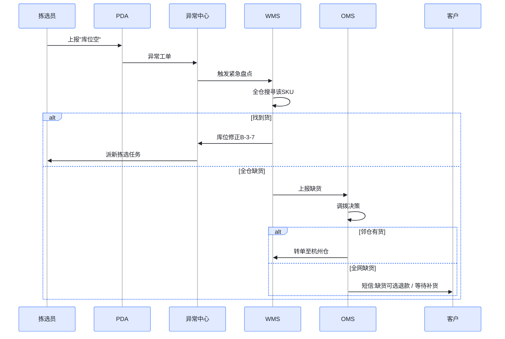
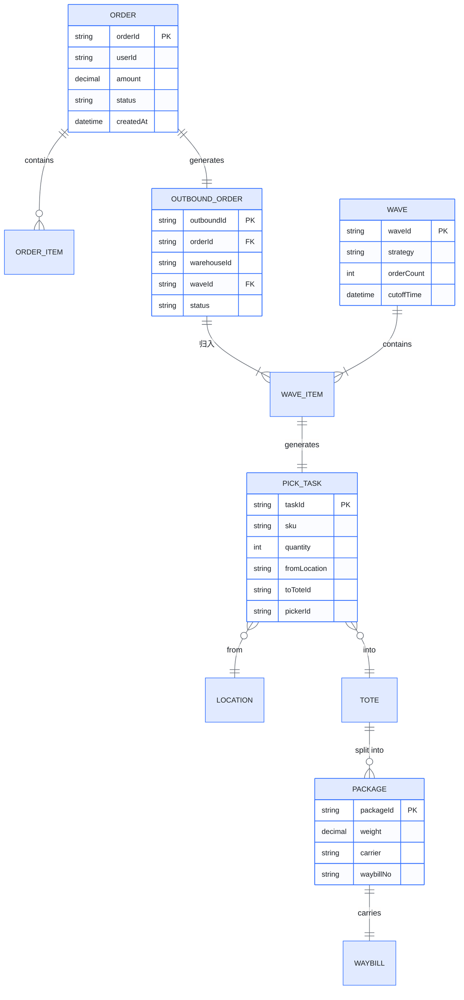

# 电商仓库自动化出库系统方案

> 面向中大型电商场景的全链路自动化出库设计，覆盖架构、交互时序、业务案例与落地建议。
>
> 所有图形均提供可视化 PNG 与 Mermaid 源码两种形式（点击 `
` 查看源码）。

## 一、系统概述

自动化出库系统的核心目标：**订单 → 波次 → 拣选 → 复核 → 打包 → 交接** 全流程无人化或少人化。

| 指标 | 传统人工 | 自动化系统 |
|------|---------|-----------|
| 单件处理时长 | 90~120s | 15~25s |
| 拣选准确率 | 99.2% | 99.99% |
| 单仓日处理峰值 | 3~5 万单 | 30~50 万单 |
| 人力成本 | 100% | 30~40% |

## 二、系统总体架构

查看 Mermaid 源码

**分层职责：**
- **OMS**：订单清洗、拆单合单、库存锁定
- **WMS**：库存管理、波次策略、任务编排
- **WES**：实时调度、任务排序、设备协同
- **WCS**：设备指令翻译、状态回传
- **PTL**：人机交互终端（电子标签拣选/播种）

---

## 三、核心交互时序图

### 3.1 订单接收与履约决策

查看 Mermaid 源码

### 3.2 波次规划与任务下发

查看 Mermaid 源码

### 3.3 货到人拣选流程（核心）

查看 Mermaid 源码

### 3.4 复核、打包与交接

查看 Mermaid 源码

### 3.5 异常处理流程

查看 Mermaid 源码

---

## 四、典型业务案例

### 案例 1：日常单仓履约（标准场景）

> **场景**：用户在某电商下单 1 瓶洗发水 + 1 包面巾纸，配送到上海。

**履约链路：**
1. **10:00:05** 订单进 OMS，履约引擎判定上海仓库存充足，单仓发货
2. **10:00:08** WMS 锁定库存，进入待波次池
3. **10:05:00** 波次引擎将该订单与其他 480 单合并为 Wave-2026052601
4. **10:05:30** Shuttle 调度货箱出库，AGV 同步搬运面巾纸料箱
5. **10:07:12** 拣选员在工作站完成 2 件拣选，投入周转箱 #047
6. **10:08:30** 周转箱满 12 单后流转复核台，DWS 通过
7. **10:09:00** 自动打包机封箱，面单贴附
8. **10:10:15** 交叉带分拣至顺丰口，装笼车
9. **11:30:00** 顺丰司机交接，订单状态变更为"已发货"

**总耗时：约 90 分钟，人工触点 1 次（拣选确认）**

---

### 案例 2：双 11 大促爆单（峰值压力）

> **场景**：双 11 零点开始 1 小时内涌入 50 万订单。

**关键策略：**

查看 Mermaid 源码

**应对措施：**
- **库存预占**：大促前 24h，热销 SKU 预拉至前置缓存库位（缩短取货距离 70%）
- **波次预生成**：提前生成 200 个空波次模板，订单进来直接填槽
- **柔性产能**：AGV 集群从 80 台动态扩至 150 台，复核台从 20 工位扩至 50 工位
- **降级方案**：超阈值后非急单延后 2 小时拣选，保障 24h 内出库 SLA
- **结果**：峰值 25 万单/小时，履约时效 6 小时内出库率 95%

---

### 案例 3：跨仓拆单（多仓履约）

> **场景**：用户买了 3 件商品：手机（华南仓有货）、手机壳（华东仓有货）、贴膜（华北仓有货）。

**履约决策对比：**

| 决策维度 | 方案 A：等齐发 | 方案 B：拆 3 单 | **采纳方案 C：拆 2 单** |
|---------|--------------|---------------|---------------------|
| 时效 | 慢（要调拨） | 最快 | 快 |
| 成本 | 调拨成本高 | 3 笔运费 | 2 笔运费 |
| 体验 | 一次签收 | 3 次签收 | 2 次签收 |

**最终拆单**：手机壳 + 贴膜从华东仓合发，手机从华南仓单发。OMS 给用户展示统一的"拆 2 个包裹发出"提示。

---

### 案例 4：异常订单恢复（库存差异）

> **场景**：拣选时发现 SKU-A8821 实际只剩 0 件（系统显示 5 件）。

**处理链路：**

查看 Mermaid 源码

---

## 五、数据模型核心实体

查看 Mermaid 源码

---

## 六、技术栈建议

| 层级 | 推荐技术 |
|------|---------|
| 接入层 | Nginx + Spring Cloud Gateway |
| 服务层 | Java (Spring Boot) / Go，DDD 微服务 |
| 消息 | Kafka（订单流）+ RocketMQ（事务消息）|
| 数据库 | MySQL（交易）+ TiDB（库存）+ Redis（缓存）|
| 实时计算 | Flink（波次/库存预警）|
| 设备通信 | OPC UA / Modbus / MQTT |
| 监控 | Prometheus + Grafana + SkyWalking |
| 大屏 | ECharts + WebSocket 推流 |

---

## 七、关键实施建议

1. **从半自动起步**：先上 WMS + PTL，再逐步引入 AGV / Shuttle，避免一次性高投入
2. **数据先行**：SKU 主数据（尺寸、重量、分类）质量决定 60% 的自动化效果
3. **分波次灰度**：新策略先在 5% 流量小波次验证，再全量
4. **应急预案常态化**：每月演练设备宕机、网络中断、断电等场景
5. **ROI 测算**：单仓投资约 3000~8000 万，回收期 2~3 年，需匹配单量规模
