# 电商仓库自动化出库系统方案

> 面向中大型电商场景的全链路自动化出库设计，覆盖架构、交互时序、业务案例与落地建议。
>
> 所有图形均提供可视化 PNG 与 Mermaid 源码两种形式（点击 `
` 查看源码）。

## 一、系统概述

自动化出库系统的核心目标：**订单 → 波次 → 拣选 → 复核 → 打包 → 交接** 全流程无人化或少人化。

| 指标 | 传统人工 | 自动化系统 |
|------|---------|-----------|
| 单件处理时长 | 90~120s | 15~25s |
| 拣选准确率 | 99.2% | 99.99% |
| 单仓日处理峰值 | 3~5 万单 | 30~50 万单 |
| 人力成本 | 100% | 30~40% |

## 二、系统总体架构

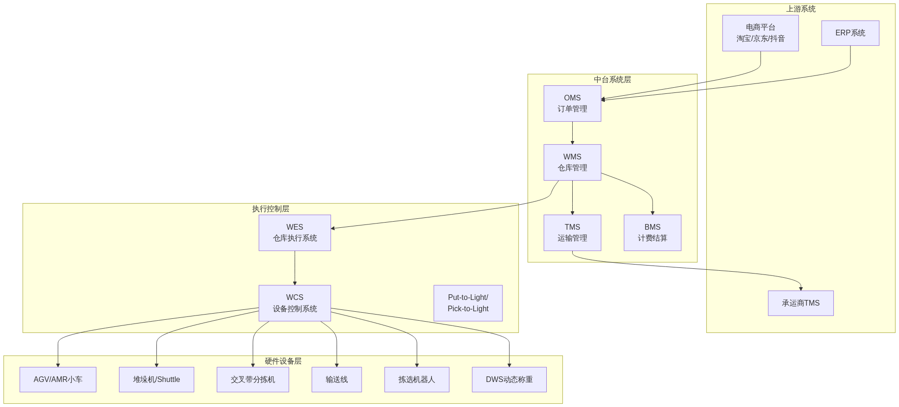

查看 Mermaid 源码

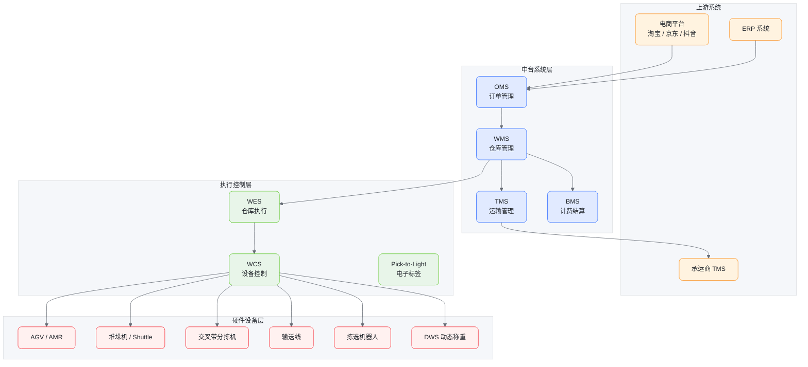
```mermaid
---
config:
  theme: base
  themeVariables:
    fontFamily: '-apple-system, BlinkMacSystemFont, "Helvetica Neue", "PingFang SC", "Microsoft YaHei", sans-serif'
    fontSize: 15px
    primaryColor: '#E1EAFF'
    primaryTextColor: '#1F2329'
    primaryBorderColor: '#3370FF'
    lineColor: '#646A73'
    secondaryColor: '#FFF3E0'
    tertiaryColor: '#E8F5E9'
    background: '#FFFFFF'
    mainBkg: '#E1EAFF'
    clusterBkg: '#F5F7FA'
    clusterBorder: '#DEE0E3'
    edgeLabelBackground: '#FFFFFF'
    titleColor: '#1F2329'
---
flowchart TB
    subgraph S1["上游系统"]
        EC["电商平台<br/>淘宝 / 京东 / 抖音"]:::up
        ERP["ERP 系统"]:::up
        TMS_OUT["承运商 TMS"]:::up
    end

    subgraph S2["中台系统层"]
        OMS["OMS<br/>订单管理"]:::mid
        WMS["WMS<br/>仓库管理"]:::mid
        TMS["TMS<br/>运输管理"]:::mid
        BMS["BMS<br/>计费结算"]:::mid
    end

    subgraph S3["执行控制层"]
        WCS["WCS<br/>设备控制"]:::exe
        WES["WES<br/>仓库执行"]:::exe
        PTL["Pick-to-Light<br/>电子标签"]:::exe
    end

    subgraph S4["硬件设备层"]
        AGV["AGV / AMR"]:::hw
        ASRS["堆垛机 / Shuttle"]:::hw
        SORTER["交叉带分拣机"]:::hw
        CONV["输送线"]:::hw
        ROBOT["拣选机器人"]:::hw
        DWS["DWS 动态称重"]:::hw
    end

    EC --> OMS
    ERP --> OMS
    OMS --> WMS
    WMS --> WES
    WES --> WCS
    WCS --> AGV
    WCS --> ASRS
    WCS --> SORTER
    WCS --> CONV
    WCS --> ROBOT
    WCS --> DWS
    WMS --> TMS
    TMS --> TMS_OUT
    WMS --> BMS

    classDef up fill:#FFF3E0,stroke:#FA8C16,color:#1F2329,rx:8,ry:8
    classDef mid fill:#E1EAFF,stroke:#3370FF,color:#1F2329,rx:8,ry:8
    classDef exe fill:#E8F5E9,stroke:#52C41A,color:#1F2329,rx:8,ry:8
    classDef hw fill:#FFF1F0,stroke:#F5222D,color:#1F2329,rx:8,ry:8
```

**分层职责：**
- **OMS**：订单清洗、拆单合单、库存锁定
- **WMS**：库存管理、波次策略、任务编排
- **WES**：实时调度、任务排序、设备协同
- **WCS**：设备指令翻译、状态回传
- **PTL**：人机交互终端（电子标签拣选/播种）

---

## 三、核心交互时序图

### 3.1 订单接收与履约决策

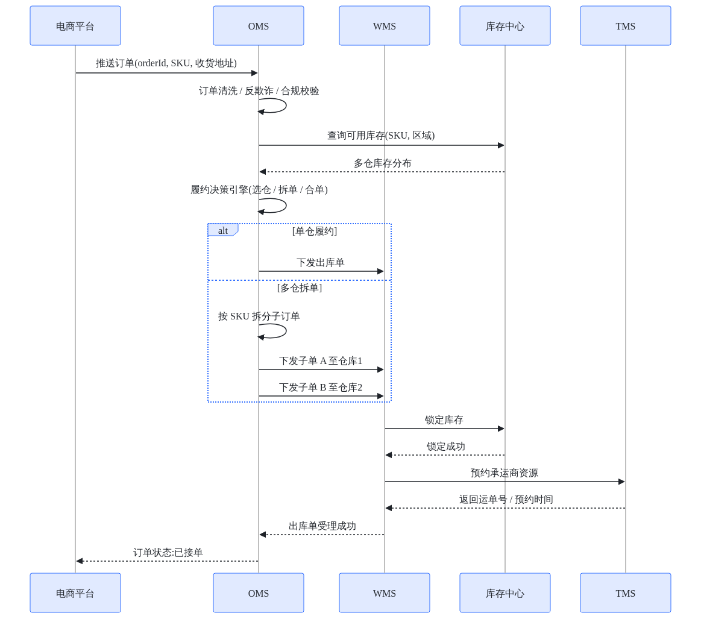

查看 Mermaid 源码

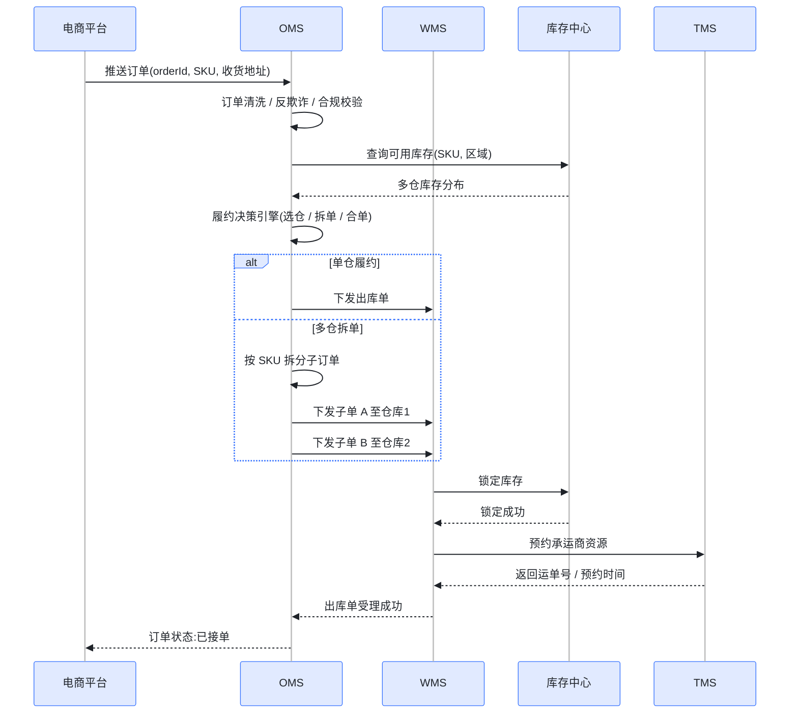
```mermaid
---
config:
  theme: base
  themeVariables:
    fontFamily: '-apple-system, BlinkMacSystemFont, "Helvetica Neue", "PingFang SC", "Microsoft YaHei", sans-serif'
    fontSize: 14px
    primaryColor: '#E1EAFF'
    primaryTextColor: '#1F2329'
    primaryBorderColor: '#3370FF'
    lineColor: '#646A73'
    actorBkg: '#E1EAFF'
    actorBorder: '#3370FF'
    actorTextColor: '#1F2329'
    actorLineColor: '#BFBFBF'
    signalColor: '#1F2329'
    signalTextColor: '#1F2329'
    labelBoxBkgColor: '#E1EAFF'
    labelBoxBorderColor: '#3370FF'
    labelTextColor: '#1F2329'
    loopTextColor: '#1F2329'
    activationBorderColor: '#3370FF'
    activationBkgColor: '#F0F4FF'
    sequenceNumberColor: '#FFFFFF'
    noteBkgColor: '#FFFBE6'
    noteTextColor: '#1F2329'
    noteBorderColor: '#FFD666'
---
sequenceDiagram
    participant EC as 电商平台
    participant OMS
    participant WMS
    participant INV as 库存中心
    participant TMS

    EC->>OMS: 推送订单(orderId, SKU, 收货地址)
    OMS->>OMS: 订单清洗 / 反欺诈 / 合规校验
    OMS->>INV: 查询可用库存(SKU, 区域)
    INV-->>OMS: 多仓库存分布
    OMS->>OMS: 履约决策引擎(选仓 / 拆单 / 合单)

    alt 单仓履约
        OMS->>WMS: 下发出库单
    else 多仓拆单
        OMS->>OMS: 按 SKU 拆分子订单
        OMS->>WMS: 下发子单 A 至仓库1
        OMS->>WMS: 下发子单 B 至仓库2
    end

    WMS->>INV: 锁定库存
    INV-->>WMS: 锁定成功
    WMS->>TMS: 预约承运商资源
    TMS-->>WMS: 返回运单号 / 预约时间
    WMS-->>OMS: 出库单受理成功
    OMS-->>EC: 订单状态:已接单
```

### 3.2 波次规划与任务下发

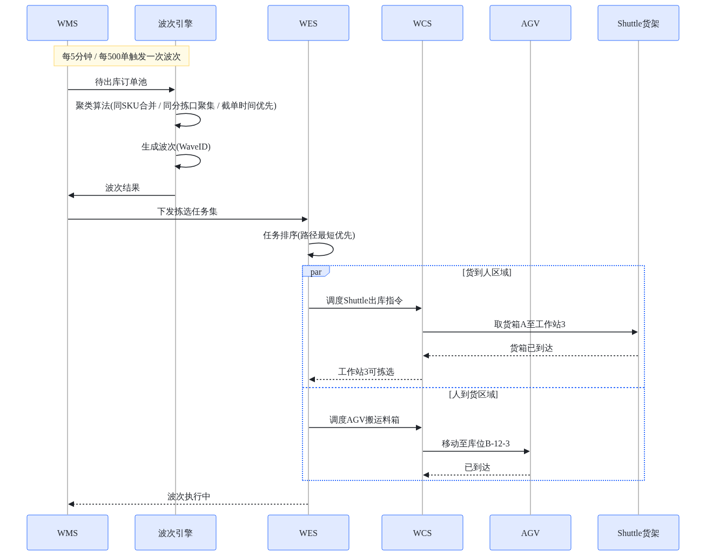

查看 Mermaid 源码

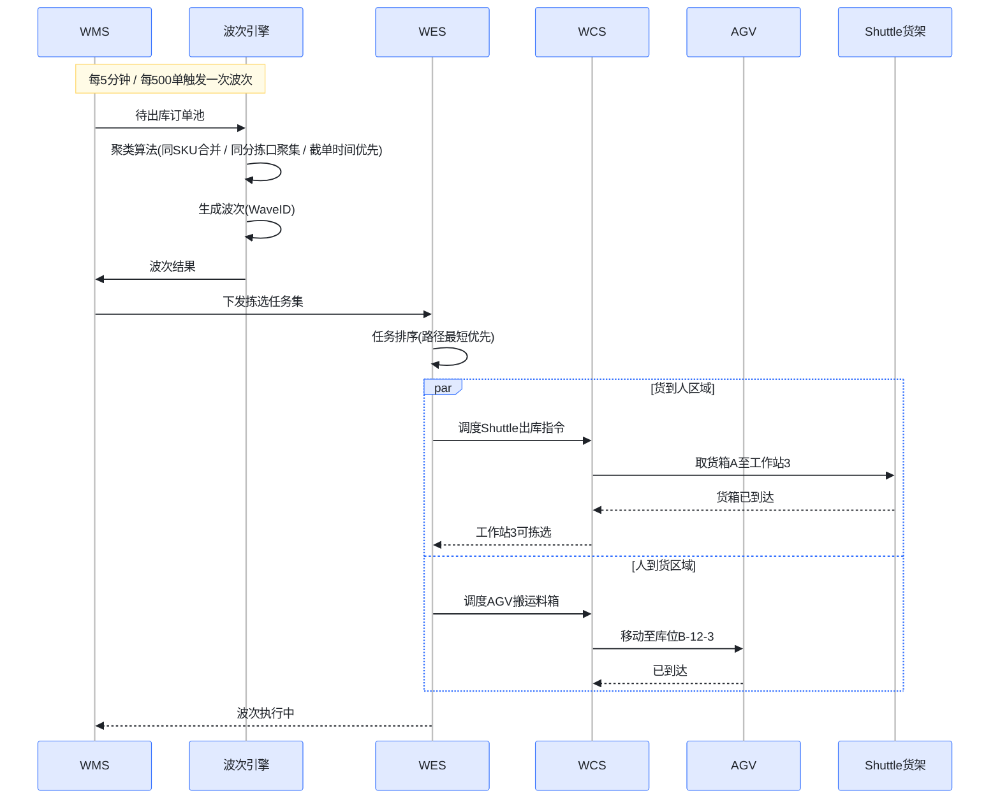
```mermaid
---
config:
  theme: base
  themeVariables:
    fontFamily: '-apple-system, BlinkMacSystemFont, "Helvetica Neue", "PingFang SC", "Microsoft YaHei", sans-serif'
    fontSize: 14px
    primaryColor: '#E1EAFF'
    primaryTextColor: '#1F2329'
    primaryBorderColor: '#3370FF'
    lineColor: '#646A73'
    actorBkg: '#E1EAFF'
    actorBorder: '#3370FF'
    actorTextColor: '#1F2329'
    actorLineColor: '#BFBFBF'
    signalColor: '#1F2329'
    signalTextColor: '#1F2329'
    labelBoxBkgColor: '#E1EAFF'
    labelBoxBorderColor: '#3370FF'
    labelTextColor: '#1F2329'
    loopTextColor: '#1F2329'
    activationBorderColor: '#3370FF'
    activationBkgColor: '#F0F4FF'
    noteBkgColor: '#FFFBE6'
    noteTextColor: '#1F2329'
    noteBorderColor: '#FFD666'
---
sequenceDiagram
    participant WMS
    participant WAVE as 波次引擎
    participant WES
    participant WCS
    participant AGV
    participant SHUTTLE as Shuttle货架

    Note over WMS,WAVE: 每5分钟 / 每500单触发一次波次

    WMS->>WAVE: 待出库订单池
    WAVE->>WAVE: 聚类算法(同SKU合并 / 同分拣口聚集 / 截单时间优先)
    WAVE->>WAVE: 生成波次(WaveID)
    WAVE->>WMS: 波次结果

    WMS->>WES: 下发拣选任务集
    WES->>WES: 任务排序(路径最短优先)

    par 货到人区域
        WES->>WCS: 调度Shuttle出库指令
        WCS->>SHUTTLE: 取货箱A至工作站3
        SHUTTLE-->>WCS: 货箱已到达
        WCS-->>WES: 工作站3可拣选
    and 人到货区域
        WES->>WCS: 调度AGV搬运料箱
        WCS->>AGV: 移动至库位B-12-3
        AGV-->>WCS: 已到达
    end

    WES-->>WMS: 波次执行中
```

### 3.3 货到人拣选流程（核心）

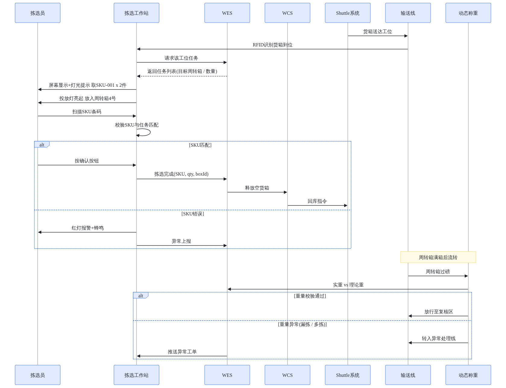

查看 Mermaid 源码

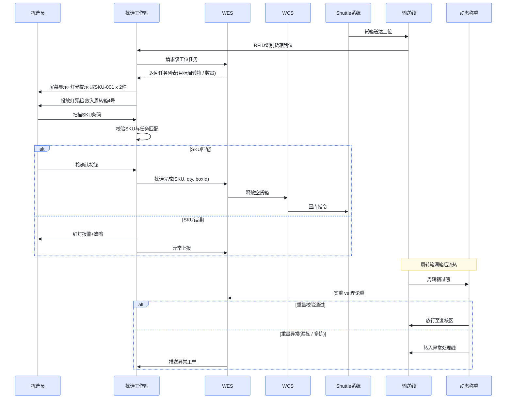
```mermaid
---
config:
  theme: base
  themeVariables:
    fontFamily: '-apple-system, BlinkMacSystemFont, "Helvetica Neue", "PingFang SC", "Microsoft YaHei", sans-serif'
    fontSize: 14px
    primaryColor: '#E1EAFF'
    primaryTextColor: '#1F2329'
    primaryBorderColor: '#3370FF'
    lineColor: '#646A73'
    actorBkg: '#E1EAFF'
    actorBorder: '#3370FF'
    actorTextColor: '#1F2329'
    actorLineColor: '#BFBFBF'
    signalColor: '#1F2329'
    signalTextColor: '#1F2329'
    labelBoxBkgColor: '#E1EAFF'
    labelBoxBorderColor: '#3370FF'
    labelTextColor: '#1F2329'
    loopTextColor: '#1F2329'
    activationBorderColor: '#3370FF'
    activationBkgColor: '#F0F4FF'
    noteBkgColor: '#FFFBE6'
    noteTextColor: '#1F2329'
    noteBorderColor: '#FFD666'
---
sequenceDiagram
    participant Picker as 拣选员
    participant PTL as 拣选工作站
    participant WES
    participant WCS
    participant SHUTTLE as Shuttle系统
    participant CONV as 输送线
    participant DWS as 动态称重

    SHUTTLE->>CONV: 货箱送达工位
    CONV->>PTL: RFID识别货箱到位
    PTL->>WES: 请求该工位任务
    WES-->>PTL: 返回任务列表(目标周转箱 / 数量)

    PTL->>Picker: 屏幕显示+灯光提示 取SKU-001 x 2件
    PTL->>Picker: 投放灯亮起 放入周转箱4号

    Picker->>PTL: 扫描SKU条码
    PTL->>PTL: 校验SKU与任务匹配

    alt SKU匹配
        Picker->>PTL: 按确认按钮
        PTL->>WES: 拣选完成(SKU, qty, boxId)
        WES->>WCS: 释放空货箱
        WCS->>SHUTTLE: 回库指令
    else SKU错误
        PTL->>Picker: 红灯报警+蜂鸣
        PTL->>WES: 异常上报
    end

    Note over CONV,DWS: 周转箱满箱后流转
    CONV->>DWS: 周转箱过磅
    DWS->>WES: 实重 vs 理论重

    alt 重量校验通过
        DWS->>CONV: 放行至复核区
    else 重量异常(漏拣 / 多拣)
        DWS->>CONV: 转入异常处理线
        WES->>PTL: 推送异常工单
    end
```

### 3.4 复核、打包与交接

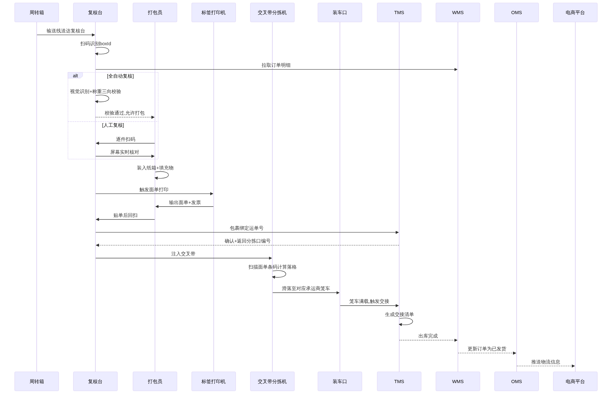

查看 Mermaid 源码

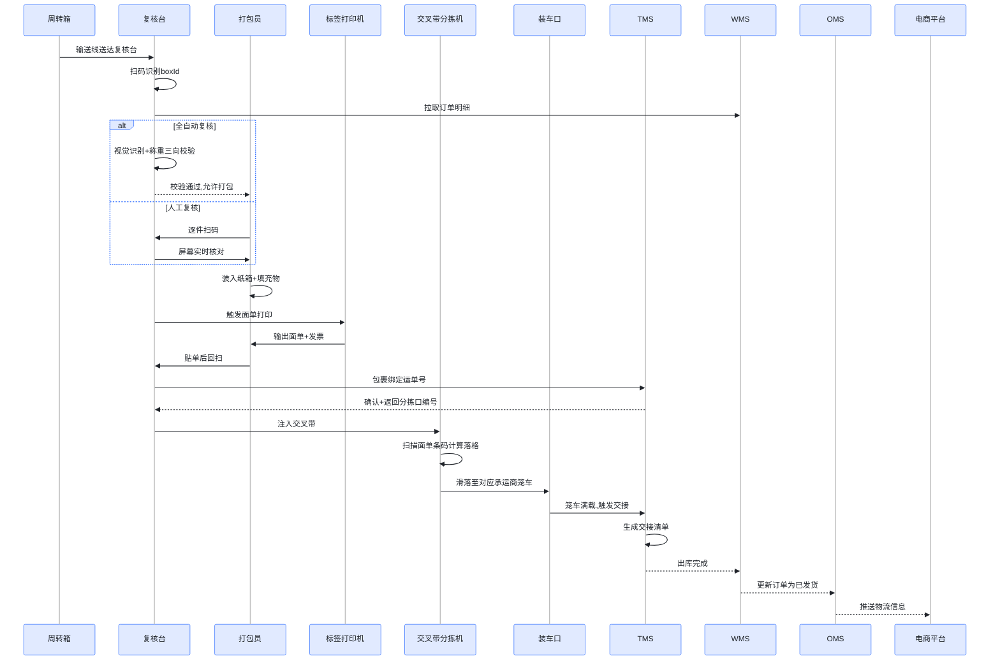
```mermaid
---
config:
  theme: base
  themeVariables:
    fontFamily: '-apple-system, BlinkMacSystemFont, "Helvetica Neue", "PingFang SC", "Microsoft YaHei", sans-serif'
    fontSize: 14px
    primaryColor: '#E1EAFF'
    primaryTextColor: '#1F2329'
    primaryBorderColor: '#3370FF'
    lineColor: '#646A73'
    actorBkg: '#E1EAFF'
    actorBorder: '#3370FF'
    actorTextColor: '#1F2329'
    actorLineColor: '#BFBFBF'
    signalColor: '#1F2329'
    signalTextColor: '#1F2329'
    labelBoxBkgColor: '#E1EAFF'
    labelBoxBorderColor: '#3370FF'
    labelTextColor: '#1F2329'
    loopTextColor: '#1F2329'
    activationBorderColor: '#3370FF'
    activationBkgColor: '#F0F4FF'
    noteBkgColor: '#FFFBE6'
    noteTextColor: '#1F2329'
    noteBorderColor: '#FFD666'
---
sequenceDiagram
    participant Tote as 周转箱
    participant SCAN as 复核台
    participant Packer as 打包员
    participant LABEL as 标签打印机
    participant SORTER as 交叉带分拣机
    participant TRUCK as 装车口
    participant TMS
    participant WMS
    participant OMS
    participant EC as 电商平台

    Tote->>SCAN: 输送线送达复核台
    SCAN->>SCAN: 扫码识别boxId
    SCAN->>WMS: 拉取订单明细

    alt 全自动复核
        SCAN->>SCAN: 视觉识别+称重三向校验
        SCAN-->>Packer: 校验通过,允许打包
    else 人工复核
        Packer->>SCAN: 逐件扫码
        SCAN->>Packer: 屏幕实时核对
    end

    Packer->>Packer: 装入纸箱+填充物
    SCAN->>LABEL: 触发面单打印
    LABEL->>Packer: 输出面单+发票
    Packer->>SCAN: 贴单后回扫

    SCAN->>TMS: 包裹绑定运单号
    TMS-->>SCAN: 确认+返回分拣口编号
    SCAN->>SORTER: 注入交叉带

    SORTER->>SORTER: 扫描面单条码计算落格
    SORTER->>TRUCK: 滑落至对应承运商笼车

    TRUCK->>TMS: 笼车满载,触发交接
    TMS->>TMS: 生成交接清单
    TMS-->>WMS: 出库完成
    WMS-->>OMS: 更新订单为已发货
    OMS-->>EC: 推送物流信息
```

### 3.5 异常处理流程

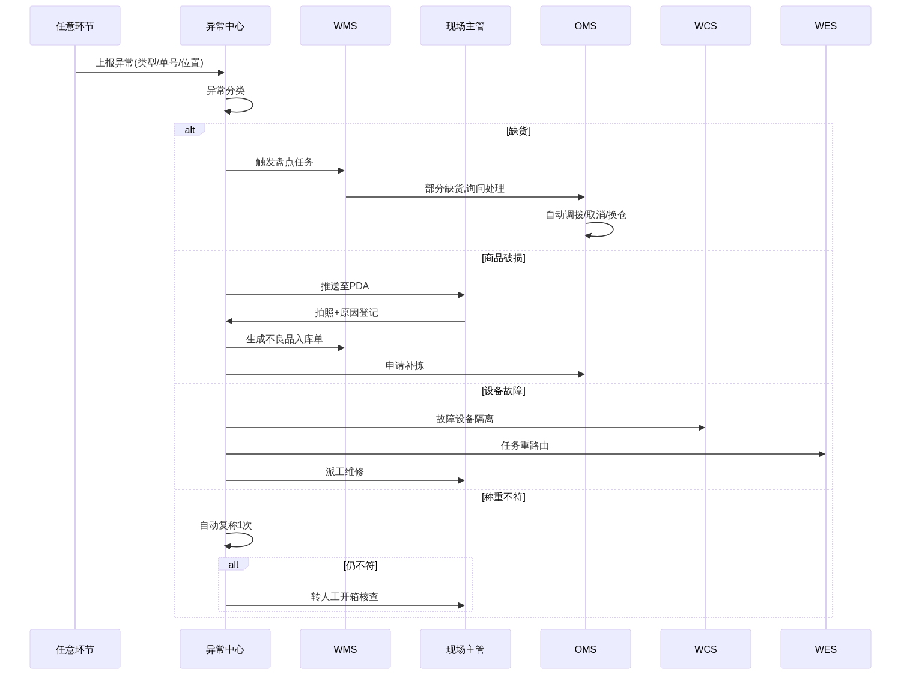

查看 Mermaid 源码

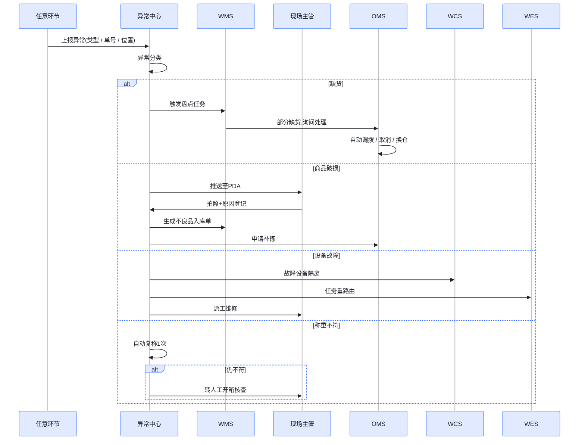
```mermaid
---
config:
  theme: base
  themeVariables:
    fontFamily: '-apple-system, BlinkMacSystemFont, "Helvetica Neue", "PingFang SC", "Microsoft YaHei", sans-serif'
    fontSize: 14px
    primaryColor: '#E1EAFF'
    primaryTextColor: '#1F2329'
    primaryBorderColor: '#3370FF'
    lineColor: '#646A73'
    actorBkg: '#E1EAFF'
    actorBorder: '#3370FF'
    actorTextColor: '#1F2329'
    actorLineColor: '#BFBFBF'
    signalColor: '#1F2329'
    signalTextColor: '#1F2329'
    labelBoxBkgColor: '#E1EAFF'
    labelBoxBorderColor: '#3370FF'
    labelTextColor: '#1F2329'
    loopTextColor: '#1F2329'
    activationBorderColor: '#3370FF'
    activationBkgColor: '#F0F4FF'
    noteBkgColor: '#FFFBE6'
    noteTextColor: '#1F2329'
    noteBorderColor: '#FFD666'
---
sequenceDiagram
    participant System as 任意环节
    participant EXC as 异常中心
    participant WMS
    participant Ops as 现场主管
    participant OMS
    participant WCS
    participant WES

    System->>EXC: 上报异常(类型 / 单号 / 位置)
    EXC->>EXC: 异常分类

    alt 缺货
        EXC->>WMS: 触发盘点任务
        WMS->>OMS: 部分缺货,询问处理
        OMS->>OMS: 自动调拨 / 取消 / 换仓
    else 商品破损
        EXC->>Ops: 推送至PDA
        Ops->>EXC: 拍照+原因登记
        EXC->>WMS: 生成不良品入库单
        EXC->>OMS: 申请补拣
    else 设备故障
        EXC->>WCS: 故障设备隔离
        EXC->>WES: 任务重路由
        EXC->>Ops: 派工维修
    else 称重不符
        EXC->>EXC: 自动复称1次
        alt 仍不符
            EXC->>Ops: 转人工开箱核查
        end
    end
```

---

## 四、典型业务案例

### 案例 1：日常单仓履约（标准场景）

> **场景**：用户在某电商下单 1 瓶洗发水 + 1 包面巾纸，配送到上海。

**履约链路：**
1. **10:00:05** 订单进 OMS，履约引擎判定上海仓库存充足，单仓发货
2. **10:00:08** WMS 锁定库存，进入待波次池
3. **10:05:00** 波次引擎将该订单与其他 480 单合并为 Wave-2026052601
4. **10:05:30** Shuttle 调度货箱出库，AGV 同步搬运面巾纸料箱
5. **10:07:12** 拣选员在工作站完成 2 件拣选，投入周转箱 #047
6. **10:08:30** 周转箱满 12 单后流转复核台，DWS 通过
7. **10:09:00** 自动打包机封箱，面单贴附
8. **10:10:15** 交叉带分拣至顺丰口，装笼车
9. **11:30:00** 顺丰司机交接，订单状态变更为"已发货"

**总耗时：约 90 分钟，人工触点 1 次（拣选确认）**

---

### 案例 2：双 11 大促爆单（峰值压力）

> **场景**：双 11 零点开始 1 小时内涌入 50 万订单。

**关键策略：**

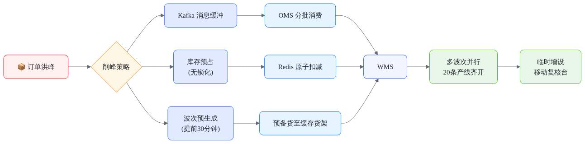

查看 Mermaid 源码

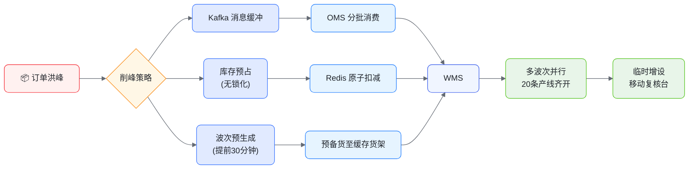
```mermaid
---
config:
  theme: base
  themeVariables:
    fontFamily: '-apple-system, BlinkMacSystemFont, "Helvetica Neue", "PingFang SC", "Microsoft YaHei", sans-serif'
    fontSize: 15px
    primaryColor: '#E1EAFF'
    primaryTextColor: '#1F2329'
    primaryBorderColor: '#3370FF'
    lineColor: '#646A73'
    background: '#FFFFFF'
---
flowchart LR
    A["📦 订单洪峰"]:::peak --> B{"削峰策略"}:::decision
    B --> C["Kafka 消息缓冲"]:::layer1
    B --> D["库存预占<br/>(无锁化)"]:::layer1
    B --> E["波次预生成<br/>(提前30分钟)"]:::layer1

    C --> F["OMS 分批消费"]:::layer2
    D --> G["Redis 原子扣减"]:::layer2
    E --> H["预备货至缓存货架"]:::layer2

    F --> I["WMS"]:::core
    G --> I
    H --> I

    I --> J["多波次并行<br/>20条产线齐开"]:::output
    J --> K["临时增设<br/>移动复核台"]:::output

    classDef peak fill:#FFF1F0,stroke:#F5222D,color:#1F2329,rx:8,ry:8
    classDef decision fill:#FFF7E6,stroke:#FA8C16,color:#1F2329
    classDef layer1 fill:#E1EAFF,stroke:#3370FF,color:#1F2329,rx:8,ry:8
    classDef layer2 fill:#E6F4FF,stroke:#1677FF,color:#1F2329,rx:8,ry:8
    classDef core fill:#F0F5FF,stroke:#2F54EB,color:#1F2329,rx:8,ry:8
    classDef output fill:#E8F5E9,stroke:#52C41A,color:#1F2329,rx:8,ry:8
```

**应对措施：**
- **库存预占**：大促前 24h，热销 SKU 预拉至前置缓存库位（缩短取货距离 70%）
- **波次预生成**：提前生成 200 个空波次模板，订单进来直接填槽
- **柔性产能**：AGV 集群从 80 台动态扩至 150 台，复核台从 20 工位扩至 50 工位
- **降级方案**：超阈值后非急单延后 2 小时拣选，保障 24h 内出库 SLA
- **结果**：峰值 25 万单/小时，履约时效 6 小时内出库率 95%

---

### 案例 3：跨仓拆单（多仓履约）

> **场景**：用户买了 3 件商品：手机（华南仓有货）、手机壳（华东仓有货）、贴膜（华北仓有货）。

**履约决策对比：**

| 决策维度 | 方案 A：等齐发 | 方案 B：拆 3 单 | **采纳方案 C：拆 2 单** |
|---------|--------------|---------------|---------------------|
| 时效 | 慢（要调拨） | 最快 | 快 |
| 成本 | 调拨成本高 | 3 笔运费 | 2 笔运费 |
| 体验 | 一次签收 | 3 次签收 | 2 次签收 |

**最终拆单**：手机壳 + 贴膜从华东仓合发，手机从华南仓单发。OMS 给用户展示统一的"拆 2 个包裹发出"提示。

---

### 案例 4：异常订单恢复（库存差异）

> **场景**：拣选时发现 SKU-A8821 实际只剩 0 件（系统显示 5 件）。

**处理链路：**

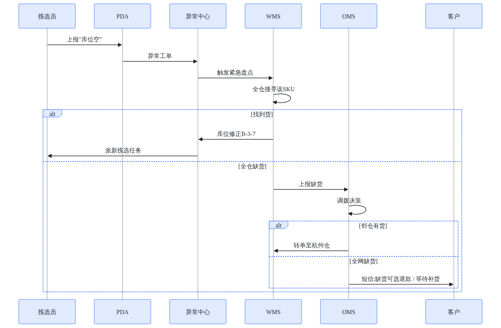

查看 Mermaid 源码

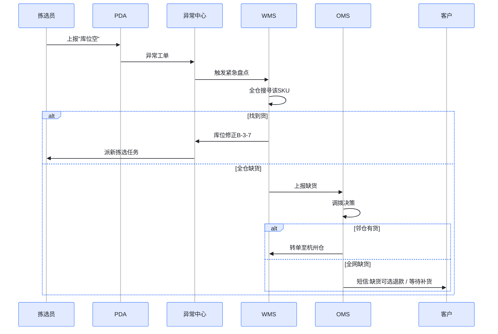
```mermaid
---
config:
  theme: base
  themeVariables:
    fontFamily: '-apple-system, BlinkMacSystemFont, "Helvetica Neue", "PingFang SC", "Microsoft YaHei", sans-serif'
    fontSize: 14px
    primaryColor: '#E1EAFF'
    primaryTextColor: '#1F2329'
    primaryBorderColor: '#3370FF'
    lineColor: '#646A73'
    actorBkg: '#E1EAFF'
    actorBorder: '#3370FF'
    actorTextColor: '#1F2329'
    actorLineColor: '#BFBFBF'
    signalColor: '#1F2329'
    signalTextColor: '#1F2329'
    labelBoxBkgColor: '#E1EAFF'
    labelBoxBorderColor: '#3370FF'
    labelTextColor: '#1F2329'
    loopTextColor: '#1F2329'
    activationBorderColor: '#3370FF'
    activationBkgColor: '#F0F4FF'
    noteBkgColor: '#FFFBE6'
    noteTextColor: '#1F2329'
    noteBorderColor: '#FFD666'
---
sequenceDiagram
    participant Picker as 拣选员
    participant PDA
    participant EXC as 异常中心
    participant WMS
    participant OMS
    participant User as 客户

    Picker->>PDA: 上报"库位空"
    PDA->>EXC: 异常工单
    EXC->>WMS: 触发紧急盘点
    WMS->>WMS: 全仓搜寻该SKU

    alt 找到货
        WMS->>EXC: 库位修正B-3-7
        EXC->>Picker: 派新拣选任务
    else 全仓缺货
        WMS->>OMS: 上报缺货
        OMS->>OMS: 调拨决策
        alt 邻仓有货
            OMS->>WMS: 转单至杭州仓
        else 全网缺货
            OMS->>User: 短信:缺货可选退款 / 等待补货
        end
    end
```

---

## 五、关键流程深度剖析

仓库自动化的核心难度集中在两次"业务态 → 物理态"的转换：**波次 → 拣货**、**拣货 → 分拣**。这两个环节最复杂、最容易出错，也是优化收益最高的地方。

### 5.1 从波次到拣货

#### 业务背景

波次（Wave）是 WMS 输出的"作业批次"，但拣选员/AGV 看到的是"拣选任务（PickTask）"。从波次到拣货，系统要在毫秒级内完成 4 件事：拆解、调度、设备协同、执行回写。

#### 全景 Pipeline

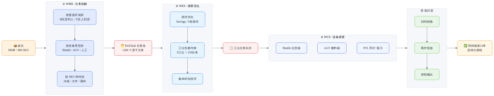

查看 Mermaid 源码

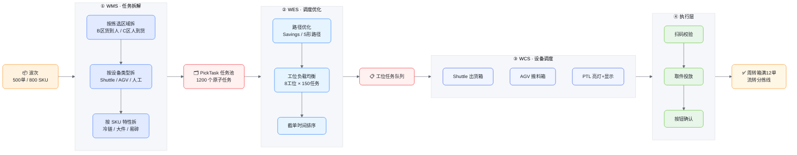
```mermaid
---
config:
  theme: base
  themeVariables:
    fontFamily: '-apple-system, BlinkMacSystemFont, "Helvetica Neue", "PingFang SC", "Microsoft YaHei", sans-serif'
    fontSize: 14px
    primaryColor: '#E1EAFF'
    primaryTextColor: '#1F2329'
    primaryBorderColor: '#3370FF'
    lineColor: '#646A73'
    background: '#FFFFFF'
    clusterBkg: '#F5F7FA'
    clusterBorder: '#DEE0E3'
---
flowchart LR
    W["📦 波次<br/>500单 / 800 SKU"]:::input

    subgraph S1["① WMS · 任务拆解"]
        direction TB
        A1["按拣选区域拆<br/>B区货到人 / C区人到货"]:::wms
        A2["按设备类型拆<br/>Shuttle / AGV / 人工"]:::wms
        A3["按 SKU 特性拆<br/>冷链 / 大件 / 易碎"]:::wms
        A1 --> A2 --> A3
    end

    P["🗂 PickTask 任务池<br/>1200 个原子任务"]:::pool

    subgraph S2["② WES · 调度优化"]
        direction TB
        B1["路径优化<br/>Savings / S形路径"]:::wes
        B2["工位负载均衡<br/>8工位 × 150任务"]:::wes
        B3["截单时间排序"]:::wes
        B1 --> B2 --> B3
    end

    Q["📋 工位任务队列"]:::pool

    subgraph S3["③ WCS · 设备调度"]
        direction TB
        C1["Shuttle 出货箱"]:::wcs
        C2["AGV 搬料箱"]:::wcs
        C3["PTL 亮灯+显示"]:::wcs
    end

    subgraph S4["④ 执行层"]
        direction TB
        E1["扫码校验"]:::run
        E2["取件投放"]:::run
        E3["按钮确认"]:::run
        E1 --> E2 --> E3
    end

    R["✅ 周转箱满12单<br/>流转分拣线"]:::output

    W --> S1 --> P --> S2 --> Q --> S3 --> S4 --> R

    classDef input fill:#FFF3E0,stroke:#FA8C16,color:#1F2329,rx:8,ry:8
    classDef pool fill:#FFF1F0,stroke:#F5222D,color:#1F2329,rx:8,ry:8
    classDef wms fill:#E1EAFF,stroke:#3370FF,color:#1F2329,rx:8,ry:8
    classDef wes fill:#E6F4FF,stroke:#1677FF,color:#1F2329,rx:8,ry:8
    classDef wcs fill:#F0F5FF,stroke:#2F54EB,color:#1F2329,rx:8,ry:8
    classDef run fill:#E8F5E9,stroke:#52C41A,color:#1F2329,rx:8,ry:8
    classDef output fill:#FFF7E6,stroke:#FA8C16,color:#1F2329,rx:8,ry:8
```

#### 4 个阶段拆解

| 阶段 | 责任系统 | 核心动作 | 关键算法 / 策略 | 典型耗时 |
|------|--------|---------|---------------|---------|
| ① 任务拆解 | WMS | 1 单订单 → N 个 PickTask（按区域 / 设备 / SKU 特性） | 主备库位选择（FIFO + 距离最短）| ~1s / 波次 |
| ② 调度优化 | WES | 1200 任务 → 8 工位队列 | Savings / S 形路径 / TSP 近似 | 3~5s |
| ③ 设备调度 | WCS | 翻译为 Shuttle / AGV / PTL 指令 | 死锁检测 / 优先级抢占 | 实时 |
| ④ 执行回写 | PTL + 现场 | 扫码、投放、确认、防错 | RFID + 重量双校验 | 15~25s / 件 |

#### 详细交互时序

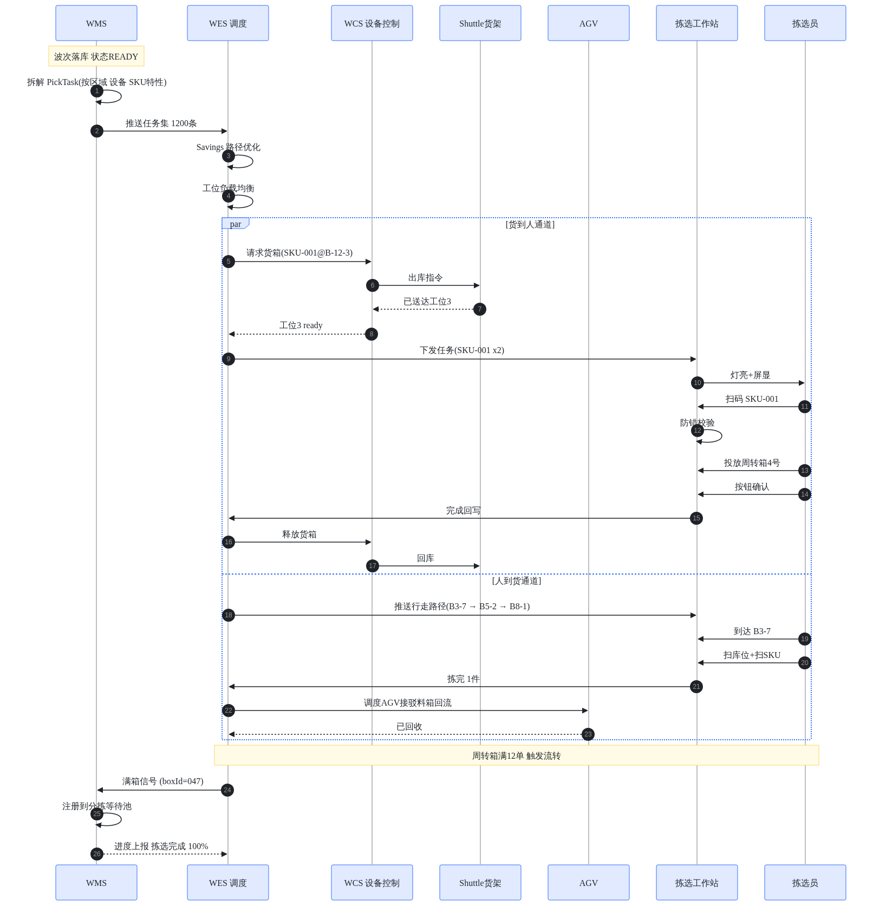

查看 Mermaid 源码

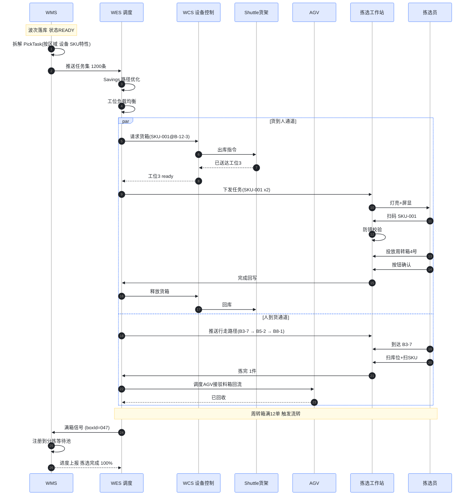
```mermaid
---
config:
  theme: base
  themeVariables:
    fontFamily: '-apple-system, BlinkMacSystemFont, "Helvetica Neue", "PingFang SC", "Microsoft YaHei", sans-serif'
    fontSize: 14px
    primaryColor: '#E1EAFF'
    primaryTextColor: '#1F2329'
    primaryBorderColor: '#3370FF'
    lineColor: '#646A73'
    actorBkg: '#E1EAFF'
    actorBorder: '#3370FF'
    actorTextColor: '#1F2329'
    actorLineColor: '#BFBFBF'
    signalColor: '#1F2329'
    signalTextColor: '#1F2329'
    labelBoxBkgColor: '#E1EAFF'
    labelBoxBorderColor: '#3370FF'
    labelTextColor: '#1F2329'
    loopTextColor: '#1F2329'
    activationBorderColor: '#3370FF'
    activationBkgColor: '#F0F4FF'
    noteBkgColor: '#FFFBE6'
    noteTextColor: '#1F2329'
    noteBorderColor: '#FFD666'
---
sequenceDiagram
    autonumber
    participant WMS
    participant WES as WES 调度
    participant WCS as WCS 设备控制
    participant SHUTTLE as Shuttle货架
    participant AGV
    participant PTL as 拣选工作站
    participant Picker as 拣选员

    Note over WMS: 波次落库 状态READY

    WMS->>WMS: 拆解 PickTask(按区域 设备 SKU特性)
    WMS->>WES: 推送任务集 1200条
    WES->>WES: Savings 路径优化
    WES->>WES: 工位负载均衡

    par 货到人通道
        WES->>WCS: 请求货箱(SKU-001@B-12-3)
        WCS->>SHUTTLE: 出库指令
        SHUTTLE-->>WCS: 已送达工位3
        WCS-->>WES: 工位3 ready
        WES->>PTL: 下发任务(SKU-001 x2)
        PTL->>Picker: 灯亮+屏显
        Picker->>PTL: 扫码 SKU-001
        PTL->>PTL: 防错校验
        Picker->>PTL: 投放周转箱4号
        Picker->>PTL: 按钮确认
        PTL->>WES: 完成回写
        WES->>WCS: 释放货箱
        WCS->>SHUTTLE: 回库
    and 人到货通道
        WES->>PTL: 推送行走路径(B3-7 → B5-2 → B8-1)
        Picker->>PTL: 到达 B3-7
        Picker->>PTL: 扫库位+扫SKU
        PTL->>WES: 拣完 1件
        WES->>AGV: 调度AGV接驳料箱回流
        AGV-->>WES: 已回收
    end

    Note over WES,Picker: 周转箱满12单 触发流转

    WES->>WMS: 满箱信号 (boxId=047)
    WMS->>WMS: 注册到分拣等待池
    WMS-->>WES: 进度上报 拣选完成 100%
```

#### PickTask 状态机

任务从生成到完成会经历 7 种状态，每种状态都有对应的回滚或补偿路径：

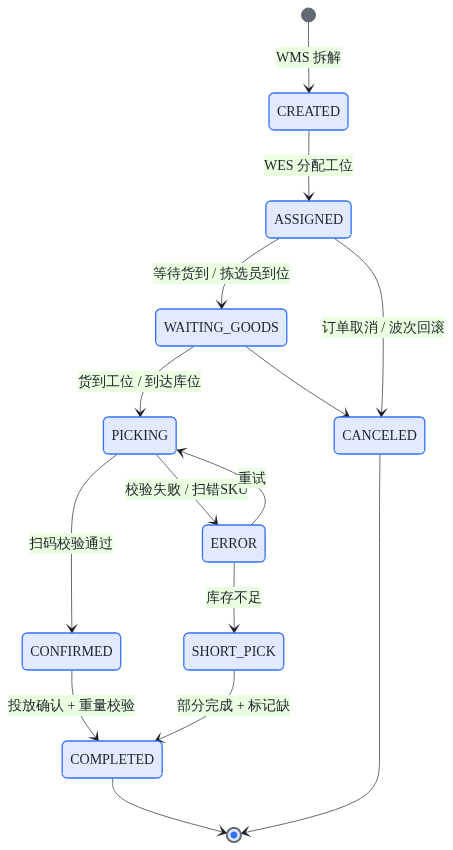

查看 Mermaid 源码

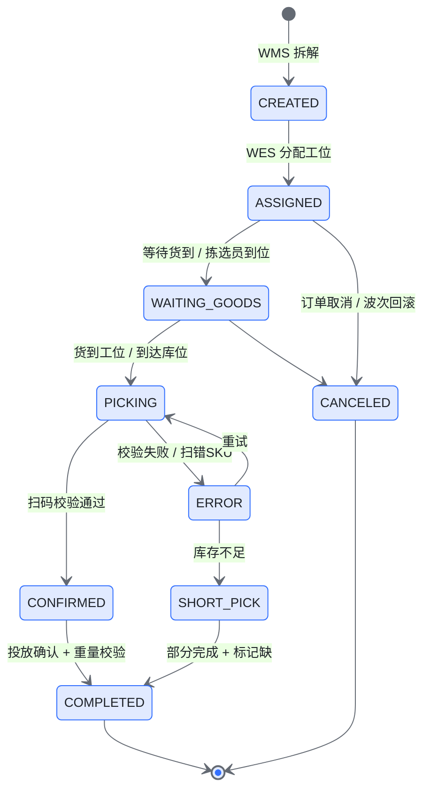
```mermaid
---
config:
  theme: base
  themeVariables:
    fontFamily: '-apple-system, BlinkMacSystemFont, "Helvetica Neue", "PingFang SC", "Microsoft YaHei", sans-serif'
    fontSize: 14px
    primaryColor: '#E1EAFF'
    primaryTextColor: '#1F2329'
    primaryBorderColor: '#3370FF'
    lineColor: '#646A73'
    background: '#FFFFFF'
---
stateDiagram-v2
    [*] --> CREATED: WMS 拆解
    CREATED --> ASSIGNED: WES 分配工位
    ASSIGNED --> WAITING_GOODS: 等待货到 / 拣选员到位
    WAITING_GOODS --> PICKING: 货到工位 / 到达库位
    PICKING --> CONFIRMED: 扫码校验通过
    PICKING --> ERROR: 校验失败 / 扫错SKU
    ERROR --> PICKING: 重试
    ERROR --> SHORT_PICK: 库存不足
    CONFIRMED --> COMPLETED: 投放确认 + 重量校验
    SHORT_PICK --> COMPLETED: 部分完成 + 标记缺
    COMPLETED --> [*]

    ASSIGNED --> CANCELED: 订单取消 / 波次回滚
    WAITING_GOODS --> CANCELED
    CANCELED --> [*]
```

#### 实战案例：500 单波次落地

> **场景**：Wave-2026052601，500 单，800 SKU，截单时间 11:00。

| 时间 | 事件 | 数据 |
|------|------|------|
| 10:05:00.000 | 波次触发 | 500 单进入 WAVE_READY |
| 10:05:00.420 | WMS 拆解完成 | 1200 个 PickTask（货到人 720 / 人到货 480）|
| 10:05:03.100 | WES 路径优化完成 | 平均行走距离从 240m 降到 87m（-64%）|
| 10:05:03.300 | 工位分配完成 | 8 工位 × 平均 150 任务 |
| 10:05:04 ~ 10:22:00 | 并行执行 | Shuttle 出 240 箱、AGV 行驶 9.2 km |
| 10:22:30 | 全部 COMPLETED | 准确率 99.97%（3 个 SKU 因库位空进入 SHORT_PICK，其中 2 个找到备份库位、1 个真缺货）|

**关键优化点**：
- **路径合并**：相邻库位的任务合并到同一拣选员，减少 64% 行走距离
- **货箱共享**：同一波次内 SKU-001 被 87 个订单需要 → 该货箱只调度 1 次，停留工位 4 分钟服务完所有订单
- **回滚兜底**：1 单缺货后 OMS 调拨决策 200ms 内完成，转单到杭州仓继续履约

---

### 5.2 从拣货到分拣

#### 业务背景

拣货完成的周转箱里装的是 **混拣物**（一个箱里有 12 个不同订单的商品）。要让物流车装的是 **以承运商为单位的笼车**，需要经过"拆 → 装 → 分 → 装车"4 步转换。

这一段是仓库的"最后 100 米"——离客户体验最近，也是单件成本最敏感的环节。

#### 全景 Pipeline

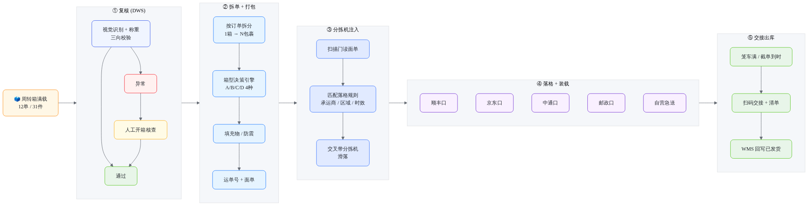

查看 Mermaid 源码

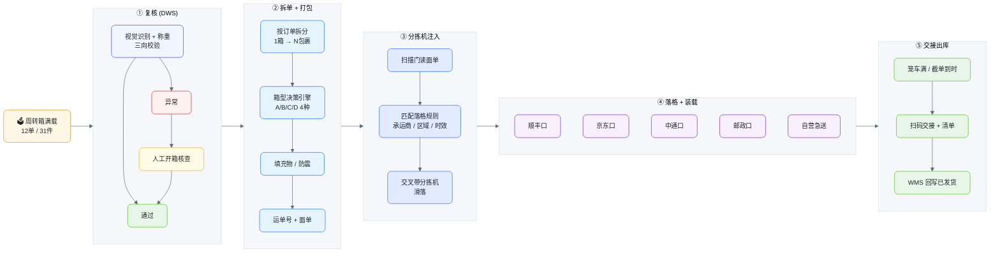
```mermaid
---
config:
  theme: base
  themeVariables:
    fontFamily: '-apple-system, BlinkMacSystemFont, "Helvetica Neue", "PingFang SC", "Microsoft YaHei", sans-serif'
    fontSize: 14px
    primaryColor: '#E1EAFF'
    primaryTextColor: '#1F2329'
    primaryBorderColor: '#3370FF'
    lineColor: '#646A73'
    background: '#FFFFFF'
    clusterBkg: '#F5F7FA'
    clusterBorder: '#DEE0E3'
---
flowchart LR
    IN["🗳 周转箱满载<br/>12单 / 31件"]:::input

    subgraph S1["① 复核 (DWS)"]
        direction TB
        CK["视觉识别 + 称重<br/>三向校验"]:::dws
        OK1["通过"]:::ok
        EX1["异常"]:::err
        CK --> OK1
        CK --> EX1
        EX1 --> MAN["人工开箱核查"]:::man
        MAN --> OK1
    end

    subgraph S2["② 拆单 + 打包"]
        direction TB
        SP["按订单拆分<br/>1箱 → N包裹"]:::pack
        BX["箱型决策引擎<br/>A/B/C/D 4种"]:::pack
        FL["填充物 / 防震"]:::pack
        LB["运单号 + 面单"]:::pack
        SP --> BX --> FL --> LB
    end

    subgraph S3["③ 分拣机注入"]
        direction TB
        SC["扫描门读面单"]:::sort
        CL["匹配落格规则<br/>承运商 / 区域 / 时效"]:::sort
        CT["交叉带分拣机<br/>滑落"]:::sort
        SC --> CL --> CT
    end

    subgraph S4["④ 落格 + 装载"]
        direction TB
        G1["顺丰口"]:::carrier
        G2["京东口"]:::carrier
        G3["中通口"]:::carrier
        G4["邮政口"]:::carrier
        G5["自营急送"]:::carrier
    end

    subgraph S5["⑤ 交接出库"]
        direction TB
        CG["笼车满 / 截单到时"]:::out
        HD["扫码交接 + 清单"]:::out
        UP["WMS 回写已发货"]:::out
        CG --> HD --> UP
    end

    IN --> S1 --> S2 --> S3 --> S4 --> S5

    classDef input fill:#FFF7E6,stroke:#FA8C16,color:#1F2329,rx:8,ry:8
    classDef dws fill:#F0F5FF,stroke:#2F54EB,color:#1F2329,rx:8,ry:8
    classDef ok fill:#E8F5E9,stroke:#52C41A,color:#1F2329,rx:8,ry:8
    classDef err fill:#FFF1F0,stroke:#F5222D,color:#1F2329,rx:8,ry:8
    classDef man fill:#FFFBE6,stroke:#FAAD14,color:#1F2329,rx:8,ry:8
    classDef pack fill:#E6F4FF,stroke:#1677FF,color:#1F2329,rx:8,ry:8
    classDef sort fill:#E1EAFF,stroke:#3370FF,color:#1F2329,rx:8,ry:8
    classDef carrier fill:#F9F0FF,stroke:#722ED1,color:#1F2329,rx:8,ry:8
    classDef out fill:#E8F5E9,stroke:#52C41A,color:#1F2329,rx:8,ry:8
```

#### 5 个阶段拆解

| 阶段 | 设备 / 系统 | 核心动作 | 关键数据 | 典型耗时 |
|------|-----------|---------|---------|---------|
| ① 复核 | DWS（视觉 + 称重）| 三向校验：视觉识别 SKU、实重 vs 理论重、件数核对 | 通过率 95%+、误判率 <0.5% | 5s / 箱 |
| ② 拆单打包 | 半自动打包工位 | 按订单拆、选箱型、填充、贴面单 | 箱型 4 种自动决策、面单 1.2s 打印 | 30~60s / 单 |
| ③ 分拣注入 | 交叉带分拣机 | 扫面单 → 计算落格 | 单线 6000~12000 件/h | 2s / 件 |
| ④ 落格装载 | 笼车 + 装车口 | 同承运商 / 同线路聚集 | 落格准确率 99.99% | 实时 |
| ⑤ 交接出库 | TMS + 司机 | 笼车满载或截单到时间，扫码交接 | 单笼平均 80 件 | 5min / 笼 |

#### 1 → N 分流案例

一个周转箱出来后，它的内容会以"包裹"为单位扇出到多个承运商。这是整个流程的"扇出图"：

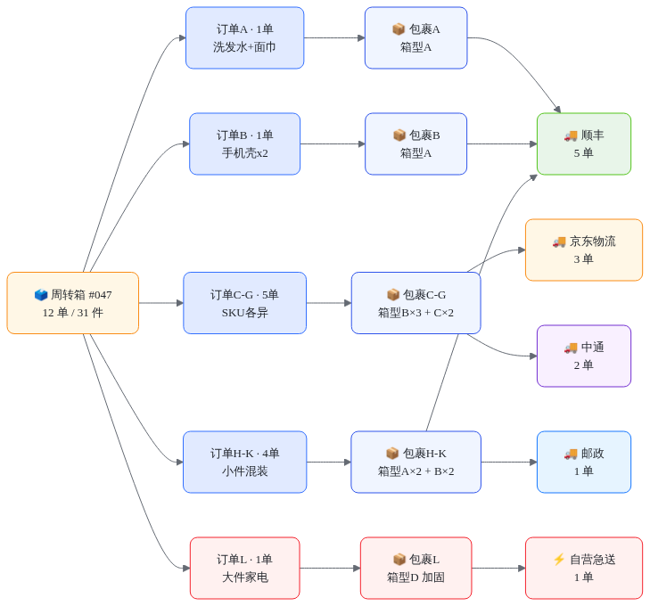

查看 Mermaid 源码

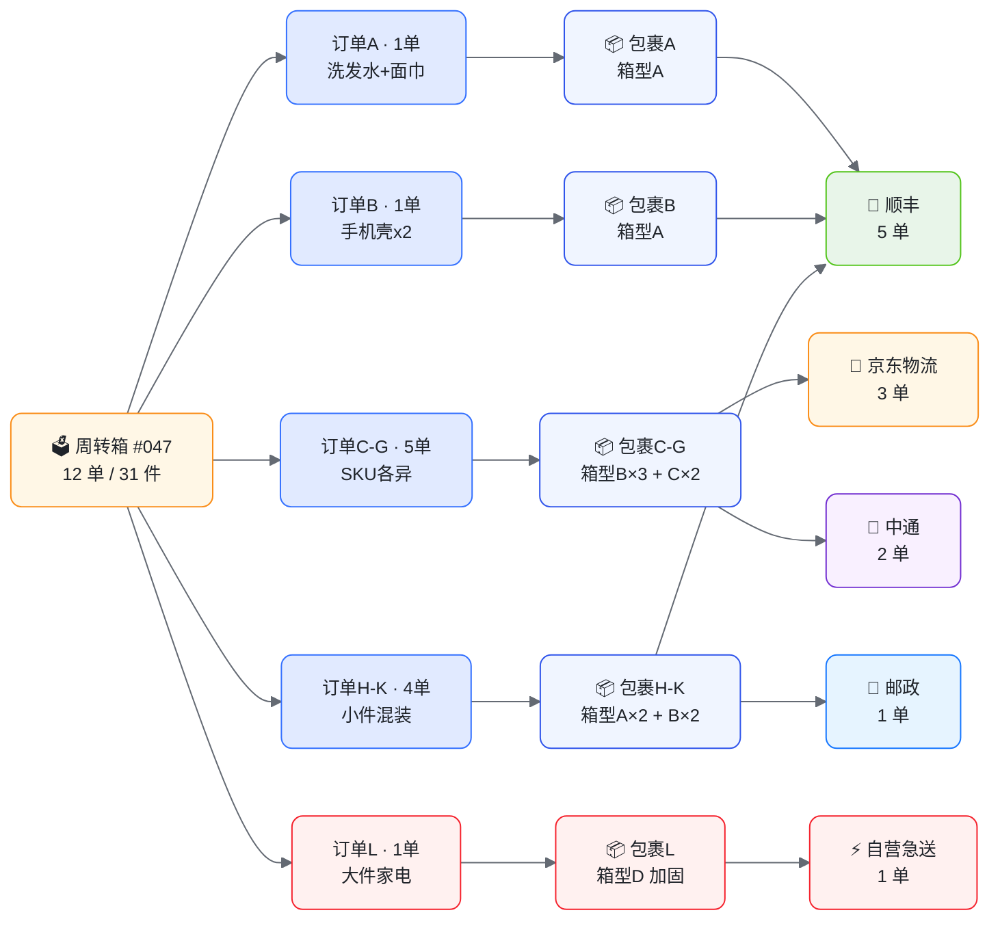
```mermaid
---
config:
  theme: base
  themeVariables:
    fontFamily: '-apple-system, BlinkMacSystemFont, "Helvetica Neue", "PingFang SC", "Microsoft YaHei", sans-serif'
    fontSize: 13px
    primaryColor: '#E1EAFF'
    primaryTextColor: '#1F2329'
    primaryBorderColor: '#3370FF'
    lineColor: '#646A73'
    background: '#FFFFFF'
---
flowchart LR
    T0["🗳 周转箱 #047<br/>12 单 / 31 件"]:::tote

    T0 --> O_A["订单A · 1单<br/>洗发水+面巾"]:::o
    T0 --> O_B["订单B · 1单<br/>手机壳x2"]:::o
    T0 --> O_C["订单C-G · 5单<br/>SKU各异"]:::o
    T0 --> O_H["订单H-K · 4单<br/>小件混装"]:::o
    T0 --> O_L["订单L · 1单<br/>大件家电"]:::oBig

    O_A --> P_A["📦 包裹A<br/>箱型A"]:::pack
    O_B --> P_B["📦 包裹B<br/>箱型A"]:::pack
    O_C --> P_C["📦 包裹C-G<br/>箱型B×3 + C×2"]:::pack
    O_H --> P_H["📦 包裹H-K<br/>箱型A×2 + B×2"]:::pack
    O_L --> P_L["📦 包裹L<br/>箱型D 加固"]:::packBig

    P_A --> SF["🚚 顺丰<br/>5 单"]:::sf
    P_B --> SF
    P_H --> SF
    P_C --> JD["🚚 京东物流<br/>3 单"]:::jd
    P_C --> ZTO["🚚 中通<br/>2 单"]:::zto
    P_H --> EMS["🚚 邮政<br/>1 单"]:::ems
    P_L --> EXP["⚡ 自营急送<br/>1 单"]:::exp

    classDef tote fill:#FFF7E6,stroke:#FA8C16,color:#1F2329,rx:8,ry:8
    classDef o fill:#E1EAFF,stroke:#3370FF,color:#1F2329,rx:8,ry:8
    classDef oBig fill:#FFF1F0,stroke:#F5222D,color:#1F2329,rx:8,ry:8
    classDef pack fill:#F0F5FF,stroke:#2F54EB,color:#1F2329,rx:8,ry:8
    classDef packBig fill:#FFF1F0,stroke:#F5222D,color:#1F2329,rx:8,ry:8
    classDef sf fill:#E8F5E9,stroke:#52C41A,color:#1F2329,rx:8,ry:8
    classDef jd fill:#FFF7E6,stroke:#FA8C16,color:#1F2329,rx:8,ry:8
    classDef zto fill:#F9F0FF,stroke:#722ED1,color:#1F2329,rx:8,ry:8
    classDef ems fill:#E6F4FF,stroke:#1677FF,color:#1F2329,rx:8,ry:8
    classDef exp fill:#FFF1F0,stroke:#F5222D,color:#1F2329,rx:8,ry:8
```

#### 详细交互时序

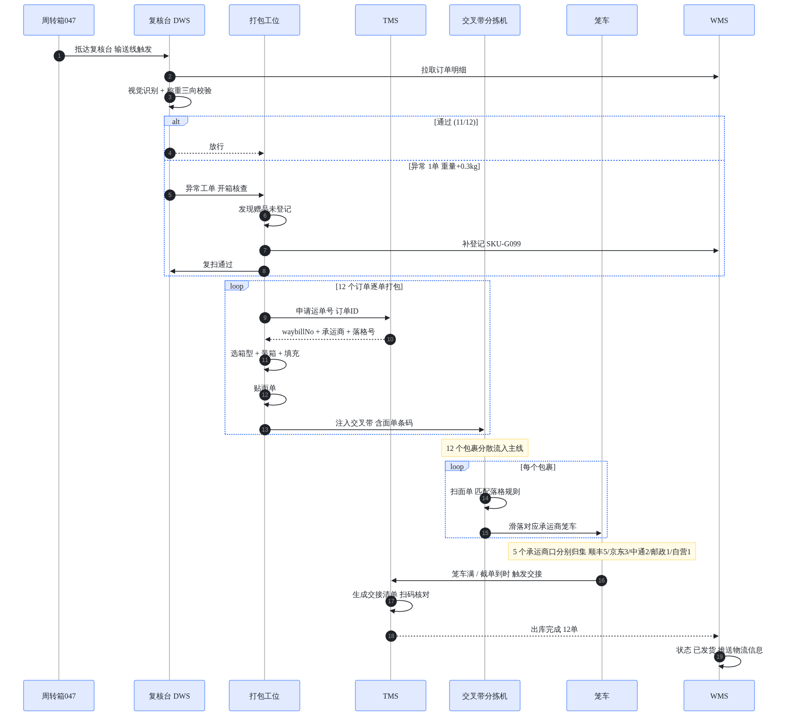

查看 Mermaid 源码

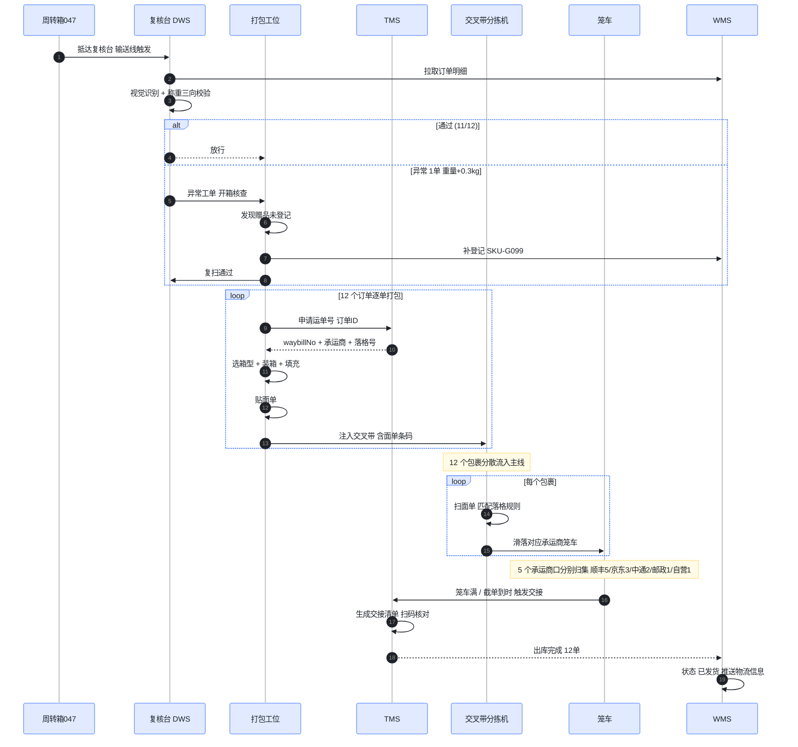
```mermaid
---
config:
  theme: base
  themeVariables:
    fontFamily: '-apple-system, BlinkMacSystemFont, "Helvetica Neue", "PingFang SC", "Microsoft YaHei", sans-serif'
    fontSize: 14px
    primaryColor: '#E1EAFF'
    primaryTextColor: '#1F2329'
    primaryBorderColor: '#3370FF'
    lineColor: '#646A73'
    actorBkg: '#E1EAFF'
    actorBorder: '#3370FF'
    actorTextColor: '#1F2329'
    actorLineColor: '#BFBFBF'
    signalColor: '#1F2329'
    signalTextColor: '#1F2329'
    labelBoxBkgColor: '#E1EAFF'
    labelBoxBorderColor: '#3370FF'
    labelTextColor: '#1F2329'
    loopTextColor: '#1F2329'
    activationBorderColor: '#3370FF'
    activationBkgColor: '#F0F4FF'
    noteBkgColor: '#FFFBE6'
    noteTextColor: '#1F2329'
    noteBorderColor: '#FFD666'
---
sequenceDiagram
    autonumber
    participant Tote as 周转箱047
    participant DWS as 复核台 DWS
    participant Packer as 打包工位
    participant TMS
    participant SORTER as 交叉带分拣机
    participant Cage as 笼车
    participant WMS

    Tote->>DWS: 抵达复核台 输送线触发
    DWS->>WMS: 拉取订单明细
    DWS->>DWS: 视觉识别 + 称重三向校验

    alt 通过 (11/12)
        DWS-->>Packer: 放行
    else 异常 1单 重量+0.3kg
        DWS->>Packer: 异常工单 开箱核查
        Packer->>Packer: 发现赠品未登记
        Packer->>WMS: 补登记 SKU-G099
        Packer->>DWS: 复扫通过
    end

    loop 12 个订单逐单打包
        Packer->>TMS: 申请运单号 订单ID
        TMS-->>Packer: waybillNo + 承运商 + 落格号
        Packer->>Packer: 选箱型 + 装箱 + 填充
        Packer->>Packer: 贴面单
        Packer->>SORTER: 注入交叉带 含面单条码
    end

    Note over SORTER: 12 个包裹分散流入主线

    loop 每个包裹
        SORTER->>SORTER: 扫面单 匹配落格规则
        SORTER->>Cage: 滑落对应承运商笼车
    end

    Note over Cage: 5 个承运商口分别归集 顺丰5/京东3/中通2/邮政1/自营1

    Cage->>TMS: 笼车满 / 截单到时 触发交接
    TMS->>TMS: 生成交接清单 扫码核对
    TMS-->>WMS: 出库完成 12单
    WMS->>WMS: 状态 已发货 推送物流信息
```

#### 实战案例：周转箱 #047 出库

> **场景**：周转箱 #047 装载 12 单（含赠品异常 1 单、大件 1 单、急送 1 单）。

| 时间 | 阶段 | 事件 | 处理 |
|------|------|------|------|
| 10:22:30 | 抵达复核台 | DWS 三向校验 | 11 单通过 |
| 10:22:35 | 异常分流 | 1 单实重 +0.3kg | 转人工开箱核查 |
| 10:23:10 | 异常处置 | 发现赠品 SKU-G099 未上架登记 | 补登记，复扫通过 |
| 10:23:20 ~ 10:25:30 | 拆单打包 | 12 单逐个打包 | 选箱型 A×7 / B×3 / C×1 / D×1 |
| 10:25:30 ~ 10:26:10 | 注入分拣 | 12 包裹陆续上交叉带 | 扫面单计算落格 |
| 10:26:00 ~ 10:26:30 | 落格 | 5 个承运商口分流 | 顺丰5 / 京东3 / 中通2 / 邮政1 / 自营1 |
| 10:35:00 | 自营急送 | 包裹 L 优先单独装车 | 30 分钟内出仓（同城 2h 达 SLA）|
| 11:00:00 | 笼车交接 | 顺丰司机扫码取走笼车 | 80 件 / 笼，出库回写 |

**总耗时**：从满箱到全部出库 ≈ 38 分钟，自动化覆盖率 92%（12 单中 1 单需要人工干预 1 次）。

**关键优化点**：
- **DWS 三向校验**：视觉 + 重量 + 件数任意 1 项异常即转人工，把误差拦截在打包前
- **箱型决策引擎**：根据 SKU 体积 + 易碎度 + 客户偏好，毫秒级输出最优箱型，节省 18% 包材成本
- **落格规则引擎**：以"承运商 × 区域 × 时效"三维匹配，急送单走专属通道避免被普通单堵塞
- **赠品异常**：占异常总量的 35%，通过自动复称识别后人工补登记，解决方案是"赠品在拣选时同步入箱"

---

## 六、数据模型核心实体

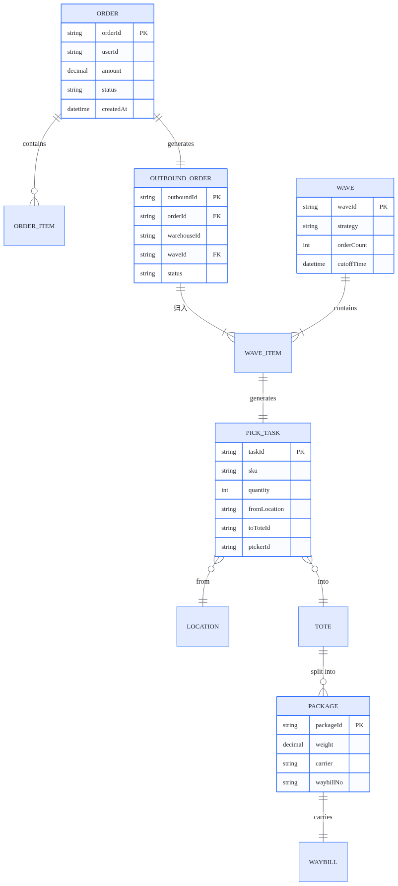

查看 Mermaid 源码

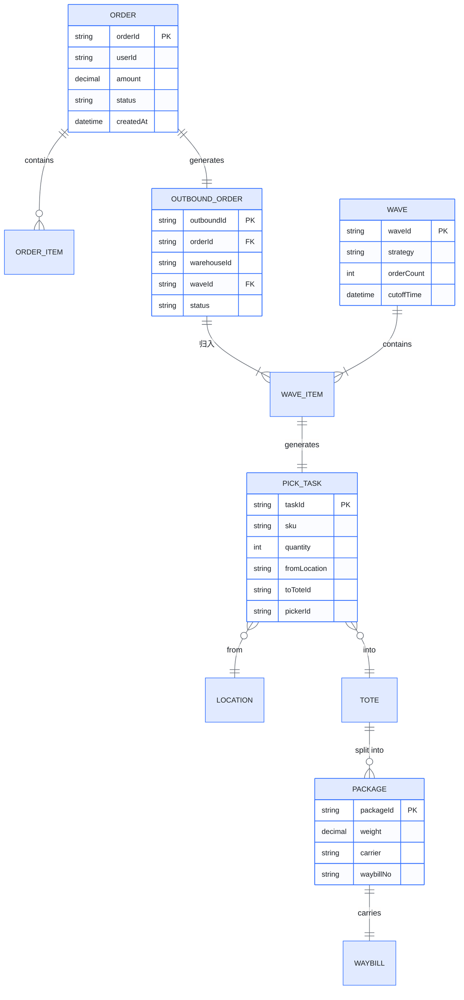
```mermaid
---
config:
  theme: base
  themeVariables:
    fontFamily: '-apple-system, BlinkMacSystemFont, "Helvetica Neue", "PingFang SC", "Microsoft YaHei", sans-serif'
    fontSize: 13px
    primaryColor: '#E1EAFF'
    primaryTextColor: '#1F2329'
    primaryBorderColor: '#3370FF'
    lineColor: '#646A73'
    background: '#FFFFFF'
---
erDiagram
    ORDER ||--o{ ORDER_ITEM : contains
    ORDER ||--|| OUTBOUND_ORDER : generates
    OUTBOUND_ORDER ||--|{ WAVE_ITEM : "归入"
    WAVE ||--|{ WAVE_ITEM : contains
    WAVE_ITEM ||--|| PICK_TASK : generates
    PICK_TASK }o--|| LOCATION : "from"
    PICK_TASK }o--|| TOTE : "into"
    TOTE ||--o{ PACKAGE : "split into"
    PACKAGE ||--|| WAYBILL : "carries"

    ORDER {
        string orderId PK
        string userId
        decimal amount
        string status
        datetime createdAt
    }
    OUTBOUND_ORDER {
        string outboundId PK
        string orderId FK
        string warehouseId
        string waveId FK
        string status
    }
    WAVE {
        string waveId PK
        string strategy
        int orderCount
        datetime cutoffTime
    }
    PICK_TASK {
        string taskId PK
        string sku
        int quantity
        string fromLocation
        string toToteId
        string pickerId
    }
    PACKAGE {
        string packageId PK
        decimal weight
        string carrier
        string waybillNo
    }
```

---

## 七、技术栈建议

| 层级 | 推荐技术 |
|------|---------|
| 接入层 | Nginx + Spring Cloud Gateway |
| 服务层 | Java (Spring Boot) / Go，DDD 微服务 |
| 消息 | Kafka（订单流）+ RocketMQ（事务消息）|
| 数据库 | MySQL（交易）+ TiDB（库存）+ Redis（缓存）|
| 实时计算 | Flink（波次/库存预警）|
| 设备通信 | OPC UA / Modbus / MQTT |
| 监控 | Prometheus + Grafana + SkyWalking |
| 大屏 | ECharts + WebSocket 推流 |

---

## 八、关键实施建议

1. **从半自动起步**：先上 WMS + PTL，再逐步引入 AGV / Shuttle，避免一次性高投入
2. **数据先行**：SKU 主数据（尺寸、重量、分类）质量决定 60% 的自动化效果
3. **分波次灰度**：新策略先在 5% 流量小波次验证，再全量
4. **应急预案常态化**：每月演练设备宕机、网络中断、断电等场景
5. **ROI 测算**：单仓投资约 3000~8000 万，回收期 2~3 年，需匹配单量规模

---

## 九、业务白话版（给老板和业务同学看）

> 前面 1~8 章是给技术同学看的"专业版"。这一章是同样内容的"白话版"——
> **不用 WMS / WES / 算法这种词**，全部用生活语言。
>
> 三种讲法任选一种：
> - **9.1 跟着订单走** —— 适合给老板/客户讲"我们家仓库 10 分钟出货"
> - **9.2 跟着拣货员走** —— 适合参观时讲"为啥我们要上自动化"
> - **9.3 餐厅类比** —— 适合彻底外行（甚至给家人朋友）

### 9.1 跟着订单走 · 小明的洗发水奇幻漂流

> 一个最常被问的问题："我下单后，仓库到底在 10 分钟里干了啥？"
> 答案是：**很多事，而且大部分是机器干的。**

#### 全程时间轴

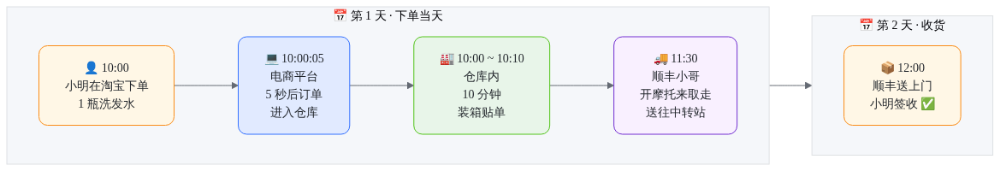

查看 Mermaid 源码

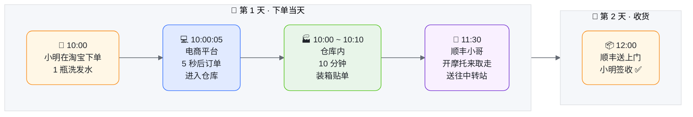
```mermaid
---
config:
  theme: base
  themeVariables:
    fontFamily: '-apple-system, BlinkMacSystemFont, "Helvetica Neue", "PingFang SC", "Microsoft YaHei", sans-serif'
    fontSize: 14px
    primaryColor: '#E1EAFF'
    primaryTextColor: '#1F2329'
    primaryBorderColor: '#3370FF'
    lineColor: '#646A73'
    background: '#FFFFFF'
    clusterBkg: '#F5F7FA'
    clusterBorder: '#DEE0E3'
---
flowchart LR
    subgraph Day1["📅 第 1 天 · 下单当天"]
        direction LR
        T0["👤 10:00<br/>小明在淘宝下单<br/>1 瓶洗发水"]:::user
        T1["💻 10:00:05<br/>电商平台<br/>5 秒后订单<br/>进入仓库"]:::platform
        T2["🏭 10:00 ~ 10:10<br/>仓库内<br/>10 分钟<br/>装箱贴单"]:::warehouse
        T3["🚚 11:30<br/>顺丰小哥<br/>开摩托来取走<br/>送往中转站"]:::courier
        T0 --> T1 --> T2 --> T3
    end

    subgraph Day2["📅 第 2 天 · 收货"]
        direction LR
        T4["📦 12:00<br/>顺丰送上门<br/>小明签收 ✅"]:::user
    end

    Day1 --> Day2

    classDef user fill:#FFF7E6,stroke:#FA8C16,color:#1F2329,rx:10,ry:10
    classDef platform fill:#E1EAFF,stroke:#3370FF,color:#1F2329,rx:10,ry:10
    classDef warehouse fill:#E8F5E9,stroke:#52C41A,color:#1F2329,rx:10,ry:10
    classDef courier fill:#F9F0FF,stroke:#722ED1,color:#1F2329,rx:10,ry:10
```

#### 仓库内 10 分钟做了 8 件事

10 分钟里，小明的洗发水经历了 8 个环节，**人只动手了 1 次**（拿货那下），其他都是机器干的：

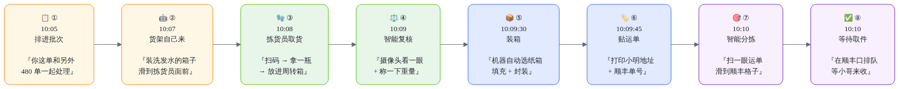

查看 Mermaid 源码

```mermaid
---
config:
  theme: base
  themeVariables:
    fontFamily: '-apple-system, BlinkMacSystemFont, "Helvetica Neue", "PingFang SC", "Microsoft YaHei", sans-serif'
    fontSize: 13px
    primaryColor: '#E1EAFF'
    primaryTextColor: '#1F2329'
    primaryBorderColor: '#3370FF'
    lineColor: '#646A73'
    background: '#FFFFFF'
---
flowchart LR
    A["📋 ①<br/>10:05<br/>排进批次<br/><br/>『你这单和另外<br/>480 单一起处理』"]:::s1
    B["🤖 ②<br/>10:07<br/>货架自己来<br/><br/>『装洗发水的箱子<br/>滑到拣货员面前』"]:::s1
    C["🧤 ③<br/>10:08<br/>拣货员取货<br/><br/>『扫码 → 拿一瓶<br/>→ 放进周转箱』"]:::s2
    D["⚖️ ④<br/>10:09<br/>智能复核<br/><br/>『摄像头看一眼<br/>+ 称一下重量』"]:::s2
    E["📦 ⑤<br/>10:09:30<br/>装箱<br/><br/>『机器自动选纸箱<br/>填充 + 封装』"]:::s3
    F["🏷 ⑥<br/>10:09:45<br/>贴运单<br/><br/>『打印小明地址<br/>+ 顺丰单号』"]:::s3
    G["🎯 ⑦<br/>10:10<br/>智能分拣<br/><br/>『扫一眼运单<br/>滑到顺丰格子』"]:::s4
    H["✅ ⑧<br/>10:10<br/>等待取件<br/><br/>『在顺丰口排队<br/>等小哥来收』"]:::s4

    A --> B --> C --> D
    D --> E --> F --> G --> H

    classDef s1 fill:#FFF7E6,stroke:#FA8C16,color:#1F2329,rx:10,ry:10
    classDef s2 fill:#E8F5E9,stroke:#52C41A,color:#1F2329,rx:10,ry:10
    classDef s3 fill:#E1EAFF,stroke:#3370FF,color:#1F2329,rx:10,ry:10
    classDef s4 fill:#F9F0FF,stroke:#722ED1,color:#1F2329,rx:10,ry:10
```

#### 几个常见疑问（业务方最爱问的）

**Q1：为啥要等 5 分钟"排进批次"？**
A：因为同一时间下单的人很多。系统每 5 分钟把所有订单"打包"一起做，就像饭店厨师不会每来一桌就单独开火，会攒一波一起炒——**效率高 5~8 倍**。

**Q2：货架真的会自己跑吗？**
A：是的，但不是货架长腿，是**机器人钻到货架底下把它顶起来**走（像扫地机器人加强版）。亚马逊 Kiva、京东 Geek+ 都是这个原理。

**Q3：装箱真的不用人？**
A：标准件可以不用人。机器有 4~6 种纸箱型号，根据物品体积自动选。但**易碎、超大、贵重物品**还是要人工。

**Q4：为啥小明 10 分钟就装好了，但要第二天才能到？**
A：仓库出货快 ≠ 配送快。**90% 的时间在路上**——分拣中心 → 转运中心 → 派送站 → 上门。仓库自动化能把"出货时间"压到分钟级，但物流时间取决于地理距离。

---

### 9.2 跟着拣货员走 · 小张的一天

> 这个视角最适合参观仓库时讲——"为啥我们花几千万搞自动化？看小张就知道了。"

#### 上午：人到货模式（传统方式）

> 小张在传统仓库工作。早上 8 点上班，推一辆小推车，按订单去货架取货。

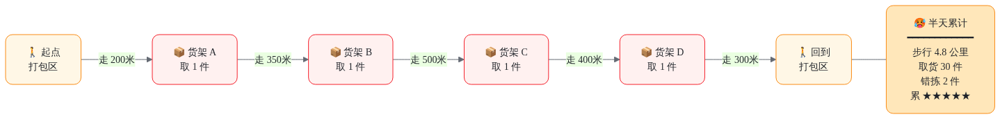

查看 Mermaid 源码

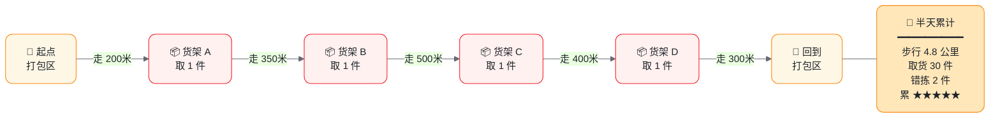
```mermaid
---
config:
  theme: base
  themeVariables:
    fontFamily: '-apple-system, BlinkMacSystemFont, "Helvetica Neue", "PingFang SC", "Microsoft YaHei", sans-serif'
    fontSize: 14px
    primaryColor: '#E1EAFF'
    primaryTextColor: '#1F2329'
    primaryBorderColor: '#3370FF'
    lineColor: '#646A73'
    background: '#FFFFFF'
---
flowchart LR
    A["🚶 起点<br/>打包区"]:::start
    B["📦 货架 A<br/>取 1 件"]:::shelf
    C["📦 货架 B<br/>取 1 件"]:::shelf
    D["📦 货架 C<br/>取 1 件"]:::shelf
    E["📦 货架 D<br/>取 1 件"]:::shelf
    F["🚶 回到<br/>打包区"]:::start
    G["🥵 半天累计<br/>━━━━━━━━━━━━<br/>步行 4.8 公里<br/>取货 30 件<br/>错拣 2 件<br/>累 ★★★★★"]:::result

    A -->|走 200米| B
    B -->|走 350米| C
    C -->|走 500米| D
    D -->|走 400米| E
    E -->|走 300米| F
    F --- G

    classDef start fill:#FFF7E6,stroke:#FA8C16,color:#1F2329,rx:10,ry:10
    classDef shelf fill:#FFF1F0,stroke:#F5222D,color:#1F2329,rx:10,ry:10
    classDef result fill:#FFE7BA,stroke:#FA8C16,color:#1F2329,rx:10,ry:10
```

**小张半天的体感**：
- 仓库像足球场那么大，他在里面走来走去
- 4 小时走了快 5 公里（**等于跑了半个马拉松的距离**）
- 拿了 30 件货
- 中间还拿错了 2 件（货架货品太多，看花眼）
- 中午回到工位，腰酸背痛

#### 下午：货到人模式（自动化方式）

> 老板花钱上了自动化设备。下午小张被调到新工位。

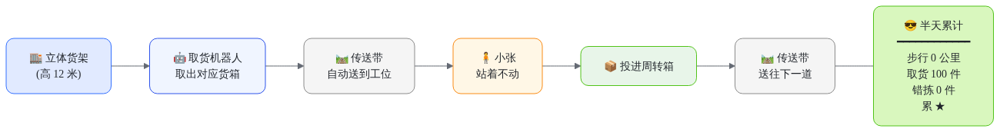

查看 Mermaid 源码

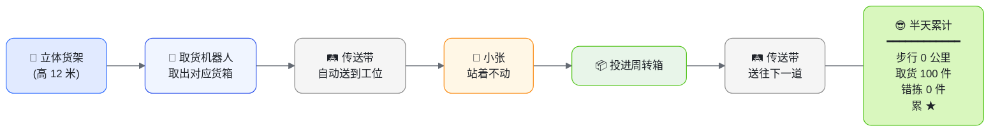
```mermaid
---
config:
  theme: base
  themeVariables:
    fontFamily: '-apple-system, BlinkMacSystemFont, "Helvetica Neue", "PingFang SC", "Microsoft YaHei", sans-serif'
    fontSize: 14px
    primaryColor: '#E1EAFF'
    primaryTextColor: '#1F2329'
    primaryBorderColor: '#3370FF'
    lineColor: '#646A73'
    background: '#FFFFFF'
---
flowchart LR
    A["🏬 立体货架<br/>(高 12 米)"]:::shelf
    B["🤖 取货机器人<br/>取出对应货箱"]:::robot
    C["🛤️ 传送带<br/>自动送到工位"]:::belt
    D["🧍 小张<br/>站着不动"]:::person
    E["📦 投进周转箱"]:::tote
    F["🛤️ 传送带<br/>送往下一道"]:::belt
    G["😎 半天累计<br/>━━━━━━━━━━━━<br/>步行 0 公里<br/>取货 100 件<br/>错拣 0 件<br/>累 ★"]:::result

    A --> B --> C --> D --> E --> F --- G

    classDef shelf fill:#E1EAFF,stroke:#3370FF,color:#1F2329,rx:10,ry:10
    classDef robot fill:#F0F5FF,stroke:#2F54EB,color:#1F2329,rx:10,ry:10
    classDef belt fill:#F5F5F5,stroke:#8C8C8C,color:#1F2329,rx:10,ry:10
    classDef person fill:#FFF7E6,stroke:#FA8C16,color:#1F2329,rx:10,ry:10
    classDef tote fill:#E8F5E9,stroke:#52C41A,color:#1F2329,rx:10,ry:10
    classDef result fill:#D9F7BE,stroke:#52C41A,color:#1F2329,rx:10,ry:10
```

**小张半天的体感**：
- 站在固定工位，没动过
- 屏幕亮一下、灯亮一下，他扫码取货放进周转箱，重复
- 4 小时拣了 100 件（**是上午的 3 倍多**）
- 一件没拿错（屏幕和灯把"取啥"明明白白告诉他了）
- 下班还能跟同事打个球

#### 哪个更好？一图看完

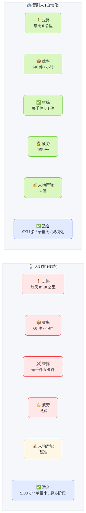

查看 Mermaid 源码

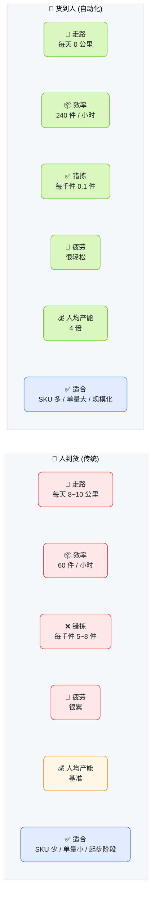
```mermaid
---
config:
  theme: base
  themeVariables:
    fontFamily: '-apple-system, BlinkMacSystemFont, "Helvetica Neue", "PingFang SC", "Microsoft YaHei", sans-serif'
    fontSize: 14px
    primaryColor: '#E1EAFF'
    primaryTextColor: '#1F2329'
    primaryBorderColor: '#3370FF'
    lineColor: '#646A73'
    background: '#FFFFFF'
    clusterBkg: '#F5F7FA'
    clusterBorder: '#DEE0E3'
---
flowchart LR
    subgraph T1["🚶 人到货 (传统)"]
        direction TB
        A1["🚶 走路<br/>每天 8~10 公里"]:::bad
        A2["📦 效率<br/>60 件 / 小时"]:::bad
        A3["❌ 错拣<br/>每千件 5~8 件"]:::bad
        A4["💪 疲劳<br/>很累"]:::bad
        A5["💰 人均产能<br/>基准"]:::neutral
        A6["✅ 适合<br/>SKU 少 / 单量小 / 起步阶段"]:::ok
        A1 ~~~ A2 ~~~ A3 ~~~ A4 ~~~ A5 ~~~ A6
    end

    subgraph T2["🤖 货到人 (自动化)"]
        direction TB
        B1["🚶 走路<br/>每天 0 公里"]:::good
        B2["📦 效率<br/>240 件 / 小时"]:::good
        B3["✅ 错拣<br/>每千件 0.1 件"]:::good
        B4["💆 疲劳<br/>很轻松"]:::good
        B5["💰 人均产能<br/>4 倍"]:::good
        B6["✅ 适合<br/>SKU 多 / 单量大 / 规模化"]:::ok
        B1 ~~~ B2 ~~~ B3 ~~~ B4 ~~~ B5 ~~~ B6
    end

    classDef good fill:#D9F7BE,stroke:#52C41A,color:#1F2329,rx:8,ry:8
    classDef bad fill:#FFE7E7,stroke:#F5222D,color:#1F2329,rx:8,ry:8
    classDef ok fill:#E1EAFF,stroke:#3370FF,color:#1F2329,rx:8,ry:8
    classDef neutral fill:#FFF7E6,stroke:#FA8C16,color:#1F2329,rx:8,ry:8
```

#### 那为啥不所有仓库都搞货到人？

成本问题。一套货到人系统投入 **3000~8000 万**，要日均出 **5 万单以上**才划算。
所以现在主流是**混合模式**：
- 高频热销商品 → 货到人区
- 低频长尾商品 → 人到货区
- 大件 / 易碎 → 人工区

---

### 9.3 餐厅类比 · 仓库就是一家超级连锁餐厅

> 完全不懂物流的人，听这个最好懂。**仓库的所有事，餐厅都干过**。

#### 整体对照

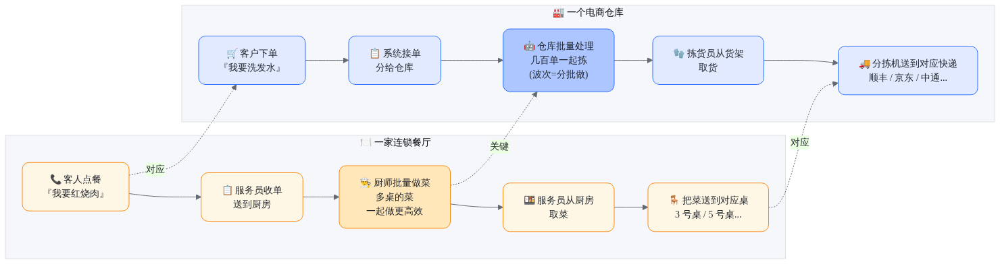

查看 Mermaid 源码

```mermaid
---
config:
  theme: base
  themeVariables:
    fontFamily: '-apple-system, BlinkMacSystemFont, "Helvetica Neue", "PingFang SC", "Microsoft YaHei", sans-serif'
    fontSize: 14px
    primaryColor: '#E1EAFF'
    primaryTextColor: '#1F2329'
    primaryBorderColor: '#3370FF'
    lineColor: '#646A73'
    background: '#FFFFFF'
    clusterBkg: '#F5F7FA'
    clusterBorder: '#DEE0E3'
---
flowchart LR
    subgraph 餐厅["🍽️ 一家连锁餐厅"]
        direction TB
        R1["📞 客人点餐<br/>『我要红烧肉』"]:::r
        R2["📋 服务员收单<br/>送到厨房"]:::r
        R3["👨‍🍳 厨师批量做菜<br/>多桌的菜<br/>一起做更高效"]:::rk
        R4["🍱 服务员从厨房<br/>取菜"]:::r
        R5["🪑 把菜送到对应桌<br/>3 号桌 / 5 号桌..."]:::r
        R1 --> R2 --> R3 --> R4 --> R5
    end

    subgraph 仓库["🏭 一个电商仓库"]
        direction TB
        W1["🛒 客户下单<br/>『我要洗发水』"]:::w
        W2["📋 系统接单<br/>分给仓库"]:::w
        W3["🤖 仓库批量处理<br/>几百单一起拣<br/>(波次=分批做)"]:::wk
        W4["🧤 拣货员从货架<br/>取货"]:::w
        W5["🚚 分拣机送到对应快递<br/>顺丰 / 京东 / 中通..."]:::w
        W1 --> W2 --> W3 --> W4 --> W5
    end

    R1 -.对应.-> W1
    R3 -.关键.-> W3
    R5 -.对应.-> W5

    classDef r fill:#FFF7E6,stroke:#FA8C16,color:#1F2329,rx:10,ry:10
    classDef rk fill:#FFE7BA,stroke:#FA8C16,color:#1F2329,rx:10,ry:10
    classDef w fill:#E1EAFF,stroke:#3370FF,color:#1F2329,rx:10,ry:10
    classDef wk fill:#ADC6FF,stroke:#3370FF,color:#1F2329,rx:10,ry:10
```

| 餐厅术语 | 仓库术语 | 干的是同一件事 |
|---------|---------|---------------|
| 桌号 | 订单号 | 唯一标识 |
| 菜单 | SKU | 可选项目 |
| 一桌客人点的多个菜 | 一个订单的多件商品 | 要打包发出 |
| 厨师按单批量做菜 | 拣货员按"波次"批量拣货 | **核心：分批做更高效** |
| 服务员看餐牌送菜 | 分拣机看面单送包裹 | 智能路由 |
| 高峰期请兼职 | 大促临时招工 | 弹性产能 |
| 后厨叫号系统 | WMS / WES 系统 | 任务调度大脑 |

#### 分拣机的"读心术"揭秘

> 这个最直观——**分拣机看起来很神奇，其实跟餐厅服务员是一个套路**。

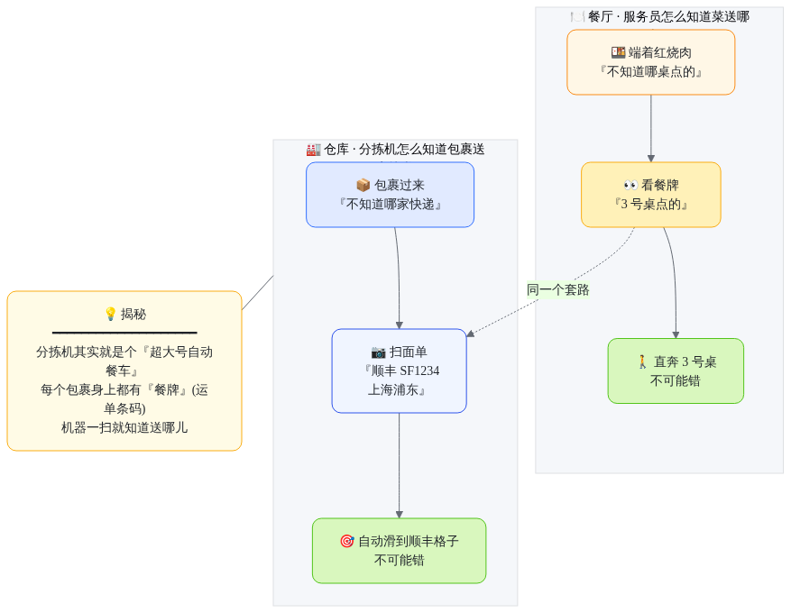

查看 Mermaid 源码

```mermaid
---
config:
  theme: base
  themeVariables:
    fontFamily: '-apple-system, BlinkMacSystemFont, "Helvetica Neue", "PingFang SC", "Microsoft YaHei", sans-serif'
    fontSize: 14px
    primaryColor: '#E1EAFF'
    primaryTextColor: '#1F2329'
    primaryBorderColor: '#3370FF'
    lineColor: '#646A73'
    background: '#FFFFFF'
    clusterBkg: '#F5F7FA'
    clusterBorder: '#DEE0E3'
---
flowchart TB
    subgraph 餐厅["🍽️ 餐厅 · 服务员怎么知道菜送哪桌？"]
        direction LR
        A1["🍱 端着红烧肉<br/>『不知道哪桌点的』"]:::r1
        A2["👀 看餐牌<br/>『3 号桌点的』"]:::r2
        A3["🚶 直奔 3 号桌<br/>不可能错"]:::r3
        A1 --> A2 --> A3
    end

    subgraph 仓库["🏭 仓库 · 分拣机怎么知道包裹送哪家快递？"]
        direction LR
        B1["📦 包裹过来<br/>『不知道哪家快递』"]:::w1
        B2["📷 扫面单<br/>『顺丰 SF1234<br/>上海浦东』"]:::w2
        B3["🎯 自动滑到顺丰格子<br/>不可能错"]:::w3
        B1 --> B2 --> B3
    end

    A2 -.同一个套路.-> B2

    NOTE["💡 揭秘<br/>━━━━━━━━━━━━━━━━━━━━<br/>分拣机其实就是个『超大号自动餐车』<br/>每个包裹身上都有『餐牌』(运单条码)<br/>机器一扫就知道送哪儿"]:::note

    仓库 --- NOTE

    classDef r1 fill:#FFF7E6,stroke:#FA8C16,color:#1F2329,rx:10,ry:10
    classDef r2 fill:#FFF1B8,stroke:#FAAD14,color:#1F2329,rx:10,ry:10
    classDef r3 fill:#D9F7BE,stroke:#52C41A,color:#1F2329,rx:10,ry:10
    classDef w1 fill:#E1EAFF,stroke:#3370FF,color:#1F2329,rx:10,ry:10
    classDef w2 fill:#F0F5FF,stroke:#2F54EB,color:#1F2329,rx:10,ry:10
    classDef w3 fill:#D9F7BE,stroke:#52C41A,color:#1F2329,rx:10,ry:10
    classDef note fill:#FFFBE6,stroke:#FAAD14,color:#1F2329,rx:10,ry:10
```

**分拣机背后的 3 个核心动作**：

1. **每个包裹打面单** = 给每盘菜配餐牌（餐厅服务员靠餐牌找桌）
2. **分拣机扫码读地址** = 服务员看餐牌找桌号
3. **机器把包裹滑到对应格子** = 服务员把菜放到对应桌

**牛在哪儿？**
- 一台交叉带分拣机每小时处理 **6000~12000 件**（人工的 100 倍）
- 准确率 **99.99%**（每 1 万件错 1 件）
- 24 小时不知疲倦，双 11 也能撑

**说穿了**：自动化不是黑科技，是把人原本就在做的事，**交给一个不会累、不会看花眼的"机器服务员"**。

---

#### 餐厅类比的极限：哪些事餐厅没法类比？

| 仓库的事 | 为啥餐厅类比不了 |
|---------|----------------|
| 跨仓拆单 | 餐厅只在一个店做菜 |
| 库存调拨 | 餐厅食材不会从北京餐厅调到上海 |
| 大促洪峰 | 餐厅最多包场，不会 1 小时来 50 万人 |
| 退货逆向流 | 餐厅没有"客人吃完退回来"这种事 |

所以**类比只能讲个 80%**，剩下的 20% 是仓库的"特种作战"——这部分要看前面的技术版（第 1~8 章）。
