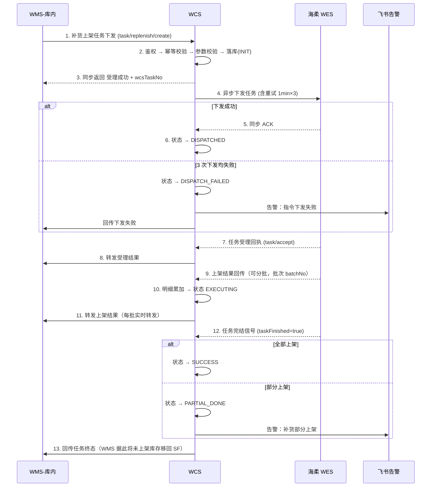
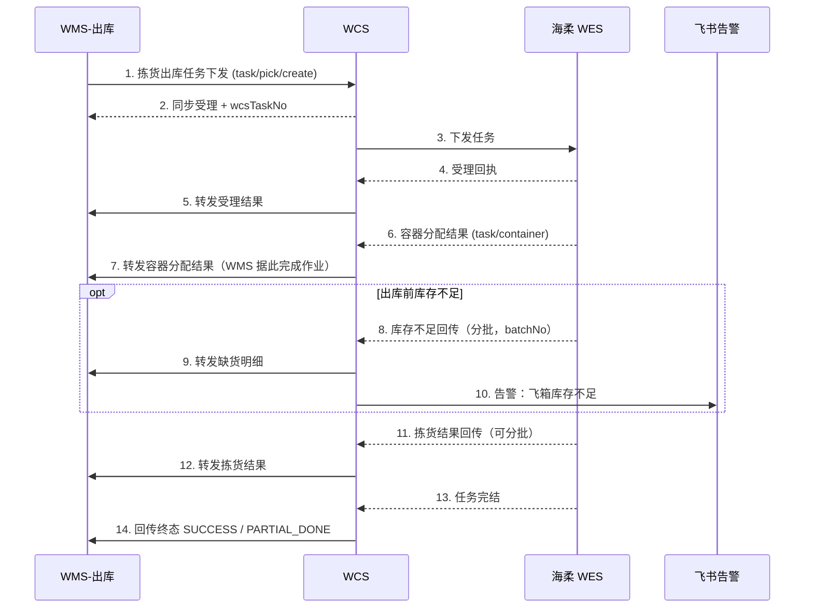
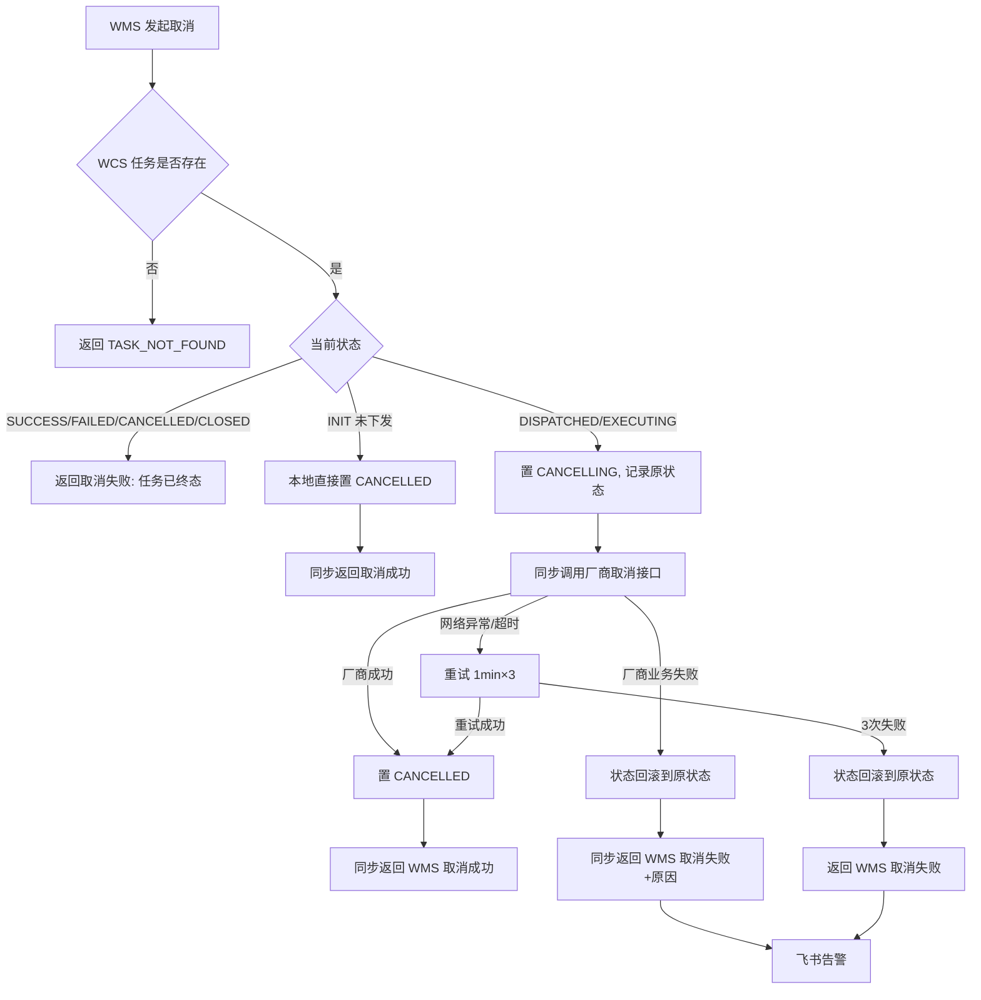

# 【子PRD】台州海柔飞箱项目 — WCS 系统

> 适用范围：本文为主 PRD《【项目】【P0】台州海柔飞箱项目》(v1.1) 下 **WCS 模块**的子需求文档，用于与研发、测试同学评审。
> WMS-库内、WMS-出库、OIC/数据湖 的模块需求详见各自子 PRD，本文仅在交互边界处引用。

---

## 0. 文档信息

| 项 | 内容 |
|---|---|
| 文档名称 | 【子PRD】台州海柔飞箱项目 — WCS 系统 |
| 版本号 | v1.0 |
| 创建日期 | 2026-08-08 |
| 产品负责人 | Stone JIANG |
| 主 PRD | 《【项目】【P0】台州海柔飞箱项目》v1.1（Jasmine） |
| 关联子 PRD | WMS-库内（Jasmine Xu）、WMS-出库（Eric Sun）、OIC-数据湖（Shawn Wang） |
| 评审对象 | WCS 研发、WMS 研发、测试、海柔（对接联调） |
| 期望评审时间 | 2026-08-12 |
| 期望提测时间 | 2026-09-22 |
| 期望上线时间 | 2026-10-12 |

### 变更日志

| 时间 | 版本 | 变更人 | 主要变更内容 |
|---|---|---|---|
| 2026-08-08 | v1.0 | Stone JIANG | 首次创建，基于主 PRD v1.1 + 两轮需求澄清 |

---

## 1. 名词解释

| 缩写 | 全称 / 含义 |
|---|---|
| **WCS** | Warehouse Control System，仓储控制系统。本项目新建，作为 WMS 与各自动化设备厂商之间的**统一调度与对接层** |
| **WMS** | Warehouse Management System，仓储管理系统（MyClub 库内 / 出库） |
| **WES** | Warehouse Execution System，厂商侧执行系统。本期指海柔 WES（WHC-FLUX） |
| **WHC** | 海柔侧控制系统，本文与 WES 合称"海柔侧" |
| **飞箱 / FX** | 门店内的自动化料箱存储拣选设备及其储区 |
| **SF** | Store Floor，门店卖场储区（飞箱的上游/下游储区） |
| **OIC** | 库存中心，负责库存流水与账务 |
| **料箱 / Tote** | 飞箱设备内的存储容器 |
| **容器 / Container** | 出库作业使用的周转箱、笼车等承接容器 |
| **供应商 / 厂商** | 自动化设备提供方：立镖、海柔、Geek+、原力聚合等 |
| **指令 / 任务（Task）** | WCS 内的标准作业指令实体，是 WCS 的核心领域对象 |

---

## 2. 项目背景与 WCS 定位

### 2.1 背景

1. **供应商替换**：合肥飞箱项目供应商为【立镖】，台州新店引入新供应商【海柔】，需完成新供应商对接落地。
2. **WCS 标准化对接模型搭建**：原【WMS → 飞箱】的直连对接模式改为 **【WMS → WCS → 飞箱】**，由 WCS 统一对外输出，WMS 只对接内部系统。

### 2.2 WCS 系统定位

WCS 在本期从 0 到 1 搭建，定位为 **"设备无关的作业指令调度与协议适配中台"**：

```
       ┌──────────────────────────────────────────────────────┐
       │  多仓店 WMS（台州门店 / 合肥门店 / FC / 云仓 / 大仓）  │
       └────────────────────────┬─────────────────────────────┘
                                │  标准指令协议（WCS 对内统一契约，不随厂商变化）
                                ▼
       ┌──────────────────────────────────────────────────────┐
       │                        WCS                            │
       │  ┌────────────┐ ┌────────────┐ ┌──────────────────┐  │
       │  │ 接入层     │ │ 调度层     │ │ 适配层            │  │
       │  │ 鉴权/幂等  │ │ 路由/状态机│ │ 厂商协议转换      │  │
       │  │ 校验/落库  │ │ 重试/告警  │ │ (海柔/立镖/...)   │  │
       │  └────────────┘ └────────────┘ └──────────────────┘  │
       └───────┬──────────────────┬───────────────┬───────────┘
               │                  │               │
               ▼                  ▼               ▼
        ┌────────────┐    ┌────────────┐   ┌────────────────┐
        │ 海柔 WES   │    │ 立镖(未来) │   │ Geek+/原力(未来)│
        └────────────┘    └────────────┘   └────────────────┘
               │
               ▼ (MQ)
        ┌────────────────┐
        │  OIC / 数据湖   │
        └────────────────┘
```

**三条设计红线（贯穿全文）：**

| # | 原则 | 含义 |
|---|---|---|
| R1 | **对内契约标准化** | WMS 只认 WCS 的标准指令协议。换厂商、加厂商，WMS 侧代码零改动 |
| R2 | **对外适配可插拔** | 每个厂商一个 Adapter 实现，新增厂商 = 新增一个 Adapter，不改主流程 |
| R3 | **全链路可追溯** | 所有指令落模型；所有出入报文落流水；一个 traceId 串起 WMS→WCS→厂商全链路 |

### 2.3 本期（1 期）范围

| # | 需求点 | 说明 | 优先级 |
|---|---|---|---|
| W1 | 上机商品主数据推送（透传） | WMS → WCS → 海柔，同步实时转发，WCS 不落库 | P0 |
| W2 | 飞箱实时库存查询（透传） | WMS → WCS → 海柔，同步实时转发，WCS 不落库 | P0 |
| W3 | 补货上架任务下发与结果回传 | 含受理回执、部分上架、库存不足 | P0 |
| W4 | 补货任务取消 | 以厂商取消结果为准，结果必达 WMS | P0 |
| W5 | 移出（下架移库）任务下发与结果回传 | FX → SF | P0 |
| W6 | 拣货出库任务下发与结果回传 | 含容器分配结果回传 | P0 |
| W7 | 库存不足回传 | 出库前库存不足，分批回传 + 告警 | P0 |
| W8 | 料箱库存快照同步数据湖 | 海柔 → WCS → MQ → 数据湖，每日一次 | P0 |
| W9 | 厂商路由（调度策略） | 按仓库号决定调用哪个厂商 | P0 |
| W10 | 重试与飞书告警 | 1 分钟间隔重试 3 次，失败告警 | P0 |
| W11 | WCS 运维后台（任务查询/人工重推/人工关闭） | 见 §9，**待确认是否纳入 1 期** | P1 |

### 2.4 本期不做（Out of Scope）

| # | 不做项 | 说明 |
|---|---|---|
| N1 | **超时兜底处理** | 厂商长时间未回传结果时的超时告警 / 自动置异常，**1 期不做**（已明确）。1 期依赖人工从后台或飞书群发现 |
| N2 | 立镖接入 WCS | 立镖仍走 WMS 历史直连链路，灰度由 WMS 判断 |
| N3 | 账号管理 / 账号鉴权对接 | 飞箱侧自定义作业账号，1 期 WCS 不做账号体系对接（作业人字段是否透传见 §12 待确认 Q9） |
| N4 | 标准件数回传-查询 | 主 PRD 标记 P1 |
| N5 | 移出任务取消、拣货任务取消 | 主 PRD 明确"飞箱移出上架任务不支持操作取消"，1 期 WCS 直接拒绝（见 §12 Q3/Q4） |
| N6 | WCS 侧库存账本 | WCS 不持有库存，库存以 OIC/WMS 为准，WCS 只做转发与快照搬运 |

---

## 3. 系统交互总览

### 3.1 端到端业务链路

| 业务场景 | 链路 | 同步/异步 |
|---|---|---|
| 上机商品推送 | WMS → WCS → 海柔 → WCS → WMS | 全同步（透传） |
| 飞箱库存查询 | WMS → WCS → 海柔 → WCS → WMS | 全同步（透传） |
| 补货上架 | WMS → WCS → 海柔（下发）；海柔 → WCS → WMS（受理/结果） | 下发同步，结果异步 |
| 补货取消 | WMS → WCS → 海柔（取消）；结果同步返回 + 异步补偿 | 见 §6.4 |
| 移出下架 | WMS → WCS → 海柔（下发）；海柔 → WCS → WMS（结果） | 下发同步，结果异步 |
| 拣货出库 | WMS → WCS → 海柔（下发）；海柔 → WCS → WMS（容器分配 / 结果 / 缺货） | 下发同步，结果异步 |
| 料箱快照 | 海柔 → WCS → MQ → 数据湖 | 异步，每日一次 |

### 3.2 主流程时序（补货上架，含部分上架）



### 3.3 主流程时序（拣货出库，含容器分配与库存不足）



---

## 4. 【技术决策专题】指令模型：单表 vs 分表

> 本节应产品要求，由研发同学在评审会上拍板。产品侧的核心诉求是：**标准化**——未来能平滑扩展到立镖、Geek+、原力聚合，并覆盖 FC / 云仓 / 大仓 的自动化设备，且"料箱到人""四向车"等不同作业形态的库内指令是**通用且标准**的。

### 4.1 候选方案

| 方案 | 描述 |
|---|---|
| **A. 统一单表 + 类型字段** | 一张 `wcs_task`，用 `task_type`（补货/拣货/移出）+ `vendor_code`（海柔/立镖/…）区分 |
| **B. 按业务类型分表** | `wcs_replenish_task` / `wcs_pick_task` / `wcs_moveout_task` 各一张 |
| **C. 按厂商分表** | `wcs_hairou_task` / `wcs_libiao_task` / … 各一张 |
| **D. 统一主表 + 明细表 + 扩展列（推荐）** | `wcs_task`（共性主表）+ `wcs_task_detail`（商品行）+ `ext_json`（厂商/作业形态差异字段）+ `wcs_message_log`（报文流水） |

### 4.2 多维度对比

| 对比维度 | A 统一单表 | B 按类型分表 | C 按厂商分表 | **D 主表+明细+扩展（推荐）** |
|---|---|---|---|---|
| **标准化程度** | 高 | 低（每类一套语义） | **最低**（换厂商=换模型，违背 WCS 初衷） | **最高**（对内单一契约） |
| **新增厂商成本** | 低（加枚举） | 中（每张表都要加厂商字段） | **高（新建表 + 全套 CRUD + 状态机 + 告警）** | **最低（新增 Adapter，模型零改动）** |
| **新增作业类型成本**（四向车/盘点） | 低 | **高（新建表）** | 高 | **低（加枚举 + ext_json）** |
| **状态机 / 重试 / 告警 / 报文留存 复用** | 一套 | N 套 | M 套 | **一套** |
| **代码重复度** | 低 | 高（N 类型 × M 厂商 组合爆炸） | 高 | **低** |
| **字段稀疏度（NULL 列）** | **中高**（差异字段全平铺） | 低 | 低 | **低**（差异进 ext_json） |
| **单表数据量** | **大** | 分散 | 分散 | 大，但可按 `warehouse_code` + 时间分区/归档 |
| **跨类型统一查询/看板** | 易 | **难（UNION）** | 难 | **易** |
| **DDL 变更影响面** | 全量任务 | 局部 | 局部 | 主表稳定，变更多落在 ext_json |
| **索引设计复杂度** | 中（需组合索引） | 低 | 低 | 中（可控，见 §5.3） |

### 4.3 数据量测算（决定"单表能不能扛住"）

- 主 PRD 目标：出库每小时处理 **600 箱**，按夜间作业 12h 计 ≈ **7,200 箱/天/仓**
- 一个料箱平均对应约 1 条任务明细，按主表:明细 ≈ 1:5 估算 → **主表 ≈ 1,500 条/天/仓，明细 ≈ 7,200 条/天/仓**
- 叠加补货 + 移出，按 2 倍冗余：主表 ≈ **3,000 条/天/仓**
- 单仓年增量：主表 ≈ **110 万行/年**，明细 ≈ **530 万行/年**
- 规划接入 10 个仓店：主表 ≈ **1,100 万行/年**，明细 ≈ **5,300 万行/年**

**结论**：单表年增量在千万级，MySQL 单表（配合 `warehouse_code + create_time` 组合索引 + 按月归档冷数据）**完全可承载**，不构成选择分表的理由。报文流水表数据量最大（≈ 主表的 6～8 倍），**单独建表并独立设置 90 天保留期**。

### 4.4 推荐结论

**推荐方案 D**，理由：

1. **方案 C 直接否决**——按厂商分表会让"换厂商"变成"换数据模型"，与本项目"WCS 标准化对接模型搭建"的立项目标正面冲突。
2. **方案 B 否决**——按类型分表会导致状态机、重试、告警、报文留存、路由这 5 套横切能力被复制 N 份；未来加"四向车呼叫箱""盘点"时每次都要新建全套，扩展成本随类型线性增长。
3. **A 与 D 的差别**只在"差异字段怎么放"。D 通过 `明细表 + ext_json` 避免主表被各厂商私有字段撑成宽表，是 A 的工程化版本。
4. **代码层用双维度策略模式解耦**（物理一张表，逻辑充分隔离）：

```
TaskService (统一编排：校验 → 落库 → 路由 → 状态机 → 重试 → 告警)
   ├── TaskTypeHandler   (按 task_type 分发：补货 / 拣货 / 移出 / 未来盘点、四向车)
   └── VendorAdapter     (按 vendor_code 分发：HAIROU / LIBIAO / GEEKPLUS / YUANLI)
          ├── request  转换：WCS 标准模型 → 厂商报文
          └── response 转换：厂商报文 → WCS 标准模型
```

> **需研发确认**：ext_json 使用 MySQL `JSON` 类型还是 `TEXT` 存 JSON 字符串（涉及是否需要对 ext 内字段建函数索引）。产品侧无偏好，建议按团队现有规范。

### 4.5 标准化枚举设计（面向未来扩展）

为满足"料箱到人 / 四向车 / FC / 云仓 / 大仓 指令通用标准化"的诉求，模型层预留三组正交枚举：

**① 任务类型 `task_type`（做什么）**

| 枚举值 | 含义 | 1 期 |
|---|---|---|
| `INBOUND_PUTAWAY` | 入库上架（补货入飞箱） | ✅ |
| `OUTBOUND_PICK` | 出库拣选（拣货出库） | ✅ |
| `MOVE_OUT` | 移出下架（飞箱 → SF） | ✅ |
| `INNER_MOVE` | 库内移位 | 预留 |
| `STOCK_TAKE` | 盘点 | 预留 |
| `CONTAINER_CALL` | 呼叫容器 / 呼叫箱（四向车常用） | 预留 |

**② 作业形态 `work_mode`（怎么做）**

| 枚举值 | 含义 | 1 期 |
|---|---|---|
| `TOTE_TO_PERSON` | 料箱到人 | ✅（海柔飞箱） |
| `FOUR_WAY_SHUTTLE` | 四向车 | 预留 |
| `AMR` | 移动机器人 | 预留 |
| `PALLET_TO_PERSON` | 托盘到人 | 预留 |

**③ 厂商 `vendor_code`（谁来做）**

| 枚举值 | 含义 | 1 期 |
|---|---|---|
| `HAIROU` | 海柔 | ✅ |
| `LIBIAO` | 立镖 | 预留（当前走 WMS 直连） |
| `GEEKPLUS` | Geek+ | 预留 |
| `YUANLI` | 原力聚合 | 预留 |

> 三组枚举**正交**：新增一个厂商只动 ③，新增一种设备形态只动 ②，新增一类作业只动 ①，互不影响。这是"标准化"落到模型上的具体体现。

---

## 5. 领域模型与状态机

### 5.1 实体关系

```
wcs_task (任务主表) 1 ──── N  wcs_task_detail (任务明细/商品行)
     │
     ├── 1 ──── N  wcs_task_result (厂商回传结果流水，含分批)
     ├── 1 ──── N  wcs_message_log (出入报文流水)
     └── 1 ──── N  wcs_dispatch_record (下发/重试记录)

wcs_vendor_route (仓库 → 厂商 路由配置)
wcs_tote_snapshot_job (料箱快照任务执行记录)
```

### 5.2 状态机

#### 5.2.1 状态定义

| 状态码 | 中文 | 类型 | 说明 |
|---|---|---|---|
| `INIT` | 待下发 | 中间态 | WCS 已受理并落库，尚未下发厂商 |
| `DISPATCHING` | 下发中 | 中间态 | 正在调用厂商接口（含重试窗口内） |
| `DISPATCH_FAILED` | 下发失败 | **可恢复终态** | 重试 3 次仍失败，已告警，支持人工重推 |
| `DISPATCHED` | 已下发 | 中间态 | 厂商已返回受理成功 |
| `EXECUTING` | 执行中 | 中间态 | 厂商已开始作业 / 已有部分结果回传 |
| `PARTIAL_DONE` | 部分完成 | **终态** | 厂商已完结但未全量完成（部分上架 / 部分拣货） |
| `SUCCESS` | 已完成 | 终态 | 全量完成 |
| `FAILED` | 已失败 | 终态 | 厂商回传执行失败 / 拒绝受理 |
| `CANCELLING` | 取消中 | 中间态 | 已向厂商发起取消，等待厂商结果 |
| `CANCELLED` | 已取消 | 终态 | 厂商确认取消成功 |
| `CLOSED` | 已关闭 | 终态 | 人工/系统兜底关闭，不再接受任何回传 |

**主表关键辅助字段**：`dispatch_count`（下发次数）、`last_dispatch_time`（最后下发时间）、`fail_code` / `fail_reason`（失败码与原因）、`finish_time`（终态时间）。

#### 5.2.2 状态流转图

```mermaid
stateDiagram-v2
    [*] --> INIT: WMS下发, WCS受理落库
    INIT --> DISPATCHING: 触发下发
    DISPATCHING --> DISPATCHED: 厂商ACK成功
    DISPATCHING --> DISPATCHING: 下发失败, 重试(1min间隔, 最多3次)
    DISPATCHING --> DISPATCH_FAILED: 重试3次仍失败 → 飞书告警
    DISPATCH_FAILED --> DISPATCHING: 人工重推(运维后台)
    DISPATCH_FAILED --> CLOSED: 人工关闭
    DISPATCHED --> EXECUTING: 厂商开始作业/首批结果回传
    DISPATCHED --> FAILED: 厂商拒绝受理
    EXECUTING --> SUCCESS: 完结且全量完成
    EXECUTING --> PARTIAL_DONE: 完结但部分完成 → 飞书告警
    EXECUTING --> FAILED: 厂商回传执行失败
    INIT --> CANCELLING: WMS取消(未下发, 直接本地取消)
    DISPATCHED --> CANCELLING: WMS取消
    EXECUTING --> CANCELLING: WMS取消
    CANCELLING --> CANCELLED: 厂商取消成功
    CANCELLING --> DISPATCHED: 厂商取消失败, 状态回滚 → 飞书告警
    CANCELLING --> EXECUTING: 厂商取消失败, 状态回滚 → 飞书告警
    SUCCESS --> [*]
    PARTIAL_DONE --> [*]
    FAILED --> [*]
    CANCELLED --> [*]
    CLOSED --> [*]
```



#### 5.2.3 状态流转规则（研发/测试对齐用）

| # | 规则 | 说明 |
|---|---|---|
| S1 | **状态只进不退** | 除"取消失败回滚"外，不允许从终态回到中间态 |
| S2 | **终态幂等** | 任务已处于 `SUCCESS`/`FAILED`/`CANCELLED`/`CLOSED` 时，收到任何厂商回传**直接丢弃并记录 WARN 日志**，不报错、不改状态 |
| S3 | **PARTIAL_DONE 是终态，不是中间态** | 分批回传过程中主表保持 `EXECUTING`，仅明细累加；只有收到厂商"任务完结"信号才判定 `SUCCESS` 或 `PARTIAL_DONE` |
| S4 | **完成判定口径** | `SUM(明细.已完成数量) >= SUM(明细.计划数量)` → `SUCCESS`；`0 < SUM(已完成) < SUM(计划)` → `PARTIAL_DONE`；`SUM(已完成) = 0` → `FAILED` |
| S5 | **状态变更加乐观锁** | 更新语句带 `WHERE status = 前置状态`，`update rows = 0` 时不重试、记 WARN，防并发覆盖 |
| S6 | **CLOSED 仅人工触发** | 1 期无自动超时关闭（见 §2.4 N1），只能由运维后台人工关闭 |
| S7 | **每次状态变更写流水** | 记录到 `wcs_task` 变更日志 / `wcs_task_result`，便于排查 |

### 5.3 表结构设计

> 以下为产品视角的字段清单，**最终 DDL 以研发设计为准**。类型、长度、索引为建议值。

#### 5.3.1 `wcs_task` — 任务主表

| 字段 | 类型 | 必填 | 说明 |
|---|---|---|---|
| `id` | bigint | Y | 主键，自增 |
| `wcs_task_no` | varchar(40) | Y | WCS 任务号（全局唯一，WCS 生成，回传 WMS 与下发厂商均用它） |
| `source_system` | varchar(20) | Y | 来源系统：`WMS_INNER`(库内) / `WMS_OUTBOUND`(出库) |
| `source_task_no` | varchar(64) | Y | 来源单号（WMS 补货单号 / 出库单号 / 移库单号） |
| `source_biz_no` | varchar(64) | N | 上游业务单号（如 PFC 备货出库单号），用于排查 |
| `warehouse_code` | varchar(32) | Y | 仓库号 / 门店号，**厂商路由的唯一依据** |
| `vendor_code` | varchar(20) | Y | 厂商编码，路由结果 |
| `task_type` | varchar(32) | Y | 任务类型，见 §4.5 ① |
| `work_mode` | varchar(32) | Y | 作业形态，见 §4.5 ②，1 期固定 `TOTE_TO_PERSON` |
| `status` | varchar(20) | Y | 任务状态，见 §5.2.1 |
| `priority` | int | N | 优先级，默认 100，数值越小越优先（预留） |
| `plan_qty` | decimal(16,3) | Y | 计划总数量（明细汇总） |
| `done_qty` | decimal(16,3) | Y | 已完成总数量（明细汇总，回传时累加） |
| `from_location` | varchar(32) | N | 源储区（如 SF / 暂存区） |
| `to_location` | varchar(32) | N | 目标储区（如 FX / SF） |
| `container_code` | varchar(64) | N | 容器编码（拣货容器分配后回填） |
| `vendor_task_no` | varchar(64) | N | 厂商侧任务号（厂商 ACK 时回填） |
| `dispatch_count` | int | Y | 下发次数，默认 0 |
| `last_dispatch_time` | datetime | N | 最后一次下发时间 |
| `cancel_source` | varchar(20) | N | 取消发起方：`WMS` / `MANUAL` |
| `fail_code` | varchar(40) | N | 失败码 |
| `fail_reason` | varchar(500) | N | 失败原因（厂商原文，便于排查） |
| `operator` | varchar(64) | N | 厂商侧实际作业人（回传时回填，见 §12 Q9） |
| `operate_time` | datetime | N | 厂商侧实际作业时间（**非传输时间**） |
| `finish_time` | datetime | N | 终态时间 |
| `ext_json` | json / text | N | 厂商 / 作业形态差异字段扩展位 |
| `trace_id` | varchar(64) | Y | 全链路追踪 ID |
| `create_time` / `update_time` | datetime | Y | 创建 / 更新时间 |
| `create_by` / `update_by` | varchar(64) | N | 创建人 / 更新人 |

**索引建议**：
- `uk_wcs_task_no` (`wcs_task_no`) UNIQUE
- `uk_source` (`source_system`, `source_task_no`, `task_type`) UNIQUE ← **幂等键，见 §8.3**
- `idx_wh_status_time` (`warehouse_code`, `status`, `create_time`)
- `idx_vendor_task` (`vendor_code`, `vendor_task_no`)
- `idx_create_time` (`create_time`) ← 归档用

#### 5.3.2 `wcs_task_detail` — 任务明细表

| 字段 | 类型 | 必填 | 说明 |
|---|---|---|---|
| `id` | bigint | Y | 主键 |
| `wcs_task_no` | varchar(40) | Y | 关联主表 |
| `line_no` | int | Y | 行号（与 WMS 行号一一对应） |
| `item_code` | varchar(32) | Y | 商品号（item） |
| `upc` | varchar(64) | N | 商品条码（主条码） |
| `batch_no` | varchar(64) | N | 批次号（如涉及） |
| `expire_date` | date | N | 效期 |
| `plan_qty` | decimal(16,3) | Y | 计划数量 |
| `done_qty` | decimal(16,3) | Y | 已完成数量（分批累加） |
| `shortage_qty` | decimal(16,3) | N | 缺货数量（库存不足回传时写入） |
| `line_status` | varchar(20) | Y | 行状态：`INIT`/`PARTIAL`/`DONE`/`SHORTAGE`/`CANCELLED` |
| `tote_code` | varchar(64) | N | 料箱编码（厂商回传） |
| `container_code` | varchar(64) | N | 容器编码（厂商回传） |
| `ext_json` | json / text | N | 扩展位 |
| `create_time` / `update_time` | datetime | Y | |

**索引**：`uk_task_line` (`wcs_task_no`, `line_no`) UNIQUE；`idx_item` (`item_code`)

#### 5.3.3 `wcs_task_result` — 结果回传流水表（支持分批）

| 字段 | 类型 | 必填 | 说明 |
|---|---|---|---|
| `id` | bigint | Y | 主键 |
| `wcs_task_no` | varchar(40) | Y | 关联主表 |
| `vendor_msg_id` | varchar(64) | Y | **厂商消息 ID，幂等键** |
| `result_type` | varchar(30) | Y | `ACCEPT`(受理) / `EXECUTE`(执行结果) / `SHORTAGE`(缺货) / `CONTAINER`(容器分配) / `CANCEL`(取消结果) / `FINISH`(完结) |
| `batch_no` | varchar(64) | N | 厂商批次号（分批回传时） |
| `is_finished` | tinyint | Y | 是否任务完结信号，0/1 |
| `result_code` | varchar(40) | N | 厂商结果码 |
| `result_msg` | varchar(500) | N | 厂商结果描述 |
| `raw_payload` | text | Y | **厂商原始报文（排查用）** |
| `forward_status` | varchar(20) | Y | 回传 WMS 状态：`PENDING`/`SUCCESS`/`FAILED` |
| `forward_count` | int | Y | 回传 WMS 次数 |
| `operate_time` | datetime | N | 厂商实际作业时间 |
| `create_time` | datetime | Y | |

**索引**：`uk_vendor_msg` (`vendor_code`, `vendor_msg_id`) UNIQUE ← 幂等；`idx_task_type` (`wcs_task_no`, `result_type`)；`idx_forward` (`forward_status`, `create_time`)

#### 5.3.4 `wcs_dispatch_record` — 下发/重试记录表

| 字段 | 类型 | 说明 |
|---|---|---|
| `id` | bigint | 主键 |
| `wcs_task_no` | varchar(40) | 关联主表 |
| `dispatch_seq` | int | 第几次下发（1/2/3） |
| `dispatch_type` | varchar(20) | `CREATE`(下发) / `CANCEL`(取消) |
| `result` | varchar(20) | `SUCCESS` / `FAILED` |
| `error_code` / `error_msg` | varchar | 失败码 / 失败原因 |
| `cost_ms` | int | 调用耗时（毫秒） |
| `create_time` | datetime | |

#### 5.3.5 `wcs_message_log` — 报文流水表

> **明确要求：WMS 原始报文与厂商原始报文都要落表，用于问题排查。**

| 字段 | 类型 | 说明 |
|---|---|---|
| `id` | bigint | 主键 |
| `trace_id` | varchar(64) | 全链路追踪 ID |
| `wcs_task_no` | varchar(40) | 关联任务（透传接口为空） |
| `direction` | varchar(20) | `WMS_IN`(WMS调WCS) / `VENDOR_OUT`(WCS调厂商) / `VENDOR_IN`(厂商调WCS) / `WMS_OUT`(WCS调WMS) / `MQ_OUT`(发数据湖) |
| `interface_code` | varchar(60) | 接口编码，见 §7.1 |
| `warehouse_code` | varchar(32) | 仓库号 |
| `vendor_code` | varchar(20) | 厂商编码 |
| `request_body` | mediumtext | 请求报文（**超过 64KB 截断并标记**） |
| `response_body` | mediumtext | 响应报文（同上） |
| `http_status` | int | HTTP 状态码 |
| `biz_code` | varchar(20) | 业务返回码 |
| `cost_ms` | int | 耗时（毫秒） |
| `success` | tinyint | 是否成功 |
| `create_time` | datetime | |

**索引**：`idx_trace` (`trace_id`)；`idx_task` (`wcs_task_no`)；`idx_iface_time` (`interface_code`, `create_time`)

**保留策略**：热数据保留 **90 天**，之后归档到冷库/对象存储；表按月分区。透传接口（商品推送、库存查询）**只写报文流水，不写任务表**。

#### 5.3.6 `wcs_vendor_route` — 厂商路由配置表

| 字段 | 类型 | 说明 |
|---|---|---|
| `id` | bigint | 主键 |
| `warehouse_code` | varchar(32) | 仓库号 / 门店号（UNIQUE） |
| `warehouse_name` | varchar(64) | 仓库名称 |
| `vendor_code` | varchar(20) | 厂商编码 |
| `work_mode` | varchar(32) | 作业形态 |
| `endpoint_url` | varchar(255) | 厂商服务地址 |
| `app_key` / `app_secret` | varchar | 调用厂商的凭证（**secret 加密存储**） |
| `wms_callback_url` | varchar(255) | 回传该仓 WMS 的回调地址（多仓多 WMS 场景，见 §12 Q8） |
| `enabled` | tinyint | 是否启用 |
| `timeout_ms` | int | 调用超时（毫秒），默认 5000 |
| `create_time` / `update_time` | datetime | |

> **说明**：路由配置放数据库表 + 本地缓存（5 分钟刷新），而非 Apollo 硬编码，便于运营侧自助新增仓店。

---

## 6. 功能需求详述

> 每个功能给出：业务描述 → 处理规则 → 异常场景 → 验收标准。字段级定义见 §7。

### 6.1 W1 上机商品主数据推送（透传）

**业务描述**：WMS 将"目标补货区在飞箱"的商品主数据推送给飞箱设备，用于料箱体积计算、预警与料箱推荐。

**链路**：`WMS → WCS → 海柔`，**同步实时转发**。

**处理规则**：

| # | 规则 |
|---|---|
| P1-1 | WCS **不落任务表、不做业务加工**，收到即按路由转发给对应厂商 |
| P1-2 | WCS 收到厂商同步响应后，**原样**转换为 WCS 标准响应返回 WMS |
| P1-3 | WCS **仍需落报文流水**（`wcs_message_log`，direction=`WMS_IN`/`VENDOR_OUT`），用于排查 |
| P1-4 | 透传字段：商品号、门店号、商品条码（可能多个）、商品名称、长、宽、高、重、Division、保质期天数、图片 |
| P1-5 | 商品条码规则由 **WMS 侧处理完成后传入**：除 21 开头自制品条码外，其他条码去除最后一位校验位，以整数格式交互。**WCS 不做条码解析** |
| P1-6 | 全量/增量由 WMS 决定，WCS 不感知（见 §12 Q10） |
| P1-7 | 调用厂商超时时间默认 **5s**（`wcs_vendor_route.timeout_ms` 可配） |

**异常场景**：

| 场景 | WCS 处理 |
|---|---|
| 仓库号未配置路由 | 同步返回 `WCS_ROUTE_NOT_FOUND`，不调厂商 |
| 厂商返回业务失败 | 原样透传失败码 + 失败原因给 WMS |
| 厂商超时 / 网络异常 | 同步返回 `WCS_VENDOR_TIMEOUT`，**透传接口不做异步重试**（由 WMS 决定是否重推），并记录报文流水 |

**验收标准**：
- ✅ WMS 推送 1 个商品，海柔侧收到完全一致的字段内容
- ✅ 同一 item 带多个条码时，条码列表完整透传，无截断
- ✅ WCS 任务表无新增数据；报文流水表有 2 条记录（WMS_IN + VENDOR_OUT）
- ✅ 厂商返回失败时，WMS 收到的失败原因与厂商原文一致

---

### 6.2 W2 飞箱实时库存查询（透传）

**业务描述**：WMS 库存对账页面查询飞箱区实时库存（灰度为海柔的门店走此接口）。

**链路**：`WMS → WCS → 海柔`，**同步实时转发**，WCS 不落业务库。

**处理规则**：

| # | 规则 |
|---|---|
| P2-1 | 与 W1 一致：不落任务表、不加工、落报文流水 |
| P2-2 | 支持按 **门店号 + 商品号列表** 查询；商品号为空时查询全量（是否允许全量查询见 §12 Q11） |
| P2-3 | 返回内容以厂商返回为准，WCS 只做字段名标准化映射 |
| P2-4 | 该接口面向人工页面查询，**建议 WMS 侧做前端防连点**；WCS 侧按门店做限流（默认 10 QPS，可配） |

**异常场景**：路由缺失 / 厂商失败 / 超时，处理同 W1。

**验收标准**：
- ✅ 查询结果与海柔系统内实际库存一致
- ✅ 查询不存在的商品，返回空列表而非报错
- ✅ 单次查询 P99 响应时间 ≤ 2s（含海柔耗时）

---

### 6.3 W3 补货上架任务

**业务描述**：WMS 生成补货单并将货品从 SF 下架到暂存区后，把"补货上架任务"下发给飞箱，由飞箱完成上架并回传结果。

**处理规则**：

| # | 规则 |
|---|---|
| P3-1 | WCS 收到任务后：鉴权 → 幂等校验（`source_system + source_task_no + task_type`）→ 参数校验 → 路由（按 `warehouse_code`）→ 落 `wcs_task` + `wcs_task_detail`，状态 `INIT` → **同步返回受理成功 + wcsTaskNo** |
| P3-2 | 受理成功后**异步**下发厂商（避免 WMS 等待厂商链路）；下发成功且厂商 ACK 后置 `DISPATCHED` |
| P3-3 | 下发失败按 §6.10 重试策略：**间隔 1 分钟，最多 3 次**；3 次失败 → `DISPATCH_FAILED` + 飞书告警 + 回传 WMS |
| P3-4 | 厂商回传"任务受理回执"→ WCS 转发 WMS |
| P3-5 | 厂商**分批回传**上架结果：WCS 按 `vendor_msg_id` 幂等，按行号累加 `done_qty`，主表置 `EXECUTING`，**每批实时转发 WMS**（不做合并等待） |
| P3-6 | 厂商回传 `isFinished=true` 时判定终态：全量完成 → `SUCCESS`；部分完成 → `PARTIAL_DONE` **+ 飞书告警**；零完成 → `FAILED` |
| P3-7 | **部分上架的库存处理由 WMS 负责**（未上架库存移回 SF），WCS 只保证把"计划量 / 实际上架量 / 差异量"准确回传 |
| P3-8 | 回传 WMS 失败时按 §6.10 重试；3 次失败 → 飞书告警，`wcs_task_result.forward_status = FAILED`，支持运维后台人工重推 |

**异常场景**：

| 场景 | WCS 处理 |
|---|---|
| 重复下发同一 `source_task_no` | 幂等命中，返回**原 wcsTaskNo + 受理成功**，不重复建单 |
| 明细为空 / 计划量 ≤ 0 | 同步返回参数校验失败 `WCS_PARAM_INVALID`，不落库 |
| 仓库号未配置路由 | 同步返回 `WCS_ROUTE_NOT_FOUND`，不落库 |
| 厂商拒绝受理 | 状态 → `FAILED`，回传 WMS 失败原因 |
| 任务已终态后收到回传 | 丢弃 + WARN 日志（规则 S2） |
| 回传数量 > 计划数量 | 按计划量封顶入库，**记录 WARN 并飞书告警**（数据异常需人工核查） |

**验收标准**：
- ✅ 正常单：下发 → ACK → 结果回传 → SUCCESS，WMS 收到完整链路消息，状态一致
- ✅ 分 3 批回传：WMS 收到 3 次结果消息，明细累加正确，终态前主表始终为 `EXECUTING`
- ✅ 部分上架：终态 `PARTIAL_DONE`，飞书群收到告警，WMS 收到差异量
- ✅ 重复下发：只建 1 条任务，两次返回同一 `wcsTaskNo`
- ✅ 厂商侧断网：3 次重试记录可查（`wcs_dispatch_record` 3 行），状态 `DISPATCH_FAILED`，飞书告警 1 条

---

### 6.4 W4 补货任务取消

> **核心口径（已确认）**：以厂商（海柔）的取消结果为准；WCS 保证取消结果必达 WMS；WCS 与厂商状态保持一致。

**业务规则（来自主 PRD）**：WMS 发起取消 → 已全部上架则取消失败；部分上架则取消未上架部分，已上架部分不做下架；未上架则取消整单。**判定由厂商侧执行，WCS 不自行判定。**

**处理流程**：



**处理规则**：

| # | 规则 |
|---|---|
| P4-1 | 取消接口为 **WMS→WCS 同步接口**，正常路径下同步返回最终结果（成功/失败），WMS 无需轮询 |
| P4-2 | 任务处于 `INIT`（尚未下发厂商）时，WCS **本地直接取消**，不调厂商 |
| P4-3 | 任务已下发时，**必须以厂商结果为准**，WCS 不做"是否可取消"的业务判定 |
| P4-4 | 厂商取消失败 → WCS **状态回滚至取消前的原状态**（保证与厂商一致）→ 同步返回失败 + 厂商原因 → **飞书告警** |
| P4-5 | **结果必达保障**：若同步响应因网络原因未送达 WMS（WMS 侧超时），WCS 通过**异步取消结果回传接口**（§7.3 I-12）重推，重推按 §6.10 策略，直至成功或告警 |
| P4-6 | 取消成功后，WCS 同步更新明细行 `line_status = CANCELLED`（未完成行），已完成行保持不变 |
| P4-7 | 取消请求幂等：同一 `source_task_no` 重复取消，若已 `CANCELLED` 直接返回成功 |
| P4-8 | **移出任务、拣货任务 1 期不支持取消**，WCS 收到直接返回 `WCS_CANCEL_NOT_SUPPORT`（见 §12 Q3/Q4） |

**验收标准**：
- ✅ 未上架取消：厂商返回成功，WCS 状态 `CANCELLED`，WMS 同步收到成功
- ✅ 部分上架取消：厂商返回"取消未上架部分成功"，WCS `CANCELLED`，明细中已上架行数量保留、未上架行置 `CANCELLED`
- ✅ 全部上架取消：厂商返回失败，WCS 状态回滚为 `SUCCESS`（或原状态），WMS 收到失败原因，飞书群有告警
- ✅ 取消过程中厂商断网：3 次重试后返回失败，WCS 状态与取消前一致，无中间态残留
- ✅ 重复取消：第二次直接返回成功，不重复调厂商

---

### 6.5 W5 移出（下架移库）任务

**业务描述**：门店员工在 MyClub 手动创建下架任务，将货品从飞箱区（FX）移出到卖场（SF）。

**处理规则**：

| # | 规则 |
|---|---|
| P5-1 | 流程与 W3 一致：受理 → 落库 → 异步下发 → 受理回执 → 结果回传（可分批）→ 终态判定 |
| P5-2 | `task_type = MOVE_OUT`，`from_location = FX`，`to_location = SF` |
| P5-3 | 厂商可回传**缺货明细**（下架时实际库存不足），处理同 §6.7 |
| P5-4 | **不支持取消**（主 PRD 明确），收到取消请求返回 `WCS_CANCEL_NOT_SUPPORT` |
| P5-5 | 部分下架 → 终态 `PARTIAL_DONE` + 飞书告警，WMS 据差异做库存处理 |

**验收标准**：
- ✅ 正常移出：下发 → 回传 → `SUCCESS`，WMS 收到实际下架量
- ✅ 部分下架：`PARTIAL_DONE` + 告警 + 差异量回传
- ✅ 对移出任务发起取消：返回 `WCS_CANCEL_NOT_SUPPORT`，任务状态不变

---

### 6.6 W6 拣货出库任务（含容器分配）

**业务描述**：WMS-出库识别出飞箱拣货任务后下发 WCS，飞箱完成货到人拣选，并分配作业容器（周转箱/笼车），WCS 将容器分配结果与拣货结果回传 WMS。

**处理规则**：

| # | 规则 |
|---|---|
| P6-1 | `task_type = OUTBOUND_PICK`；主流程同 W3 |
| P6-2 | **容器分配**：厂商在作业过程中回传容器分配结果（任务 → 容器编码 / 容器类型 / 容器序号），WCS **实时转发 WMS**，并回填 `wcs_task.container_code`、`wcs_task_detail.container_code` |
| P6-3 | 一个任务可能分配**多个容器**，容器分配可分多次回传，WCS 按 `vendor_msg_id` 幂等，逐条转发 |
| P6-4 | 拣货结果可分批回传，处理同 P3-5 |
| P6-5 | 出库前库存不足由厂商回传，处理见 §6.7 |
| P6-6 | 部分拣货 → 终态 `PARTIAL_DONE` **+ 飞书告警**（已明确要求"部分发货"需告警） |
| P6-7 | **1 期不支持取消**（见 §12 Q4） |

**验收标准**：
- ✅ 正常拣货：容器分配结果先于/独立于拣货结果送达 WMS，WMS 可据此完成作业
- ✅ 多容器场景：WMS 收到 N 条容器分配消息，容器编码不重复、不丢失
- ✅ 部分拣货：`PARTIAL_DONE` + 飞书告警 + 差异量回传
- ✅ 容器分配消息重复推送：WCS 幂等，WMS 只收到 1 次有效消息

---

### 6.7 W7 库存不足回传

**业务描述**：飞箱设备在出库/下架作业前发现实际库存不足，需将缺货明细回传 WMS，避免无效作业。

**处理规则**：

| # | 规则 |
|---|---|
| P7-1 | **按分批处理**：厂商可对同一任务多次回传缺货明细，每次带 `batchNo` + `vendorMsgId` |
| P7-2 | WCS 按 `vendorMsgId` 幂等，写入 `wcs_task_detail.shortage_qty`（累加），行状态置 `SHORTAGE` |
| P7-3 | **每批实时转发 WMS**，不做合并等待 |
| P7-4 | **每次缺货回传均触发飞书告警**（含门店、任务号、商品号、缺货量），便于现场介入 |
| P7-5 | 缺货不改变任务主状态（仍为 `EXECUTING`），最终由完结信号决定 `PARTIAL_DONE` / `FAILED` |
| P7-6 | 告警需**做聚合防刷**：同一任务号 5 分钟内多次缺货，合并为一条告警（防止告警风暴，见 §12 Q13） |

**验收标准**：
- ✅ 单批缺货：WMS 收到缺货明细，飞书群收到告警
- ✅ 多批缺货：`shortage_qty` 正确累加，WMS 收到多条消息
- ✅ 重复推送同一 `vendorMsgId`：只处理一次，不重复累加、不重复告警

---

### 6.8 W8 料箱库存快照同步数据湖

**业务描述**：飞箱系统每日固定时间抓取料箱库存快照，经 WCS 转换后以 MQ 形式投递数据湖，用于料箱库容利用率分析、料箱选品策略、指导补货策略。

**链路**：`海柔 → (API) → WCS → (MQ) → OIC/数据湖`

**处理规则**：

| # | 规则 |
|---|---|
| P8-1 | **推送时机**：每日 **02:00**，由海柔调用 WCS 快照接收接口推送（时间点与主 PRD 建议的 07:00 存在冲突，见 §12 Q1） |
| P8-2 | **推送方式**：海柔侧**分页推送**（建议单页 ≤ 500 条），报文带 `snapshotDate`、`pageNo`、`totalPage`、`totalCount` |
| P8-3 | WCS 收到后做**完整性校验**：`累计接收条数 == totalCount` 且 `pageNo` 无缺页，方视为该日快照完整 |
| P8-4 | WCS 将快照转换为标准格式，投递到 MQ Topic `wcs.tote.inventory.snapshot`，**按页/批投递**，消息体带 `snapshotDate` + `batchSeq` + `isLast` 便于数据湖判断收齐 |
| P8-5 | WCS 记录每日快照执行情况到 `wcs_tote_snapshot_job`（日期、期望条数、实收条数、投递条数、状态） |
| P8-6 | **兜底对账**：每日 **02:30** 定时检查当日快照是否完整；未收到或缺页 → **飞书告警**，支持运维后台触发重收/重投 |
| P8-7 | MQ 投递失败按 §6.10 重试 3 次，仍失败 → 飞书告警 |
| P8-8 | 快照数据 WCS **落库保留 7 天**（仅用于重投与排查），不做业务加工 |
| P8-9 | 快照字段以《飞箱库存快照》文档为准，见 §7.6 |
| P8-10 | 适用范围：**仅台州海柔**，立镖不涉及 |

**验收标准**：
- ✅ 海柔分 5 页推送 2,300 条，数据湖收到 2,300 条，无重复无丢失
- ✅ 中间某页推送失败重推：WCS 幂等（按 `snapshotDate + pageNo`），数据湖不产生重复
- ✅ 当日未收到快照：02:30 飞书告警触发
- ✅ MQ 消息可通过 `snapshotDate` 完整回溯

---

### 6.9 W9 厂商路由（调度策略）

**业务描述**：**灰度判断在 WMS 侧完成**（WMS 决定该门店走立镖历史链路还是走 WCS）。WCS 侧做的是**调度策略**：根据指令中的仓库号决定调用哪个厂商。

**处理规则**：

| # | 规则 |
|---|---|
| P9-1 | 所有进入 WCS 的指令**必须携带 `warehouseCode`**，WCS 按 `wcs_vendor_route` 表查询目标厂商 |
| P9-2 | 路由未命中或该仓 `enabled=0` → 同步返回 `WCS_ROUTE_NOT_FOUND`，**不落任务、不下发**，并记录报文流水 |
| P9-3 | 路由配置支持运营在**运维后台**维护（新增仓店无需发版） |
| P9-4 | 路由结果写入 `wcs_task.vendor_code`，任务生命周期内**不再重新路由**（避免中途改配置导致回传串线） |
| P9-5 | 本地缓存路由配置，**5 分钟**自动刷新，支持手动刷新 |
| P9-6 | 1 期路由表仅配置台州门店 → `HAIROU` |

**验收标准**：
- ✅ 台州门店指令正确路由到海柔
- ✅ 未配置门店的指令被拒绝，返回明确错误码，无脏数据
- ✅ 路由配置变更后 5 分钟内生效（或手动刷新即时生效）

---

### 6.10 W10 重试策略与飞书告警

#### 6.10.1 重试策略（已确认）

| 项 | 规则 |
|---|---|
| **重试间隔** | 1 分钟 |
| **重试次数** | 最多 3 次（首次 + 3 次重试 = 共 4 次调用？**需研发确认口径，产品建议：总调用次数 3 次**，见 §12 Q14） |
| **触发条件** | 网络异常、连接超时、读超时、HTTP 5xx、厂商返回系统级错误 |
| **不重试条件** | 厂商返回**业务级失败**（参数错误、任务已存在、任务不可取消等）→ 直接置失败并回传 |
| **失败后动作** | 停止重试 → 状态置 `DISPATCH_FAILED` / `forward_status=FAILED` → **飞书告警** → 支持运维后台人工重推 |
| **适用范围** | ① WCS → 厂商 下发；② WCS → 厂商 取消；③ WCS → WMS 结果回传；④ WCS → MQ 投递 |
| **不适用范围** | 透传接口（W1/W2）为同步实时转发，**不做异步重试**，失败直接返回 WMS |
| **实现建议** | 基于延时消息 / 定时扫描 `wcs_dispatch_record`，避免线程阻塞；重试需保证幂等 |

#### 6.10.2 告警清单（已确认 + 建议补充）

| # | 告警场景 | 触发点 | 级别 | 状态 |
|---|---|---|---|---|
| A1 | **指令下发失败** | 重试 3 次后仍失败 | P1 | 已确认 |
| A2 | **补货部分上架** | 任务终态判定为 `PARTIAL_DONE` 且 `task_type=INBOUND_PUTAWAY` | P2 | 已确认 |
| A3 | **部分发货/部分拣货** | 任务终态 `PARTIAL_DONE` 且 `task_type=OUTBOUND_PICK`/`MOVE_OUT` | P2 | 已确认 |
| A4 | **取消失败** | 厂商返回取消失败 或 取消重试 3 次失败 | P1 | 已确认 |
| A5 | **飞箱库存不足** | 收到厂商缺货回传 | P2 | 已确认 |
| A6 | 结果回传 WMS 失败 | 回传重试 3 次后仍失败 | P1 | 建议补充 |
| A7 | 料箱快照未收到/不完整 | 每日 02:30 对账未通过 | P2 | 建议补充 |
| A8 | MQ 投递失败 | 重试 3 次后失败 | P1 | 建议补充 |
| A9 | 回传数量 > 计划数量 | 数据异常校验 | P2 | 建议补充 |
| A10 | 路由未命中 | 指令携带的仓库号无配置 | P2 | 建议补充 |

#### 6.10.3 告警内容模板

```
【WCS告警】{告警场景}
级别：P1
门店/仓库：{warehouseCode} {warehouseName}
厂商：{vendorCode}
任务号：WCS={wcsTaskNo} / WMS={sourceTaskNo} / 厂商={vendorTaskNo}
任务类型：{taskType}
失败原因：{failReason}
发生时间：{yyyy-MM-dd HH:mm:ss}
traceId：{traceId}
处理建议：{对应处置动作}
```

#### 6.10.4 告警治理

| # | 规则 |
|---|---|
| G1 | 告警渠道：飞书群机器人 Webhook，地址走配置（**需运维提供 Webhook，见 §12 Q12**） |
| G2 | **告警聚合**：同一 `wcsTaskNo` + 同一告警场景，5 分钟内只发 1 条 |
| G3 | **告警熔断**：同一场景 1 分钟内超过 20 条 → 降级为汇总告警（"XX 场景 1 分钟内发生 N 次"），防止刷屏 |
| G4 | 告警发送本身失败不阻塞主流程，仅记录 ERROR 日志 |
| G5 | P1 告警建议 @ 值班同学（群内 @所有人 需与运营确认） |

---

## 7. 接口设计

> ⚠️ **重要说明**：《台州飞箱（WCS-海柔接口）》飞书表格未纳入本次输入范围，因此 **WCS ↔ 海柔 侧的字段以该接口清单为最终准绳**，本文给出的是**WCS 对内（WMS 侧）的标准契约**与厂商侧的映射占位。评审时需与海柔接口清单逐项对齐，见 §12 Q2。

### 7.1 接口清单

#### ① WMS → WCS（WCS 提供）

| 编码 | 接口名称 | 方法 | 路径 | 同步/异步 | 是否落库 |
|---|---|---|---|---|---|
| I-01 | 上机商品主数据推送 | POST | `/wcs/api/v1/item/sync` | 同步透传 | 仅报文流水 |
| I-02 | 飞箱实时库存查询 | POST | `/wcs/api/v1/inventory/query` | 同步透传 | 仅报文流水 |
| I-03 | 补货上架任务下发 | POST | `/wcs/api/v1/task/replenish/create` | 同步受理 | 是 |
| I-04 | 移出下架任务下发 | POST | `/wcs/api/v1/task/moveout/create` | 同步受理 | 是 |
| I-05 | 拣货出库任务下发 | POST | `/wcs/api/v1/task/pick/create` | 同步受理 | 是 |
| I-06 | 任务取消 | POST | `/wcs/api/v1/task/cancel` | 同步返回结果 | 是 |
| I-07 | 任务状态查询（排查用） | POST | `/wcs/api/v1/task/query` | 同步 | 否 |

#### ② WCS → WMS（WMS 提供，回调地址按仓配置）

| 编码 | 接口名称 | 方法 | 触发时机 |
|---|---|---|---|
| I-08 | 任务受理结果回传 | POST | 厂商 ACK / 拒绝受理 / WCS 下发失败 |
| I-09 | 任务执行结果回传 | POST | 厂商回传上架/拣货/下架结果（可分批） |
| I-10 | 容器分配结果回传 | POST | 厂商回传容器分配 |
| I-11 | 库存不足回传 | POST | 厂商回传缺货明细 |
| I-12 | 取消结果回传（异步补偿） | POST | 同步取消响应未达 WMS 时补推 |

#### ③ WCS → 海柔（海柔提供）

| 编码 | 接口名称 | 对应 WCS 上游 |
|---|---|---|
| V-01 | 商品主数据接收 | I-01 |
| V-02 | 库存查询 | I-02 |
| V-03 | 任务创建（补货/拣货/移出统一或分接口，以海柔清单为准） | I-03/I-04/I-05 |
| V-04 | 任务取消 | I-06 |

#### ④ 海柔 → WCS（WCS 提供）

| 编码 | 接口名称 | 方法 | 路径 |
|---|---|---|---|
| V-05 | 任务受理回执 | POST | `/wcs/api/v1/vendor/{vendorCode}/task/accept` |
| V-06 | 任务执行结果回传 | POST | `/wcs/api/v1/vendor/{vendorCode}/task/report` |
| V-07 | 容器分配结果回传 | POST | `/wcs/api/v1/vendor/{vendorCode}/task/container` |
| V-08 | 库存不足回传 | POST | `/wcs/api/v1/vendor/{vendorCode}/task/shortage` |
| V-09 | 料箱库存快照推送 | POST | `/wcs/api/v1/vendor/{vendorCode}/tote/snapshot` |

#### ⑤ WCS → 数据湖（MQ）

| 编码 | Topic | 内容 | 频率 |
|---|---|---|---|
| M-01 | `wcs.tote.inventory.snapshot` | 料箱库存快照 | 每日 1 次 |

### 7.2 统一报文规范

**技术选型**：Java + Spring Boot，全部接口 **HTTP / REST + JSON**（`Content-Type: application/json;charset=UTF-8`）。

**统一请求头**：

| Header | 必填 | 说明 |
|---|---|---|
| `X-App-Key` | Y | 调用方应用标识 |
| `X-Timestamp` | Y | 请求时间戳（毫秒），有效期 **5 分钟** |
| `X-Nonce` | Y | 随机串，防重放（Redis 缓存 5 分钟） |
| `X-Sign` | Y | 签名，见 §8.4 |
| `X-Trace-Id` | N | 调用方 traceId；未传则 WCS 生成 |
| `X-Warehouse-Code` | N | 仓库号（便于网关层路由与限流） |

**统一响应体**：

```json
{
  "success": true,
  "code": "0000",
  "message": "成功",
  "traceId": "wcs-20261012-8a3f2c91b7e04d",
  "data": { }
}
```

**统一返回码**：

| code | 含义 | 说明 |
|---|---|---|
| `0000` | 成功 | |
| `1001` | `WCS_AUTH_FAILED` | 鉴权失败（签名错误/过期/重放） |
| `1002` | `WCS_PARAM_INVALID` | 参数校验失败 |
| `1003` | `WCS_ROUTE_NOT_FOUND` | 仓库号未配置厂商路由 |
| `1004` | `WCS_TASK_NOT_FOUND` | 任务不存在 |
| `1005` | `WCS_TASK_STATUS_ILLEGAL` | 任务状态不允许该操作 |
| `1006` | `WCS_CANCEL_NOT_SUPPORT` | 该任务类型不支持取消 |
| `2001` | `WCS_VENDOR_BIZ_FAILED` | 厂商返回业务失败（`data.vendorCode`/`vendorMsg` 带厂商原文） |
| `2002` | `WCS_VENDOR_TIMEOUT` | 调用厂商超时 |
| `2003` | `WCS_VENDOR_UNAVAILABLE` | 厂商服务不可用 |
| `9999` | `WCS_SYSTEM_ERROR` | 系统异常 |

> **规范**：凡厂商返回失败，WCS 一律在 `data` 中携带 `vendorCode` / `vendorMsg` **厂商原文**，不做二次翻译，保证现场可排查。

### 7.3 关键接口定义

#### I-03 补货上架任务下发（WMS → WCS）

**请求**：

| 字段 | 类型 | 必填 | 说明 |
|---|---|---|---|
| `sourceSystem` | String | Y | 固定 `WMS_INNER` |
| `sourceTaskNo` | String | Y | WMS 补货上架单号（**幂等键之一**） |
| `sourceBizNo` | String | N | 上游业务单号 |
| `warehouseCode` | String | Y | 门店号/仓库号（**路由依据**） |
| `taskType` | String | Y | 固定 `INBOUND_PUTAWAY` |
| `priority` | Integer | N | 优先级，默认 100 |
| `fromLocation` | String | N | 源储区，如 `STAGING`（暂存区） |
| `toLocation` | String | N | 目标储区，如 `FX` |
| `expectFinishTime` | String | N | 期望完成时间 `yyyy-MM-dd HH:mm:ss` |
| `operator` | String | N | WMS 侧操作人 |
| `details` | Array | Y | 明细，≥1 行 |
| `details[].lineNo` | Integer | Y | 行号 |
| `details[].itemCode` | String | Y | 商品号 |
| `details[].upc` | String | N | 商品条码 |
| `details[].planQty` | Number | Y | 计划数量，> 0 |
| `details[].batchNo` | String | N | 批次号 |
| `details[].expireDate` | String | N | 效期 `yyyy-MM-dd` |
| `details[].ext` | Object | N | 扩展字段 |

**响应 `data`**：

| 字段 | 类型 | 说明 |
|---|---|---|
| `wcsTaskNo` | String | WCS 任务号 |
| `status` | String | 受理后状态，正常为 `INIT` |
| `duplicated` | Boolean | 是否为幂等命中的重复请求 |

**请求示例**：

```json
{
  "sourceSystem": "WMS_INNER",
  "sourceTaskNo": "RP20261012000123",
  "warehouseCode": "TZ001",
  "taskType": "INBOUND_PUTAWAY",
  "fromLocation": "STAGING",
  "toLocation": "FX",
  "operator": "zhangsan",
  "details": [
    { "lineNo": 1, "itemCode": "980012345", "upc": "6901234567892", "planQty": 24 },
    { "lineNo": 2, "itemCode": "980012346", "upc": "6901234567893", "planQty": 12 }
  ]
}
```

#### I-06 任务取消（WMS → WCS）

**请求**：

| 字段 | 类型 | 必填 | 说明 |
|---|---|---|---|
| `sourceSystem` | String | Y | 来源系统 |
| `sourceTaskNo` | String | Y | WMS 单号（与 `wcsTaskNo` 二选一） |
| `wcsTaskNo` | String | N | WCS 任务号 |
| `warehouseCode` | String | Y | 仓库号 |
| `cancelReason` | String | N | 取消原因 |
| `operator` | String | N | 操作人 |

**响应 `data`**：

| 字段 | 类型 | 说明 |
|---|---|---|
| `wcsTaskNo` | String | WCS 任务号 |
| `cancelResult` | String | `SUCCESS` / `FAILED` |
| `taskStatus` | String | 取消后任务状态 |
| `failReason` | String | 失败原因（厂商原文） |

#### I-09 任务执行结果回传（WCS → WMS）

| 字段 | 类型 | 必填 | 说明 |
|---|---|---|---|
| `wcsTaskNo` | String | Y | WCS 任务号 |
| `sourceTaskNo` | String | Y | WMS 单号 |
| `warehouseCode` | String | Y | 仓库号 |
| `taskType` | String | Y | 任务类型 |
| `messageId` | String | Y | 消息 ID（**WMS 幂等键**） |
| `batchNo` | String | N | 批次号（分批回传） |
| `isFinished` | Boolean | Y | 是否任务完结信号 |
| `taskStatus` | String | Y | 当前任务状态 |
| `operator` | String | N | 厂商侧实际作业人 |
| `operateTime` | String | N | 厂商侧**实际作业时间**（非传输时间） |
| `details` | Array | Y | 结果明细 |
| `details[].lineNo` | Integer | Y | 行号 |
| `details[].itemCode` | String | Y | 商品号 |
| `details[].planQty` | Number | Y | 计划数量 |
| `details[].doneQty` | Number | Y | **本批**完成数量 |
| `details[].totalDoneQty` | Number | Y | **累计**完成数量 |
| `details[].shortageQty` | Number | N | 缺货数量 |
| `details[].toteCode` | String | N | 料箱编码 |
| `details[].containerCode` | String | N | 容器编码 |
| `details[].lineStatus` | String | Y | 行状态 |

> **`doneQty`（本批）与 `totalDoneQty`（累计）同时给出**，避免 WMS 因消息乱序/重复导致累加错误——这是分批回传场景最容易出问题的地方，请测试同学重点覆盖。

#### I-11 库存不足回传（WCS → WMS）

| 字段 | 类型 | 必填 | 说明 |
|---|---|---|---|
| `wcsTaskNo` / `sourceTaskNo` / `warehouseCode` | String | Y | 同上 |
| `messageId` | String | Y | 幂等键 |
| `batchNo` | String | N | 批次号 |
| `shortageTime` | String | Y | 缺货发现时间 |
| `details[].lineNo` / `itemCode` | - | Y | 定位行 |
| `details[].planQty` | Number | Y | 计划数量 |
| `details[].availableQty` | Number | Y | 飞箱实际可用数量 |
| `details[].shortageQty` | Number | Y | 缺货数量 |

#### I-10 容器分配结果回传（WCS → WMS）

| 字段 | 类型 | 必填 | 说明 |
|---|---|---|---|
| `wcsTaskNo` / `sourceTaskNo` / `warehouseCode` | String | Y | |
| `messageId` | String | Y | 幂等键 |
| `containers[].containerCode` | String | Y | 容器编码 |
| `containers[].containerType` | String | N | 容器类型（周转箱/笼车…） |
| `containers[].seqNo` | Integer | N | 容器序号 |
| `containers[].lineNos` | Array | N | 该容器承接的明细行号 |
| `containers[].allocateTime` | String | N | 分配时间 |

### 7.4 海柔 → WCS 回传接口通用要求

| # | 要求 |
|---|---|
| V-1 | 所有回传报文必须携带 **`vendorMsgId`（厂商侧全局唯一消息 ID）**，WCS 据此幂等 |
| V-2 | 必须携带 **`wcsTaskNo`**（WCS 下发时传给厂商），或 `vendorTaskNo` + `warehouseCode` 组合 |
| V-3 | 分批回传必须携带 `batchNo` 与 `isFinished` 标识 |
| V-4 | 必须回传**实际作业时间 `operateTime`**（非传输时间）与**实际作业人 `operator`** |
| V-5 | WCS 同步返回受理结果；厂商侧对 WCS 返回失败/超时应有重推机制（需与海柔确认） |
| V-6 | 报文时间统一 `yyyy-MM-dd HH:mm:ss`，时区 `GMT+8` |
| V-7 | 数量字段统一使用**数值型**，单位为**件**，小数位 ≤ 3 |

### 7.5 MQ 消息规范（M-01 料箱库存快照）

**Topic**：`wcs.tote.inventory.snapshot`
**Tag**：`{vendorCode}_{warehouseCode}`
**消息体**：

```json
{
  "snapshotDate": "2026-10-12",
  "warehouseCode": "TZ001",
  "vendorCode": "HAIROU",
  "batchSeq": 3,
  "totalBatch": 5,
  "isLast": false,
  "totalCount": 2300,
  "generateTime": "2026-10-12 02:00:00",
  "traceId": "wcs-snapshot-20261012-001",
  "items": [
    {
      "toteCode": "TOTE00012345",
      "toteType": "STANDARD",
      "locationCode": "A-01-03-02",
      "itemCode": "980012345",
      "upc": "6901234567892",
      "qty": 36,
      "volumeUsage": 0.72,
      "batchNo": "",
      "expireDate": "2027-05-01"
    }
  ]
}
```

> **快照字段以《飞箱库存快照》文档为准**，上表为示意。数据湖侧的消费幂等键建议为 `snapshotDate + warehouseCode + batchSeq`（需与 OIC/数据湖同学对齐，见 §12 Q15）。

### 7.6 接口映射表（WCS 标准模型 ↔ 海柔）

> 该表为**评审时的对齐工作底稿**，需与《台州飞箱（WCS-海柔接口）》逐字段确认后补全。

| WCS 标准字段 | 海柔字段 | 转换规则 | 备注 |
|---|---|---|---|
| `wcsTaskNo` | 待确认 | 直传 | 作为厂商侧外部单号 |
| `warehouseCode` | 待确认 | 直传 / 映射 | 若海柔使用自有仓码需在路由表配映射关系 |
| `taskType` | 待确认 | 枚举映射 | WCS 枚举 → 海柔枚举 |
| `itemCode` | 待确认 | 直传 | |
| `planQty` | 待确认 | 直传 | 单位需确认（件/箱） |
| `operateTime` | 待确认 | 时区/格式转换 | 统一 GMT+8 |
| … | … | … | **评审时补全** |

---

## 8. 非功能性需求

### 8.1 性能指标

**测算依据**：出库整体每小时处理料箱数 600 箱 → 0.17 箱/秒。考虑接口放大（下发 + 受理 + 分批结果 + 容器分配 + 缺货，约 6～10 倍）及多仓并行（规划 10 仓），峰值估算 **≈ 20 TPS**。按 2.5 倍冗余设计。

| 指标 | 目标值 |
|---|---|
| 任务下发接口（I-03/04/05）响应时间 | P99 ≤ **500ms**（WCS 自身处理，不含厂商） |
| 透传接口（I-01/02）响应时间 | P99 ≤ **2s**（含海柔耗时）；WCS 自身开销 ≤ **100ms** |
| 结果回传处理（V-05～V-08）响应时间 | P99 ≤ **500ms** |
| 系统吞吐 | 支持 **≥ 50 TPS** |
| 任务下发到厂商接收时延 | ≤ **3s**（正常网络） |
| 结果回传到 WMS 时延 | ≤ **3s**（正常网络） |
| 料箱快照处理 | 单日 10 万条数据在 **10 分钟**内完成接收 + 投递 |
| 调用厂商超时 | 连接 2s / 读 5s（可配） |

### 8.2 可用性与容量

| 项 | 要求 |
|---|---|
| 服务可用性 | ≥ 99.9%（夜间作业时段 20:00–08:00 为核心保障窗口） |
| 部署 | 多实例部署，无状态服务，定时任务需**防重复执行**（分布式锁） |
| 数据保留 | 任务主表/明细：**永久**（按月归档冷数据）；报文流水：**热 90 天**；快照落库：**7 天** |
| 容量规划 | 见 §4.3 |

### 8.3 幂等性（已确认：各自保障）

| 链路 | 幂等键 | 责任方 | 处理策略 |
|---|---|---|---|
| WMS → WCS 任务下发 | `sourceSystem + sourceTaskNo + taskType` | **WCS 保障** | 命中已存在任务，返回原 `wcsTaskNo` + `duplicated=true`，不重复建单 |
| WMS → WCS 任务取消 | `wcsTaskNo` + 目标状态 | **WCS 保障** | 已 `CANCELLED` 直接返回成功 |
| WCS → 海柔 下发/取消 | `wcsTaskNo` | **海柔保障** | 需海柔确认重复下发返回原任务而非报错 |
| 海柔 → WCS 结果回传 | `vendorCode + vendorMsgId` | **WCS 保障** | 唯一索引拦截，重复直接返回成功不处理 |
| WCS → WMS 结果回传 | `messageId` | **WMS 保障** | WCS 保证同一 `messageId` 内容不变 |
| WCS → MQ 快照 | `snapshotDate + warehouseCode + batchSeq` | **数据湖保障** | WCS 保证同批次内容一致 |

> **数据库唯一索引是幂等的最后一道防线**，不能只依赖"先查后插"（并发下会击穿）。

### 8.4 安全与鉴权（已确认：需要做）

WMS 与 WCS 是两个独立系统，**必须做接口鉴权**。

**方案（推荐）：AK/SK + HMAC-SHA256 签名**

| # | 规则 |
|---|---|
| SEC-1 | 每个调用方（WMS-库内、WMS-出库、海柔）分配独立 `appKey` / `appSecret` |
| SEC-2 | 签名串：`appKey + timestamp + nonce + body的MD5`，用 `appSecret` 做 HMAC-SHA256，结果 Base64 |
| SEC-3 | 服务端校验：签名一致 + `timestamp` 在 **±5 分钟**内 + `nonce` 未使用过（Redis 5 分钟去重） |
| SEC-4 | `appSecret` **加密存储**，不落日志、不落报文流水（报文流水需对敏感 Header 脱敏） |
| SEC-5 | 支持按 `appKey` 做**接口级白名单**（如海柔的 appKey 只能调 V-05～V-09） |
| SEC-6 | 传输使用 HTTPS |
| SEC-7 | 支持按 `appKey` + 接口维度限流（默认 100 QPS，可配） |

> **备选**：若公司已有统一 API 网关 / 内部服务鉴权体系（如 mTLS、统一 Token），优先复用，本节作废。**需研发确认，见 §12 Q12。**

### 8.5 监控与可观测

| 项 | 要求 |
|---|---|
| 全链路追踪 | `traceId` 贯穿 WMS → WCS → 厂商，落 `wcs_message_log` 与日志 |
| 业务监控看板 | 各状态任务量、下发成功率、回传成功率、平均时延、重试次数分布、告警次数 |
| 技术监控 | 接口 QPS / RT / 错误率、DB 慢 SQL、MQ 堆积、线程池水位 |
| 排查入口 | 运维后台支持按 `wcsTaskNo` / `sourceTaskNo` / `warehouseCode` / `traceId` 检索任务与全部报文 |
| 日志 | 关键节点 INFO；状态跳变、幂等命中、数据异常 WARN；调用失败 ERROR |

> **注意**：主 PRD 提到的"任务堆积告警"依赖超时判定，**1 期不做**（见 §2.4 N1），但监控看板需能看到各状态停留时长，供人工巡检。

---

## 9. 运维后台（W11，建议纳入 1 期）

> **产品建议**：WCS 是全新系统且 1 期不做超时兜底，**没有运维后台会导致线上问题无法自助处置**（只能改库）。强烈建议 1 期至少做只读查询 + 人工重推两个功能。**需评审决策，见 §12 Q13。**

| 功能 | 优先级 | 说明 |
|---|---|---|
| 任务列表查询 | **P0** | 按门店/厂商/类型/状态/时间/单号检索 |
| 任务详情 | **P0** | 主表 + 明细 + 下发记录 + 回传流水 + 报文（可复制） |
| 人工重推（下发） | **P0** | 对 `DISPATCH_FAILED` 任务重新下发 |
| 人工重推（回传 WMS） | **P0** | 对 `forward_status=FAILED` 的结果重推 |
| 人工关闭任务 | P1 | 置 `CLOSED`，需填写原因，操作留痕 |
| 厂商路由配置维护 | P1 | 新增/停用门店路由 |
| 料箱快照执行记录 | P1 | 查看每日快照接收/投递情况，支持重投 |
| 操作审计日志 | P1 | 所有人工操作留痕（操作人/时间/前后状态） |

---

## 10. 关键测试用例场景（给测试同学）

> 完整用例由测试同学编写，本节列出**必须覆盖**的场景清单。

### 10.1 正向场景

| # | 场景 | 预期结果 |
|---|---|---|
| T01 | 商品主数据推送成功 | 海柔收到完整字段；WCS 无任务数据；报文流水 2 条 |
| T02 | 库存查询成功 | 返回值与海柔一致；P99 ≤ 2s |
| T03 | 补货任务全流程（全量上架） | 状态链 `INIT→DISPATCHED→EXECUTING→SUCCESS`；WMS 收齐消息 |
| T04 | 移出任务全流程 | 同上，`task_type=MOVE_OUT` |
| T05 | 拣货任务全流程 + 容器分配 | WMS 收到容器分配消息与拣货结果 |
| T06 | 补货任务取消（未上架） | 厂商成功，状态 `CANCELLED`，WMS 同步收到成功 |
| T07 | 料箱快照全流程 | 数据湖收到全部数据，条数一致 |

### 10.2 分批 / 部分完成场景（**重点**）

| # | 场景 | 预期结果 |
|---|---|---|
| T08 | 上架结果分 3 批回传 | 每批实时转发 WMS；`totalDoneQty` 累加正确；终态前主表 `EXECUTING` |
| T09 | 部分上架（完成 60%） | 终态 `PARTIAL_DONE`；飞书告警 1 条；WMS 收到差异量 |
| T10 | 部分拣货 | 终态 `PARTIAL_DONE`；飞书告警 |
| T11 | 分批回传消息**乱序**到达 | `totalDoneQty` 以最新累计值为准，不出现回退 |
| T12 | 零完成 | 终态 `FAILED` |
| T13 | 取消部分上架任务 | 已上架行数量保留，未上架行 `CANCELLED`，主状态 `CANCELLED` |

### 10.3 异常 / 边界场景（**重点**）

| # | 场景 | 预期结果 |
|---|---|---|
| T14 | 重复下发同一 `sourceTaskNo` | 只建 1 条任务；两次返回同一 `wcsTaskNo`，第二次 `duplicated=true` |
| T15 | 并发下发同一 `sourceTaskNo`（10 线程） | 唯一索引拦截；只建 1 条；无异常抛给 WMS |
| T16 | 厂商回传重复 `vendorMsgId` | 只处理一次；数量不重复累加；不重复告警 |
| T17 | 厂商下发接口断网 | 重试 3 次（`wcs_dispatch_record` 3 行，间隔≈1min）；`DISPATCH_FAILED`；飞书告警 |
| T18 | 回传 WMS 失败 | 重试 3 次；`forward_status=FAILED`；飞书告警；后台可重推 |
| T19 | 取消时厂商返回失败 | 状态**回滚**至取消前；WMS 收到失败原因；飞书告警 |
| T20 | 取消时厂商断网 | 重试 3 次后返回失败；状态回滚；无 `CANCELLING` 残留 |
| T21 | 对已 `SUCCESS` 任务发起取消 | 返回 `WCS_TASK_STATUS_ILLEGAL` |
| T22 | 对移出/拣货任务发起取消 | 返回 `WCS_CANCEL_NOT_SUPPORT` |
| T23 | 终态任务收到厂商回传 | 丢弃 + WARN 日志；状态不变；不报错给厂商 |
| T24 | 仓库号未配置路由 | 返回 `WCS_ROUTE_NOT_FOUND`；无任务落库；报文流水有记录 |
| T25 | 明细为空 / `planQty=0` / 负数 | 返回 `WCS_PARAM_INVALID`；不落库 |
| T26 | 回传数量 > 计划数量 | 按计划量封顶；WARN + 飞书告警 |
| T27 | 签名错误 / 时间戳过期 / nonce 重放 | 返回 `WCS_AUTH_FAILED`；三种子场景分别验证 |
| T28 | 库存不足分批回传 | `shortage_qty` 累加正确；每批转发 WMS；告警按 5 分钟聚合 |
| T29 | 料箱快照缺页 | 02:30 对账告警；后台可查看缺页明细 |
| T30 | 料箱快照重复推送同一页 | WCS 幂等；数据湖不重复 |
| T31 | 大报文（1000 行明细）下发 | 正常受理；报文流水超 64KB 截断并标记 |
| T32 | 告警风暴（1 分钟 50 条同类告警） | 熔断为汇总告警；不刷屏 |

### 10.4 性能场景

| # | 场景 | 预期结果 |
|---|---|---|
| T33 | 50 TPS 持续压测 10 分钟 | 无错误；P99 满足 §8.1 |
| T34 | 单日 10 万条快照 | 10 分钟内完成接收 + MQ 投递 |
| T35 | 任务表 1000 万行下的查询 | 后台按单号查询 ≤ 1s |

---

## 11. 上线与灰度方案

| 阶段 | 内容 | 时间 |
|---|---|---|
| 需求评审 | 本文评审 | 2026-08-12 |
| 接口对齐 | 与海柔逐字段对齐《WCS-海柔接口》；与 WMS 对齐 I-01～I-12 契约 | 评审后 1 周内 |
| 开发 | WCS 开发 | 至 2026-09-22 |
| 提测 | 联调 + 系统测试 | 2026-09-22 |
| 联调 | WMS ↔ WCS ↔ 海柔沙箱联调 | 提测同步进行 |
| 上线 | 台州门店 | 2026-10-12 |

**上线必备初始化数据**：

| 项 | 内容 |
|---|---|
| 厂商路由配置 | 台州门店号 → `HAIROU`，含 endpoint、超时、WMS 回调地址 |
| 鉴权凭证 | WMS-库内 / WMS-出库 / 海柔 各一套 AK/SK |
| 飞书告警 | 告警群 Webhook 配置，告警开关（支持按场景开关） |
| MQ | Topic `wcs.tote.inventory.snapshot` 创建，数据湖侧订阅 |
| 定时任务 | 02:30 快照对账任务；重试扫描任务 |
| 枚举字典 | 任务类型 / 状态 / 厂商 / 作业形态 |

**灰度与回滚**：

| 项 | 方案 |
|---|---|
| 灰度 | **灰度在 WMS 侧控制**（门店开关 + 供应商配置）。WCS 侧通过 `wcs_vendor_route.enabled` 做二次开关 |
| 回滚 | 关闭 WMS 侧灰度开关，门店回落历史链路。WCS 不承载存量立镖业务，回滚无数据风险 |
| 数据兼容 | WCS 为新建系统，**无历史数据迁移** |

---

## 12. 待确认问题清单

> 以下问题需要在评审会上明确责任人与结论。标 ⚠️ 的为**阻塞开发**的问题。

| # | 问题 | 涉及方 | 产品建议 | 状态 |
|---|---|---|---|---|
| Q1 | ⚠️ **料箱快照时间点冲突**：主 PRD 建议 07:00（作业静止），补充说明为 02:00。以哪个为准？另外是**海柔推给 WCS** 还是 **WCS 拉取海柔**？ | 产品/海柔/数据湖 | 建议 02:00 海柔推送（本文按此设计），若改 07:00 只需改配置 | 待确认 |
| Q2 | ⚠️ **《台州飞箱（WCS-海柔接口）》未纳入本次输入**，海柔侧字段与接口粒度（任务创建是统一接口还是按类型分接口）需逐项对齐 | 产品/海柔/研发 | 评审前后 1 周内完成字段映射表（§7.6）补全 | 待确认 |
| Q3 | 移出任务是否绝对不支持取消？WCS 直接拒绝是否符合业务预期 | 产品/WMS | 按主 PRD 直接拒绝 | 待确认 |
| Q4 | 拣货出库任务 1 期是否需要支持取消？ | 产品/WMS-出库 | 1 期不做 | 待确认 |
| Q5 | 容器类型枚举、容器编码规则由谁定义与维护？WMS 是否需要预先知道容器主数据 | WMS-出库/海柔 | 由海柔提供枚举，WCS 直传 | 待确认 |
| Q6 | ⚠️ WCS → WMS 的 5 个回传接口（I-08～I-12）由 **WMS 提供并按本文契约实现**，还是 WMS 已有既定接口需 WCS 适配？ | WMS/研发 | 建议按 WCS 标准契约，WMS 新建接口（否则标准化目标落空） | 待确认 |
| Q7 | 部分上架/部分拣货时，WCS 只回传"计划量/实际量/差异量"，**库存移回 SF 由 WMS 处理**——确认该分工 | WMS-库内 | 按此分工 | 待确认 |
| Q8 | 多仓店多 WMS 场景下，回传地址如何管理？统一一个 WMS 域名，还是按仓配置回调地址？ | 研发/WMS | 按仓配置（`wcs_vendor_route.wms_callback_url`） | 待确认 |
| Q9 | 主 PRD 要求"回传 MyClub 对应操作账号及真实操作时间"。1 期 WCS 是否需要透传厂商作业人？账号体系是否需要对接？ | 产品/WMS | 1 期只透传 `operator`+`operateTime` 字段，不做账号体系对接 | 待确认 |
| Q10 | 商品主数据推送是全量还是增量？推送失败后由谁负责重推？ | WMS-库内 | 由 WMS 决定并负责重推，WCS 不做补偿 | 待确认 |
| Q11 | 库存查询是否允许"全量查询"（不传商品号）？并发/频率上限是多少？ | WMS/海柔 | 建议必须传商品号，单次 ≤ 200 个；按门店限流 10 QPS | 待确认 |
| Q12 | ⚠️ 鉴权方案：是否有公司统一网关/内部服务鉴权可复用？飞书告警群 Webhook 由谁提供？ | 研发/运维 | 优先复用统一体系；Webhook 请运维在评审后 3 天内提供 | 待确认 |
| Q13 | ⚠️ **运维后台（§9）是否纳入 1 期？** 1 期不做超时兜底，若也没有后台，线上问题只能改库处置 | 产品/研发 | 强烈建议至少做"查询 + 人工重推" | 待确认 |
| Q14 | 重试次数口径：3 次是"总调用 3 次"还是"首次 + 重试 3 次 = 4 次"？ | 产品/研发 | 建议总调用 3 次（首次 + 重试 2 次）或明确为首次+3 次重试，二选一定死 | 待确认 |
| Q15 | 数据湖侧 MQ 消费的幂等键与收齐判定逻辑，需与 OIC/数据湖同学对齐 | 数据湖 | 建议 `snapshotDate + warehouseCode + batchSeq`，`isLast` 判收齐 | 待确认 |
| Q16 | 海柔沙箱/测试环境何时可用？联调窗口如何安排？ | 项目/海柔 | 建议 09-01 前提供 | 待确认 |
| Q17 | `ext_json` 使用 MySQL JSON 类型还是 TEXT？是否有团队规范 | 研发 | 按团队规范 | 待确认 |
| Q18 | WCS 是否需要对接公司统一监控/日志平台？有无既定中间件选型（MQ 用 Kafka 还是 RocketMQ） | 研发 | 按团队现有基建 | 待确认 |

---

## 13. 附录

### 13.1 枚举汇总

| 枚举组 | 值 |
|---|---|
| `sourceSystem` | `WMS_INNER`、`WMS_OUTBOUND` |
| `taskType` | `INBOUND_PUTAWAY`、`OUTBOUND_PICK`、`MOVE_OUT`、（预留）`INNER_MOVE`、`STOCK_TAKE`、`CONTAINER_CALL` |
| `workMode` | `TOTE_TO_PERSON`、（预留）`FOUR_WAY_SHUTTLE`、`AMR`、`PALLET_TO_PERSON` |
| `vendorCode` | `HAIROU`、（预留）`LIBIAO`、`GEEKPLUS`、`YUANLI` |
| `status` | `INIT`、`DISPATCHING`、`DISPATCH_FAILED`、`DISPATCHED`、`EXECUTING`、`PARTIAL_DONE`、`SUCCESS`、`FAILED`、`CANCELLING`、`CANCELLED`、`CLOSED` |
| `lineStatus` | `INIT`、`PARTIAL`、`DONE`、`SHORTAGE`、`CANCELLED` |
| `resultType` | `ACCEPT`、`EXECUTE`、`SHORTAGE`、`CONTAINER`、`CANCEL`、`FINISH` |
| `direction` | `WMS_IN`、`VENDOR_OUT`、`VENDOR_IN`、`WMS_OUT`、`MQ_OUT` |

### 13.2 配置项清单

| 配置项 | 默认值 | 说明 |
|---|---|---|
| `wcs.retry.interval` | 60s | 重试间隔 |
| `wcs.retry.maxTimes` | 3 | 最大重试次数 |
| `wcs.vendor.timeout.connect` | 2000ms | 厂商连接超时 |
| `wcs.vendor.timeout.read` | 5000ms | 厂商读超时 |
| `wcs.route.cache.refresh` | 300s | 路由缓存刷新间隔 |
| `wcs.alert.feishu.webhook` | - | 飞书告警 Webhook |
| `wcs.alert.aggregate.window` | 300s | 告警聚合窗口 |
| `wcs.alert.circuit.threshold` | 20/min | 告警熔断阈值 |
| `wcs.alert.switch.{scene}` | true | 分场景告警开关 |
| `wcs.snapshot.reconcile.cron` | `0 30 2 * * ?` | 快照对账时间 |
| `wcs.messagelog.retainDays` | 90 | 报文流水保留天数 |
| `wcs.inventory.query.qps` | 10 | 库存查询按门店限流 |
| `wcs.auth.timestamp.expire` | 300s | 签名时间戳有效期 |

### 13.3 参考文档

| 文档 | 说明 |
|---|---|
| 《【项目】【P0】台州海柔飞箱项目》v1.1 | 主 PRD |
| 《台州飞箱（WCS-海柔接口）》 | **海柔接口清单，字段最终准绳** |
| 《海柔-WHC-FLUX接口文档 - Alex-Copy 0727》 | 海柔接口说明 |
| 《飞箱库存快照》 | 料箱快照字段定义 |
| 《【202505】My Club创新类项目-接入自动化拣货设备飞箱》 | 飞箱 v1.0 PRD |
| 《山姆门店转运自动化项目系统方案BRD 20260604》 | 海柔 BRD |

---

**（文档结束）**
