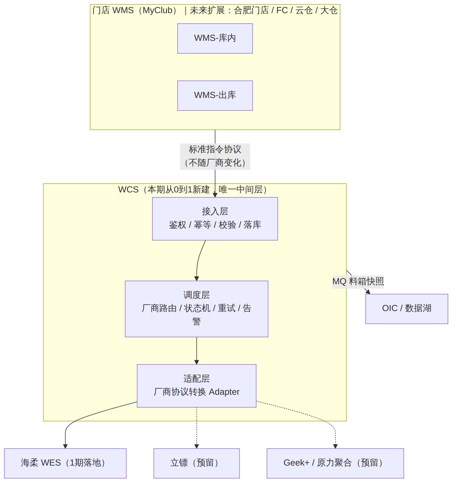
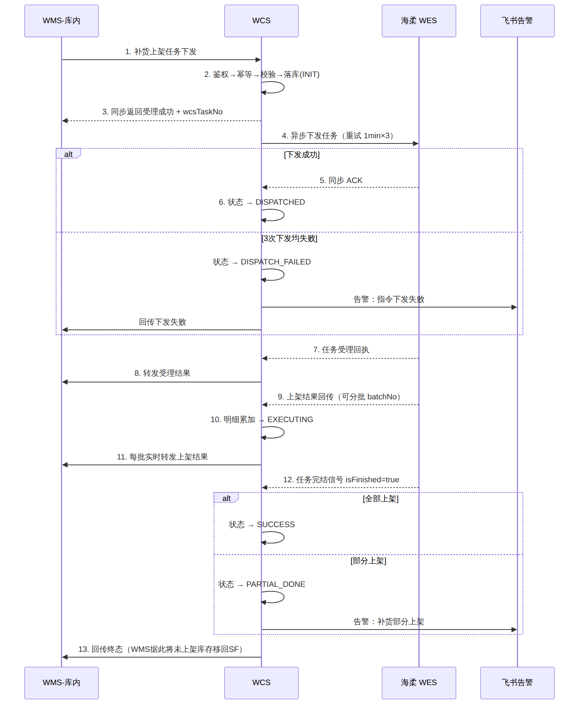
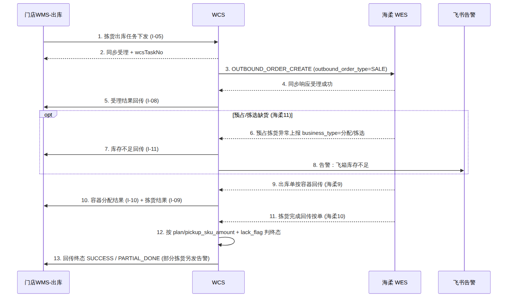
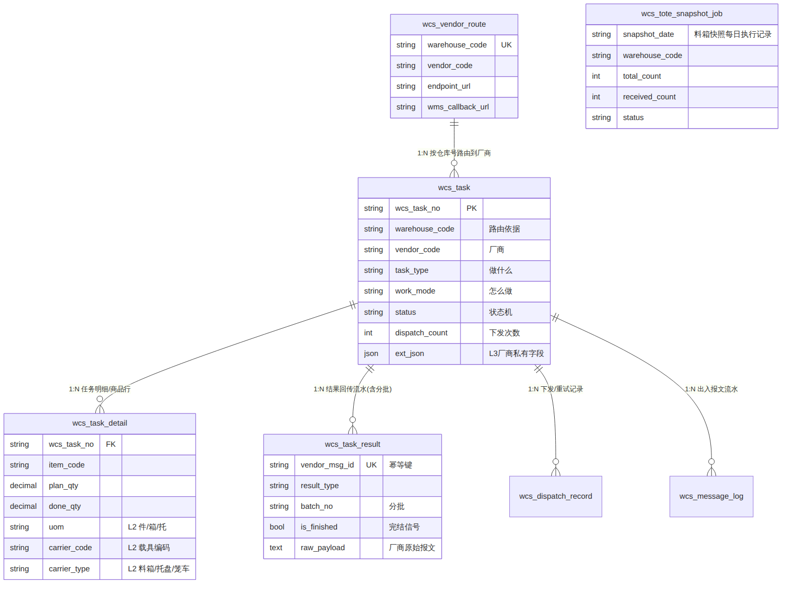
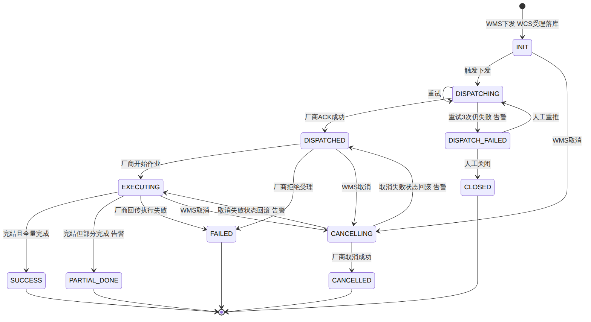
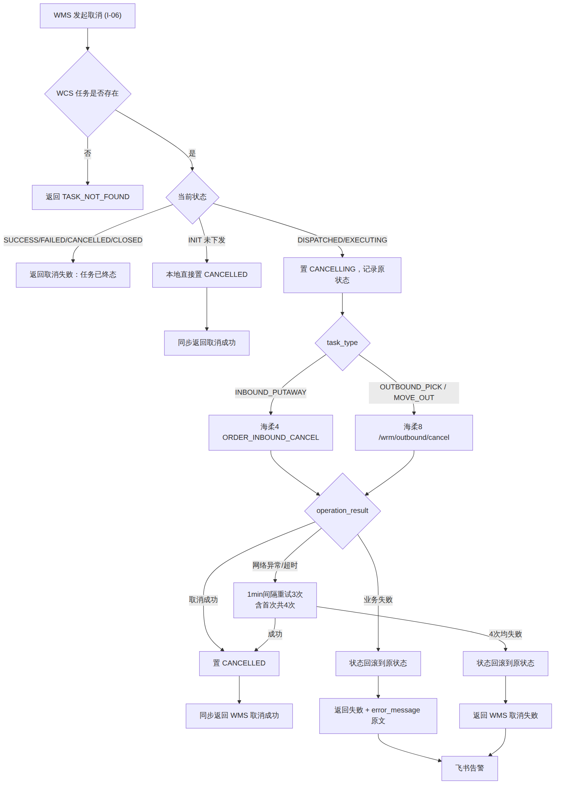

# 【子PRD】台州海柔飞箱项目 — WCS 系统（飞书版）

> **📌 关于本文件**
> 本文件是《【子PRD】台州海柔飞箱项目 — WCS 系统》的**飞书导入版**，正文内容与标准 Markdown 版完全一致。
> 差异仅在图示：飞书导入不渲染 mermaid，因此每张图**同时给出图片引用与等价表格**，两种导入方式都不丢内容。
> **推荐导入方式**：飞书云文档 →「导入文档」→ 上传 `WCS子PRD_台州海柔飞箱项目.docx`，6 张图与全部排版都会带入。
> **粘贴 Markdown 时**：图片链接不会自动解析，请从 `docs/wcs/images/` 手动插图，表格已可直接替代阅读。

> 适用范围：本文为主 PRD《【项目】【P0】台州海柔飞箱项目》(v1.1) 下 **WCS 模块**的子需求文档，用于与研发、测试同学评审。
> WMS-库内、WMS-出库、OIC/数据湖 的模块需求详见各自子 PRD，本文仅在交互边界处引用。

---

## 0. 文档信息

| 项 | 内容 |
|---|---|
| 文档名称 | 【子PRD】台州海柔飞箱项目 — WCS 系统（飞书版） |
| 版本号 | v1.4 |
| 创建日期 | 2026-08-08 |
| 产品负责人 | Stone JIANG |
| 主 PRD | 《【项目】【P0】台州海柔飞箱项目》v1.1（Jasmine） |
| 关联子 PRD | WMS-库内（Jasmine Xu）、WMS-出库（Eric Sun）、OIC-数据湖（Shawn Wang） |
| 评审对象 | WCS 研发、WMS 研发、测试、海柔（对接联调） |
| 期望评审时间 | 2026-08-12 |
| 期望提测时间 | 2026-09-22 |
| 期望上线时间 | 2026-10-12 |

### 变更日志

| 时间 | 版本 | 变更人 | 主要变更内容 |
|---|---|---|---|
| 2026-08-08 | v1.4 | Stone JIANG | 全文彻底移除中间层的旧称谓，只保留「门店 WMS → WCS → 海柔 WES」一种表述；§7.7-R13 升级为阻塞项：**海柔接口文档需同步更新**（中间层统一为 WCS、流向统一写法、中间层接口地址列由 WCS 回填） |
| 2026-08-08 | v1.3 | Stone JIANG | **统一系统链路口径**：全文明确为「门店 WMS → WCS → 海柔 WES」三段式，WCS 为本项目新建的唯一中间层（名词解释、架构图、时序图、接口章节、协议信封命名全部更正） |
| 2026-08-08 | v1.2 | Stone JIANG | **按《台州飞箱（WCS-海柔接口）》接口清单逐字段核对并重写 §7**：15 个接口对齐、字段映射表补全、新增 §7.7 核对发现的 12 项对接问题；同步修正移出任务复用出库单、无独立受理回执、容器信息随结果回传、库存查询必须分页、模型新增 owner_code |
| 2026-08-08 | v1.1 | Stone JIANG | 第三轮确认：①指令模型定稿并新增三厂商建模推演（§4.5）②快照时间统一 07:00 ③重试口径定为首次+3 次共 4 次 ④运维后台纳入 1 期 P0、超时改人工兜底 ⑤WMS 按 WCS 标准契约实现回传接口 ⑥载具/单位字段泛化 |
| 2026-08-08 | v1.0 | Stone JIANG | 首次创建，基于主 PRD v1.1 + 两轮需求澄清 |

---

## 1. 名词解释

| 缩写 | 全称 / 含义 |
|---|---|
| **WCS** | Warehouse Control System，仓储控制系统。本项目新建，作为 WMS 与各自动化设备厂商之间的**统一调度与对接层** |
| **WMS** | Warehouse Management System，**门店**仓储管理系统（MyClub 库内 / 出库），本项目的上游 |
| **WES** | Warehouse Execution System，厂商侧执行系统。本期指**海柔 WES**，是本项目的下游终点 |
| **飞箱 / FX** | 门店内的自动化料箱存储拣选设备及其储区 |
| **SF** | Store Floor，门店卖场储区（飞箱的上游/下游储区） |
| **OIC** | 库存中心，负责库存流水与账务 |
| **料箱 / Tote** | 飞箱设备内的存储容器 |
| **容器 / Container** | 出库作业使用的周转箱、笼车等承接容器 |
| **供应商 / 厂商** | 自动化设备提供方：立镖、海柔、Geek+、原力聚合等 |
| **指令 / 任务（Task）** | WCS 内的标准作业指令实体，是 WCS 的核心领域对象 |

> **系统链路口径（全文统一）**：本项目的交互链路是 **门店 WMS → WCS → 海柔 WES**，共三段、三个系统。
> **WCS 是本项目从 0 到 1 新建的系统，也是链路中唯一的中间层**——门店 WMS 只对接 WCS，海柔 WES 也只对接 WCS，不存在第四个系统。
> 海柔现有接口文档对中间层的称谓与此不一致，**需同步更新**，见 §7.7-R13。

---

## 2. 项目背景与 WCS 定位

### 2.1 背景

1. **供应商替换**：合肥飞箱项目供应商为【立镖】，台州新店引入新供应商【海柔】，需完成新供应商对接落地。
2. **WCS 标准化对接模型搭建**：原【门店 WMS → 飞箱】的直连对接模式改为 **【门店 WMS → WCS → 海柔 WES】**，由 WCS 统一对外输出，门店 WMS 只对接内部系统。

### 2.2 WCS 系统定位

WCS 在本期从 0 到 1 搭建，定位为 **"设备无关的作业指令调度与协议适配中台"**：



*图：WCS 系统上下文与分层结构（飞书粘贴 Markdown 时请手动插图，内容等价于下表）*

**WCS 分层结构（自上而下）：**

| 层级 | 参与方 / 组件 | 职责 |
|---|---|---|
| 上游 | **门店 WMS（MyClub 库内 / 出库）**；未来扩展合肥门店 / FC / 云仓 / 大仓 | 发起作业指令，只对接 WCS 标准指令协议（协议不随厂商变化） |
| WCS-接入层 | WCS | 鉴权、幂等校验、参数校验、指令落库 |
| WCS-调度层 | WCS | 厂商路由、状态机、重试、告警 |
| WCS-适配层 | WCS | 厂商协议转换 Adapter（海柔 / 立镖 / Geek+ / 原力聚合） |

> 链路只有三段：**门店 WMS → WCS → 海柔 WES**。WCS 是本项目新建的系统，也是链路中唯一的中间层。
| 下游-设备 | **海柔 WES（1 期落地）**；立镖、Geek+、原力聚合（预留） | 执行实际作业并回传结果 |
| 下游-数据 | OIC / 数据湖 | 通过 MQ 接收料箱库存快照 |


**三条设计红线（贯穿全文）：**

| # | 原则 | 含义 |
|---|---|---|
| R1 | **对内契约标准化** | WMS 只认 WCS 的标准指令协议。换厂商、加厂商，WMS 侧代码零改动 |
| R2 | **对外适配可插拔** | 每个厂商一个 Adapter 实现，新增厂商 = 新增一个 Adapter，不改主流程 |
| R3 | **全链路可追溯** | 所有指令落模型；所有出入报文落流水；一个 traceId 串起 WMS→WCS→厂商全链路 |

### 2.3 本期（1 期）范围

| # | 需求点 | 说明 | 优先级 |
|---|---|---|---|
| W1 | 上机商品主数据推送（透传） | WMS → WCS → 海柔，同步实时转发，WCS 不落库 | P0 |
| W2 | 飞箱实时库存查询（透传） | WMS → WCS → 海柔，同步实时转发，WCS 不落库 | P0 |
| W3 | 补货上架任务下发与结果回传 | 含受理回执、部分上架、库存不足 | P0 |
| W4 | 补货任务取消 | 以厂商取消结果为准，结果必达 WMS | P0 |
| W5 | 移出（下架移库）任务下发与结果回传 | FX → SF | P0 |
| W6 | 拣货出库任务下发与结果回传 | 含容器分配结果回传 | P0 |
| W7 | 库存不足回传 | 出库前库存不足，分批回传 + 告警 | P0 |
| W8 | 料箱库存快照同步数据湖 | 海柔 → WCS → MQ → 数据湖，每日一次 | P0 |
| W9 | 厂商路由（调度策略） | 按仓库号决定调用哪个厂商 | P0 |
| W10 | 重试与飞书告警 | 1 分钟间隔重试 3 次（含首次共 4 次调用），失败告警 | P0 |
| W12 | 周转容器状态查询（透传） | 海柔接口 12，纯透传，开发成本低，建议 1 期一并做 | P1 |
| W13 | 商品容器规格装箱件数回传（透传） | 海柔接口 13，纯透传给 WMS | P1 |
| W11 | WCS 运维后台（任务查询 / 人工重推 / 人工关闭） | **已确认纳入 1 期**。1 期不做系统级超时兜底，改由人工兜底，因此后台必须能查任务、能人工重推。见 §9 | P0 |

### 2.4 本期不做（Out of Scope）

| # | 不做项 | 说明 |
|---|---|---|
| N1 | **系统级超时兜底** | 厂商长时间未回传结果时的**自动**超时告警 / 自动置异常，**1 期不做**（已确认）。改为**人工兜底**：运维后台提供任务查询与人工重推（§9，1 期 P0），监控看板展示各状态停留时长供人工巡检 |
| N2 | 立镖接入 WCS | 立镖仍走 WMS 历史直连链路，灰度由 WMS 判断 |
| N3 | 账号管理 / 账号鉴权对接 | 飞箱侧自定义作业账号，1 期 WCS 不做账号体系对接（作业人字段是否透传见 §12 待确认 Q9） |
| N4 | 标准件数回传-查询 | 主 PRD 标记 P1 |
| N7 | 商品信息拉取（海柔接口 2） | 海柔标 P2 待定，且接口清单明细页为空白，1 期不做 |
| N8 | 盘点、调整单、补货通知、关闭回传、库存对账等 10 个接口 | 接口清单已明确「店后仓不使用」，1 期不实现 |
| N5 | 移出任务取消、拣货任务取消 | 主 PRD 明确"飞箱移出上架任务不支持操作取消"，1 期 WCS 直接拒绝（见 §12 Q3/Q4） |
| N6 | WCS 侧库存账本 | WCS 不持有库存，库存以 OIC/WMS 为准，WCS 只做转发与快照搬运 |

---

## 3. 系统交互总览

### 3.1 端到端业务链路

> 全部链路均为 **门店 WMS → WCS → 海柔 WES** 三段式，WCS 是唯一的中间层。

| 业务场景 | 链路 | 同步/异步 |
|---|---|---|
| 上机商品推送 | WMS → WCS → 海柔 → WCS → WMS | 全同步（透传） |
| 飞箱库存查询 | WMS → WCS → 海柔 → WCS → WMS | 全同步（透传） |
| 补货上架 | WMS → WCS → 海柔（下发，**同步返回受理结果**）；海柔 → WCS → WMS（结果） | 下发同步，结果异步 |
| 补货取消 | WMS → WCS → 海柔（取消）；结果同步返回 + 异步补偿 | 见 §6.4 |
| 移出下架 | WMS → WCS → 海柔（**复用出库单接口，`outbound_order_type=MOVE`**）；海柔 → WCS → WMS（结果） | 下发同步，结果异步 |
| 拣货出库 | WMS → WCS → 海柔（`outbound_order_type=SALE`）；海柔 → WCS → WMS（结果 / 容器 / 缺货） | 下发同步，结果异步 |
| 料箱快照 | 海柔 → WCS → MQ → 数据湖 | 异步，每日一次（07:00） |

### 3.2 主流程时序（补货上架，含部分上架）



*图：补货上架主流程时序（含部分上架）（飞书粘贴 Markdown 时请手动插图，内容等价于下表）*

**补货上架端到端步骤：**

| 步骤 | 发起方 → 接收方 | 动作 | 说明 |
|---|---|---|---|
| 1 | 门店 WMS-库内 → WCS | 补货上架任务下发 | 接口 I-03 |
| 2 | WCS | 鉴权 → 幂等校验 → 参数校验 → 落库 | 状态置 `INIT` |
| 3 | WCS → 门店 WMS-库内 | 同步返回受理成功 + `wcsTaskNo` | 不等待厂商 |
| 4 | WCS → 海柔 WES | 异步下发 `ORDER_INBOUND_CREATE`，`type=4`（补货入库单） | 失败按 1min 间隔重试 3 次（含首次共 4 次调用） |
| 4a | 分支：同步响应成功 | 状态置 `DISPATCHED` | **海柔无独立异步受理回执，以同步响应为准** |
| 4b | 分支：4 次调用均失败 | 状态置 `DISPATCH_FAILED` → 飞书告警 → 回传 WMS | 支持后台人工重推 |
| 5 | WCS → 门店 WMS-库内 | 受理结果回传 | 接口 I-08 |
| 6 | 海柔 WES → WCS | 上架按箱回传（海柔 5，**P2**） | 中间批次；若 1 期不实现则无过程回传，见 §7.7-R3 |
| 7 | WCS | 按 `idempotentCode` 幂等 → 明细累加 → 状态置 `EXECUTING` | 主表此时不置终态 |
| 8 | WCS → 门店 WMS-库内 | 每批实时转发 | 接口 I-09，不做合并等待 |
| 9 | 海柔 WES → WCS | 上架按单回传（海柔 6，P0） | **整单完结信号** |
| 10 | WCS | 按 `plan_sku_amount` 与 `sku_amount` 判定终态 | 全量 → `SUCCESS`；部分 → `PARTIAL_DONE` + **飞书告警**；零完成 → `FAILED` |
| 11 | WCS → 门店 WMS-库内 | 回传任务终态 | WMS 据此将未上架库存移回 SF |


### 3.3 主流程时序（拣货出库，含容器分配与库存不足）



*图：拣货出库主流程时序（含容器信息与库存不足）（飞书粘贴 Markdown 时请手动插图，内容等价于下表）*

**拣货出库端到端步骤：**

| 步骤 | 发起方 → 接收方 | 动作 | 说明 |
|---|---|---|---|
| 1 | 门店 WMS-出库 → WCS | 拣货出库任务下发 | 接口 I-05 |
| 2 | WCS → 门店 WMS-出库 | 同步受理 + `wcsTaskNo` | |
| 3 | WCS → 海柔 WES | `OUTBOUND_ORDER_CREATE`，`outbound_order_type=SALE` | 移出任务同接口，传 `MOVE` |
| 4 | 海柔 WES → WCS | **同步响应**受理成功 | 无独立异步回执 |
| 5 | WCS → 门店 WMS-出库 | 受理结果回传 | 接口 I-08 |
| 6 | 海柔 WES → WCS | （可选）预占拣货异常上报（海柔 11） | 带 `business_type`：分配 / 拣选 |
| 7 | WCS → 门店 WMS-出库 | 库存不足回传 | 接口 I-11 |
| 8 | WCS → 飞书 | **告警：飞箱库存不足**（含少货环节） | 5 分钟聚合 |
| 9 | 海柔 WES → WCS | 出库单按容器回传（海柔 9，P0） | 含 `order_box_no`、`container_status` |
| 10 | WCS → 门店 WMS-出库 | 容器分配结果（I-10）+ 拣货结果（I-09） | **容器信息随结果回传，无独立接口** |
| 11 | 海柔 WES → WCS | 拣货完成回传按单（海柔 10，P0） | 含 `container_list`、`lack_flag` |
| 12 | WCS | 按 `plan_sku_amount` / `pickup_sku_amount` + `lack_flag` 判终态 | `lack_flag` 为真强制判 `PARTIAL_DONE` |
| 13 | WCS → 门店 WMS-出库 | 回传终态 `SUCCESS` / `PARTIAL_DONE`（部分拣货另发飞书告警） | |


---

## 4. 【已定稿】标准指令模型设计

> **本节已定稿，不再做方案比选。** 结论：采用 **统一任务主表 + 明细表 + 泛化列 + 扩展列 + 独立流水表** 的标准指令模型。
> 产品侧的核心诉求是标准化——未来能平滑扩展到立镖、Geek+、原力聚合，并覆盖 FC / 云仓 / 大仓 的自动化设备，"料箱到人""四向车"等不同作业形态的库内指令必须是**通用且标准**的。
> §4.5 用**海柔闪拣、立镖飞箱、原力聚合四向车**三个真实场景做建模推演，验证该模型确实通用。

### 4.1 模型定稿

标准指令模型由 6 张表构成（字段详见 §5.3）：

| 表 | 定位 | 说明 |
|---|---|---|
| `wcs_task` | 任务主表 | **所有厂商、所有作业类型共用一张**，靠三组正交枚举区分 |
| `wcs_task_detail` | 任务明细表 | 商品行 / 载具行 |
| `wcs_task_result` | 结果回传流水表 | 支持分批回传与幂等 |
| `wcs_dispatch_record` | 下发 / 重试记录表 | |
| `wcs_message_log` | 出入报文流水表 | WMS 与厂商原始报文，问题排查依据 |
| `wcs_vendor_route` | 仓库 → 厂商 路由配置表 | 新增仓店无需发版 |

**差异化字段的三级承载策略**——这是模型能"通用"的关键：

| 层级 | 承载位置 | 判定标准 | 例子 |
|---|---|---|---|
| **L1 共性字段** | 主表 / 明细表**固定列** | 全厂商、全作业类型都有 | 任务号、仓库号、任务类型、状态、计划量、完成量、时间戳 |
| **L2 半共性字段** | 明细表**泛化列** | 语义相同、取值域不同 | `carrier_code` / `carrier_type`（料箱 / 托盘 / 笼车）、`uom`（件 / 箱 / 托） |
| **L3 厂商私有字段** | `ext_json` | 只有某厂商或某设备形态才有 | 巷道号、层号、四向车编号、播种墙位、波次号 |

> **判定口径（研发落地时按此执行）**：一个字段是否配进固定列，看它在"厂商 × 作业类型"矩阵里的覆盖率——覆盖 ≥2 个厂商且 ≥2 类作业才进固定列，否则进 `ext_json`。避免主表被单一厂商的私有字段撑成宽表。

**代码层双维度策略模式**（物理一张表，逻辑充分隔离）：

```
TaskService（统一编排：鉴权 → 校验 → 幂等 → 落库 → 路由 → 状态机 → 重试 → 回传 → 告警）
   ├── TaskTypeHandler   按 task_type 分发：上架 / 拣选 / 移出 /（未来）移位、盘点、呼叫载具
   └── VendorAdapter     按 vendor_code 分发：HAIROU / LIBIAO / GEEKPLUS / YUANLI
          ├── toVendorRequest    WCS 标准模型 → 厂商报文
          └── fromVendorResponse 厂商报文 → WCS 标准模型（含枚举归一、分批归一）
```

横切能力（状态机、重试、幂等、告警、报文留存、路由）**只实现一套**，被所有厂商与作业类型复用。

> **需研发确认**：`ext_json` 使用 MySQL `JSON` 类型还是 `TEXT` 存 JSON 字符串（涉及是否需要对 ext 内字段建函数索引）。产品侧无偏好，按团队现有规范即可。

### 4.2 已排除的两个方案

以下两种建模方式在方案讨论中已明确排除，不再纳入评审：

| 已排除方案 | 排除理由 |
|---|---|
| **按厂商分表**（`wcs_hairou_task` / `wcs_libiao_task` / …） | 换厂商 = 换数据模型，与本项目"WCS 标准化对接模型搭建"的立项目标正面冲突；状态机、重试、告警、报文留存、路由这 5 套横切能力要按厂商复制 M 份 |
| **按业务类型分表**（`wcs_replenish_task` / `wcs_pick_task` / …） | 每新增一类作业（盘点、库内移位、呼叫载具）都要新建全套表 + CRUD + 状态机；与厂商维度叠加后是 N 类型 × M 厂商 的组合爆炸 |

> 两者的共同问题：把"扩展"从**加一行枚举**变成了**加一张表**，与标准化诉求相反。

### 4.3 数据量测算（验证单表可承载）

| 项 | 测算 |
|---|---|
| 出库处理能力（主 PRD 目标） | 600 箱/小时 |
| 夜间作业时长 | 按 12h 计 → **7,200 箱/天/仓** |
| 主表 : 明细 比例 | 约 1:5 → 主表 ≈ 1,500 条/天/仓，明细 ≈ 7,200 条/天/仓 |
| 叠加补货 + 移出（2 倍冗余） | 主表 ≈ **3,000 条/天/仓** |
| 单仓年增量 | 主表 ≈ **110 万行/年**，明细 ≈ **530 万行/年** |
| 规划接入 10 个仓店 | 主表 ≈ **1,100 万行/年**，明细 ≈ **5,300 万行/年** |
| 报文流水表 | ≈ 主表的 6～8 倍，**单独建表 + 90 天保留期 + 按月分区** |

**结论**：主表年增量千万级，MySQL 单表配合 `warehouse_code + status + create_time` 组合索引 + 按月归档冷数据**完全可承载**，数据量不构成分表理由。

### 4.4 标准化三组正交枚举

**① 任务类型 `task_type`（做什么）**

| 枚举值 | 含义 | 1 期 |
|---|---|---|
| `INBOUND_PUTAWAY` | 入库上架（补货入飞箱、整托入库上架） | ✅ |
| `OUTBOUND_PICK` | 出库拣选（拣货出库） | ✅ |
| `MOVE_OUT` | 移出下架（飞箱 → SF） | ✅ |
| `INNER_MOVE` | 库内移位（库内换位、并箱、整理） | 预留 |
| `STOCK_TAKE` | 盘点 | 预留 |
| `CONTAINER_CALL` | 呼叫载具（呼叫料箱/托盘到工作站或出库口） | 预留 |

**② 作业形态 `work_mode`（怎么做）**

| 枚举值 | 含义 | 1 期 |
|---|---|---|
| `TOTE_TO_PERSON` | 料箱到人 | ✅（海柔闪拣、立镖飞箱） |
| `FOUR_WAY_SHUTTLE` | 四向穿梭车 | 预留（原力聚合） |
| `PALLET_TO_PERSON` | 托盘到人 | 预留 |
| `AMR` | 移动机器人 | 预留 |

**③ 厂商 `vendor_code`（谁来做）**

| 枚举值 | 含义 | 1 期 |
|---|---|---|
| `HAIROU` | 海柔 | ✅ |
| `LIBIAO` | 立镖 | 预留（当前走 WMS 直连历史链路） |
| `GEEKPLUS` | Geek+ | 预留 |
| `YUANLI` | 原力聚合 | 预留 |

> 三组枚举**正交**：加一个厂商只动 ③，加一种设备形态只动 ②，加一类作业只动 ①，互不影响。

### 4.5 多厂商 / 多设备建模推演

**推演方法**：把每个场景的真实业务要素，逐一落到标准指令模型的字段上，统计"表结构要改多少"。

#### 推演一：海柔闪拣（料箱到人）— 台州门店补货上架【1 期落地】

| 业务要素 | 落位字段 | 层级 |
|---|---|---|
| WMS 补货上架单号 | `wcs_task.source_task_no` | L1 |
| 台州门店号 | `wcs_task.warehouse_code`（同时是路由依据） | L1 |
| 作业内容：从暂存区上架到飞箱 | `task_type=INBOUND_PUTAWAY`，`from_location=STAGING`，`to_location=FX` | L1 |
| 设备形态：料箱到人 | `work_mode=TOTE_TO_PERSON` | L1 |
| 厂商：海柔 | `vendor_code=HAIROU` | L1 |
| 商品行、计划件数 | `wcs_task_detail.item_code` / `plan_qty` / `uom=EA` | L1/L2 |
| 上架落入的料箱 | `wcs_task_detail.carrier_code`，`carrier_type=TOTE` | L2 |
| 分批上架的批次 | `wcs_task_result.batch_no` + `vendor_msg_id` | L1 |
| 海柔工作站号、波次号 | `ext_json`：`{"stationNo":"WS-03","waveNo":"W2026101201"}` | L3 |

> **表结构变更：0**。这是 1 期实际落地的形态。

#### 推演二：立镖飞箱（料箱到人）— 合肥门店拣货出库【存量，未来收编进 WCS】

立镖当前走 WMS 直连历史链路。假设未来收编进 WCS：

| 业务要素 | 落位字段 | 与海柔的差异处理 |
|---|---|---|
| 合肥门店号 | `warehouse_code` → 路由表命中 `LIBIAO` | 只加一行路由配置 |
| 厂商：立镖 | `vendor_code=LIBIAO` | 只加一个枚举值 |
| 作业内容：飞箱拣货出库 | `task_type=OUTBOUND_PICK`，`work_mode=TOTE_TO_PERSON` | 与海柔完全相同 |
| 立镖自有任务号规则 | `wcs_task.vendor_task_no` | 泛化列已覆盖，无需新字段 |
| **立镖若不支持分批回传**（整单一次性回传） | Adapter 在 `fromVendorResponse` 里把整单结果包装成"单批 + `isFinished=true`" | **归一在 Adapter，主流程无感** |
| **立镖若无容器分配环节** | `container_code` 留空，I-10 接口不触发 | 可选字段，不影响 |
| 立镖播种墙位、格口号 | `ext_json`：`{"wallCode":"A","slotNo":"12"}` | L3 |

> **表结构变更：0；新增枚举：1 个厂商；新增 Adapter：1 个。**
> 关键点在于：**厂商能力差异（分不分批、有没有容器分配）由 Adapter 归一，不污染主流程和数据模型。**

#### 推演三：原力聚合四向车 — 云仓/大仓整托入库、库内移位、呼叫载具【未来】

这是差异最大的场景（不同设备形态 + 不同作业单位 + 不同作业类型），因此是模型通用性的**压力测试**：

| 业务要素 | 落位字段 | 是否需要改表 |
|---|---|---|
| 云仓 / 大仓仓库号 | `warehouse_code` → 路由命中 `YUANLI` | 否 |
| 设备形态：四向穿梭车 | `work_mode=FOUR_WAY_SHUTTLE` | 否，加枚举 |
| 作业类型：整托入库上架 | `task_type=INBOUND_PUTAWAY` | 否，复用现有枚举 |
| 作业类型：库内移位（换位/并托） | `task_type=INNER_MOVE` | 否，启用预留枚举 |
| 作业类型：呼叫托盘到出库口 | `task_type=CONTAINER_CALL` | 否，启用预留枚举 |
| **作业单位是托盘，不是料箱** | `carrier_type=PALLET`，`carrier_code=` 托盘码 | **否——因泛化列已按"载具"设计** |
| **数量单位是托，不是件** | `wcs_task_detail.uom=PL` | **否——因明细已带单位字段** |
| 库位：巷道-排-列-层 | 标准库位码入 `from_location`/`to_location`；细坐标入 `ext_json`：`{"aisle":"03","row":"12","col":"04","layer":"05"}` | 否 |
| 提升机号、四向车编号 | `ext_json`：`{"liftNo":"L2","shuttleNo":"S17"}` | 否 |
| 状态流转（下发→受理→执行→完成/失败/取消） | 完全复用 §5.2 状态机 | 否 |
| 四向车整任务回传、不分批 | Adapter 归一为单批 + `isFinished=true` | 否 |

> **表结构变更：0；新增枚举：1 个厂商 + 1 个作业形态 +（启用）2 个任务类型；新增 Adapter：1 个。**

#### 推演结论

| 场景 | 厂商 | 作业形态 | 任务类型 | **表结构变更** | 新增枚举 | 新增 Adapter |
|---|---|---|---|---|---|---|
| 海柔闪拣 · 门店补货上架 | `HAIROU` | `TOTE_TO_PERSON` | `INBOUND_PUTAWAY` | **0** | 0（1 期基线） | 1（1 期已建） |
| 立镖飞箱 · 门店拣货出库 | `LIBIAO` | `TOTE_TO_PERSON` | `OUTBOUND_PICK` | **0** | +1 厂商 | 1 |
| 原力聚合四向车 · 云仓整托移位 | `YUANLI` | `FOUR_WAY_SHUTTLE` | `INNER_MOVE` / `CONTAINER_CALL` | **0** | +1 厂商 +1 形态 +2 类型 | 1 |

**结论**：三个场景下表结构**零变更**，扩展成本恒定为"加枚举 + 加一个 Adapter"，不随厂商数或作业类型数增长。标准化目标成立。

**推演暴露并已修正的两处模型设计**（已回写到 §5.3.2，评审时请重点确认）：

| # | 问题 | 修正 |
|---|---|---|
| 1 | 原设计明细行叫 `tote_code`（料箱码），四向车场景作业对象是托盘，语义不成立 | 泛化为 **`carrier_code`（载具编码）+ `carrier_type`（`TOTE` 料箱 / `PALLET` 托盘 / `CAGE` 笼车 / `BIN` 周转箱）** |
| 2 | 原设计明细行数量没有单位，1 期全是"件"，四向车场景是"托" | 明细增加 **`uom`（`EA` 件 / `CS` 箱 / `PL` 托）**，1 期固定传 `EA` |

> 这两处若不在 1 期就位，未来接入四向车时就是**破坏性表变更 + 存量数据刷数**，成本远高于现在多加两列。

---

## 5. 领域模型与状态机

### 5.1 实体关系



*图：WCS 领域模型实体关系图（飞书粘贴 Markdown 时请手动插图，内容等价于下表）*

**实体关系（等价于 ER 图）：**

| 主实体 | 关系 | 从实体 | 说明 |
|---|---|---|---|
| `wcs_task` 任务主表 | 1 : N | `wcs_task_detail` | 任务明细 / 商品行 |
| `wcs_task` | 1 : N | `wcs_task_result` | 结果回传流水（含分批，按海柔 `idempotentCode` 幂等） |
| `wcs_task` | 1 : N | `wcs_dispatch_record` | 下发 / 重试记录 |
| `wcs_task` | 1 : N | `wcs_message_log` | 出入报文流水（WMS 与厂商原始报文） |
| `wcs_vendor_route` 路由配置 | 1 : N | `wcs_task` | 按 `warehouse_code` 路由到厂商 |
| `wcs_tote_snapshot_job` | 独立 | — | 料箱快照每日执行记录 |


### 5.2 状态机

#### 5.2.1 状态定义

| 状态码 | 中文 | 类型 | 说明 |
|---|---|---|---|
| `INIT` | 待下发 | 中间态 | WCS 已受理并落库，尚未下发厂商 |
| `DISPATCHING` | 下发中 | 中间态 | 正在调用厂商接口（含重试窗口内） |
| `DISPATCH_FAILED` | 下发失败 | **可恢复终态** | 共 4 次调用（首次 + 重试 3 次）仍失败，已告警，支持人工重推 |
| `DISPATCHED` | 已下发 | 中间态 | 厂商**同步响应**受理成功（海柔无独立异步回执接口） |
| `EXECUTING` | 执行中 | 中间态 | 厂商已开始作业 / 已有部分结果回传 |
| `PARTIAL_DONE` | 部分完成 | **终态** | 厂商已完结但未全量完成（部分上架 / 部分拣货） |
| `SUCCESS` | 已完成 | 终态 | 全量完成 |
| `FAILED` | 已失败 | 终态 | 厂商回传执行失败 / 拒绝受理 |
| `CANCELLING` | 取消中 | 中间态 | 已向厂商发起取消，等待厂商结果 |
| `CANCELLED` | 已取消 | 终态 | 厂商确认取消成功 |
| `CLOSED` | 已关闭 | 终态 | 人工/系统兜底关闭，不再接受任何回传 |

**主表关键辅助字段**：`dispatch_count`（下发次数）、`last_dispatch_time`（最后下发时间）、`fail_code` / `fail_reason`（失败码与原因）、`finish_time`（终态时间）。

#### 5.2.2 状态流转图



*图：任务状态流转图（飞书粘贴 Markdown 时请手动插图，内容等价于下表）*

**状态转移表（等价于状态机图，评审以本表为准）：**

| # | 当前状态 | 触发事件 | 目标状态 | 附加动作 |
|---|---|---|---|---|
| 1 | （新建） | WMS 下发，WCS 受理落库 | `INIT` | 同步返回 `wcsTaskNo` |
| 2 | `INIT` | 触发下发 | `DISPATCHING` | `dispatch_count+1` |
| 3 | `INIT` | WMS 发起取消 | `CANCELLING` → `CANCELLED` | 未下发厂商，本地直接取消 |
| 4 | `DISPATCHING` | 厂商**同步响应**受理成功（海柔无独立异步回执） | `DISPATCHED` | 回填 `vendor_task_no` |
| 5 | `DISPATCHING` | 下发失败（网络 / 5xx / 系统错） | `DISPATCHING` | 间隔 1 分钟重试，最多重试 3 次 |
| 6 | `DISPATCHING` | **共 4 次调用（首次 + 重试 3 次）仍失败** | `DISPATCH_FAILED` | **飞书告警** + 回传 WMS |
| 7 | `DISPATCH_FAILED` | 运维后台人工重推 | `DISPATCHING` | 操作留痕 |
| 8 | `DISPATCH_FAILED` | 运维后台人工关闭 | `CLOSED` | 需填原因，操作留痕 |
| 9 | `DISPATCHED` | 厂商开始作业 / 首批结果回传 | `EXECUTING` | |
| 10 | `DISPATCHED` | 厂商拒绝受理 | `FAILED` | 回传 WMS 失败原因 |
| 11 | `DISPATCHED` / `EXECUTING` | WMS 发起取消 | `CANCELLING` | 记录取消前原状态 |
| 12 | `EXECUTING` | 收到完结信号且全量完成 | `SUCCESS` | 回传 WMS 终态 |
| 13 | `EXECUTING` | 收到完结信号但部分完成 | `PARTIAL_DONE` | **飞书告警** + 回传 WMS |
| 14 | `EXECUTING` | 厂商回传执行失败（零完成） | `FAILED` | 回传 WMS |
| 15 | `CANCELLING` | 厂商取消成功 | `CANCELLED` | 同步返回 WMS 成功 |
| 16 | `CANCELLING` | 厂商取消失败 / 调用 4 次仍失败 | **回滚至取消前原状态** | **飞书告警** + 返回失败原因 |
| 17 | 任意终态 | 收到厂商回传 | 状态不变 | 丢弃 + WARN 日志（规则 S2） |

> 终态：`SUCCESS`、`PARTIAL_DONE`、`FAILED`、`CANCELLED`、`CLOSED`；`DISPATCH_FAILED` 为可恢复终态。


#### 5.2.3 状态流转规则（研发/测试对齐用）

| # | 规则 | 说明 |
|---|---|---|
| S1 | **状态只进不退** | 除"取消失败回滚"外，不允许从终态回到中间态 |
| S2 | **终态幂等** | 任务已处于 `SUCCESS`/`FAILED`/`CANCELLED`/`CLOSED` 时，收到任何厂商回传**直接丢弃并记录 WARN 日志**，不报错、不改状态 |
| S3 | **PARTIAL_DONE 是终态，不是中间态** | 分批回传过程中主表保持 `EXECUTING`，仅明细累加；只有收到厂商"任务完结"信号才判定 `SUCCESS` 或 `PARTIAL_DONE` |
| S4 | **完成判定口径** | `SUM(明细.已完成数量) >= SUM(明细.计划数量)` → `SUCCESS`；`0 < SUM(已完成) < SUM(计划)` → `PARTIAL_DONE`；`SUM(已完成) = 0` → `FAILED` |
| S5 | **状态变更加乐观锁** | 更新语句带 `WHERE status = 前置状态`，`update rows = 0` 时不重试、记 WARN，防并发覆盖 |
| S6 | **CLOSED 仅人工触发** | 1 期无自动超时关闭（见 §2.4 N1），只能由运维后台人工关闭 |
| S7 | **每次状态变更写流水** | 记录到 `wcs_task` 变更日志 / `wcs_task_result`，便于排查 |

### 5.3 表结构设计

> 以下为产品视角的字段清单，**最终 DDL 以研发设计为准**。类型、长度、索引为建议值。

#### 5.3.1 `wcs_task` — 任务主表

| 字段 | 类型 | 必填 | 说明 |
|---|---|---|---|
| `id` | bigint | Y | 主键，自增 |
| `wcs_task_no` | varchar(40) | Y | WCS 任务号（全局唯一，WCS 生成，回传 WMS 与下发厂商均用它） |
| `source_system` | varchar(20) | Y | 来源系统：`WMS_INNER`(库内) / `WMS_OUTBOUND`(出库) |
| `source_task_no` | varchar(64) | Y | 来源单号（WMS 补货单号 / 出库单号 / 移库单号） |
| `source_biz_no` | varchar(64) | N | 上游业务单号（如 PFC 备货出库单号），用于排查 |
| `warehouse_code` | varchar(32) | Y | 仓库号 / 门店号，**厂商路由的唯一依据**（映射海柔 `warehouse_code`） |
| `owner_code` | varchar(32) | Y | **货主**。海柔全接口必填，由 WMS 下发时传入 |
| `vendor_code` | varchar(20) | Y | 厂商编码，路由结果 |
| `task_type` | varchar(32) | Y | 任务类型，见 §4.5 ① |
| `work_mode` | varchar(32) | Y | 作业形态，见 §4.5 ②，1 期固定 `TOTE_TO_PERSON` |
| `status` | varchar(20) | Y | 任务状态，见 §5.2.1 |
| `priority` | int | N | 优先级，默认 100，数值越小越优先（预留） |
| `plan_qty` | decimal(16,3) | Y | 计划总数量（明细汇总） |
| `done_qty` | decimal(16,3) | Y | 已完成总数量（明细汇总，回传时累加） |
| `from_location` | varchar(32) | N | 源储区（如 SF / 暂存区） |
| `to_location` | varchar(32) | N | 目标储区（如 FX / SF） |
| `container_code` | varchar(64) | N | 容器编码（拣货容器分配后回填） |
| `vendor_task_no` | varchar(64) | N | 厂商侧任务号（厂商 ACK 时回填） |
| `dispatch_count` | int | Y | 下发次数，默认 0 |
| `last_dispatch_time` | datetime | N | 最后一次下发时间 |
| `cancel_source` | varchar(20) | N | 取消发起方：`WMS` / `MANUAL` |
| `fail_code` | varchar(40) | N | 失败码 |
| `fail_reason` | varchar(500) | N | 失败原因（厂商原文，便于排查） |
| `operator` | varchar(64) | N | 厂商侧实际作业人（回传时回填，见 §12 Q9） |
| `operate_time` | datetime | N | 厂商侧实际作业时间（**非传输时间**） |
| `finish_time` | datetime | N | 终态时间 |
| `ext_json` | json / text | N | 厂商 / 作业形态差异字段扩展位 |
| `trace_id` | varchar(64) | Y | 全链路追踪 ID |
| `create_time` / `update_time` | datetime | Y | 创建 / 更新时间 |
| `create_by` / `update_by` | varchar(64) | N | 创建人 / 更新人 |

**索引建议**：
- `uk_wcs_task_no` (`wcs_task_no`) UNIQUE
- `uk_source` (`source_system`, `source_task_no`, `task_type`) UNIQUE ← **幂等键，见 §8.3**
- `idx_wh_status_time` (`warehouse_code`, `status`, `create_time`)
- `idx_vendor_task` (`vendor_code`, `vendor_task_no`)
- `idx_create_time` (`create_time`) ← 归档用

#### 5.3.2 `wcs_task_detail` — 任务明细表

| 字段 | 类型 | 必填 | 说明 |
|---|---|---|---|
| `id` | bigint | Y | 主键 |
| `wcs_task_no` | varchar(40) | Y | 关联主表 |
| `line_no` | int | Y | 行号（与 WMS 行号一一对应） |
| `item_code` | varchar(32) | Y | 商品号（item） |
| `upc` | varchar(64) | N | 商品条码（主条码） |
| `batch_no` | varchar(64) | N | 批次号（如涉及） |
| `expire_date` | date | N | 效期 |
| `plan_qty` | decimal(16,3) | Y | 计划数量 |
| `done_qty` | decimal(16,3) | Y | 已完成数量（分批累加） |
| `uom` | varchar(8) | Y | **数量单位**（L2 泛化列）：`EA` 件 / `CS` 箱 / `PL` 托。1 期固定 `EA` |
| `shortage_qty` | decimal(16,3) | N | 缺货数量（库存不足回传时写入） |
| `line_status` | varchar(20) | Y | 行状态：`INIT`/`PARTIAL`/`DONE`/`SHORTAGE`/`CANCELLED` |
| `carrier_code` | varchar(64) | N | **载具编码**（L2 泛化列，厂商回传）。1 期即料箱码 |
| `carrier_type` | varchar(16) | N | **载具类型**（L2 泛化列）：`TOTE` 料箱 / `PALLET` 托盘 / `CAGE` 笼车 / `BIN` 周转箱。1 期固定 `TOTE` |
| `container_code` | varchar(64) | N | 出库承接容器编码（厂商回传，与载具区分：载具是货所在的箱/托，容器是出库承接的周转箱/笼车） |
| `ext_json` | json / text | N | L3 厂商私有字段扩展位 |
| `create_time` / `update_time` | datetime | Y | |

> `carrier_code` / `carrier_type` / `uom` 三列来自 §4.5 的四向车推演。1 期取值固定（`TOTE` + `EA`），**但必须在 1 期就位**，否则未来接入四向车是破坏性表变更 + 存量刷数。

**索引**：`uk_task_line` (`wcs_task_no`, `line_no`) UNIQUE；`idx_item` (`item_code`)

#### 5.3.3 `wcs_task_result` — 结果回传流水表（支持分批）

| 字段 | 类型 | 必填 | 说明 |
|---|---|---|---|
| `id` | bigint | Y | 主键 |
| `wcs_task_no` | varchar(40) | Y | 关联主表 |
| `vendor_msg_id` | varchar(64) | Y | **厂商消息 ID，幂等键**。海柔场景取报文中的 `idempotentCode`（幂等号） |
| `result_type` | varchar(30) | Y | `ACCEPT`(受理) / `EXECUTE`(执行结果) / `SHORTAGE`(缺货) / `CONTAINER`(容器分配) / `CANCEL`(取消结果) / `FINISH`(完结) |
| `batch_no` | varchar(64) | N | 厂商批次号（分批回传时） |
| `is_finished` | tinyint | Y | 是否任务完结信号，0/1 |
| `result_code` | varchar(40) | N | 厂商结果码 |
| `result_msg` | varchar(500) | N | 厂商结果描述 |
| `raw_payload` | text | Y | **厂商原始报文（排查用）** |
| `vendor_trace_id` | varchar(64) | N | 厂商响应中的 `traceId`，跨系统排查用 |
| `forward_status` | varchar(20) | Y | 回传 WMS 状态：`PENDING`/`SUCCESS`/`FAILED` |
| `forward_count` | int | Y | 回传 WMS 次数 |
| `operate_time` | datetime | N | 厂商实际作业时间 |
| `create_time` | datetime | Y | |

**索引**：`uk_vendor_msg` (`vendor_code`, `vendor_msg_id`) UNIQUE ← 幂等；`idx_task_type` (`wcs_task_no`, `result_type`)；`idx_forward` (`forward_status`, `create_time`)

#### 5.3.4 `wcs_dispatch_record` — 下发/重试记录表

| 字段 | 类型 | 说明 |
|---|---|---|
| `id` | bigint | 主键 |
| `wcs_task_no` | varchar(40) | 关联主表 |
| `dispatch_seq` | int | 第几次下发（1/2/3） |
| `dispatch_type` | varchar(20) | `CREATE`(下发) / `CANCEL`(取消) |
| `result` | varchar(20) | `SUCCESS` / `FAILED` |
| `error_code` / `error_msg` | varchar | 失败码 / 失败原因 |
| `cost_ms` | int | 调用耗时（毫秒） |
| `create_time` | datetime | |

#### 5.3.5 `wcs_message_log` — 报文流水表

> **明确要求：WMS 原始报文与厂商原始报文都要落表，用于问题排查。**

| 字段 | 类型 | 说明 |
|---|---|---|
| `id` | bigint | 主键 |
| `trace_id` | varchar(64) | 全链路追踪 ID |
| `wcs_task_no` | varchar(40) | 关联任务（透传接口为空） |
| `direction` | varchar(20) | `WMS_IN`(WMS调WCS) / `VENDOR_OUT`(WCS调厂商) / `VENDOR_IN`(厂商调WCS) / `WMS_OUT`(WCS调WMS) / `MQ_OUT`(发数据湖) |
| `interface_code` | varchar(60) | 接口编码，见 §7.1 |
| `warehouse_code` | varchar(32) | 仓库号 |
| `vendor_code` | varchar(20) | 厂商编码 |
| `request_body` | mediumtext | 请求报文（**超过 64KB 截断并标记**） |
| `response_body` | mediumtext | 响应报文（同上） |
| `http_status` | int | HTTP 状态码 |
| `biz_code` | varchar(20) | 业务返回码 |
| `cost_ms` | int | 耗时（毫秒） |
| `success` | tinyint | 是否成功 |
| `create_time` | datetime | |

**索引**：`idx_trace` (`trace_id`)；`idx_task` (`wcs_task_no`)；`idx_iface_time` (`interface_code`, `create_time`)

**保留策略**：热数据保留 **90 天**，之后归档到冷库/对象存储；表按月分区。透传接口（商品推送、库存查询）**只写报文流水，不写任务表**。

#### 5.3.6 `wcs_vendor_route` — 厂商路由配置表

| 字段 | 类型 | 说明 |
|---|---|---|
| `id` | bigint | 主键 |
| `warehouse_code` | varchar(32) | 仓库号 / 门店号（UNIQUE） |
| `warehouse_name` | varchar(64) | 仓库名称 |
| `vendor_warehouse_id` | bigint | **厂商侧仓库 ID**（海柔信封必填的 `warehouseId`，Number 型），由本表配置映射 |
| `owner_code` | varchar(32) | 默认货主（WMS 未传时兜底） |
| `vendor_code` | varchar(20) | 厂商编码 |
| `work_mode` | varchar(32) | 作业形态 |
| `endpoint_url` | varchar(255) | 厂商服务地址 |
| `app_key` / `app_secret` | varchar | 调用厂商的凭证（**secret 加密存储**） |
| `wms_callback_url` | varchar(255) | 回传该仓 WMS 的回调地址（多仓多 WMS 场景，见 §12 Q8） |
| `enabled` | tinyint | 是否启用 |
| `timeout_ms` | int | 调用超时（毫秒），默认 5000 |
| `create_time` / `update_time` | datetime | |

> **说明**：路由配置放数据库表 + 本地缓存（5 分钟刷新），而非 Apollo 硬编码，便于运营侧自助新增仓店。

---

## 6. 功能需求详述

> 每个功能给出：业务描述 → 处理规则 → 异常场景 → 验收标准。字段级定义见 §7。

### 6.1 W1 上机商品主数据推送（透传）

**业务描述**：WMS 将"目标补货区在飞箱"的商品主数据推送给飞箱设备，用于料箱体积计算、预警与料箱推荐。

**链路**：`WMS → WCS → 海柔`，**同步实时转发**。

**处理规则**：

| # | 规则 |
|---|---|
| P1-1 | WCS **不落任务表、不做业务加工**，收到即按路由转发给对应厂商 |
| P1-2 | WCS 收到厂商同步响应后，**原样**转换为 WCS 标准响应返回 WMS |
| P1-3 | WCS **仍需落报文流水**（`wcs_message_log`，direction=`WMS_IN`/`VENDOR_OUT`），用于排查 |
| P1-4 | 透传字段：商品号、门店号、商品条码（可能多个）、商品名称、长、宽、高、重、Division、保质期天数、图片 |
| P1-5 | 商品条码规则由 **WMS 侧处理完成后传入**：除 21 开头自制品条码外，其他条码去除最后一位校验位，以整数格式交互。**WCS 不做条码解析** |
| P1-6 | 全量/增量由 WMS 决定，WCS 不感知（见 §12 Q10） |
| P1-7 | 调用厂商超时时间默认 **5s**（`wcs_vendor_route.timeout_ms` 可配） |

**异常场景**：

| 场景 | WCS 处理 |
|---|---|
| 仓库号未配置路由 | 同步返回 `WCS_ROUTE_NOT_FOUND`，不调厂商 |
| 厂商返回业务失败 | 原样透传失败码 + 失败原因给 WMS |
| 厂商超时 / 网络异常 | 同步返回 `WCS_VENDOR_TIMEOUT`，**透传接口不做异步重试**（由 WMS 决定是否重推），并记录报文流水 |

**验收标准**：
- ✅ WMS 推送 1 个商品，海柔侧收到完全一致的字段内容
- ✅ 同一 item 带多个条码时，条码列表完整透传，无截断
- ✅ WCS 任务表无新增数据；报文流水表有 2 条记录（WMS_IN + VENDOR_OUT）
- ✅ 厂商返回失败时，WMS 收到的失败原因与厂商原文一致

---

### 6.2 W2 飞箱实时库存查询（透传）

**业务描述**：WMS 库存对账页面查询飞箱区实时库存（灰度为海柔的门店走此接口）。

**链路**：`WMS → WCS → 海柔`，**同步实时转发**，WCS 不落业务库。

**处理规则**：

| # | 规则 |
|---|---|
| P2-1 | 与 W1 一致：不落任务表、不加工、落报文流水 |
| P2-2 | 按 **仓库号 + 货主 + 商品号列表** 查询。**海柔要求 `sku_list` 必填、且必须分页**（`current_page` 从 1 开始、`page_size`），不支持全量查询。WCS 原样透传分页参数与 `total_num` |
| P2-3 | 返回内容以厂商返回为准，WCS 只做字段名标准化映射（`amount`/`sku_code`/`out_batch_code`/`owner_code` + 分页信息） |
| P2-4 | 该接口面向人工页面查询，**建议 WMS 侧做前端防连点**；WCS 侧按门店做限流（默认 10 QPS，可配） |

**异常场景**：路由缺失 / 厂商失败 / 超时，处理同 W1。

**验收标准**：
- ✅ 查询结果与海柔系统内实际库存一致
- ✅ 查询不存在的商品，返回空列表而非报错
- ✅ 分页：`page_size=50` 时翻页正确，`total_num` 与实际一致
- ✅ 单次查询 P99 响应时间 ≤ 2s（含海柔耗时）

---

### 6.3 W3 补货上架任务

**业务描述**：WMS 生成补货单并将货品从 SF 下架到暂存区后，把"补货上架任务"下发给飞箱，由飞箱完成上架并回传结果。

**处理规则**：

| # | 规则 |
|---|---|
| P3-1 | WCS 收到任务后：鉴权 → 幂等校验（`source_system + source_task_no + task_type`）→ 参数校验 → 路由（按 `warehouse_code`）→ 落 `wcs_task` + `wcs_task_detail`，状态 `INIT` → **同步返回受理成功 + wcsTaskNo** |
| P3-2 | 受理成功后**异步**下发厂商（避免 WMS 等待厂商链路）；海柔同步响应成功即置 `DISPATCHED`。下发时 `type` 固定传 `4`（补货入库单），`receipt_code=wcsTaskNo`，`orig_note=WMS 补货通知单号`（需在海柔界面展示） |
| P3-3 | 下发失败按 §6.10 重试策略：**首次调用失败后，间隔 1 分钟重试，最多重试 3 次（含首次共 4 次调用）**；仍失败 → `DISPATCH_FAILED` + 飞书告警 + 回传 WMS |
| P3-4 | **海柔无独立异步受理回执接口**：下发接口同步返回 `returnCode`/`code`/`message`，WCS 据此判定 `DISPATCHED` / `FAILED`，并通过 I-08 转发 WMS |
| P3-5 | 厂商回传分两个接口：**按箱回传（海柔 5，P2）= 中间批次**；**按单回传（海柔 6，P0）= 整单完结**。WCS 按 `idempotentCode` 幂等，按行号累加 `done_qty`，**每批实时转发 WMS**（不做合并等待）。⚠️ 接口 5 海柔标 P2，若 1 期不实现则上架无过程回传，见 §7.7-R3 |
| P3-6 | 收到**按单回传（海柔 6）**时判定终态，基准为报文中的 `plan_sku_amount` 与 `sku_amount`：全量 → `SUCCESS`；部分 → `PARTIAL_DONE` **+ 飞书告警**；零完成 → `FAILED`。`receipt_status`（异常标识）为异常时一并告警 |
| P3-7 | **部分上架的库存处理由 WMS 负责**（未上架库存移回 SF），WCS 只保证把"计划量 / 实际上架量 / 差异量"准确回传 |
| P3-8 | 回传 WMS 失败时按 §6.10 重试；共 4 次调用仍失败 → 飞书告警，`wcs_task_result.forward_status = FAILED`，支持运维后台人工重推 |

**异常场景**：

| 场景 | WCS 处理 |
|---|---|
| 重复下发同一 `source_task_no` | 幂等命中，返回**原 wcsTaskNo + 受理成功**，不重复建单 |
| 明细为空 / 计划量 ≤ 0 | 同步返回参数校验失败 `WCS_PARAM_INVALID`，不落库 |
| 仓库号未配置路由 | 同步返回 `WCS_ROUTE_NOT_FOUND`，不落库 |
| 厂商拒绝受理 | 状态 → `FAILED`，回传 WMS 失败原因 |
| 任务已终态后收到回传 | 丢弃 + WARN 日志（规则 S2） |
| 回传数量 > 计划数量 | 按计划量封顶入库，**记录 WARN 并飞书告警**（数据异常需人工核查） |

**验收标准**：
- ✅ 正常单：下发 → ACK → 结果回传 → SUCCESS，WMS 收到完整链路消息，状态一致
- ✅ 分 3 批回传：WMS 收到 3 次结果消息，明细累加正确，终态前主表始终为 `EXECUTING`
- ✅ 部分上架：终态 `PARTIAL_DONE`，飞书群收到告警，WMS 收到差异量
- ✅ 重复下发：只建 1 条任务，两次返回同一 `wcsTaskNo`
- ✅ 厂商侧断网：3 次重试记录可查（`wcs_dispatch_record` 3 行），状态 `DISPATCH_FAILED`，飞书告警 1 条

---

### 6.4 W4 补货任务取消

> **核心口径（已确认）**：以厂商（海柔）的取消结果为准；WCS 保证取消结果必达 WMS；WCS 与厂商状态保持一致。

**业务规则（来自主 PRD）**：WMS 发起取消 → 已全部上架则取消失败；部分上架则取消未上架部分，已上架部分不做下架；未上架则取消整单。**判定由厂商侧执行，WCS 不自行判定。**

**处理流程**：



*图：任务取消处理流程图（飞书粘贴 Markdown 时请手动插图，内容等价于下表）*

**取消处理决策表（等价于流程图，评审以本表为准）：**

| # | 判断条件 | WCS 动作 | 返回 WMS | 告警 |
|---|---|---|---|---|
| 1 | 任务不存在 | 不做任何处理 | `WCS_TASK_NOT_FOUND` | 否 |
| 2 | 状态为 `SUCCESS`/`FAILED`/`CANCELLED`/`CLOSED` | 状态不变 | 取消失败：任务已终态；若已 `CANCELLED` 则返回成功（幂等） | 否 |
| 3 | 状态为 `INIT`（尚未下发厂商） | 本地直接置 `CANCELLED` | 同步返回取消成功 | 否 |
| 4 | 状态为 `DISPATCHED`/`EXECUTING` | 置 `CANCELLING` 并记录原状态，按 `task_type` 分派海柔接口 | 视厂商结果，见 4a/4b/4c | — |
| 4-a | ↳ `INBOUND_PUTAWAY` | 调海柔 4 `/WES/OPEN/ORDER_INBOUND_CANCEL` | — | — |
| 4-b | ↳ `OUTBOUND_PICK` / `MOVE_OUT` | 调海柔 8 `/wrm/outbound/cancel` | — | — |
| 5a | 海柔 `operation_result` = 取消成功 | 置 `CANCELLED`，未完成明细行置 `CANCELLED`，已完成行数量保留 | 同步返回取消成功 | 否 |
| 5b | 海柔返回业务失败 | **状态回滚至原状态** | 同步返回取消失败 + `error_message` 原文 | **是** |
| 5c | 网络异常 / 超时 | 按 1min 间隔重试 3 次（含首次共 4 次调用）；成功走 5a | 4 次均失败 → 状态回滚 → 返回取消失败 | **是** |
| 6 | 移出 / 拣货任务（WMS 侧暂不开放取消） | 不调厂商 | `WCS_CANCEL_NOT_SUPPORT` | 否 |

> **`operation_result` 的成功取值需海柔提供**（§7.7-R4），否则无法编写判定分支。
> **结果必达保障**：若同步响应因网络原因未送达 WMS，WCS 通过异步取消结果回传接口（I-12）重推，直至成功或告警。


**处理规则**：

| # | 规则 |
|---|---|
| P4-1 | 取消接口为 **WMS→WCS 同步接口**，正常路径下同步返回最终结果（成功/失败），WMS 无需轮询 |
| P4-2 | 任务处于 `INIT`（尚未下发厂商）时，WCS **本地直接取消**，不调厂商 |
| P4-3 | 任务已下发时，**必须以厂商结果为准**，WCS 不做"是否可取消"的业务判定 |
| P4-4 | 厂商取消失败 → WCS **状态回滚至取消前的原状态**（保证与厂商一致）→ 同步返回失败 + 厂商原因 → **飞书告警** |
| P4-5 | **结果必达保障**：若同步响应因网络原因未送达 WMS（WMS 侧超时），WCS 通过**异步取消结果回传接口**（§7.3 I-12）重推，重推按 §6.10 策略（共 4 次调用），直至成功或告警 |
| P4-6 | 取消成功后，WCS 同步更新明细行 `line_status = CANCELLED`（未完成行），已完成行保持不变 |
| P4-7 | 取消请求幂等：同一 `source_task_no` 重复取消，若已 `CANCELLED` 直接返回成功 |
| P4-8 | **移出任务、拣货任务 1 期不支持取消**，WCS 收到直接返回 `WCS_CANCEL_NOT_SUPPORT`（见 §12 Q3/Q4） |

**验收标准**：
- ✅ 未上架取消：厂商返回成功，WCS 状态 `CANCELLED`，WMS 同步收到成功
- ✅ 部分上架取消：厂商返回"取消未上架部分成功"，WCS `CANCELLED`，明细中已上架行数量保留、未上架行置 `CANCELLED`
- ✅ 全部上架取消：厂商返回失败，WCS 状态回滚为 `SUCCESS`（或原状态），WMS 收到失败原因，飞书群有告警
- ✅ 取消过程中厂商断网：3 次重试后返回失败，WCS 状态与取消前一致，无中间态残留
- ✅ 重复取消：第二次直接返回成功，不重复调厂商

---

### 6.5 W5 移出（下架移库）任务

**业务描述**：门店员工在 MyClub 手动创建下架任务，将货品从飞箱区（FX）移出到卖场（SF）。

**处理规则**：

| # | 规则 |
|---|---|
| P5-1 | 流程与 W3 一致：受理 → 落库 → 异步下发 → 受理回执 → 结果回传（可分批）→ 终态判定 |
| P5-2 | `task_type = MOVE_OUT`，`from_location = FX`，`to_location = SF`。**海柔侧没有独立移出接口，复用出库单下发（接口 7），由 `outbound_order_type=MOVE` 区分**（拣货为 `SALE`） |
| P5-3 | 厂商可回传**缺货明细**（下架时实际库存不足），处理同 §6.7 |
| P5-4 | 主 PRD 明确移出**不支持取消**，WCS 对 WMS 返回 `WCS_CANCEL_NOT_SUPPORT`。⚠️ 但海柔出库单取消（接口 8）是 P0 且移出走出库单，**技术上可取消**——WCS 侧实现完整能力、对 WMS 暂不开放，是否放开由业务定，见 §7.7-R2 |
| P5-5 | 部分下架 → 终态 `PARTIAL_DONE` + 飞书告警，WMS 据差异做库存处理 |

**验收标准**：
- ✅ 正常移出：下发 → 回传 → `SUCCESS`，WMS 收到实际下架量
- ✅ 部分下架：`PARTIAL_DONE` + 告警 + 差异量回传
- ✅ 对移出任务发起取消：返回 `WCS_CANCEL_NOT_SUPPORT`，任务状态不变

---

### 6.6 W6 拣货出库任务（含容器分配）

**业务描述**：WMS-出库识别出飞箱拣货任务后下发 WCS，飞箱完成货到人拣选，并分配作业容器（周转箱/笼车），WCS 将容器分配结果与拣货结果回传 WMS。

**处理规则**：

| # | 规则 |
|---|---|
| P6-1 | `task_type = OUTBOUND_PICK`；主流程同 W3 |
| P6-2 | **容器信息没有独立接口**：随海柔**按容器回传（接口 9）**的 `order_box_no` / `container_status`，与**按单回传（接口 10）**的 `container_list`（`container_code`、`seeding_bin_code` 格口号、`wall_code` 播种墙号、`pallet_code` 码放托盘号）一起送达。WCS 从中提取并通过 I-10 **实时转发 WMS**，同时回填 `container_code` |
| P6-3 | 一个任务可能分配**多个容器**（接口 10 有 `container_amount` 容器数），可分多次回传，WCS 按 `idempotentCode` 幂等，逐条转发 |
| P6-4 | 拣货结果可分批回传，处理同 P3-5 |
| P6-5 | 出库前库存不足由厂商回传，处理见 §6.7 |
| P6-6 | 终态判定基准为接口 10 的 `plan_sku_amount` 与 `pickup_sku_amount`；**`lack_flag`（缺发标识）为真时强制判 `PARTIAL_DONE`**。部分拣货 → `PARTIAL_DONE` **+ 飞书告警** |
| P6-7 | 海柔出库单取消（接口 8）是 P0，**WCS 侧实现取消能力**；是否对 WMS 开放拣货取消由业务定，见 §7.7-R2 |

**验收标准**：
- ✅ 正常拣货：容器分配结果先于/独立于拣货结果送达 WMS，WMS 可据此完成作业
- ✅ 多容器场景：WMS 收到 N 条容器分配消息，容器编码不重复、不丢失
- ✅ 部分拣货：`PARTIAL_DONE` + 飞书告警 + 差异量回传
- ✅ 容器分配消息重复推送：WCS 幂等，WMS 只收到 1 次有效消息

---

### 6.7 W7 库存不足回传

**业务描述**：飞箱设备在出库/下架作业前发现实际库存不足，需将缺货明细回传 WMS，避免无效作业。

**处理规则**：

| # | 规则 |
|---|---|
| P7-1 | 对应海柔**预占拣货异常上报（接口 11，P0）**。可对同一任务多次上报，每次带 `idempotentCode` 幂等号 |
| P7-2 | WCS 按 `idempotentCode` 幂等，将海柔 `quantity`（少货数量）累加写入 `wcs_task_detail.shortage_qty`，行状态置 `SHORTAGE` |
| P7-3 | **每批实时转发 WMS**，不做合并等待 |
| P7-4 | **每次缺货回传均触发飞书告警**，告警内容须含海柔 `business_type`（**少货环节：分配 / 拣选**），便于现场判断是分配阶段还是拣选阶段缺货 |
| P7-5 | 缺货不改变任务主状态（仍为 `EXECUTING`），最终由完结信号决定 `PARTIAL_DONE` / `FAILED` |
| P7-6 | 告警需**做聚合防刷**：同一任务号 5 分钟内多次缺货，合并为一条告警 |
| P7-7 | ⚠️ 海柔只提供「少货数量」，**不提供飞箱实际可用数量**。WCS 回传 WMS 的 `availableQty` 为推算值（`planQty − 累计 shortageQty`），字段说明需标注，避免 WMS 当作实测值使用 |

**验收标准**：
- ✅ 单批缺货：WMS 收到缺货明细，飞书群收到告警
- ✅ 多批缺货：`shortage_qty` 正确累加，WMS 收到多条消息
- ✅ 重复推送同一 `vendorMsgId`：只处理一次，不重复累加、不重复告警

---

### 6.8 W8 料箱库存快照同步数据湖

**业务描述**：飞箱系统每日固定时间抓取料箱库存快照，经 WCS 转换后以 MQ 形式投递数据湖，用于料箱库容利用率分析、料箱选品策略、指导补货策略。

**链路**：`海柔 → (API) → WCS → (MQ) → OIC/数据湖`

**处理规则**：

| # | 规则 |
|---|---|
| P8-1 | **推送时机**：每日 **07:00**（已确认，与主 PRD 一致——该时点作业相对静止，快照准确度最高），由海柔调用 WCS 快照接收接口推送 |
| P8-2 | **推送方式**：海柔调用 V-07，报文为 `command_list` 数组（`container_code`、`sku_code`、`sku_name`、`division`、`expiration_date`、`sku_quantity`、`frozen_quantity`）。⚠️ **接口 14 当前没有 snapshotDate、没有分页字段、没有总条数**，见 §7.7-R9 |
| P8-3 | **完整性校验（降级方案）**：在海柔补充分页与快照日期字段前只能做**弱对账**——以「当日 07:30 前是否收到过推送」及接收条数环比（与前 7 日均值偏差 > 30% 则告警）判断异常。海柔补齐字段后升级为强校验 |
| P8-4 | WCS 转换为标准格式投递 MQ Topic `wcs.tote.inventory.snapshot`，**按接收批次投递**；`snapshotDate`（按接收日期）、`batchSeq`、`isLast` 当前**由 WCS 生成**，海柔补齐后改为透传 |
| P8-5 | WCS 记录每日快照执行情况到 `wcs_tote_snapshot_job`（日期、期望条数、实收条数、投递条数、状态） |
| P8-6 | **兜底对账**：每日 **07:30** 定时检查当日快照是否完整；未收到或缺页 → **飞书告警**，支持运维后台触发重收/重投 |
| P8-7 | MQ 投递失败按 §6.10 重试（共 4 次调用），仍失败 → 飞书告警 |
| P8-8 | 快照数据 WCS **落库保留 7 天**（仅用于重投与排查），不做业务加工 |
| P8-9 | 快照字段以海柔接口 14 为准，映射见 §7.4 映射 8；与《飞箱库存快照》报表字段的差异需与数据湖同学确认 |
| P8-10 | 适用范围：**仅台州海柔**，立镖不涉及 |

**验收标准**：
- ✅ 海柔分批推送 2,300 条，数据湖收到 2,300 条，无重复无丢失
- ✅ 中间某批推送失败重推：WCS 按 `idempotentCode` 幂等，数据湖不产生重复
- ✅ 当日未收到快照：07:30 飞书告警触发
- ✅ MQ 消息可通过 `snapshotDate` 完整回溯

---

### 6.9 W9 厂商路由（调度策略）

**业务描述**：**灰度判断在 WMS 侧完成**（WMS 决定该门店走立镖历史链路还是走 WCS）。WCS 侧做的是**调度策略**：根据指令中的仓库号决定调用哪个厂商。

**处理规则**：

| # | 规则 |
|---|---|
| P9-1 | 所有进入 WCS 的指令**必须携带 `warehouseCode`**，WCS 按 `wcs_vendor_route` 表查询目标厂商 |
| P9-2 | 路由未命中或该仓 `enabled=0` → 同步返回 `WCS_ROUTE_NOT_FOUND`，**不落任务、不下发**，并记录报文流水 |
| P9-3 | 路由配置支持运营在**运维后台**维护（新增仓店无需发版） |
| P9-4 | 路由结果写入 `wcs_task.vendor_code`，任务生命周期内**不再重新路由**（避免中途改配置导致回传串线） |
| P9-5 | 本地缓存路由配置，**5 分钟**自动刷新，支持手动刷新 |
| P9-6 | 1 期路由表仅配置台州门店 → `HAIROU` |

**验收标准**：
- ✅ 台州门店指令正确路由到海柔
- ✅ 未配置门店的指令被拒绝，返回明确错误码，无脏数据
- ✅ 路由配置变更后 5 分钟内生效（或手动刷新即时生效）

---

### 6.10 W10 重试策略与飞书告警

#### 6.10.1 重试策略（已确认）

| 项 | 规则 |
|---|---|
| **重试间隔** | 1 分钟（固定间隔，不做指数退避） |
| **重试次数** | **首次调用 + 重试 3 次 = 共 4 次调用**（已确认口径）。`wcs_dispatch_record` 会留下 4 条记录，`dispatch_count` 最终为 4 |
| **总耗时** | 首次失败起约 3 分钟内结束重试（T+0 首次、T+1min、T+2min、T+3min） |
| **触发条件** | 网络异常、连接超时、读超时、HTTP 5xx、厂商返回系统级错误 |
| **不重试条件** | 厂商返回**业务级失败**（参数错误、任务已存在、任务不可取消等）→ 直接置失败并回传 |
| **失败后动作** | 停止重试 → 状态置 `DISPATCH_FAILED` / `forward_status=FAILED` → **飞书告警** → 支持运维后台人工重推 |
| **适用范围** | ① WCS → 厂商 下发；② WCS → 厂商 取消；③ WCS → WMS 结果回传；④ WCS → MQ 投递 |
| **不适用范围** | 透传接口（W1/W2）为同步实时转发，**不做异步重试**，失败直接返回 WMS |
| **实现建议** | 基于延时消息 / 定时扫描 `wcs_dispatch_record`，避免线程阻塞；重试需保证幂等 |

#### 6.10.2 告警清单（已确认 + 建议补充）

| # | 告警场景 | 触发点 | 级别 | 状态 |
|---|---|---|---|---|
| A1 | **指令下发失败** | 共 4 次调用（首次 + 重试 3 次）后仍失败 | P1 | 已确认 |
| A2 | **补货部分上架** | 任务终态判定为 `PARTIAL_DONE` 且 `task_type=INBOUND_PUTAWAY` | P2 | 已确认 |
| A3 | **部分发货/部分拣货** | 任务终态 `PARTIAL_DONE` 且 `task_type=OUTBOUND_PICK`/`MOVE_OUT` | P2 | 已确认 |
| A4 | **取消失败** | 厂商返回取消失败 或 取消调用 4 次仍失败 | P1 | 已确认 |
| A5 | **飞箱库存不足** | 收到厂商缺货回传 | P2 | 已确认 |
| A6 | 结果回传 WMS 失败 | 回传调用 4 次后仍失败 | P1 | 建议补充 |
| A7 | 料箱快照未收到/不完整 | 每日 07:30 对账未通过 | P2 | 建议补充 |
| A8 | MQ 投递失败 | 投递 4 次后仍失败 | P1 | 建议补充 |
| A9 | 回传数量 > 计划数量 | 数据异常校验 | P2 | 建议补充 |
| A10 | 路由未命中 | 指令携带的仓库号无配置 | P2 | 建议补充 |

#### 6.10.3 告警内容模板

```
【WCS告警】{告警场景}
级别：P1
门店/仓库：{warehouseCode} {warehouseName}
厂商：{vendorCode}
任务号：WCS={wcsTaskNo} / WMS={sourceTaskNo} / 厂商={vendorTaskNo}
任务类型：{taskType}
失败原因：{failReason}
发生时间：{yyyy-MM-dd HH:mm:ss}
traceId：{traceId}
处理建议：{对应处置动作}
```

#### 6.10.4 告警治理

| # | 规则 |
|---|---|
| G1 | 告警渠道：飞书群机器人 Webhook，地址走配置（**需运维提供 Webhook，见 §12 Q12**） |
| G2 | **告警聚合**：同一 `wcsTaskNo` + 同一告警场景，5 分钟内只发 1 条 |
| G3 | **告警熔断**：同一场景 1 分钟内超过 20 条 → 降级为汇总告警（"XX 场景 1 分钟内发生 N 次"），防止刷屏 |
| G4 | 告警发送本身失败不阻塞主流程，仅记录 ERROR 日志 |
| G5 | P1 告警建议 @ 值班同学（群内 @所有人 需与运营确认） |

---

## 7. 接口设计

> **本节已按《台州飞箱（WCS-海柔接口）》接口清单（2026-09-22 计划联通性测试版）逐字段核对并重写。**
> **链路口径**：本项目为 **门店 WMS → WCS → 海柔 WES** 三段式，WCS 是本项目新建的唯一中间层。接口清单中所有标注为「WMS → 中间层 → 设备」的流向，在本项目中即 **门店 WMS → WCS → 海柔 WES**。
> 清单中**中间层的接口访问地址列目前全部空白，那正是 WCS 需要定义并回填给海柔与门店 WMS 的地址**，本节 §7.3 给出定义。海柔接口文档需同步更新中间层称谓，见 §7.7-R13。
> 核对中发现的 12 处问题与对接需求见 **§7.7**，需要在评审会上与海柔、WMS 一起过。

### 7.1 接口清单（对齐海柔清单，共 15 个）

清单口径：店后仓使用 15 个，另有 10 个（盘点、调整单、补货通知、关闭回传、库存对账等）店后仓不使用，WCS 1 期不实现。

| 海柔# | 接口名称 | 数据流向 | 海柔优先级 | 变动类型 | WCS 1 期 | WCS 内部编号 |
|---|---|---|---|---|---|---|
| 1 | 基础-商品信息同步 | WMS→WCS→海柔 | P0 | 字段调增 | ✅ 透传 | I-01 |
| 2 | 基础-商品信息拉取 | 海柔→WCS→WMS | P2（待定） | 新增 | ❌ 不做 | — |
| 3 | 上架任务下发 | WMS→WCS→海柔 | P0 | 字段调增 | ✅ | I-03 |
| 4 | 上架任务取消 | WMS→WCS→海柔 | P0 | 字段调增 | ✅ | I-06a |
| 5 | 上架任务按箱回传 | 海柔→WCS→WMS | **P2** | 字段调增 | ⚠️ 见 §7.7-R3 | V-01 |
| 6 | 上架任务结果回传（按单） | 海柔→WCS→WMS | P0 | 新增 | ✅ | V-02 |
| 7 | 出库单下发 | WMS→WCS→海柔 | P0 | 字段调增 | ✅ | I-04 / I-05 |
| 8 | 出库单取消 | WMS→WCS→海柔 | P0 | 字段调增 | ✅ 见 §7.7-R2 | I-06b |
| 9 | 出库单按容器回传 | 海柔→WCS→WMS | P0 | 字段调增 | ✅ | V-03 |
| 10 | 出库拣货完成回传（按单） | 海柔→WCS→WMS | P0 | 新增 | ✅ | V-04 |
| 11 | 预占拣货异常上报 | 海柔→WCS→WMS | P0 | 新增 | ✅（即库存不足） | V-05 |
| 12 | 周转容器状态查询 | WMS→WCS→海柔（清单方向标注有误，见 §7.7-R1） | P2 | 新增 | ⏸ 建议 1 期做（透传，成本低） | I-07 |
| 13 | 商品容器规格装箱件数 | 海柔→WCS→WMS | P2 | 新增 | ⏸ 建议 1 期做（透传） | V-06 |
| 14 | 每日料箱库存快照 | 海柔→WCS→数据湖 | P0 | 新增 | ✅ | V-07 |
| 15 | 库存-查询商品库存 | WMS→WCS→海柔 | P0 | 字段调整 | ✅ 透传 | I-02 |

**三条对齐后必须修正的设计（相对本文 v1.1）：**

| # | v1.1 的写法 | 接口清单实际 | 本版修正 |
|---|---|---|---|
| M1 | 移出任务有独立下发接口 | **没有独立移出接口**。接口 7 出库单下发用 `outbound_order_type` 区分：`SALE` 出库、`MOVE` 移库下架 | WCS 对内仍保留 I-04（移出）/ I-05（拣货）两个语义接口，Adapter 统一映射到海柔 `OUTBOUND_ORDER_CREATE`，靠 `outbound_order_type` 区分。**这正是适配层的价值** |
| M2 | 海柔有独立"任务受理回执"异步接口 | **没有**。下发接口是**同步返回** `returnCode`/`code`/`message` | 状态机 `INIT→DISPATCHED` 由**同步响应**驱动，不等异步回执；WCS→WMS 的受理结果回传（I-08）保留，由该同步响应触发 |
| M3 | 有独立"容器分配结果"回传接口 | **没有**。容器信息随接口 9（按容器回传）与接口 10（`container_list`）一起回传 | WCS 从 V-03 / V-04 报文中提取容器信息，转发 I-10 给 WMS |

### 7.2 报文规范

WCS 处在两套协议之间，**两侧规范不同，由适配层隔离**：

| 方向 | 协议 | 报文规范 | 鉴权 |
|---|---|---|---|
| 门店 WMS ↔ WCS | HTTP POST + JSON | **WCS 标准契约**（§7.2.1） | AK/SK + HMAC 签名（§8.4） |
| WCS ↔ 海柔 WES | HTTP POST + JSON | **海柔协议信封**（§7.2.2） | 签名认证 / AccessToken（海柔规范） |

#### 7.2.1 WCS 对内标准报文（门店 WMS ↔ WCS）

请求头：

| Header | 必填 | 说明 |
|---|---|---|
| `X-App-Key` | Y | 调用方应用标识 |
| `X-Timestamp` | Y | 请求时间戳（毫秒），有效期 5 分钟 |
| `X-Nonce` | Y | 随机串，防重放 |
| `X-Sign` | Y | 签名，见 §8.4 |
| `X-Trace-Id` | N | 调用方 traceId；未传则 WCS 生成 |

响应体：

```json
{
  "success": true,
  "code": "0000",
  "message": "成功",
  "traceId": "wcs-20261012-8a3f2c91b7e04d",
  "data": { }
}
```

统一返回码：

| code | 含义 | 说明 |
|---|---|---|
| `0000` | 成功 | |
| `1001` | `WCS_AUTH_FAILED` | 鉴权失败（签名错误/过期/重放） |
| `1002` | `WCS_PARAM_INVALID` | 参数校验失败 |
| `1003` | `WCS_ROUTE_NOT_FOUND` | 仓库号未配置厂商路由 |
| `1004` | `WCS_TASK_NOT_FOUND` | 任务不存在 |
| `1005` | `WCS_TASK_STATUS_ILLEGAL` | 任务状态不允许该操作 |
| `1006` | `WCS_CANCEL_NOT_SUPPORT` | 该任务类型不支持取消 |
| `2001` | `WCS_VENDOR_BIZ_FAILED` | 厂商返回业务失败，`data` 带海柔 `code`/`message` 原文 |
| `2002` | `WCS_VENDOR_TIMEOUT` | 调用厂商超时 |
| `2003` | `WCS_VENDOR_UNAVAILABLE` | 厂商服务不可用 |
| `9999` | `WCS_SYSTEM_ERROR` | 系统异常 |

#### 7.2.2 海柔协议信封（WCS ↔ 海柔 WES，以接口清单为准）

**请求信封**（所有接口一致，业务参数放 `param`）：

```json
{
  "param": {
    "warehouseId": 0,
    "idempotentCode": "",
    "invokeFrom": "",
    "targetSystem": "",
    "<业务字段>": "..."
  },
  "appName": "具体的AppName",
  "format": "json",
  "sign": "签名字符串",
  "source": "具体的AppName",
  "version": "1.0.0",
  "timestamp": "当前时间戳"
}
```

请求头额外带：`accessToken: 具体token`

**响应信封**：

```json
{
  "traceId": "",
  "result": {},
  "returnCode": "",
  "code": "",
  "appName": "",
  "responseTime": 0,
  "message": ""
}
```

**信封公共字段的 WCS 落位**：

| 海柔字段 | 类型 | 必填 | WCS 如何取值 |
|---|---|---|---|
| `warehouseId` | Number | Y | 由 `wcs_vendor_route` 按 `warehouse_code` 配置映射（海柔侧数字仓库 ID），**新增路由表字段 `vendor_warehouse_id`** |
| `warehouse_code` | String | Y | 直接取 `wcs_task.warehouse_code`（如需码值转换，走路由表映射） |
| `owner_code` | String | Y | 货主，**全接口必填**。`wcs_task` 新增 `owner_code` 字段，由 WMS 下发时传入 |
| `idempotentCode` | String | Y | **幂等号**。WCS→海柔 用 `wcs_task_no`（取消用 `wcs_task_no + ":CANCEL"`）；海柔→WCS 用海柔生成值，**作为 WCS 侧幂等键**（替代 v1.1 里的 `vendorMsgId`） |
| `invokeFrom` | String | Y | 固定 `WCS`（具体取值需与海柔约定，见 §7.7-R8） |
| `targetSystem` | String | Y | 固定海柔系统标识（同上） |
| `appName` / `source` | String | Y | 海柔分配给 WCS 的 AppName |
| `sign` | String | Y | 按海柔签名规则生成 |
| `timestamp` | String | Y | 当前时间戳 |
| `traceId`（响应） | String | — | **落 `wcs_message_log.ext`，与 WCS 自身 traceId 一并记录，跨系统排查用** |

### 7.3 接口定义

#### ① 门店 WMS → WCS（WCS 提供，本文定义）

| 编码 | 接口名称 | 路径 | 对应海柔接口 | 落库 |
|---|---|---|---|---|
| I-01 | 上机商品主数据推送 | `POST /wcs/api/v1/item/sync` | 1 `/WES/OPEN/SKU_CREATE` | 仅报文流水 |
| I-02 | 飞箱实时库存查询 | `POST /wcs/api/v1/inventory/query` | 15 `/plugin/stock/query/skuLot` | 仅报文流水 |
| I-03 | 补货上架任务下发 | `POST /wcs/api/v1/task/replenish/create` | 3 `/WES/OPEN/ORDER_INBOUND_CREATE` | 是 |
| I-04 | 移出下架任务下发 | `POST /wcs/api/v1/task/moveout/create` | 7 `/WES/OPEN/OUTBOUND_ORDER_CREATE`（`outbound_order_type=MOVE`） | 是 |
| I-05 | 拣货出库任务下发 | `POST /wcs/api/v1/task/pick/create` | 7 同上（`outbound_order_type=SALE`） | 是 |
| I-06 | 任务取消 | `POST /wcs/api/v1/task/cancel` | 上架→4 `/WES/OPEN/ORDER_INBOUND_CANCEL`；出库/移出→8 `/wrm/outbound/cancel` | 是 |
| I-07 | 周转容器状态查询 | `POST /wcs/api/v1/container/status/query` | 12（透传） | 仅报文流水 |
| I-99 | 任务状态查询（排查用） | `POST /wcs/api/v1/task/query` | — | 否 |

#### ② WCS → 门店 WMS（**WMS 按本文标准契约实现**，回调地址按门店/仓配置）

> **已确认**：这些回传接口由 WMS 按 WCS 定义的标准契约新建，不由 WCS 去适配 WMS 的存量接口。

| 编码 | 接口名称 | 触发来源 |
|---|---|---|
| I-08 | 任务受理结果回传 | 海柔下发接口的**同步响应**（成功 / 业务失败）；或 WCS 重试 4 次仍失败 |
| I-09 | 任务执行结果回传 | 海柔 5 / 6 / 9 / 10 号接口 |
| I-10 | 容器分配结果回传 | 从海柔 9 / 10 号接口报文中提取容器信息 |
| I-11 | 库存不足回传 | 海柔 11 号接口（预占拣货异常上报） |
| I-12 | 取消结果回传（异步补偿） | 同步取消响应未达 WMS 时补推 |
| I-13 | 商品容器规格装箱件数回传 | 海柔 13 号接口（透传） |

#### ③ 海柔 WES → WCS（**WCS 提供，需回填到接口清单的中间层接口地址列**）

| 编码 | 接口名称 | 路径（WCS 定义） | 海柔# |
|---|---|---|---|
| V-01 | 上架任务按箱回传 | `POST /wcs/api/v1/vendor/hairou/receipt/container-report` | 5 |
| V-02 | 上架任务结果回传（按单） | `POST /wcs/api/v1/vendor/hairou/receipt/order-report` | 6 |
| V-03 | 出库单按容器回传 | `POST /wcs/api/v1/vendor/hairou/outbound/container-report` | 9 |
| V-04 | 出库拣货完成回传（按单） | `POST /wcs/api/v1/vendor/hairou/outbound/order-report` | 10 |
| V-05 | 预占拣货异常上报 | `POST /wcs/api/v1/vendor/hairou/outbound/shortage-report` | 11 |
| V-06 | 商品容器规格装箱件数 | `POST /wcs/api/v1/vendor/hairou/container/spec-report` | 13 |
| V-07 | 每日料箱库存快照 | `POST /wcs/api/v1/vendor/hairou/tote/snapshot` | 14 |

#### ④ WCS → 数据湖（MQ）

| 编码 | Topic | 内容 | 频率 |
|---|---|---|---|
| M-01 | `wcs.tote.inventory.snapshot` | 料箱库存快照（源自 V-07） | 每日 1 次，07:00 |

### 7.4 字段映射表（WCS 标准模型 ↔ 海柔）

> 以下按接口逐个给出。海柔字段名与类型取自接口清单；"WCS 来源"列即 Adapter 的转换规则。

#### 映射 1 — 商品主数据同步（I-01 → 海柔 1）

WCS 纯透传，字段由 WMS 提供，Adapter 只做命名转换与信封封装。

| 海柔字段 | 类型 | 必填 | 含义 | 备注 |
|---|---|---|---|---|
| `sku_code` | String | Y | 商品编码 | 主 PRD 的"商品号 item" |
| `sku_name` | String | Y | 商品名称 | |
| `warehouse_code` | String | Y | 仓库 | 主 PRD 的"门店号" |
| `owner_code` | String | Y | 货主 | |
| `bar_code_list[].bar_code` | String | Y | 商品条码 | **支持一 item 多条码**，与主 PRD 一致 |
| `length` / `width` / `height` | Number | Y/N/Y | 长 / 宽 / 高 | `width` 清单标为非必填，见 §7.7-R6 |
| `gross_weight` | Number | Y | 毛重 | 主 PRD 的"重" |
| `net_weight` | Number | N | 净量 | |
| `volume` | Number | N | 体积 | |
| `shelf_life` | Number | Y | 保质期天数 | 主 PRD 要求字段 |
| `division` | String | Y | 商品类型 | 枚举 `DG1`/`DG2`/`DG3`/`XC1` 等，台州海柔新增 |
| `pic_url` / `inner_pic_url` | String | N | 图片地址 / 内网图片地址 | |
| **`is_agv`** | String | **Y** | **是否上机（Y/N）** | **这就是"上机商品推送"的落点**，下发海柔必填 |
| `category` | String | N | 部门号 | |
| `delist_date` | String | N | 下架日期 | |
| `is_need_exp_manage` | Number | Y | 是否需要效期管理 | |
| `is_expensive` / `is_fragile` / `is_sequence_sku` | Number | N | 是否贵重 / 易碎 / 序列号商品 | |
| `unit` / `item_size` / `item_style` / `item_color` / `remark` | String | N | 基本单位 / 大小 / 款式 / 颜色 / 备注 | |

> 单次推送单个 SKU，**只有成功或失败**（清单原文）。条码解析规则（21 开头自制品保留、其余去校验位）由 **WMS 侧完成**，WCS 不解析。

#### 映射 2 — 补货上架任务下发（I-03 → 海柔 3）

| 海柔字段 | 类型 | 必填 | WCS 来源 |
|---|---|---|---|
| `receipt_code` | String | Y | `wcs_task.wcs_task_no`（上架单号，海柔侧业务主键） |
| `orig_note` | String | Y | `wcs_task.source_task_no`（源单据 = WMS 补货通知单号，**需在海柔界面展示**） |
| `orig_note_line_no` | String | N | `wcs_task_detail.line_no` |
| `warehouse_code` | String | Y | `wcs_task.warehouse_code` |
| `owner_code` | String | Y | `wcs_task.owner_code` |
| **`type`** | Number | Y | 入库类型。**补货固定传 `4`（replenishment 补货入库单）**。枚举：0=inbound1，1=inbound2，2=returnBack 返仓，3=normal 普通，4=replenishment 补货 |
| `remark` | String | N | `wcs_task.ext_json.remark` |
| `sku_list[].sku_code` | String | Y | `wcs_task_detail.item_code` |
| `sku_list[].sku_name` | String | N | 由 WMS 传入 |
| `sku_list[].amount` | Number | Y | `wcs_task_detail.plan_qty`（单位 `EA`） |
| `sku_list[].line_no` | Number | N（海柔必传） | `wcs_task_detail.line_no`，见 §7.7-R6 |
| `sku_list[].out_batch_code` | String | N（海柔必传） | `wcs_task_detail.batch_no` |
| `sku_list[].container_code` | String | N（海柔必传，托盘号） | `wcs_task_detail.carrier_code` |
| `sku_list[].production_date` | String | N | 生产日期 `yyyy-MM-dd` |
| `sku_list[].expiration_date` | String | Y | `wcs_task_detail.expire_date`，`yyyy-MM-dd` |
| `sku_list[].inbound_date` | date | N（海柔必传） | 入库日期 `yyyy-MM-dd` |
| `sku_list[].sku_level` | Number | N | 商品等级（海柔标注"质量状态？"，见 §7.7-R7） |

> 一次一个单，**只有成功或失败**（清单原文）——因此 WCS 的下发不做部分成功处理，同步响应即终局，直接驱动 `DISPATCHED` / `FAILED`。

#### 映射 3 — 出库/移出任务下发（I-04、I-05 → 海柔 7）

| 海柔字段 | 类型 | 必填 | WCS 来源 |
|---|---|---|---|
| `out_order_code` | String | Y | `wcs_task.wcs_task_no`（WMS 单号，业务主键） |
| `orig_note` | String | Y | `wcs_task.source_task_no`（源单据，传 app 渠道单号） |
| **`outbound_order_type`** | String | Y | **`task_type` 映射：`OUTBOUND_PICK`→`SALE`；`MOVE_OUT`→`MOVE`** |
| `warehouse_code` | String | Y | `wcs_task.warehouse_code` |
| `inbound_warehouse_code` | String | Y | 收货仓库编码（云仓），由 WMS 传入 |
| `owner_code` | String | Y | `wcs_task.owner_code` |
| `orig_plantform_code` | String | N | 订单来源平台编码（母店号） |
| `shop_code` / `out_wave_code` | String | N | 店铺编码 / 波次号 → `ext_json` |
| `priority` | Number | N | `wcs_task.priority` |
| `customer_create_time` / `wh_end_time` | String | N | 下单时间 / 截单时间 |
| `carrier_code` | String | N | 承运商编码（01 京东 / 04 自有物流 / 16 顺丰）。**注意与明细的载具 `carrier_code` 同名不同义，见 §7.7-R5** |
| `big_order` / `pre_sale` | String | N | 是否大单 / 是否预售（Y/N） |
| `order_channel` | String | N | 订单渠道（1 全城配 / 2 全国配） |
| `sku_list[].sku_code` / `sku_name` | String | Y/N | `wcs_task_detail.item_code` |
| `sku_list[].amount` | Number | Y | `wcs_task_detail.plan_qty` |
| `sku_list[].line_no` | Number | Y | `wcs_task_detail.line_no` |
| `sku_list[].out_batch_code` | String | N | `wcs_task_detail.batch_no` |

#### 映射 4 — 任务取消（I-06 → 海柔 4 / 8）

WCS 按 `task_type` 分派到两个海柔接口：

| WCS 任务类型 | 海柔接口 | 关键字段 |
|---|---|---|
| `INBOUND_PUTAWAY` | 4 `/WES/OPEN/ORDER_INBOUND_CANCEL` | `receipt_code`、`orig_note`、`warehouse_code`、`owner_code`、`remark` |
| `OUTBOUND_PICK` / `MOVE_OUT` | 8 `/wrm/outbound/cancel` | `out_order_code`、`orig_note`、`warehouse_code`、`owner_code`、`cancel_date`、`remark` |

**取消响应（两接口一致，同步返回）→ WCS 状态判定**：

| 海柔响应字段 | 含义 | WCS 处理 |
|---|---|---|
| `operation_result` | Number，取消结果 | **成功值需海柔明确，见 §7.7-R4**。成功 → `CANCELLED`；失败 → 回滚原状态 + 飞书告警 |
| `error_message` | String，错误信息 | 原文回传 WMS，不做二次翻译 |
| `cancel_date` | 取消时间 | 落 `wcs_task.finish_time` |

> **同步返回取消结果**，与 §6.4"以厂商取消结果为准、结果必达 WMS"的设计完全吻合，无需异步等待。

#### 映射 5 — 上架结果回传（海柔 5 / 6 → I-09）

**海柔用两个接口表达"分批"与"完结"，没有 `isFinished` 字段**，WCS 据接口来源归一：

| 海柔接口 | 语义 | WCS `result_type` | `is_finished` | 主表状态 |
|---|---|---|---|---|
| 5 按箱回传（P2） | 中间批次，一个订单可多次回传 | `EXECUTE` | 0 | `EXECUTING` |
| 6 按单回传（P0） | 整单完结 | `FINISH` | 1 | 判定终态 |

接口 6 关键字段 → WCS 终态判定：

| 海柔字段 | 含义 | WCS 用途 |
|---|---|---|
| `receipt_code` | 上架单号/事务号 | 关联 `wcs_task_no` |
| `plan_sku_amount` | 计划入库商品总数 | 与实际对比 |
| `sku_amount` | 实际入库商品总数 | **`sku_amount >= plan_sku_amount` → `SUCCESS`；`0 < sku_amount < plan_sku_amount` → `PARTIAL_DONE` + 飞书告警；`=0` → `FAILED`** |
| `receipt_status` | 异常标识 | 异常时记录并告警 |
| `status` | 上架单状态 | 落 `ext_json`，枚举待海柔提供（§7.7-R4） |
| `receiptor` | 上架人（登录名） | `wcs_task.operator` |
| `start_time` / `completion_time` | 上架开始 / 完成时间 | `wcs_task.operate_time`（**真实作业时间，非传输时间**） |
| `workstation_no` | 工作站号 | `ext_json` |
| `sku_list[].sku_code` / `amount` / `item`(行号) | 明细 | 回写 `wcs_task_detail.done_qty` |
| `sku_list[].out_batch_code` / `expiration_date` | 批次 / 效期 | 明细回写 |

接口 5（按箱）额外字段：`container_code`（箱号）→ `wcs_task_detail.carrier_code`；`doc_no`（单号）、`order_type`、`workstation_no`、`receiptor`、`completion_time`。

#### 映射 6 — 出库结果回传（海柔 9 / 10 → I-09、I-10）

| 海柔接口 | 语义 | WCS `result_type` | `is_finished` |
|---|---|---|---|
| 9 按容器回传 | 容器维度进度 + 容器信息 | `EXECUTE` + `CONTAINER` | 0 |
| 10 拣货完成回传（按单） | 整单完结 | `FINISH` | 1 |

接口 9 关键字段：

| 海柔字段 | 含义 | WCS 用途 |
|---|---|---|
| `out_order_code` / `orig_note` | 出库单号 / 源单号 | 关联任务 |
| `order_box_no` | **订单容器（周转容器）** | → I-10 `containers[].containerCode` |
| `container_status` | 1 容器关闭 / 2 容器出库 | → I-10 `containers[].status` |
| `outbound_pick_type` | 作业模式：1 单品 / 2 非单品 | `ext_json` |
| `workstation_no` / `picker` / `close_time` | 工作站 / 拣货人 / 关箱时间 | `operator`、`operate_time` |
| `sku_list[].quantity` / `line_no` / `sku_code` | 出库明细 | 回写 `done_qty` |
| `sku_list[].outbound_order_type` | `SALE` / `MOVE` | 校验与任务类型一致 |

接口 10 关键字段 → 终态判定与容器信息：

| 海柔字段 | 含义 | WCS 用途 |
|---|---|---|
| `plan_sku_amount` | 计划商品总数量 | 终态判定基准 |
| `pickup_sku_amount` | 实际拣货商品总数量 | **判定 `SUCCESS` / `PARTIAL_DONE` / `FAILED`** |
| **`lack_flag`** | **缺发标识** | 为真时强制判 `PARTIAL_DONE` 并飞书告警 |
| `container_amount` | 容器数 | → I-10 |
| `container_list[].container_code` | 容器编码 | → I-10 `containers[].containerCode` |
| `container_list[].seeding_bin_code` | 格口号 | → I-10 `containers[].slotNo` |
| `container_list[].pallet_code` | 码放托盘号 | → I-10 `containers[].palletCode` |
| `wall_code` | 播种墙号 | → I-10 `containers[].wallCode` |
| `picker` / `start_time` / `finish_date` | 拣货人 / 开始 / 完成时间 | `operator`、`operate_time` |
| `status` | 状态 | `ext_json`，枚举待提供 |

#### 映射 7 — 预占拣货异常上报 = 库存不足（海柔 11 → I-11）

| 海柔字段 | 类型 | 必填 | WCS 处理 |
|---|---|---|---|
| `outbound_order_no` | String | Y | 关联 `wcs_task`（**注意：此处字段名与接口 9/10 的 `out_order_code` 不一致，见 §7.7-R5**） |
| `warehouse_code` | String | Y | 校验路由 |
| `sku_code` | String | Y | 定位明细行 |
| **`business_type`** | String | Y | **少货环节：分配 / 拣选**。原样透传 WMS，并进入告警内容 |
| `quantity` | Number | Y | 少货数量 → `wcs_task_detail.shortage_qty`（**累加**） |
| `operator` | String | — | 操作人（示例报文有，字段表未列，见 §7.7-R6） |
| `remark` | String | N | 备注 |
| `idempotentCode` | String | Y | **WCS 幂等键** |

> **注意**：海柔只给"少货数量 `quantity`"，**没有"飞箱可用数量"**。因此 WCS 回传 WMS 的 I-11 中 `availableQty` 改为可选，由 `planQty - 累计shortageQty` 推算，并在字段说明中标注为推算值。

#### 映射 8 — 每日料箱库存快照（海柔 14 → M-01）

| 海柔字段 | 类型 | 必填 | 含义 |
|---|---|---|---|
| `container_code` | String | Y | 容器（料箱）编号 |
| `sku_code` | String | Y | 商品编码 |
| `sku_name` | String | N | 商品名称 |
| `division` | Number | N | 商品分类 |
| `expiration_date` | String | N | 失效日期 |
| `sku_quantity` | Number | Y | 装箱数量 |
| `frozen_quantity` | Number | Y | 冻结数量 |

> **缺口（重要）**：该接口**没有 `snapshotDate`（快照日期）、没有分页字段、没有总条数**，WCS 无法判断"当日快照是否收齐"，也无法承接大批量一次性推送。这是 §6.8 兜底对账设计的前提被打破。**必须作为对接需求提给海柔，见 §7.7-R9。**

#### 映射 9 — 库存查询（I-02 → 海柔 15）

| 海柔字段 | 类型 | 必填 | 说明 |
|---|---|---|---|
| 入参 `warehouse_code` | String | Y | 仓库 |
| 入参 `sku_list[].sku_code` / `owner_code` | String | Y | **待查商品明细必填**——不支持不传商品号的全量查询 |
| 入参 `sku_list[].out_batch_code` | String | N | WMS 批次号 |
| 入参 `current_page` / `page_size` | Number | Y | **分页必填**，页码从 1 开始 |
| 出参 `sku_list[].amount` / `sku_code` / `out_batch_code` / `owner_code` | — | — | 库存明细 |
| 出参 `total_num` / `current_page` / `page_size` | Number | — | 分页信息 |

> 这修正了本文 v1.1 §6.2 "商品号为空时查询全量"的写法——**海柔不支持全量查询，且必须分页**。WCS 透传时原样传递分页参数与结果。

#### 映射 10 — 周转容器状态查询（I-07 → 海柔 12）

入参 `container_code`；出参 `is_active`（是否可用）、`remark`。纯透传。

#### 映射 11 — 商品容器规格装箱件数（海柔 13 → I-13）

`sku_code`、`sku_name`、`sku_length/width/height`、`sku_quantity`（装箱数量）、`container_type`（容器规格）、`container_length/width/height`、`update_time`。纯透传给 WMS。

### 7.5 WCS 对内接口关键字段

#### I-03 补货上架任务下发（WMS → WCS）

| 字段 | 类型 | 必填 | 说明 |
|---|---|---|---|
| `sourceSystem` | String | Y | 固定 `WMS_INNER` |
| `sourceTaskNo` | String | Y | WMS 补货通知单号（**幂等键之一**，映射海柔 `orig_note`） |
| `warehouseCode` | String | Y | 门店号/仓库号（**路由依据**） |
| `ownerCode` | String | Y | **货主**（海柔全接口必填，v1.1 遗漏，本版新增） |
| `taskType` | String | Y | 固定 `INBOUND_PUTAWAY` |
| `inboundType` | Integer | N | 入库类型，默认 `4`（补货入库单） |
| `priority` | Integer | N | 优先级，默认 100 |
| `details[].lineNo` | Integer | Y | 行号 |
| `details[].itemCode` | String | Y | 商品号 |
| `details[].planQty` | Number | Y | 计划数量，> 0 |
| `details[].uom` | String | N | 单位，默认 `EA` |
| `details[].batchNo` | String | N | WMS 批次号 |
| `details[].expireDate` | String | Y | 到期日期 `yyyy-MM-dd`（海柔必填） |
| `details[].productionDate` | String | N | 生产日期 `yyyy-MM-dd` |
| `details[].inboundDate` | String | N | 入库日期 `yyyy-MM-dd`（海柔必传） |
| `details[].carrierCode` | String | N | 载具/托盘号（海柔必传） |

响应 `data`：`wcsTaskNo`、`status`、`duplicated`。

#### I-05 拣货出库任务下发（WMS → WCS）

在 I-03 基础上：`taskType=OUTBOUND_PICK`、`inboundWarehouseCode`（收货仓库编码/云仓，必填）、`origPlatformCode`（母店号）、`shopCode`、`waveNo`、`carrierCode`（承运商，01/04/16）、`bigOrder`、`preSale`、`orderChannel`。
`I-04` 移出任务同结构，`taskType=MOVE_OUT`。

#### I-09 任务执行结果回传（WCS → WMS）

| 字段 | 类型 | 必填 | 说明 |
|---|---|---|---|
| `wcsTaskNo` / `sourceTaskNo` / `warehouseCode` | String | Y | 任务定位 |
| `messageId` | String | Y | 消息 ID（**WMS 幂等键**，取自海柔 `idempotentCode`） |
| `reportType` | String | Y | `BATCH`（按箱/按容器）/ `FINAL`（按单） |
| `isFinished` | Boolean | Y | 由 `reportType` 推导，`FINAL`=true |
| `taskStatus` | String | Y | 当前 WCS 任务状态 |
| `planTotalQty` / `doneTotalQty` | Number | Y | 计划 / 实际总量（映射 `plan_sku_amount` / `sku_amount` / `pickup_sku_amount`） |
| `lackFlag` | Boolean | N | 缺发标识（出库场景，映射 `lack_flag`） |
| `operator` | String | N | 厂商实际作业人（`receiptor` / `picker`） |
| `operateTime` | String | N | 厂商**实际作业时间**（`completion_time` / `finish_date`） |
| `details[].lineNo` / `itemCode` | — | Y | 定位行 |
| `details[].planQty` / `doneQty` / `totalDoneQty` | Number | Y | 计划 / 本批 / 累计完成量 |
| `details[].carrierCode` / `carrierType` | String | N | 载具编码 / 类型 |
| `details[].containerCode` | String | N | 出库承接容器 |
| `details[].lineStatus` | String | Y | 行状态 |

> `doneQty`（本批）与 `totalDoneQty`（累计）**同时给出**，避免 WMS 因消息乱序/重复导致累加错误——测试重点覆盖。

#### I-10 容器分配结果回传（WCS → WMS）

| 字段 | 说明 | 海柔来源 |
|---|---|---|
| `containers[].containerCode` | 容器编码 | 9 `order_box_no` / 10 `container_list[].container_code` |
| `containers[].containerStatus` | 1 容器关闭 / 2 容器出库 | 9 `container_status` |
| `containers[].slotNo` | 格口号 | 10 `seeding_bin_code` |
| `containers[].wallCode` | 播种墙号 | 10 `wall_code` |
| `containers[].palletCode` | 码放托盘号 | 10 `pallet_code` |
| `containers[].workstationNo` / `picker` / `closeTime` | 工作站 / 拣货人 / 关箱时间 | 9 同名字段 |

#### I-11 库存不足回传（WCS → WMS）

| 字段 | 必填 | 说明 |
|---|---|---|
| `wcsTaskNo` / `sourceTaskNo` / `warehouseCode` | Y | 任务定位 |
| `messageId` | Y | 幂等键（海柔 `idempotentCode`） |
| `businessType` | Y | **少货环节：分配 / 拣选**（海柔 `business_type` 原文） |
| `details[].itemCode` | Y | 商品编码 |
| `details[].shortageQty` | Y | 少货数量（海柔 `quantity`） |
| `details[].planQty` | N | 计划数量（WCS 从任务明细补齐） |
| `details[].availableQty` | N | **推算值** = `planQty − 累计shortageQty`，海柔未提供实际可用量 |
| `operator` / `remark` | N | 操作人 / 备注 |

### 7.6 MQ 消息规范（M-01 料箱库存快照）

**Topic**：`wcs.tote.inventory.snapshot`　**Tag**：`HAIROU_{warehouseCode}`

```json
{
  "snapshotDate": "2026-10-12",
  "warehouseCode": "TZ001",
  "vendorCode": "HAIROU",
  "batchSeq": 3,
  "isLast": false,
  "generateTime": "2026-10-12 07:00:00",
  "traceId": "wcs-snapshot-20261012-001",
  "items": [
    {
      "containerCode": "TOTE00012345",
      "skuCode": "980012345",
      "skuName": "示例商品",
      "division": 1,
      "expirationDate": "2027-05-01",
      "skuQuantity": 36,
      "frozenQuantity": 0
    }
  ]
}
```

> `items` 内字段与海柔接口 14 一一对应。`snapshotDate` / `batchSeq` / `isLast` **海柔未提供，当前由 WCS 按接收日期与接收批次生成**；若海柔按 §7.7-R9 补充这些字段，则改为直接透传，可靠性更高。
> 数据湖侧消费幂等键建议 `snapshotDate + warehouseCode + batchSeq`（需与 OIC/数据湖同学确认，§12.2 Q15）。

### 7.7 接口清单核对发现的问题与对接需求

> 这 12 项是逐字段核对接口清单后发现的，**需要在评审会上分派给海柔 / WMS / WCS 三方**。R1～R4 会影响 WCS 编码，属阻塞项。

| # | 问题 | 影响 | 责任方 | 建议处理 |
|---|---|---|---|---|
| **R1** | ⚠️ **接口 12（周转容器状态查询）方向标注矛盾**：接口列表页标为「设备→中间层→WMS」，详情页标为「WMS→中间层→海柔」，且入参是 `container_code`、出参 `is_active`，明显是 WMS 发起的查询 | 决定 WCS 提供接口还是调用接口 | 海柔 | 以详情页为准（**门店 WMS → WCS → 海柔 WES**，透传），请海柔更正清单 |
| **R2** | ⚠️ **出库单取消（接口 8，P0）与主 PRD"移出任务不支持取消"冲突**。移出走出库单，海柔技术上支持取消 | 影响 §6.4/§6.5 取消口径与 WMS 侧按钮 | 产品/WMS | 建议：**WCS 侧实现完整取消能力**（能力就绪），是否对 WMS 开放移出取消由业务定；本版先按"WCS 支持、WMS 不开放"实现 |
| **R3** | ⚠️ **上架按箱回传（接口 5）是 P2，按单回传（接口 6）才是 P0** | 若 1 期不做接口 5，则上架**没有过程回传**，WMS 只能在整单完结时一次性拿到结果，"部分上架实时感知"落空 | 产品/海柔 | 确认 1 期是否必须要接口 5；若不做，需在 §6.3 明确"上架无过程回传"并同步 WMS |
| **R4** | ⚠️ **多个枚举值未提供**：`operation_result`（取消结果）成功值、`receipt_status`（异常标识）、上架单 `status`、出库单 `status`、`order_type`、`pick_type`、`sku_level`（商品等级 / 质量状态） | WCS 无法编写状态判定与失败分支 | 海柔 | 评审后 3 个工作日内提供完整枚举表 |
| **R5** | **字段命名不一致**：① 出库单号在接口 9/10 叫 `out_order_code`，在接口 11 叫 `outbound_order_no`；② `carrier_code` 在出库单头是"承运商编码"，在上架回传里是"承运商编码"，而 WCS 模型里 `carrier_code` 是载具编码 | 易映射错，排查困难 | 海柔/WCS | 请海柔统一为 `out_order_code`；WCS 侧在映射表显式标注，避免同名混淆 |
| **R6** | **"是否必填"与"海柔必传"冲突**：接口 3 的 `line_no`、`out_batch_code`、`container_code`、`inbound_date` 标必填=否但备注"海柔必传"；接口 1 的 `width` 标非必填但长/高必填；接口 11 的 `operator` 只出现在示例报文、字段表未列 | WCS 校验规则无法确定，可能下发被拒 | 海柔 | 请按"实际校验规则"更新必填标记，WCS 按"海柔必传"从严校验 |
| **R7** | **时间字段类型不统一**：`completion_time` 在接口 5 是 String、接口 6 是 Number；`cancel_date` 在接口 4 是 Number、接口 8 是 String（备注 `-> cancel_date_str`）；`production_date`/`expiration_date` 字段表写 `yyyy-MM-dd` 但示例 JSON 是 `0` | 序列化必错，联调必返工 | 海柔 | **统一为字符串 `yyyy-MM-dd HH:mm:ss`（日期类 `yyyy-MM-dd`），时区 GMT+8**；WCS 侧 Adapter 做兼容解析并记录告警 |
| **R8** | **信封字段取值未约定**：`invokeFrom`、`targetSystem`、`appName`、`source`、`version` 的具体取值，以及 `warehouseId`（Number）与 `warehouse_code`（String）的对应关系 | 无法联调 | 海柔/WCS | 海柔提供取值规范与 AppName/AccessToken；`warehouseId` 由 WCS 路由表配置映射（新增字段 `vendor_warehouse_id`） |
| **R9** | ⚠️ **料箱快照（接口 14）缺 `snapshotDate`、分页字段、总条数** | 无法判断当日快照收齐，无法承接大批量推送，§6.8 的兜底对账失去依据 | 海柔 | 请补充 `snapshot_date`、`current_page`/`page_size`/`total_num`；在补充前，WCS 按接收日期生成 `snapshotDate`，并以"07:30 前是否收到过推送"做弱对账 |
| **R10** | **鉴权说明矛盾**：总表写"签名认证/AccessToken"，各接口详情页写"鉴权机制：无" | 安全口径不明 | 海柔 | 确认生产环境是否强制鉴权；WCS 侧按"必须鉴权"实现 |
| **R11** | **海柔接口路径风格不一致**：`/WES/OPEN/...`（商品、上架、出库下发）、`/wrm/outbound/cancel`（出库取消）、`/plugin/stock/query/skuLot`（库存查询）；且接口 5/6/9/10/11/13/14 的地址栏为空 | WCS 配置项与联调准备 | 海柔/WCS | 海柔侧路径按实际配置到路由表即可；**海柔 WES → WCS 的 7 个接口地址由 WCS 定义（§7.3③），需回填到清单的中间层接口地址列** |
| **R12** | **接口 2（商品信息拉取）明细页为空白**，P2 待定 | 1 期范围 | 产品/海柔 | 1 期不做，2 期再定义 |
| **R13** | ⚠️ **海柔接口文档需要更新**：现有接口清单对中间层的系统称谓、以及「WMS → 中间层 → 设备」的流向写法，与本项目实际架构不一致。本项目为 **门店 WMS → WCS → 海柔 WES** 三段式，**WCS 是本次新建的系统，也是唯一的中间层** | 三方沟通会误以为链路中还有别的系统，联调时定位责任边界会混乱；接口地址列也无人认领 | 海柔 | 请海柔更新接口文档：① 中间层统一写作 **WCS**；② 流向统一写作 **WMS → WCS → 海柔 WES**；③ 中间层接口地址列由 WCS 按 §7.3③ 回填。更新后的清单作为联调基线 |

---

## 8. 非功能性需求

### 8.1 性能指标

**测算依据**：出库整体每小时处理料箱数 600 箱 → 0.17 箱/秒。考虑接口放大（下发 + 受理 + 分批结果 + 容器分配 + 缺货，约 6～10 倍）及多仓并行（规划 10 仓），峰值估算 **≈ 20 TPS**。按 2.5 倍冗余设计。

| 指标 | 目标值 |
|---|---|
| 任务下发接口（I-03/04/05）响应时间 | P99 ≤ **500ms**（WCS 自身处理，不含厂商） |
| 透传接口（I-01/02）响应时间 | P99 ≤ **2s**（含海柔耗时）；WCS 自身开销 ≤ **100ms** |
| 结果回传处理（V-05～V-08）响应时间 | P99 ≤ **500ms** |
| 系统吞吐 | 支持 **≥ 50 TPS** |
| 任务下发到厂商接收时延 | ≤ **3s**（正常网络） |
| 结果回传到 WMS 时延 | ≤ **3s**（正常网络） |
| 料箱快照处理 | 单日 10 万条数据在 **10 分钟**内完成接收 + 投递 |
| 调用厂商超时 | 连接 2s / 读 5s（可配） |

### 8.2 可用性与容量

| 项 | 要求 |
|---|---|
| 服务可用性 | ≥ 99.9%（夜间作业时段 20:00–08:00 为核心保障窗口） |
| 部署 | 多实例部署，无状态服务，定时任务需**防重复执行**（分布式锁） |
| 数据保留 | 任务主表/明细：**永久**（按月归档冷数据）；报文流水：**热 90 天**；快照落库：**7 天** |
| 容量规划 | 见 §4.3 |

### 8.3 幂等性（已确认：各自保障）

| 链路 | 幂等键 | 责任方 | 处理策略 |
|---|---|---|---|
| WMS → WCS 任务下发 | `sourceSystem + sourceTaskNo + taskType` | **WCS 保障** | 命中已存在任务，返回原 `wcsTaskNo` + `duplicated=true`，不重复建单 |
| WMS → WCS 任务取消 | `wcsTaskNo` + 目标状态 | **WCS 保障** | 已 `CANCELLED` 直接返回成功 |
| WCS → 海柔 下发/取消 | 海柔信封的 `idempotentCode`（WCS 传 `wcsTaskNo`，取消传 `wcsTaskNo:CANCEL`） | **海柔保障** | 海柔全接口已内置幂等号，需确认重复下发返回原任务而非报错 |
| 海柔 → WCS 结果回传 | `vendorCode + idempotentCode` | **WCS 保障** | 唯一索引拦截，重复直接返回成功不处理 |
| WCS → WMS 结果回传 | `messageId` | **WMS 保障** | WCS 保证同一 `messageId` 内容不变 |
| WCS → MQ 快照 | `snapshotDate + warehouseCode + batchSeq` | **数据湖保障** | WCS 保证同批次内容一致 |

> **数据库唯一索引是幂等的最后一道防线**，不能只依赖"先查后插"（并发下会击穿）。

### 8.4 安全与鉴权（已确认：需要做）

WMS 与 WCS 是两个独立系统，**必须做接口鉴权**。

**方案（推荐）：AK/SK + HMAC-SHA256 签名**

| # | 规则 |
|---|---|
| SEC-1 | 每个调用方（WMS-库内、WMS-出库、海柔）分配独立 `appKey` / `appSecret` |
| SEC-2 | 签名串：`appKey + timestamp + nonce + body的MD5`，用 `appSecret` 做 HMAC-SHA256，结果 Base64 |
| SEC-3 | 服务端校验：签名一致 + `timestamp` 在 **±5 分钟**内 + `nonce` 未使用过（Redis 5 分钟去重） |
| SEC-4 | `appSecret` **加密存储**，不落日志、不落报文流水（报文流水需对敏感 Header 脱敏） |
| SEC-5 | 支持按 `appKey` 做**接口级白名单**（如海柔的 appKey 只能调 V-05～V-09） |
| SEC-6 | 传输使用 HTTPS |
| SEC-7 | 支持按 `appKey` + 接口维度限流（默认 100 QPS，可配） |

> **备选**：若公司已有统一 API 网关 / 内部服务鉴权体系（如 mTLS、统一 Token），优先复用，本节作废。**需研发确认，见 §12 Q12。**

### 8.5 监控与可观测

| 项 | 要求 |
|---|---|
| 全链路追踪 | `traceId` 贯穿 WMS → WCS → 厂商，落 `wcs_message_log` 与日志 |
| 业务监控看板 | 各状态任务量、下发成功率、回传成功率、平均时延、重试次数分布、告警次数 |
| 技术监控 | 接口 QPS / RT / 错误率、DB 慢 SQL、MQ 堆积、线程池水位 |
| 排查入口 | 运维后台支持按 `wcsTaskNo` / `sourceTaskNo` / `warehouseCode` / `traceId` 检索任务与全部报文 |
| 日志 | 关键节点 INFO；状态跳变、幂等命中、数据异常 WARN；调用失败 ERROR |

> **注意**：主 PRD 提到的"任务堆积告警"依赖超时判定，**1 期不做**（见 §2.4 N1），但监控看板需能看到各状态停留时长，供人工巡检。

---

## 9. 运维后台（W11，**已确认纳入 1 期**）

> **定位**：1 期不做系统级超时兜底（§2.4 N1），改为**人工兜底**。因此运维后台是 1 期的必需组件——线上问题必须能通过后台自助处置，而不是改库。
> **1 期必做（P0）**：任务查询、任务详情（含报文）、人工重推下发、人工重推回传。其余为 P1。

| 功能 | 优先级 | 说明 |
|---|---|---|
| 任务列表查询 | **P0** | 按门店/厂商/类型/状态/时间/单号检索 |
| 任务详情 | **P0** | 主表 + 明细 + 下发记录 + 回传流水 + 报文（可复制） |
| 人工重推（下发） | **P0** | 对 `DISPATCH_FAILED` 任务重新下发 |
| 人工重推（回传 WMS） | **P0** | 对 `forward_status=FAILED` 的结果重推 |
| 人工关闭任务 | P1 | 置 `CLOSED`，需填写原因，操作留痕 |
| 厂商路由配置维护 | P1 | 新增/停用门店路由 |
| 料箱快照执行记录 | P1 | 查看每日快照接收/投递情况，支持重投 |
| 操作审计日志 | P1 | 所有人工操作留痕（操作人/时间/前后状态） |

**人工兜底 SOP**（替代系统级超时兜底，供运维/现场同学执行）：

| 场景 | 发现方式 | 处置动作 |
|---|---|---|
| 指令下发失败 | 飞书告警 A1 | 后台按任务号定位 → 查看 `wcs_dispatch_record` 与报文流水确认失败原因 → 排除后**人工重推下发** |
| 结果回传 WMS 失败 | 飞书告警 A6 | 后台定位 → **人工重推回传** |
| 厂商长时间无回传（**无自动告警**） | 监控看板"各状态停留时长"人工巡检；建议交接班各巡检 1 次 | 后台确认任务停留在 `DISPATCHED`/`EXECUTING` → 联系海柔现场核实 → 视结果人工重推或人工关闭 |
| 数据异常（回传量 > 计划量等） | 飞书告警 A9 | 后台核对明细 → 与海柔核实 → 必要时人工关闭并由 WMS 重新发起 |

> **巡检要求写进上线 checklist**：夜间作业时段（20:00–08:00）建议每 2 小时巡检一次任务状态停留时长。2 期再补自动超时告警。

---

## 10. 关键测试用例场景（给测试同学）

> 完整用例由测试同学编写，本节列出**必须覆盖**的场景清单。

### 10.1 正向场景

| # | 场景 | 预期结果 |
|---|---|---|
| T01 | 商品主数据推送成功 | 海柔收到完整字段；WCS 无任务数据；报文流水 2 条 |
| T02 | 库存查询成功 | 返回值与海柔一致；P99 ≤ 2s |
| T03 | 补货任务全流程（全量上架） | 状态链 `INIT→DISPATCHED→EXECUTING→SUCCESS`；WMS 收齐消息 |
| T04 | 移出任务全流程 | 同上，`task_type=MOVE_OUT` |
| T05 | 拣货任务全流程 + 容器分配 | WMS 收到容器分配消息与拣货结果 |
| T06 | 补货任务取消（未上架） | 厂商成功，状态 `CANCELLED`，WMS 同步收到成功 |
| T07 | 料箱快照全流程 | 数据湖收到全部数据，条数一致 |

### 10.2 分批 / 部分完成场景（**重点**）

| # | 场景 | 预期结果 |
|---|---|---|
| T08 | 上架按箱回传（海柔5）分 3 批 | 每批实时转发 WMS；`totalDoneQty` 累加正确；终态前主表 `EXECUTING` |
| T09 | 上架按单回传 `sku_amount` < `plan_sku_amount` | 终态 `PARTIAL_DONE`；飞书告警 1 条；WMS 收到差异量 |
| T10 | 拣货按单回传 `lack_flag=1` 或 `pickup_sku_amount` < `plan_sku_amount` | 终态 `PARTIAL_DONE`；飞书告警 |
| T11 | 分批回传消息**乱序**到达 | `totalDoneQty` 以最新累计值为准，不出现回退 |
| T12 | 零完成 | 终态 `FAILED` |
| T13 | 取消部分上架任务 | 已上架行数量保留，未上架行 `CANCELLED`，主状态 `CANCELLED` |

### 10.3 异常 / 边界场景（**重点**）

| # | 场景 | 预期结果 |
|---|---|---|
| T14 | 重复下发同一 `sourceTaskNo` | 只建 1 条任务；两次返回同一 `wcsTaskNo`，第二次 `duplicated=true` |
| T15 | 并发下发同一 `sourceTaskNo`（10 线程） | 唯一索引拦截；只建 1 条；无异常抛给 WMS |
| T16 | 海柔重复推送同一 `idempotentCode` | 只处理一次；数量不重复累加；不重复告警 |
| T17 | 厂商下发接口断网 | **`wcs_dispatch_record` 共 4 行**（首次 + 重试 3 次，间隔≈1min），`dispatch_count=4`；状态 `DISPATCH_FAILED`；飞书告警 1 条 |
| T18 | 回传 WMS 失败 | 共 4 次调用；`forward_count=4`，`forward_status=FAILED`；飞书告警；后台可重推 |
| T19 | 取消时厂商返回失败 | 状态**回滚**至取消前；WMS 收到失败原因；飞书告警 |
| T20 | 取消时厂商断网 | 共 4 次调用后返回失败；状态回滚；无 `CANCELLING` 残留 |
| T21 | 对已 `SUCCESS` 任务发起取消 | 返回 `WCS_TASK_STATUS_ILLEGAL` |
| T22 | 对移出任务发起取消 | 返回 `WCS_CANCEL_NOT_SUPPORT`（WMS 侧不开放）；WCS 内部取消能力另行验证 |
| T23 | 终态任务收到厂商回传 | 丢弃 + WARN 日志；状态不变；不报错给厂商 |
| T24 | 仓库号未配置路由 | 返回 `WCS_ROUTE_NOT_FOUND`；无任务落库；报文流水有记录 |
| T25 | 明细为空 / `planQty=0` / 负数 | 返回 `WCS_PARAM_INVALID`；不落库 |
| T26 | 回传数量 > 计划数量 | 按计划量封顶；WARN + 飞书告警 |
| T27 | 签名错误 / 时间戳过期 / nonce 重放 | 返回 `WCS_AUTH_FAILED`；三种子场景分别验证 |
| T28 | 预占拣货异常上报（海柔11）多次上报 | `shortage_qty` 累加正确；每次转发 WMS 且带 `business_type`；告警按 5 分钟聚合 |
| T29 | 当日未收到料箱快照 | 07:30 弱对账告警触发；后台可查看接收记录 |
| T30 | 料箱快照重复推送同一批 | WCS 按 `idempotentCode` 幂等；数据湖不重复 |
| T31 | 大报文（1000 行明细）下发 | 正常受理；报文流水超 64KB 截断并标记 |
| T32 | 告警风暴（1 分钟 50 条同类告警） | 熔断为汇总告警；不刷屏 |

### 10.4 性能场景

| # | 场景 | 预期结果 |
|---|---|---|
| T33 | 50 TPS 持续压测 10 分钟 | 无错误；P99 满足 §8.1 |
| T34 | 单日 10 万条快照 | 10 分钟内完成接收 + MQ 投递 |
| T35 | 任务表 1000 万行下的查询 | 后台按单号查询 ≤ 1s |

### 10.5 接口对齐场景（联调必测）

| # | 场景 | 预期结果 |
|---|---|---|
| T36 | 移出任务下发 | 海柔侧收到 `outbound_order_type=MOVE`；拣货任务收到 `SALE` |
| T37 | 补货任务下发 | 海柔侧收到 `type=4`（补货入库单），`receipt_code=wcsTaskNo`，`orig_note=WMS 补货通知单号`且在海柔界面可见 |
| T38 | 信封字段 | `warehouseId` 按路由表映射正确；`owner_code`、`idempotentCode`、`invokeFrom`、`targetSystem` 均非空 |
| T39 | 时间字段兼容 | `completion_time` / `cancel_date` 收到 String 与 Number 两种类型均能正确解析（§7.7-R7 兼容逻辑） |
| T40 | 库存查询分页 | `current_page` 从 1 开始；`total_num` 正确；跨页无重复无遗漏 |
| T41 | 上架/出库取消 | 海柔 `operation_result` 成功与失败两种取值分别验证；失败时 `error_message` 原文透传 WMS |
| T42 | 海柔响应 `traceId` | 落 `wcs_message_log.vendor_trace_id`，可按海柔 traceId 反查 WCS 任务 |

---

## 11. 上线与灰度方案

| 阶段 | 内容 | 时间 |
|---|---|---|
| 需求评审 | 本文评审 | 2026-08-12 |
| 接口对齐 | ✅ 海柔侧已完成（v1.2，§7.4 映射表）；剩余 §7.7 的 12 项问题需海柔/WMS 答复；与 WMS 对齐 I-01～I-13 契约 | 评审后 1 周内 |
| 开发 | WCS 开发 | 至 2026-09-22 |
| 提测 | 联调 + 系统测试 | 2026-09-22 |
| 联调 | WMS ↔ WCS ↔ 海柔沙箱联调 | 提测同步进行 |
| 上线 | 台州门店 | 2026-10-12 |

**上线必备初始化数据**：

| 项 | 内容 |
|---|---|
| 厂商路由配置 | 台州门店号 → `HAIROU`，含 endpoint、超时、WMS 回调地址、**`vendor_warehouse_id`（海柔 warehouseId）、默认 `owner_code`** |
| 鉴权凭证 | WMS-库内 / WMS-出库 各一套 AK/SK（WCS 对内）；**海柔分配给 WCS 的 AppName + AccessToken + 签名密钥（WCS 对外）** |
| 飞书告警 | 告警群 Webhook 配置，告警开关（支持按场景开关） |
| MQ | Topic `wcs.tote.inventory.snapshot` 创建，数据湖侧订阅 |
| 定时任务 | 07:30 快照对账任务；重试扫描任务 |
| 枚举字典 | 任务类型 / 状态 / 厂商 / 作业形态；**海柔枚举：入库类型 type、`outbound_order_type`、`operation_result`、`container_status`、`business_type`（待海柔提供，§7.7-R4）** |

**灰度与回滚**：

| 项 | 方案 |
|---|---|
| 灰度 | **灰度在 WMS 侧控制**（门店开关 + 供应商配置）。WCS 侧通过 `wcs_vendor_route.enabled` 做二次开关 |
| 回滚 | 关闭 WMS 侧灰度开关，门店回落历史链路。WCS 不承载存量立镖业务，回滚无数据风险 |
| 数据兼容 | WCS 为新建系统，**无历史数据迁移** |

---

## 12. 待确认问题清单

### 12.1 已确认结论（本版已落入正文，评审时确认无异议即可）

| # | 议题 | **结论** | 落入章节 |
|---|---|---|---|
| C1 | 指令模型：单表 vs 分表 | **定稿为统一主表 + 明细表 + 泛化列 + 扩展列 + 独立流水表**；按厂商分表、按业务类型分表已排除。三厂商建模推演见 §4.5 | §4 |
| C2 | 料箱快照时间点 | **统一为每日 07:00**（与主 PRD 一致，作业相对静止），兜底对账 07:30 | §6.8、§13.2 |
| C3 | 重试次数口径 | **首次调用 + 重试 3 次 = 共 4 次调用**，间隔 1 分钟 | §6.10.1 |
| C4 | 超时兜底 | 1 期**不做系统级自动超时告警**，改为**人工兜底**；运维后台**纳入 1 期 P0**，必须支持任务查询与人工重推 | §2.4 N1、§9 |
| C5 | WMS 回传接口归属 | **WMS 按 WCS 定义的标准契约实现**（I-08～I-12），不由 WCS 适配 WMS 存量接口 | §7.1 ② |
| C6 | 载具与单位泛化 | 明细行 `tote_code` 泛化为 `carrier_code` + `carrier_type`；新增 `uom` 单位字段（1 期固定 `TOTE` + `EA`） | §4.5、§5.3.2、§7.5 |
| C7 | **海柔接口清单已到位并完成核对** | 15 个接口全部对齐，字段映射表（§7.4，11 张）补全；核对发现 12 项对接问题另见 §7.7 | §7 全节 |

### 12.2 仍待确认（评审会上明确责任人与结论）

> 标 ⚠️ 的为**阻塞开发**的问题。

| # | 问题 | 涉及方 | 产品建议 | 状态 |
|---|---|---|---|---|
| ~~Q2~~ | ~~《台州飞箱（WCS-海柔接口）》未拿到~~ | — | — | ✅ **已关闭**（附件已收到，§7 已按清单重写，遗留问题转入 §7.7 R1～R12） |
| Q3 | 移出任务是否绝对不支持取消？**海柔出库单取消（接口 8）是 P0，技术上可取消**，与主 PRD「不支持取消」冲突 | 产品/WMS | WCS 实现完整能力、对 WMS 暂不开放；是否放开由业务定，同 §7.7-R2 | 待确认 |
| Q4 | 拣货出库任务是否对 WMS 开放取消？海柔接口 8 已支持 | 产品/WMS-出库 | 建议 1 期开放（海柔能力已具备，WCS 增量成本低） | 待确认 |
| Q5 | 容器类型枚举与编码规则：海柔接口 13 会上报 `container_type`（容器规格），是否即为容器主数据来源？WMS 是否需要预先落库 | WMS-出库/海柔 | 建议以接口 13 为容器规格主数据来源，1 期透传给 WMS | 待确认 |
| Q7 | 部分上架/部分拣货时，WCS 只回传"计划量/实际量/差异量"，**库存移回 SF 由 WMS 处理**——确认该分工 | WMS-库内 | 按此分工 | 待确认 |
| Q8 | 多仓店多 WMS 场景下，回传地址如何管理？统一一个 WMS 域名，还是按仓配置回调地址？ | 研发/WMS | 按仓配置（`wcs_vendor_route.wms_callback_url`） | 待确认 |
| Q9 | 主 PRD 要求"回传 MyClub 对应操作账号及真实操作时间"。1 期 WCS 是否需要透传厂商作业人？账号体系是否需要对接？ | 产品/WMS | 1 期只透传 `operator`+`operateTime` 字段，不做账号体系对接 | 待确认 |
| Q10 | 商品主数据推送是全量还是增量？推送失败后由谁负责重推？ | WMS-库内 | 由 WMS 决定并负责重推，WCS 不做补偿 | 待确认 |
| ~~Q11~~ | ~~库存查询是否允许全量查询~~ | — | — | ✅ **已关闭**：海柔接口 15 要求 `sku_list` 必填且必须分页，不支持全量查询 |
| Q12 | ⚠️ 鉴权方案：是否有公司统一网关/内部服务鉴权可复用？飞书告警群 Webhook 由谁提供？ | 研发/运维 | 优先复用统一体系；Webhook 请运维在评审后 3 天内提供 | 待确认 |
| Q15 | 数据湖侧 MQ 消费的幂等键与收齐判定逻辑，需与 OIC/数据湖同学对齐 | 数据湖 | 建议 `snapshotDate + warehouseCode + batchSeq`，`isLast` 判收齐 | 待确认 |
| Q16 | 海柔沙箱/测试环境何时可用？联调窗口如何安排？ | 项目/海柔 | 建议 09-01 前提供 | 待确认 |
| Q17 | `ext_json` 使用 MySQL JSON 类型还是 TEXT？是否有团队规范 | 研发 | 按团队规范 | 待确认 |
| Q18 | WCS 是否需要对接公司统一监控/日志平台？有无既定中间件选型（MQ 用 Kafka 还是 RocketMQ） | 研发 | 按团队现有基建 | 待确认 |
| Q19 | 运维后台的使用角色与权限范围（谁能重推、谁能关闭任务）？是否复用现有后台权限体系？ | 产品/研发/运维 | 建议：查询开放给现场主管；重推/关闭限运维与研发值班 | 待确认 |
| Q20 | 人工巡检 SOP（§9）由谁执行、纳入谁的值班职责？夜间作业时段每 2 小时巡检一次是否可落地？ | 运营/运维 | 需在上线前明确到人 | 待确认 |
| Q21 | 周转容器状态查询（接口 12）与商品容器规格装箱件数（接口 13）海柔标 P2，**WCS 侧是纯透传、成本很低**，是否一并纳入 1 期？ | 产品/WMS | 建议纳入 1 期（已按 P1 写入 §2.3 W12/W13） | 待确认 |
| Q22 | 出库单下发的 `inbound_warehouse_code`（收货仓库编码/云仓）必填，门店移出场景该字段传什么？ | WMS-出库 | 需明确取值规则 | 待确认 |
| Q23 | `owner_code`（货主）取值规则：由 WMS 每单传入，还是按仓库在路由表配置固定值？ | WMS/产品 | 建议 WMS 传入、路由表配默认值兜底 | 待确认 |
| Q24 | 海柔接口 14 的 `division`（商品分类）是 Number，而商品同步接口 1 的 `division` 是 String 枚举（DG1/DG2…），两者是否同一含义？ | 海柔/数据湖 | 需海柔澄清，否则数据湖侧口径不一致 | 待确认 |

---

## 13. 附录

### 13.1 枚举汇总

| 枚举组 | 值 |
|---|---|
| `sourceSystem` | `WMS_INNER`、`WMS_OUTBOUND` |
| `taskType` | `INBOUND_PUTAWAY`、`OUTBOUND_PICK`、`MOVE_OUT`、（预留）`INNER_MOVE`、`STOCK_TAKE`、`CONTAINER_CALL` |
| `workMode` | `TOTE_TO_PERSON`、（预留）`FOUR_WAY_SHUTTLE`、`AMR`、`PALLET_TO_PERSON` |
| `vendorCode` | `HAIROU`、（预留）`LIBIAO`、`GEEKPLUS`、`YUANLI` |
| `status` | `INIT`、`DISPATCHING`、`DISPATCH_FAILED`、`DISPATCHED`、`EXECUTING`、`PARTIAL_DONE`、`SUCCESS`、`FAILED`、`CANCELLING`、`CANCELLED`、`CLOSED` |
| `lineStatus` | `INIT`、`PARTIAL`、`DONE`、`SHORTAGE`、`CANCELLED` |
| `carrierType` | `TOTE` 料箱、`PALLET` 托盘、`CAGE` 笼车、`BIN` 周转箱（1 期固定 `TOTE`） |
| `uom` | `EA` 件、`CS` 箱、`PL` 托（1 期固定 `EA`） |
| `resultType` | `ACCEPT`、`EXECUTE`、`SHORTAGE`、`CONTAINER`、`CANCEL`、`FINISH` |
| 海柔 `outbound_order_type` | `SALE` 出库拣货、`MOVE` 移库下架 |
| 海柔 入库类型 `type` | 0=inbound1、1=inbound2、2=returnBack 返仓、3=normal 普通、**4=replenishment 补货（WCS 固定传 4）** |
| 海柔 `container_status` | 1 容器关闭、2 容器出库 |
| 海柔 `outbound_pick_type` | 1 单品、2 非单品 |
| 海柔 `business_type` | 少货环节：分配 / 拣选 |
| `direction` | `WMS_IN`、`VENDOR_OUT`、`VENDOR_IN`、`WMS_OUT`、`MQ_OUT` |

### 13.2 配置项清单

| 配置项 | 默认值 | 说明 |
|---|---|---|
| `wcs.retry.interval` | 60s | 重试间隔 |
| `wcs.retry.maxTimes` | 3 | **最大重试次数**（不含首次调用，故总调用数 = 4） |
| `wcs.vendor.timeout.connect` | 2000ms | 厂商连接超时 |
| `wcs.vendor.timeout.read` | 5000ms | 厂商读超时 |
| `wcs.route.cache.refresh` | 300s | 路由缓存刷新间隔 |
| `wcs.alert.feishu.webhook` | - | 飞书告警 Webhook |
| `wcs.alert.aggregate.window` | 300s | 告警聚合窗口 |
| `wcs.alert.circuit.threshold` | 20/min | 告警熔断阈值 |
| `wcs.alert.switch.{scene}` | true | 分场景告警开关 |
| `wcs.snapshot.reconcile.cron` | `0 30 7 * * ?` | 快照对账时间（每日 07:30） |
| `wcs.messagelog.retainDays` | 90 | 报文流水保留天数 |
| `wcs.inventory.query.qps` | 10 | 库存查询按门店限流 |
| `wcs.vendor.hairou.appName` | - | 海柔分配的 AppName |
| `wcs.vendor.hairou.accessToken` | - | 海柔 AccessToken（加密存储） |
| `wcs.vendor.hairou.invokeFrom` | `WCS` | 信封 `invokeFrom` 取值（待海柔确认） |
| `wcs.vendor.hairou.targetSystem` | - | 信封 `targetSystem` 取值（待海柔确认） |
| `wcs.snapshot.count.deviationRate` | 0.3 | 快照条数环比偏差告警阈值 |
| `wcs.auth.timestamp.expire` | 300s | 签名时间戳有效期 |

### 13.3 参考文档

| 文档 | 说明 |
|---|---|
| 《【项目】【P0】台州海柔飞箱项目》v1.1 | 主 PRD |
| 《台州飞箱（WCS-海柔接口）》 | **海柔接口清单（2026-09-22 联通性测试版），已于 v1.2 完成逐字段核对，字段最终准绳** |
| 《海柔 FLUX 接口文档 - Alex-Copy 0727》 | 海柔侧接口说明（该文档需按 §7.7-R13 同步更新中间层称谓） |
| 《飞箱库存快照》 | 料箱快照字段定义 |
| 《【202505】My Club创新类项目-接入自动化拣货设备飞箱》 | 飞箱 v1.0 PRD |
| 《山姆门店转运自动化项目系统方案BRD 20260604》 | 海柔 BRD |

---

**（文档结束）**
