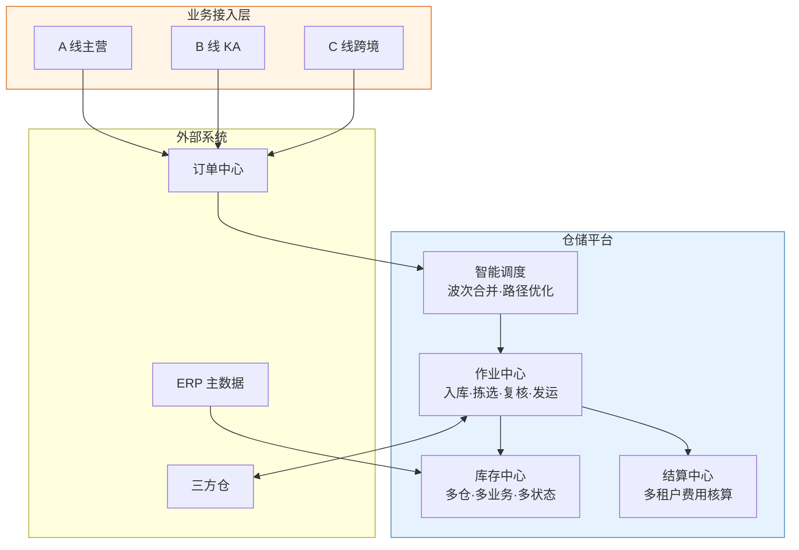
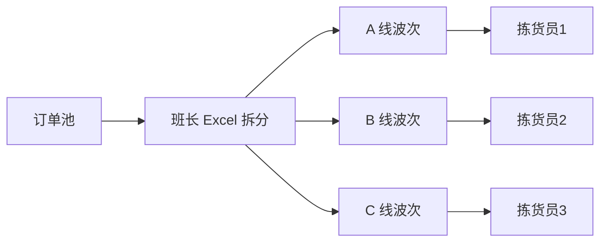
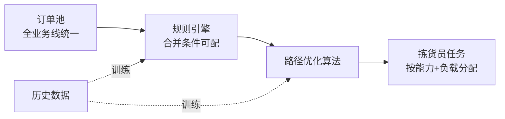
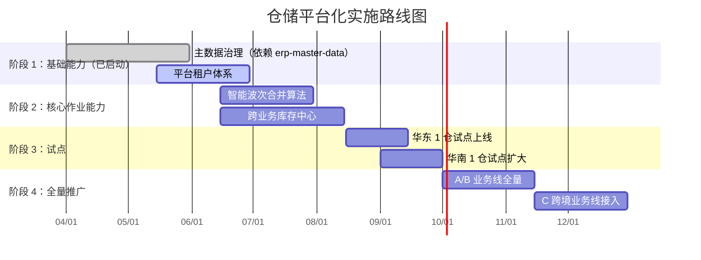

# 仓储平台化 系统解决方案 v1.0

> **文档类型**：系统解决方案（业务版）  
> **项目代号**：wms-platform  
> **作者**：江某某 ｜ **日期**：2026-05-26 ｜ **状态**：评审中  
> **目标读者**：运营总监、财务经理、IT 架构师

---

## 一句话结论

> **本方案将分散的 3 个业务线仓储能力统一为一套平台，通过智能波次合并和跨仓协同，把拣选人效从 80 单/h 提升到 100 单/h（+25%），预计年化节省 480 万元，2026 Q3 试点、Q4 全量推广。**

---

## 1. 业务背景与痛点

### 1.1 现状

公司目前有 3 条业务线（A 线主营、B 线 KA、C 线跨境），各自维护独立仓储系统，分布在 5 个区域仓。运营模式：
- 各业务线独立排单、独立拣货、独立结算
- 共用同一物理仓库时按区域硬隔离
- 班长凭经验合并波次，无系统支持

### 1.2 痛点（按业务影响排序）

| # | 痛点 | 业务影响 | 量化损失 |
|---|---|---|---|
| 1 | 拣选人效持续下滑 | 人力成本占比从 4.2% 升至 5.3% | 年多支出约 600 万 |
| 2 | 跨业务线无法削峰 | A 线爆单时 B 线人员闲置 | 旺季加班费多 200 万 |
| 3 | 班长靠经验排单 | 任务分配不均，员工抱怨 | 流失率 18%，招聘成本 80 万 |
| 4 | 三方仓数据不互通 | 月底对账靠人工，错账率 2% | 财务返工 3 人月/季 |

### 1.3 为什么现在做

- **业务驱动**：SKU 数 2 年内从 2 万增至 4.8 万，原作业方式不可持续
- **成本压力**：仓储成本占 GMV 比从 4.2% 升至 5.3%，老板设定红线 4.5%
- **战略机会**：2026 年新签 2 家 KA 客户，要求统一对接，倒逼平台化

---

## 2. 目标与衡量标准

### 2.1 业务目标（上线后 3 个月达成）

| 指标 | 当前 | 目标 | 测量方式 |
|---|---|---|---|
| 拣选人效 | 80 单/人/小时 | 100 单/人/小时 | 周报取值 |
| 缺货率 | 3.2% | 1.5% | 月度盘点 |
| 订单履约时效 | 28 小时 | 18 小时 | 系统自动统计 |
| 仓储成本/GMV | 5.3% | 4.5% | 财务月报 |

### 2.2 非目标（明确不做）

- 本期**不**改造 OMS 订单中心
- 本期**不**接入海外仓
- 本期**不**做自动化设备（AGV、立体库）

---

## 3. 解决方案概要

### 3.1 整体思路

把"3 套独立系统"重构为"1 套平台 + 多业务租户"，核心改造点：
1. **作业能力下沉**：入库、库存、拣选等通用能力沉淀到平台
2. **业务规则上浮**：各业务线的特殊规则（KA 优先级、跨境单证）以配置形式存在
3. **算法替代经验**：波次合并、路径优化交给系统

### 3.2 业务架构图

### 3.3 关键模块说明

| 模块 | 解决什么问题 | 与现状差异 |
|---|---|---|
| 智能调度 | 替代班长经验排单 | 新增能力 |
| 库存中心 | 跨业务线库存可视、可调拨 | 原各自管理，现统一池化 |
| 作业中心 | 多业务共用同一套 SOP，仅差异点配置化 | 原 3 套独立系统 |
| 结算中心 | 自动按业务线/客户分摊费用 | 原月底人工拆账 |

---

## 4. 业务流程变化（前后对比）

### 4.1 现状：班长经验式排单

**问题**：班长每天 1 小时排单、跨业务线无法合并、无法实时调整。

### 4.2 改造后：系统智能合单 + 跨业务统一调度

**改善点**：班长从"排单"转向"异常处理"、跨业务线削峰、算法持续学习改进。

---

## 5. 预期收益（量化）

### 5.1 直接收益（年化）

| 收益项 | 测算口径 | 金额 |
|---|---|---|
| 人力节省 | 人效提升 25%，节省 12 人 × 8000/月 × 12 | 115 万 |
| 库存周转改善 | 周转 45→35 天，释放占用 2000 万 × 4% 资金成本 | 80 万 |
| 缺货损失减少 | GMV 12 亿 × 缺货率改善 1.7% × 毛利率 22% | 45 万 |
| 旺季加班减少 | 跨业务削峰，旺季加班费 -50% | 100 万 |
| 三方仓对账自动化 | 节省 12 财务人月 × 1.5 万/人月 | 18 万 |
| 人员流失降低 | 流失率 18%→10%，节省招聘培训 | 50 万 |
| 平台化运维节省 | 3 套系统并 1 套，IT 维护成本 -40% | 72 万 |
| **合计** | | **480 万** |

### 5.2 间接收益

- **客户体验**：履约时效 28h→18h，B2C 转化率预估提升 1.5%
- **战略能力**：能快速接入新业务线和新 KA 客户（原需 3 个月，现 2 周）
- **数据沉淀**：作业数据统一沉淀，为未来自动化设备引入打基础

---

## 6. 实施路径与里程碑

---

## 7. 风险与依赖

| 风险/依赖 | 概率 | 影响 | 应对 |
|---|---|---|---|
| ERP 主数据治理项目延期 | 中 | 高 | 优先治理商品和库位数据，其他可解耦 |
| 三方仓接入标准不统一 | 高 | 中 | 6 月起由运营总监牵头制定 SOP v1.0 |
| 旺季峰值未压测 | 中 | 高 | 8 月完成专项压测，按双 11 1.5 倍预备资源 |
| 业务方 UAT 资源不足 | 中 | 中 | 业务方承诺试点期 2 人 ×全职 4 周 |

---

## 8. 资源需求

| 资源类型 | 数量 | 时间 | 备注 |
|---|---|---|---|
| 产品 | 2 人 | 6 个月 | 含本人 |
| 研发 | 8 人 | 6 个月 | 后端 5 + 前端 2 + 算法 1 |
| 测试 | 3 人 | 4 个月 | 含 1 名性能测试 |
| 业务方投入 | 80 人天 | 分散在试点期 | 调研 + UAT + 培训 |
| 预算 | 380 万 | | 人力 320 + 硬件 60 |

**ROI**：投入 380 万 → 年化收益 480 万 → **回本周期 9.5 个月**

---

## 9. 附录

- 行业基准：行业头部仓储平台化人效平均 110 单/h，本方案目标 100 单/h 偏保守
- 业务术语：见 [.kiro/steering/domain-glossary.md](../../../.kiro/steering/domain-glossary.md)
- 关联项目：[erp-master-data](../../erp-master-data/)（强依赖）

---

## 变更记录

| 版本 | 日期 | 变更 | 作者 |
|---|---|---|---|
| v0.1 | 2026-05-15 | 初稿 | 江某某 |
| v0.5 | 2026-05-22 | 补充收益测算明细 | 江某某 |
| v1.0 | 2026-05-26 | 评审版本 | 江某某 |
