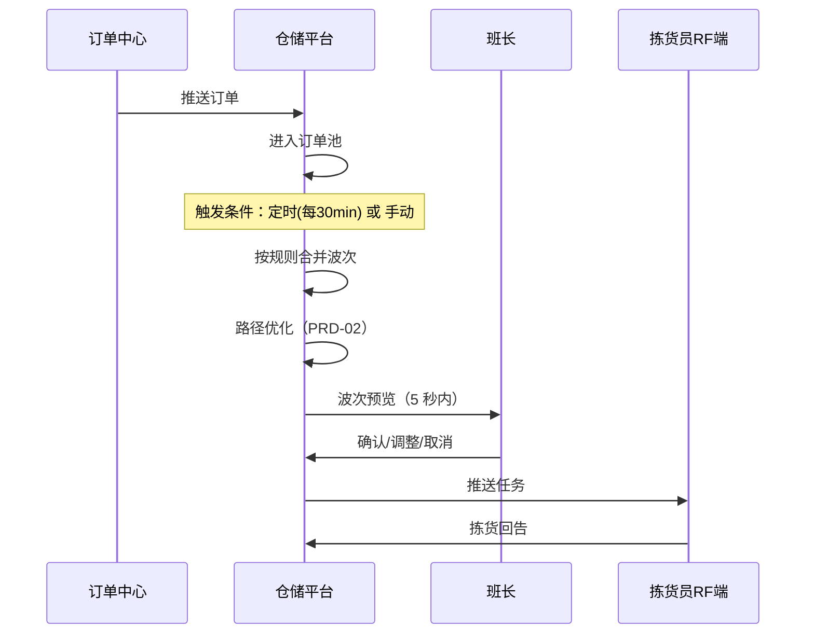

# 智能波次合并 PRD v0.1

> **项目代号**：wms-platform  
> **PRD 编号**：wms-platform-PRD-01  
> **作者**：江某某 ｜ **日期**：2026-05-26 ｜ **状态**：草稿  
> **目标读者**：业务方（仓库班长）、产品、研发、测试

---

## 一句话需求

> 作为**仓库班长**，我希望系统**根据订单属性、库存位置和拣货员能力自动合并波次并分配任务**，以便**我从每天 1 小时排单中解放出来，专注异常处理，同时把拣选人效从 80 单/h 提升到 100 单/h**。

---

## 1. 背景与目标

### 1.1 业务背景

关联系统方案：[wms-platform-solution-v1.0](../01-solution/wms-platform-solution-v1.0.md)

本期解决：替代班长经验排单，提升人效与公平性。

### 1.2 目标用户与场景

| 用户角色 | 高频场景 | 痛点 |
|---|---|---|
| 仓库班长 | 早 8 点 / 中 14 点排单 | 1 小时拍脑袋分单，员工抱怨不公 |
| 拣货员 | 接收任务并执行 | 走动距离 35 米/单，疲劳度高 |
| 仓库主管 | 实时查看作业进度 | 信息分散，看不到全局 |

### 1.3 衡量指标（上线 1 个月）

| 指标 | 当前 | 目标 |
|---|---|---|
| 拣选人效 | 80 单/h | 95 单/h（首期目标） |
| 单单走动距离 | 35 米 | 25 米 |
| 班长排单耗时 | 60 分钟/天 | < 10 分钟/天 |
| 任务分配公平度（基尼系数） | 0.32 | < 0.15 |

---

## 2. 需求范围

### 2.1 本期范围（In Scope）
1. 波次合并规则配置
2. 自动波次生成与触发（手动 + 定时）
3. 拣货员任务推送（RF 端）
4. 班长监控大屏
5. 异常单据手动干预

### 2.2 不在本期（Out of Scope）
1. 跨仓波次合并 → 二期
2. 路径优化算法 → 下一个 PRD（02）
3. 设备调度（AGV 协同）→ 三期

### 2.3 优先级

| 需求 | P0/P1/P2 | 理由 |
|---|---|---|
| 规则配置 + 自动合单 | P0 | 主流程核心 |
| 任务推送 RF 端 | P0 | 现场执行依赖 |
| 班长监控大屏 | P1 | 可用 Excel 临时替代 |
| 异常手动干预 | P0 | 没有此功能不敢上线 |

---

## 3. 业务流程

### 3.1 主流程

### 3.2 异常流程

| 异常 | 处理 |
|---|---|
| 库存不足 | 自动剔除该订单，标记异常待补货 |
| 拣货员离线 | 任务自动回收，重新分配 |
| 紧急插单（VIP/KA） | 班长可强制插入指定波次 |

---

## 4. 功能详述

### 4.1 波次合并规则配置

**业务规则**（可配置）：
- 同一波次最大订单数：默认 30，范围 1-100
- 同一波次最大 SKU 数：默认 50
- 同一波次库位距离上限：默认 80 米
- 客户优先级：KA > VIP > 普通
- 时效要求：< 4h 优先合并
- 商品属性：易碎品独立波次、冷链独立波次

**输入与输出**：

| 输入 | 处理 | 输出 |
|---|---|---|
| 订单池中的订单（含 SKU、库位、客户、时效要求） | 按规则评分合并 | 1~N 个波次，每波次含订单清单 |

### 4.2 自动波次生成与触发

- **定时触发**：默认每 30 分钟，可配置
- **手动触发**：班长在监控页点击"立即合单"
- **响应时间**：< 5 秒生成结果

### 4.3 拣货员任务推送

- 推送方式：RF 端实时通知（声音 + 振动）
- 任务卡片显示：波次号、订单数、SKU 数、首个库位、预计耗时
- 详细界面见原型：[picking-task/index.html](../03-prototype/picking-task/index.html)

### 4.4 班长监控大屏

- 实时数据：在拣单数、待拣单数、平均人效、异常预警
- 操作：人工合单、调整波次、回收任务

### 4.5 异常手动干预

- 班长可对单条订单/单个波次进行：插队、暂缓、退回订单池

---

## 5. 数据需求

### 5.1 数据对象

涉及主数据：
- 商品（依赖 ERP 主数据治理项目）
- 库位（含坐标信息，用于路径计算）
- 拣货员（含技能标签、当前负载）
- 订单（来自 OMS）

新增字段：
- 订单：波次号、合并时间、波次状态
- 拣货员：今日拣单量、当前波次

### 5.2 数据来源与流向

- 上游：OMS（订单）、ERP（商品/库位主数据）
- 下游：结算中心（人效统计）、BI（运营分析）

---

## 6. 非功能需求

| 维度 | 要求 |
|---|---|
| 性能 | 单次合单 ≤ 5 秒（订单池 ≤ 5000 单时） |
| 并发 | 高峰期 200 拣货员同时在线，每秒 10 次回告 |
| 可用性 | 7×24，全年可用率 99.9%（每月停机 < 43 分钟） |
| 数据留存 | 波次/任务历史保留 3 年 |
| 数据安全 | 客户信息脱敏、操作全留痕 |

---

## 7. 上线计划

| 阶段 | 时间 | 范围 |
|---|---|---|
| 内部 UAT | 2026-08-01 ~ 08-10 | 测试环境 |
| 灰度试点 | 2026-08-15 ~ 09-15 | 华东 1 仓 1 个区域 |
| 扩大试点 | 2026-09-15 ~ 10-15 | 华东 1 仓全仓 + 华南 1 仓 |
| 全量推广 | 2026-10-15 起 | 全部 5 仓 |

### 上线判断标准
- [ ] 拣选准确率 ≥ 99.95%
- [ ] 试点仓人效 ≥ 90 单/h（首阶段目标）
- [ ] 班长 NPS ≥ 8
- [ ] 拣货员 NPS ≥ 7

---

## 8. 风险与待决问题

| # | 问题 | 决策方 | 期望日期 | 状态 |
|---|---|---|---|---|
| 1 | KA 客户优先级规则是否硬编码还是配置化 | 业务总监 | 2026-06-10 | 待决 |
| 2 | 紧急插单是否允许打破波次上限 | 运营 + 财务 | 2026-06-15 | 待决 |
| 3 | 算法初期需要历史数据多久（3 个月 vs 6 个月） | 算法团队 | 2026-06-05 | 待决 |

---

## 9. 附录

- 关联方案：[wms-platform-solution-v1.0](../01-solution/wms-platform-solution-v1.0.md)
- 后续 PRD：路径优化（PRD-02）、跨仓协同（PRD-03）
- 业务术语：见 [.kiro/steering/domain-glossary.md](../../../.kiro/steering/domain-glossary.md)

---

## 变更记录

| 版本 | 日期 | 变更 | 作者 |
|---|---|---|---|
| v0.1 | 2026-05-26 | 初稿，待业务方评审 | 江某某 |
