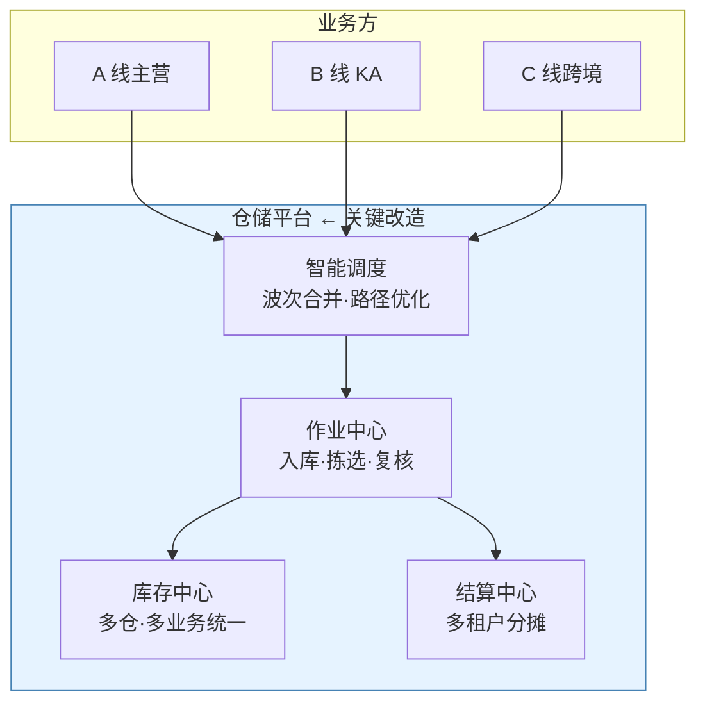

# 仓储平台化方案 业务评审

零售供应链 · wms-platform · v1.0

汇报人：江某某 ｜ 2026-05-30

<!--
本份用 Slidev 编写。本地预览：slidev wms-platform-report-20260530-biz-review.md
导出 PPTX：slidev export --format pptx
-->

---

## 议程（10 分钟讲完）

1. **结论**（30 秒）
2. **痛点**（2 分钟）
3. **方案**（3 分钟）
4. **收益**（2 分钟）
5. **风险与下一步**（2 分钟）
6. **请决策事项**（30 秒）

---
layout: section
---

# 1. 结论

---

## 一句话结论

> **把 3 套独立仓储系统统一为一套平台 + 智能调度，**  
> **拣选人效 80 → 100 单/h，年化节省 480 万，9.5 个月回本。**

+25%

人效提升

¥480万

年化收益

9.5个月

回本周期

---
layout: section
---

# 2. 痛点：成本红线被突破

---

## 仓储成本占比已超红线

| 指标 | 2024 | 2025 | 2026 Q1 | 老板红线 |
|---|---|---|---|---|
| 仓储成本/GMV | 4.2% | 4.8% | **5.3%** | 4.5% |
| 拣选人效（单/h） | 95 | 85 | **80** | — |
| 缺货率 | 2.1% | 2.8% | **3.2%** | 1.5% |

不改变现状，2026 全年仓储成本将多支出约 600 万元。

---

## 4 大痛点（按损失排序）

| # | 痛点 | 年损失 |
|---|---|---|
| 1 | 拣选人效持续下滑 | 600 万 |
| 2 | 跨业务线无法削峰，旺季加班暴增 | 200 万 |
| 3 | 班长经验排单，员工抱怨流失 | 80 万（招聘成本） |
| 4 | 三方仓对账靠人工，错账率 2% | 18 万 + 月底返工 3 人月/季 |

---
layout: section
---

# 3. 方案：1 套平台 + 智能调度

---

## 一图看懂

**白话**：把"3 套系统 + 班长经验"换成"1 套平台 + 系统智能合单"。

---

## 关键改造点

| 模块 | 现状 | 改造后 |
|---|---|---|
| 作业 | A/B/C 三套独立 | 一套平台，差异点配置化 |
| 库存 | 各业务线独立池 | 统一池化，可跨业务调拨 |
| 排单 | 班长 Excel 拍脑袋 | 系统按规则自动合并 |
| 结算 | 月底人工拆账 | 自动按租户分摊 |

---
layout: section
---

# 4. 收益：480 万 / 年

---

## 收益拆解（年化）

| 收益项 | 金额 | 测算口径 |
|---|---|---|
| 人力节省 | 115 万 | 节省 12 人 |
| 库存周转改善 | 80 万 | 释放占用资金 2000 万 |
| 缺货损失减少 | 45 万 | GMV × 缺货率改善 × 毛利 |
| 旺季加班减少 | 100 万 | 跨业务削峰 |
| 三方仓对账自动化 | 18 万 | 节省 12 财务人月 |
| 人员流失降低 | 50 万 | 流失率 18% → 10% |
| IT 运维节省 | 72 万 | 3 套系统并 1 套 |
| **合计** | **480 万** | |

投入 380 万 → 年化 480 万 → 回本 9.5 个月

---

## 同时改善 4 项业务 KPI

仓储成本/GMV

5.3% → 4.5%

回到老板红线内

拣选人效

80 → 100 单/h

+25%

缺货率

3.2% → 1.5%

客户体验改善

订单履约时效

28h → 18h

B2C 转化预估 +1.5%

---
layout: section
---

# 5. 风险与下一步

---

## 主要风险（已有应对）

| 风险 | 概率 | 影响 | 应对 |
|---|---|---|---|
| 🔴 ERP 主数据治理项目延期 | 中 | 高 | 优先治理商品/库位，其他可解耦 |
| 🟡 三方仓接入标准不统一 | 高 | 中 | 6 月起运营总监牵头 SOP v1.0 |
| 🟡 旺季峰值未压测 | 中 | 高 | 8 月专项压测，按 1.5 倍预备 |

---

## 下一步（30 天）

- ✅ 6/10：本方案评审通过
- ✅ 6/15：启动 PRD-01 智能波次合并
- ✅ 6/20：三方仓 SOP v1.0
- ✅ 6/30：PRD-01 评审通过

---
layout: section
---

# 6. 请评审决策

---

## 请今天确认 3 件事

1. **方案 v1.0 是否通过？** → 是否继续 PRD 阶段
2. **资源是否到位？** → 380 万预算 + 业务方 80 人天投入
3. **试点仓选择？** → 建议华东 1 仓（数据基础最好）

方案详情：jiangzw/projects/wms-platform/01-solution/wms-platform-solution-v1.0.md

---
layout: end
---

# 谢谢
