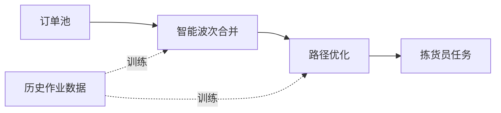

# {汇报主题}

零售供应链 · {项目名}

汇报人：{姓名} ｜ {YYYY-MM-DD}

<!--
本模板用 Slidev 编写，本地运行：
  npm i -g @slidev/cli
  slidev biz-report-slidev.md
导出 PDF：slidev export
导出 PPTX：slidev export --format pptx
-->

---
layout: section
---

# 一句话结论

---

## 一句话结论

> **本季度仓储成本下降 12%，相当于年化节省 480 万元。**
> 主要来自波次合并算法上线后人效从 80 单/h 提升至 95 单/h（+18.7%）。

数据时间：2026-04-01 ~ 2026-05-31 ｜ 数据来源：WMS 运营周报

---

## 议程

1. 业务背景与痛点
2. 我们做了什么
3. 业务收益（核心）
4. 风险与下一步

---
layout: section
---

# 1. 业务背景与痛点

---

## 现状：仓储成本占比连年走高

**关键数据**

| 指标 | 2024 | 2025 | 2026 Q1 |
|---|---|---|---|
| 仓储成本占 GMV | 4.2% | 4.8% | 5.3% |
| 拣选人效（单/h） | 95 | 85 | 80 |
| 缺货率 | 2.1% | 2.8% | 3.2% |

**核心痛点**

- 🔴 **人效持续下滑**：SKU 数量翻倍，作业方式没变
- 🔴 **波次靠人工**：班长经验决定，忙闲不均
- 🟡 **跨仓协同弱**：3 个仓各管各的，无法削峰

---
layout: section
---

# 2. 我们做了什么

---

## 一图看懂方案

**简单讲**：把原来"班长拍脑袋分单"换成"系统按规则合并 + 走最短路径"，让每个拣货员的任务更均衡、走得更少。

---

## 进展时间线

| 时间 | 里程碑 | 状态 |
|---|---|---|
| 2026-02 | 立项与方案评审 | ✅ 完成 |
| 2026-03 | 算法原型与历史数据回测 | ✅ 完成 |
| 2026-04 | 试点仓（华东 1 仓）上线 | ✅ 完成 |
| 2026-05 | 扩大试点（+华南 1 仓） | 🟡 进行中 |
| 2026-07 | 全量推广 | ⚪ 待启动 |

---
layout: section
---

# 3. 业务收益

---

## 试点仓数据：远超预期

+18.7%

拣选人效

80 → 95 单/小时

-29%

单单走动距离

35 → 25 米/单

¥480万

年化节省

按当前作业量推算

---

## 收益测算明细

| 收益项 | 测算口径 | 年化金额 |
|---|---|---|
| 人力节省 | 节省 12 人 × 8000 元/月 × 12 | 115 万 |
| 库存周转改善 | 占用资金 8000 万 × 4% 资金成本 | 320 万 |
| 缺货损失减少 | GMV × 缺货率改善 × 毛利率 | 45 万 |
| **合计** | | **480 万** |

---
layout: section
---

# 4. 风险与下一步

---

## 风险

| 风险 | 影响 | 应对 |
|---|---|---|
| 🔴 三方仓接入标准不统一 | 全量推广延迟 | 6 月起统一 SOP，由运营总监牵头 |
| 🟡 旺季流量峰值未压测 | 双 11 期间可能拥堵 | 8 月完成专项压测 |

## 下一步（未来 30 天）

- ✅ 完成华南仓试点验收（**6/15**）
- ✅ 三方仓接入标准 v1.0 发布（**6/20**）
- ✅ 启动全量推广方案评审（**6/30**）

---
layout: end
---

# 谢谢

讨论 & 决策

项目代号：wms-platform ｜ 详情见仓库：jiangzw/projects/wms-platform/

