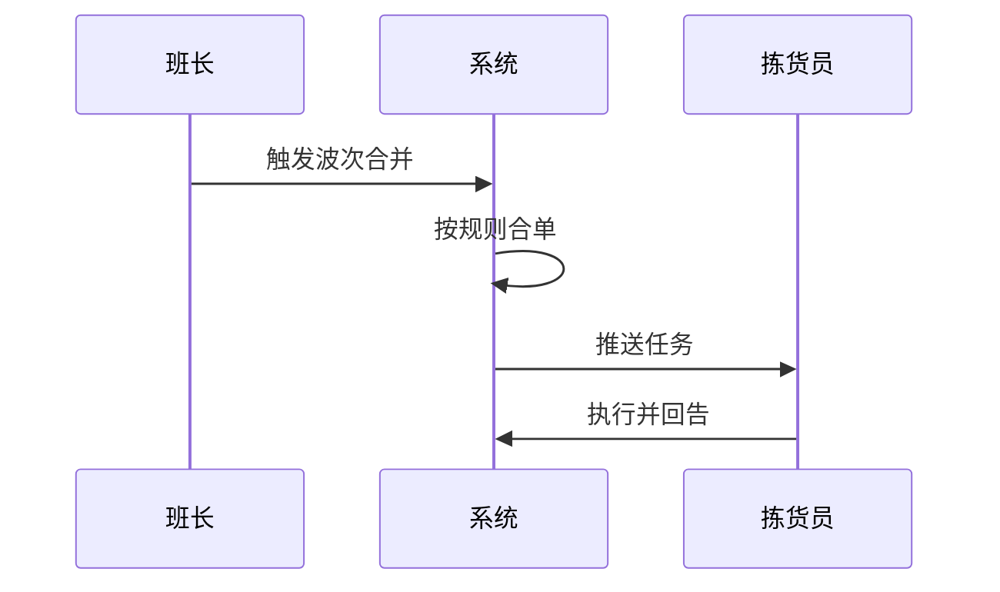

# {功能名} PRD v{版本号}

> **项目代号**：{project-code}  
> **PRD 编号**：{project-code}-PRD-{序号}  
> **作者**：{姓名} ｜ **日期**：YYYY-MM-DD ｜ **状态**：草稿/评审中/已通过  
> **目标读者**：业务方、产品、研发、测试

---

## 一句话需求

> _作为 [角色]，我希望 [能力]，以便 [业务目的]。_

---

## 1. 背景与目标

### 1.1 业务背景
- 关联系统方案：[链接到 solution 文档]
- 本期解决的具体问题：……

### 1.2 目标用户与场景

| 用户角色 | 高频场景 | 痛点 |
|---|---|---|
| 仓库班长 | 早班分配波次任务 | 凭经验，不均衡 |
| 拣货员 | 接收任务并执行 | 走动距离长 |

### 1.3 衡量指标

| 指标 | 当前 | 目标（上线后 1 个月） |
|---|---|---|
| 拣选人效（单/h） | 80 | 100 |
| 走动距离（米/单） | 35 | 25 |

---

## 2. 需求范围

### 2.1 本期范围（In Scope）
1. [需求点 1]
2. [需求点 2]

### 2.2 不在本期（Out of Scope）
1. [明确不做的内容]

### 2.3 优先级

| 需求 | P0/P1/P2 | 理由 |
|---|---|---|
| | | |

---

## 3. 业务流程

### 3.1 主流程

### 3.2 异常流程
- 场景 A：库存不足
- 场景 B：设备离线

---

## 4. 功能详述

### 功能 4.1 [功能名]

#### 4.1.1 业务规则
- 规则 1：……
- 规则 2：……

#### 4.1.2 输入与输出

| 输入 | 处理 | 输出 |
|---|---|---|
| | | |

#### 4.1.3 界面草图
> 静态原型见 `../03-prototype/{功能}/index.html`

#### 4.1.4 边界与约束
- 单次最大处理量：……
- 数据保留周期：……

---

## 5. 数据需求

### 5.1 数据对象
- 涉及主数据：商品、库位、订单
- 新增字段：……

### 5.2 数据来源与流向
- 上游：……
- 下游：……

---

## 6. 非功能需求

| 维度 | 要求 |
|---|---|
| 性能 | 单次波次合并 ≤ 30 秒 |
| 并发 | 高峰期 200 拣货员同时在线 |
| 可用性 | 7×24，全年可用率 99.9% |
| 数据安全 | 敏感字段加密、操作留痕 |

---

## 7. 上线计划

| 阶段 | 时间 | 范围 |
|---|---|---|
| 灰度试点 | | 1 个仓 |
| 扩大试点 | | 3 个仓 |
| 全量推广 | | 全部仓 |

### 上线判断标准
- [ ] 拣选准确率 ≥ 99.95%
- [ ] 试点仓人效改善 ≥ 15%
- [ ] 业务方 UAT 通过

---

## 8. 风险与待决问题

| 序号 | 问题 | 决策方 | 期望日期 | 状态 |
|---|---|---|---|---|
| 1 | | | | 待决 |

---

## 9. 附录

- 相关 PRD：
- 业务术语：见 [.kiro/steering/domain-glossary.md](../../.kiro/steering/domain-glossary.md)

---

## 变更记录

| 版本 | 日期 | 变更 | 作者 |
|---|---|---|---|
| v0.1 | | 初稿 | |
