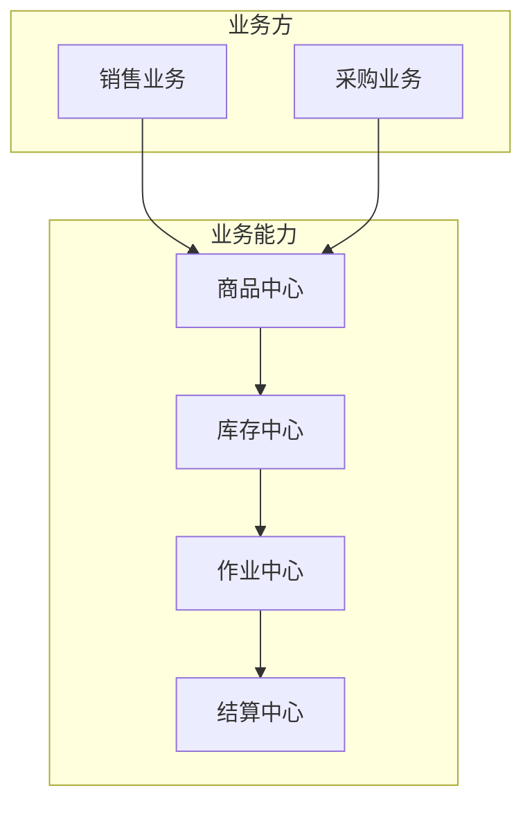
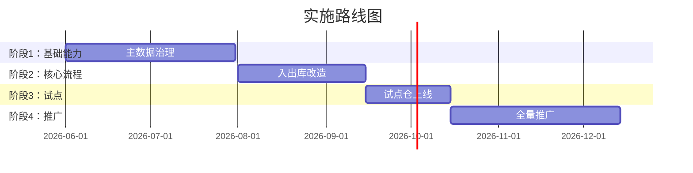

# {项目名} 系统解决方案 v{版本号}

> **文档类型**：系统解决方案（业务版）  
> **项目代号**：{project-code}  
> **作者**：{姓名} ｜ **日期**：YYYY-MM-DD ｜ **状态**：草稿/评审中/已通过  
> **目标读者**：业务负责人、业务部门、IT/产品

---

## 一句话结论

> _本方案通过 XXX 方式，预计在 X 个月内将 [核心指标] 从 X 改善到 Y，节省成本 X 万/年。_

---

## 1. 业务背景与痛点

### 1.1 现状
- 当前 [业务环节] 的运作方式是……
- 涉及组织/角色：……
- 关键现状数据：
  - 指标 A：当前 X【数据来源】
  - 指标 B：当前 Y【数据来源】

### 1.2 痛点（按影响排序）

| # | 痛点 | 业务影响 | 量化损失 |
|---|---|---|---|
| 1 | [痛点描述] | [对业务的具体影响] | [金额/时间/百分比] |
| 2 | | | |
| 3 | | | |

### 1.3 为什么现在做
- [外部驱动：业务规模、合规、客户要求]
- [内部驱动：成本压力、效率瓶颈]

---

## 2. 目标与衡量标准

### 2.1 业务目标

| 指标 | 当前 | 目标 | 时间窗口 |
|---|---|---|---|
| [核心指标 1] | | | |
| [核心指标 2] | | | |

### 2.2 非目标（明确不做的）
- 本方案**不**包含 ……
- 本方案**不**解决 ……

---

## 3. 解决方案概要

### 3.1 整体思路（一段话）
本方案的核心思路是 ……

### 3.2 业务架构图

### 3.3 关键模块说明

| 模块 | 解决什么问题 | 与现状差异 |
|---|---|---|
| [模块 1] | | |
| [模块 2] | | |

---

## 4. 业务流程变化（前后对比）

### 4.1 现状流程

**问题**：……

### 4.2 改造后流程

**改善点**：……

---

## 5. 预期收益（量化）

### 5.1 直接收益

| 收益项 | 测算方式 | 年化金额 |
|---|---|---|
| [人力节省] | X 人 × Y 元/月 × 12 | |
| [库存周转改善] | 占用资金 × 资金成本率 | |
| [缺货损失减少] | GMV × 缺货率改善 × 毛利率 | |
| **合计** | | |

### 5.2 间接收益
- [客户体验改善：履约时效、缺货率]
- [合规与风险降低]
- [组织能力沉淀]

---

## 6. 实施路径与里程碑

| 阶段 | 关键交付 | 时间 | 验收标准 |
|---|---|---|---|
| 1 | | | |
| 2 | | | |

---

## 7. 风险与依赖

| 风险/依赖 | 概率 | 影响 | 应对 |
|---|---|---|---|
| [风险描述] | 高/中/低 | 高/中/低 | |

---

## 8. 资源需求

| 资源类型 | 数量 | 时间 | 备注 |
|---|---|---|---|
| 产品 | X 人 | X 月 | |
| 研发 | X 人 | X 月 | |
| 业务方投入 | X 人天 | | 主要用于调研、UAT |
| 预算 | X 万 | | |

---

## 9. 附录

- 相关文档：
- 调研记录：
- 术语表：见 [.kiro/steering/domain-glossary.md](../../.kiro/steering/domain-glossary.md)

---

## 变更记录

| 版本 | 日期 | 变更 | 作者 |
|---|---|---|---|
| v0.1 | YYYY-MM-DD | 初稿 | |
| v1.0 | YYYY-MM-DD | 评审通过 | |
