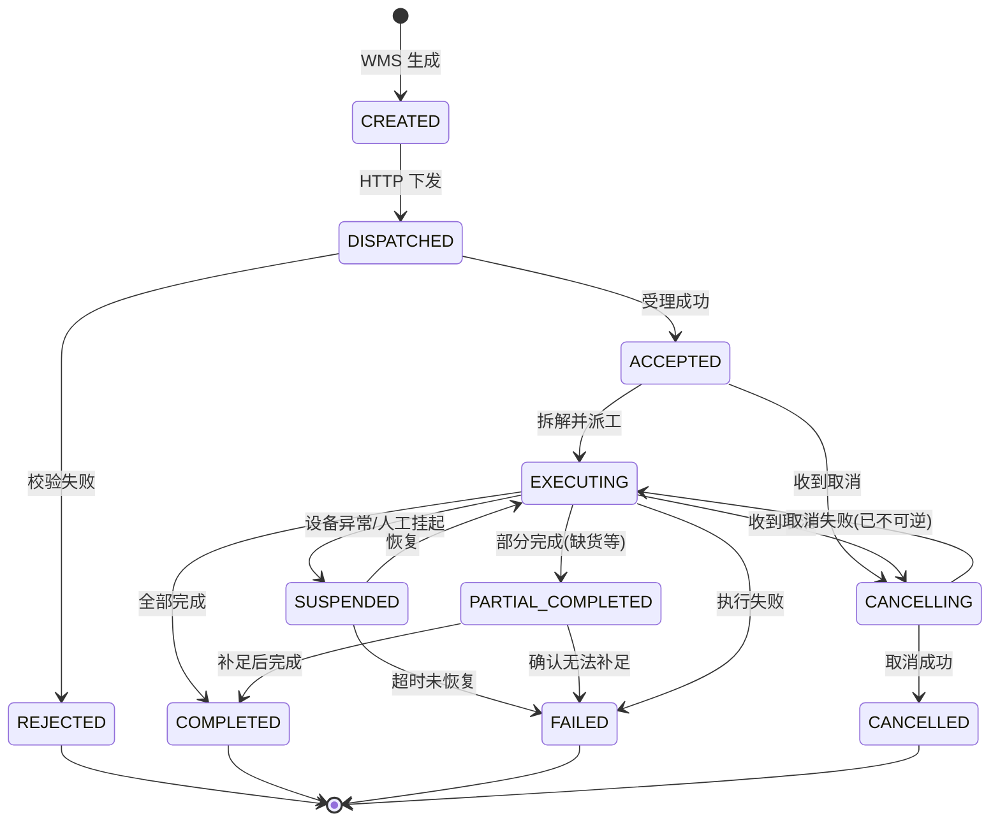
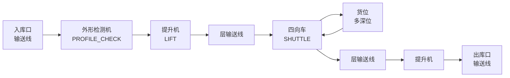
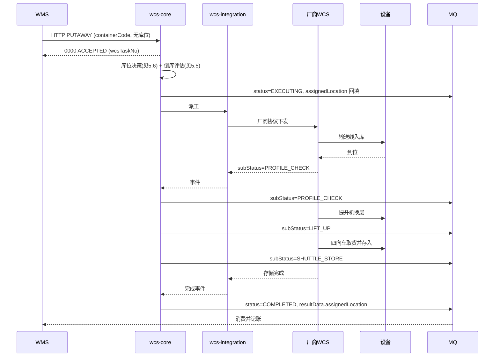
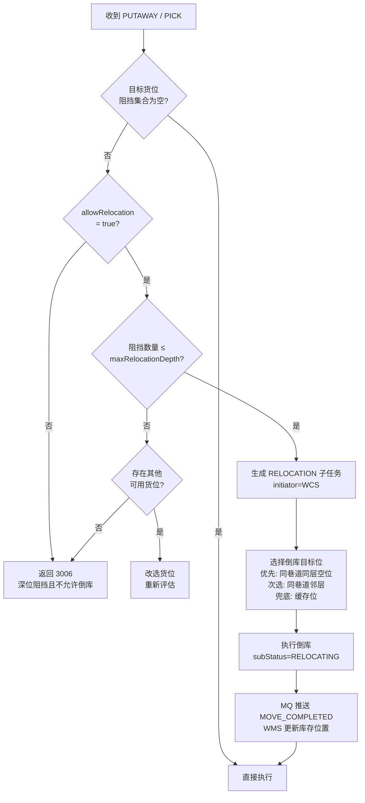
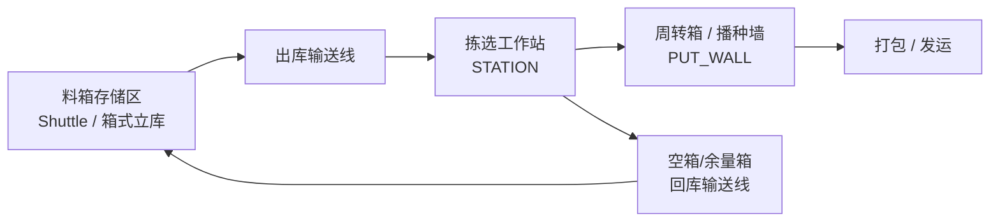
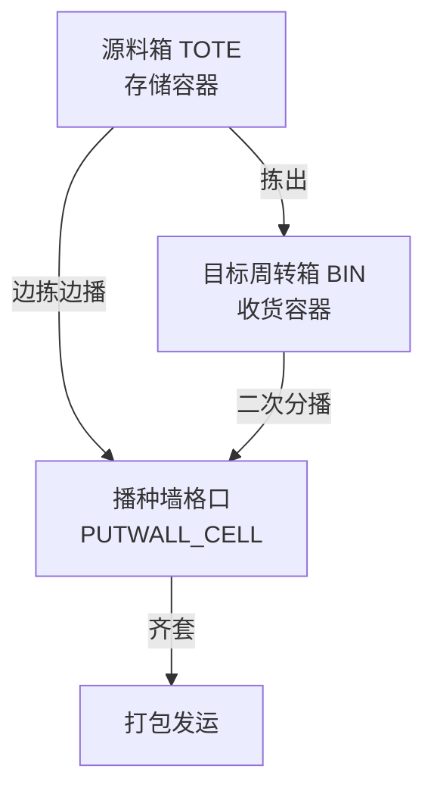
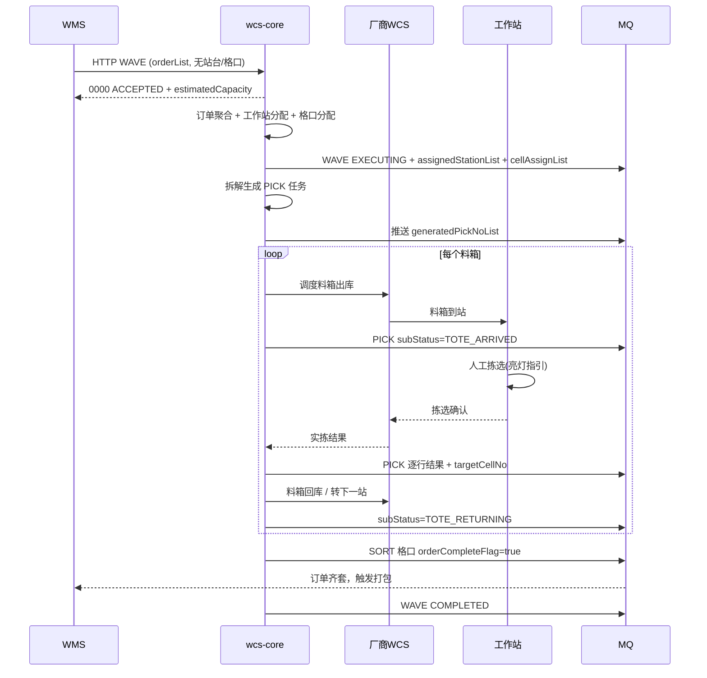
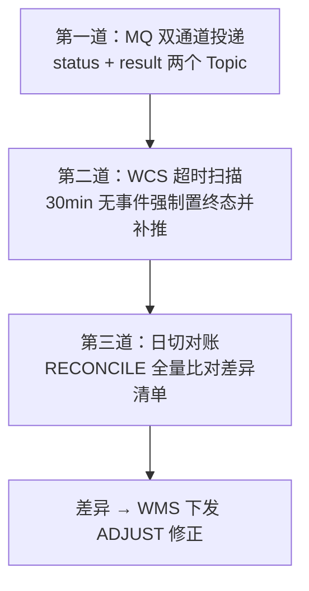

# WCS 标准指令模型 PRD

> 面向研发 / 测试评审版本。本文档定义 WMS 与自研 WCS 之间的**标准指令模型**（报文结构、状态机、13 类指令字段级定义、接口协议、异常补偿、验收用例），并针对**四向车立库**与**电商仓料箱到人**两个场景给出扩展设计。

---

## 0. 文档信息

| 项 | 内容 |
|---|---|
| 文档名称 | WCS 标准指令模型 PRD |
| 版本 | v1.0 |
| 状态 | 待评审 |
| 关联架构 | `WCS架构产品方案.pptx` P1（分层架构）、P2（wcs-core 服务分解） |
| 适用系统 | Flux WMS / 飞云 WMS ←→ wcs-core ←→ 各厂商 WCS / 设备 |

### 0.1 版本记录

| 版本 | 日期 | 修订人 | 修订说明 |
|---|---|---|---|
| v1.0 | 2026-07-28 | 产品 | 初稿，覆盖 13 类指令字段级定义 + 四向车立库 / 料箱到人场景扩展 |

### 0.2 评审签署

| 角色 | 姓名 | 意见 | 日期 |
|---|---|---|---|
| 产品负责人 | | | |
| WCS 研发负责人 | | | |
| WMS 研发负责人 | | | |
| 测试负责人 | | | |
| 自动化设备/供应商接口负责人 | | | |

---

## 1. 背景与目标

### 1.1 背景

当前全渠道仓库接入多套 WMS（Flux WMS、飞云 WMS）与多家自动化供应商系统（货架到人、料箱到人、托盘到人、分拣机器人、语音拣选等）。若 WMS 与各厂商 WCS 直连，会产生 `M × N` 条定制集成链路，带来三个问题：

1. **接口不可复用**——每接入一家新供应商，WMS 侧都要改造一次；
2. **调度无法统一**——优先级、限流、熔断散落在各厂商系统内，无全局 SLA 保障；
3. **供应商不可替换**——业务逻辑与厂商协议耦合，更换设备等于重做集成。

本期通过自研 WCS 收敛为 `M + N` 条链路：WMS 只对接 WCS 的**一套标准指令集**，WCS 向下按能力适配各厂商。

### 1.2 本期目标

| 编号 | 目标 | 验收口径 |
|---|---|---|
| G1 | 定义一套版本化、幂等、可灰度的标准指令报文规范 | 13 类指令均有字段级定义与 JSON 示例，通过研发评审 |
| G2 | 定义统一的指令生命周期状态机与错误码体系 | 状态机无歧义分支；错误码分段覆盖参数/业务/资源/设备/系统 5 类 |
| G3 | WMS 侧零感知设备差异 | WMS 下发报文中不出现任何厂商专有字段；新增供应商不改 WMS 接口 |
| G4 | 支撑四向车立库场景 | 支持多深位库位模型、倒库、提升机/输送线/四向车链路事件回传 |
| G5 | 支撑电商仓料箱到人场景 | 支持波次驱动、工作站分配、一箱多单/一单多箱、播种墙格口、空箱回库 |
| G6 | 上下行全链路可观测 | 每条指令可通过 `traceId` 串联 WMS→WCS→厂商→设备全链路事件 |

### 1.3 非目标（本期不做，避免评审发散）

- 不做 WMS 侧库存账务逻辑（库存增减仍由 WMS 记账，WCS 只回传执行事实）；
- 不做设备底层协议（PLC / Modbus / OPC-UA）的直连，底层协议由厂商 WCS 或 `wcs-integration` 适配层封装；
- 不做人工作业（纯 RF 拣选）的流程再造，本期仅将其作为 `pickMode` 的一个枚举兼容；
- 不做跨仓调拨的运输段调度。

### 1.4 名词与缩写

| 术语 | 说明 |
|---|---|
| WMS | 仓库管理系统，业务决策层，负责库存账务与作业单据 |
| WCS（本文特指 wcs-core） | 自研仓储控制系统，标准指令承接与统一调度 |
| 厂商 WCS | 供应商随设备提供的控制系统，作为可插拔执行层接入 |
| 指令（Instruction） | WMS 下发给 WCS 的标准化作业意图，本期定义 13 类 |
| 任务（Task） | WCS 将一条指令拆解后生成的内部执行单元，一条指令可拆出 N 个任务 |
| 四向车 | 可在同层 X/Y 双向行走、经提升机换层的穿梭车 |
| 多深位 | 同一巷道同一层同一列上纵深存放多个货位，`depthNo=1` 为最靠近巷道口 |
| 倒库（Relocation） | 为取出深位货物，先将阻挡货物搬至他处的动作 |
| 料箱到人 | Tote-to-Person，料箱由设备搬运至拣选工作站，人在站台拣选 |
| 播种墙 / Put Wall | 分播用格口墙，一个格口对应一个订单或一个门店 |
| 工作站（Station） | 人机交互的拣选/分播作业台位 |
| DWS | Dimension-Weight-Scanning，体积重量扫码一体设备 |

---

## 2. 职责边界（关键前提，先对齐再看字段）

> **本期已确认的核心原则：WMS 只下发业务意图，库位分配、路径规划、设备编排全部由 WCS 决策并回传。**
> 该原则是下文所有字段"可空/由 WCS 回填"设计的依据，评审时请优先确认本章。

### 2.1 分层职责

| 层 | 系统 | 职责 |
|---|---|---|
| 业务决策层 | Flux WMS / 飞云 WMS | 订单与库存账务、作业单据生成、波次业务规则、货主与批次策略 |
| 统一调度层 | wcs-core | 指令受理、拆解、库位决策、路径与设备编排、优先级/限流/熔断、状态归集 |
| 能力适配层 | wcs-scenario / wcs-integration | 场景语义到厂商能力的映射、SDK 与协议适配、执行日志 |
| 执行层 | 厂商 WCS / 设备 | 具体设备动作执行与底层状态上报 |

### 2.2 决策权归属矩阵

| 决策项 | WMS | WCS | 说明 |
|---|:--:|:--:|---|
| 是否要做这批作业（业务意图） | ● | | WMS 生成收货单/出库波次等 |
| 库存账务增减 | ● | | WCS 只回传执行事实，不记账 |
| 货主 / 批次 / 效期策略 | ● | | 批次由 WMS 在指令明细中指定或标注"不限" |
| **目标库位选择** | | ● | 含巷道、层、列、深度 |
| **存储策略执行**（ABC / 层均衡 / 就近） | ○ | ● | WMS 可通过 `storageStrategy` 表达偏好，WCS 有最终决定权 |
| **是否倒库、倒到哪** | | ● | WCS 自主发起，事后通知 WMS |
| **路径与设备编排** | | ● | 四向车/提升机/输送线的组合与时序 |
| **工作站分配** | ○ | ● | WMS 可给候选工作站列表，WCS 做实际分配与负载均衡 |
| **格口分配** | ○ | ● | WMS 给订单聚合结果，WCS 分配具体格口号 |
| 指令优先级基准 | ● | ○ | WMS 给 `priority`/`slaLevel`，WCS 可基于拥塞动态调整执行序 |
| 设备故障降级与切换 | | ● | 对 WMS 透明，仅在不可恢复时上报异常 |

图例：● 主责　○ 参与/提供输入

### 2.3 边界约束（研发实现红线）

- **C1**：WMS 下发报文中**禁止**出现任何厂商专有字段（如某品牌的 `binId`、`agvGroup`）。此类信息只能存在于 `wcs-integration` 适配层内部。
- **C2**：所有库位坐标字段在**下行方向可空**；WCS 决策后通过上行状态报文回填。WMS 必须能接受"下发时不知道库位"。
- **C3**：WCS 自主发起的动作（倒库、空箱回库、设备内部搬运）**不占用** WMS 的指令号，使用 WCS 内部任务号，通过 MQ 事件通知 WMS，WMS 按需记账。
- **C4**：WCS 不做业务合法性兜底。若 WMS 下发的商品在 WCS 主数据中不存在，直接拒绝（`2001`），不做隐式创建。
- **C5**：一条指令的执行结果**必须**最终到达终态（`COMPLETED` / `FAILED` / `CANCELLED` / `REJECTED`），不允许长期挂起而无事件。超时由 WCS 主动置 `FAILED` 并上报。

---

## 3. 指令模型总体设计

### 3.1 指令分类与编码规范

本期定义 **13 类**标准指令：

| # | 指令类型 `instructionType` | 中文 | 方向 | 所属域 |
|---|---|---|:--:|---|
| 1 | `GOODS` | 商品信息指令 | WMS→WCS | 主数据 |
| 2 | `CONTAINER` | 容器信息指令 | WMS→WCS | 主数据 |
| 3 | `RECEIVE` | 收货指令 | WMS→WCS | 入库 |
| 4 | `PUTAWAY` | 上架指令 | WMS→WCS | 入库 |
| 5 | `WAVE` | 波次指令 | WMS→WCS | 出库 |
| 6 | `PICK` | 拣货指令 | WMS→WCS | 出库 |
| 7 | `SORT` | 分播指令 | WMS→WCS | 出库 |
| 8 | `REPLENISH` | 补货指令 | WMS→WCS | 库内 |
| 9 | `MOVE` | 移库指令 | 双向 | 库内 |
| 10 | `COUNT` | 盘点指令 | WMS→WCS | 库内 |
| 11 | `ADJUST` | 调整指令 | WMS→WCS | 库内 |
| 12 | `RECONCILE` | 对账指令 | 双向 | 支撑 |
| 13 | `MONITOR` | 监控预警指令 | 双向 | 支撑 |

> **关于"任务单看板指令"**：架构图中的看板能力由 `wcs-dashboard` 通过数据采集通路（MQ→数据湖→可视化）实现，**不作为一类指令**下发。看板所需数据来源于 `MONITOR` 订阅与状态事件流。此为本期与架构图的一处口径收敛，请评审确认。

**指令号生成规则（`instructionNo`）**：由 WMS 生成并保证全局唯一，作为**幂等键**。

```
{仓库编码 4位}{指令类型缩写 2位}{yyyyMMdd 8位}{序列 8位}
示例：W001PA2026072800001234   （W001 仓 / PA=PUTAWAY / 2026-07-28 / 第 1234 条）
```

类型缩写映射：`GD/CT/RC/PA/WV/PK/ST/RP/MV/CN/AJ/RL/MN`

### 3.2 公共报文结构

所有下行指令共用同一 Header，各指令仅 `body` 不同。

**请求 Header**

| 字段 | 类型 | 必填 | 说明 |
|---|---|:--:|---|
| `instructionNo` | String(32) | Y | 指令唯一编号，**幂等键**，规则见 3.1 |
| `instructionType` | String(16) | Y | 指令类型枚举，见 3.1 |
| `instructionAction` | String(16) | Y | `CREATE` 新增 / `UPDATE` 变更 / `CANCEL` 取消 |
| `schemaVersion` | String(8) | Y | 报文版本，如 `v1.0`。WCS 按版本路由解析器 |
| `bizNo` | String(64) | Y | 上游业务单号（WMS 单据号），用于业务追溯 |
| `warehouseNo` | String(16) | Y | 仓库编码 |
| `ownerCode` | String(32) | N | 货主编码，多货主仓必填 |
| `priority` | Integer | Y | 0–9，9 最高，默认 5 |
| `slaLevel` | String(8) | N | `S1`/`S2`/`S3`，与时效承诺挂钩，见 9.1 |
| `expectFinishTime` | DateTime | N | 期望完成时间（ISO-8601），用于 SLA 预警 |
| `grayTag` | String(16) | N | 灰度标签，WCS 按标签路由到灰度实例 |
| `sourceSystem` | String(16) | Y | `FLUX_WMS` / `FEIYUN_WMS` |
| `requestTime` | DateTime | Y | 下发时间 |
| `traceId` | String(64) | Y | 全链路追踪 ID，贯穿至设备事件 |
| `body` | Object | Y | 各指令专有报文体 |
| `extendFields` | Object | N | 扩展字段，K-V 结构，**新增字段优先放这里再择机转正** |

**同步响应（HTTP）**

| 字段 | 类型 | 必填 | 说明 |
|---|---|:--:|---|
| `code` | String(8) | Y | `0000` 表示受理成功，其余见 3.7 |
| `message` | String(256) | Y | 描述信息 |
| `instructionNo` | String(32) | Y | 回显 |
| `wcsTaskNo` | String(32) | N | WCS 内部任务号，受理成功时返回 |
| `acceptTime` | DateTime | Y | 受理时间 |
| `duplicated` | Boolean | Y | 是否命中幂等（重复下发） |
| `data` | Object | N | 指令级返回数据（如预估产能） |

> **重要语义**：HTTP 同步响应仅代表**受理成功**（`ACCEPTED`），不代表执行完成。执行结果一律走 MQ 异步上报。

**异步状态上报（MQ）**

| 字段 | 类型 | 必填 | 说明 |
|---|---|:--:|---|
| `instructionNo` | String(32) | Y | 对应指令号 |
| `wcsTaskNo` | String(32) | Y | WCS 内部任务号 |
| `seqNo` | Long | Y | **单调递增序号**，消费方按此去重与排序，解决 MQ 乱序 |
| `status` | String(16) | Y | 状态机枚举，见 3.3 |
| `subStatus` | String(32) | N | 细分执行节点，如 `LIFT_UP`、`SHUTTLE_MOVING` |
| `progress` | Integer | N | 0–100 完成百分比 |
| `deviceInfo` | Object | N | 设备上下文，见下 |
| `resultData` | Object | N | 执行结果（如实际库位、实拣数量） |
| `errorCode` | String(8) | N | 失败时必填 |
| `errorMsg` | String(256) | N | 失败时必填 |
| `eventTime` | DateTime | Y | 事件发生时间 |
| `traceId` | String(64) | Y | 与下行一致 |

`deviceInfo` 结构：

| 字段 | 类型 | 说明 |
|---|---|---|
| `vendorCode` | String(16) | 供应商编码 |
| `deviceType` | String(16) | `SHUTTLE`/`LIFT`/`CONVEYOR`/`AGV`/`STACKER`/`STATION`/`ROBOT` |
| `deviceNo` | String(32) | 设备编号 |
| `stationNo` | String(16) | 工作站编号（如适用） |

### 3.3 指令生命周期状态机



**状态定义**

| 状态 | 含义 | 是否终态 | 触发方 |
|---|---|:--:|---|
| `CREATED` | WMS 已生成未下发 | N | WMS |
| `DISPATCHED` | 已下发至 WCS，等待受理 | N | WMS |
| `REJECTED` | WCS 校验不通过，拒绝受理 | **Y** | WCS |
| `ACCEPTED` | 已受理，等待调度 | N | WCS |
| `EXECUTING` | 已派工，设备执行中 | N | WCS |
| `SUSPENDED` | 挂起（设备故障/人工干预） | N | WCS |
| `PARTIAL_COMPLETED` | 部分完成（如缺货少拣） | N | WCS |
| `COMPLETED` | 全部完成 | **Y** | WCS |
| `FAILED` | 执行失败且不可恢复 | **Y** | WCS |
| `CANCELLING` | 取消处理中 | N | WCS |
| `CANCELLED` | 已取消 | **Y** | WCS |

**取消可行性规则（研发重点）**

| 当前状态 | 可否取消 | 说明 |
|---|:--:|---|
| `ACCEPTED` | 可 | 未派工，直接置 `CANCELLED` |
| `EXECUTING` 且未有物理动作 | 可 | 撤回派工 |
| `EXECUTING` 且设备已取货 | **部分可** | 需生成回位任务，取消完成后货物归位；回位期间保持 `CANCELLING` |
| `PARTIAL_COMPLETED` | 不可 | 已产生业务事实，须走 `ADJUST` 冲正 |
| 终态 | 不可 | 返回 `2010` |

### 3.4 幂等与重试

| 项 | 规则 |
|---|---|
| 幂等键 | `instructionNo` + `instructionAction` |
| 幂等窗口 | **72 小时**（覆盖长周期盘点/波次） |
| 重复下发 | 返回首次受理结果，`duplicated=true`，`code=0000`，**不重复创建任务** |
| 内容冲突 | 同一 `instructionNo` 但报文体不一致 → 拒绝，`code=1009` |
| WMS 重试策略 | 指数退避，建议 `2s/4s/8s/16s`，最多 4 次；超时未响应视为**未知**，必须通过查询接口确认，**禁止直接判失败** |
| WCS→厂商重试 | 由 `wcs-strategy` 配置，默认 3 次；重试期间指令保持 `EXECUTING`，不向 WMS 抖动状态 |
| MQ 消费幂等 | 消费方按 `instructionNo + seqNo` 去重；`seqNo` 小于已处理值的报文直接丢弃 |

### 3.5 版本化与灰度

- **报文版本**：`schemaVersion` 决定解析器版本。WCS 同时支持 **N 与 N-1** 两个版本，新版本发布后旧版本保留 **6 个月**。
- **兼容性原则**：小版本（`v1.0→v1.1`）只允许**新增可选字段**；删除字段、改变字段语义、收紧枚举必须升大版本。
- **灰度**：`grayTag` 支持按仓、按货主、按指令类型三个维度灰度。未打标走稳定版本。
- **降级**：灰度实例异常时自动回落稳定实例，对 WMS 无感。

### 3.6 优先级与调度

**执行序权重**（`wcs-schedule` 计算）：

```
score = priority × 10
      + slaWeight(slaLevel)          # S1=30, S2=15, S3=5
      + urgency(expectFinishTime)    # 剩余时间越少权重越高，超时项 +50
      - congestion(targetArea)       # 目标区域拥塞时降权，避免死锁
```

| 机制 | 规则 |
|---|---|
| 限流 | 按仓 + 指令类型双维度令牌桶；超限返回 `5002`，WMS 应退避重试 |
| 降级 | 触发阈值后，`S3` 指令暂缓派工，优先保 `S1/S2` |
| 熔断 | 单一厂商链路连续失败 N 次（默认 10）熔断 60s，期间该链路指令置 `SUSPENDED` 而非 `FAILED` |
| 防饥饿 | 指令等待超过 `maxWaitTime`（默认 30min）强制提权，避免低优先级永不执行 |

### 3.7 错误码规范

采用 4 位分段编码：

| 段 | 含义 | WMS 侧建议动作 |
|---|---|---|
| `0000` | 成功 | — |
| `1xxx` | 参数与格式错误 | **不可重试**，修数据后重发 |
| `2xxx` | 业务规则拒绝 | **不可重试**，人工介入 |
| `3xxx` | 资源不足（库位/容器/库存） | 可延后重试 |
| `4xxx` | 设备与执行异常 | WCS 内部已重试，通常无需 WMS 重试 |
| `5xxx` | 系统与限流 | **可重试**，指数退避 |

**明细表**

| 错误码 | 含义 | 触发场景 |
|---|---|---|
| `0000` | 成功 | — |
| `1001` | 必填字段缺失 | Header 或 body 必填项为空 |
| `1002` | 字段格式非法 | 类型/长度/日期格式错误 |
| `1003` | 枚举值非法 | 不在约定枚举内 |
| `1004` | 指令类型不支持 | `instructionType` 未定义 |
| `1005` | 报文版本不支持 | `schemaVersion` 超出支持范围 |
| `1006` | 明细行为空 | `detailList` 长度为 0 |
| `1007` | 明细行数超限 | 超过单指令上限（见 9.2） |
| `1008` | 数量非法 | 数量 ≤ 0 或超过精度 |
| `1009` | 幂等冲突 | 同指令号内容不一致 |
| `2001` | 商品不存在 | 主数据未同步 |
| `2002` | 容器不存在或状态非法 | 容器未注册/已停用 |
| `2003` | 货主不存在 | — |
| `2004` | 批次/效期规则冲突 | 指定批次与实物不符 |
| `2005` | 业务单据状态非法 | 如对已完成波次追加拣货 |
| `2006` | 重复业务单号 | `bizNo` 已存在且非同一指令 |
| `2007` | 作业区域不支持该指令 | 如对人工区下发料箱到人拣货 |
| `2008` | 商品与容器规格不匹配 | 超出容器承重/尺寸 |
| `2009` | 指令不存在 | 取消/查询时指令号无效 |
| `2010` | 当前状态不允许该操作 | 终态指令被取消 |
| `3001` | 无可用库位 | 存储区满 |
| `3002` | 无可用容器 | 空箱耗尽 |
| `3003` | 库存不足 | 拣货数量大于可用量 |
| `3004` | 无可用工作站 | 站台全忙且超时 |
| `3005` | 无可用格口 | 播种墙格口耗尽 |
| `3006` | 深位阻挡且不允许倒库 | 见 5.5 |
| `4001` | 设备离线 | 目标设备失联 |
| `4002` | 设备故障 | 厂商上报故障码 |
| `4003` | 执行超时 | 超过单任务时限 |
| `4004` | 厂商接口调用失败 | 适配层调用异常 |
| `4005` | 厂商返回业务拒绝 | 厂商侧校验不通过 |
| `4006` | 货物异常（超限/形变/散落） | 外形检测不通过 |
| `4007` | 取货失败 | 目标位置无货 |
| `4008` | 放货失败 | 目标位置被占 |
| `5001` | 系统内部错误 | 未捕获异常 |
| `5002` | 触发限流 | 令牌桶耗尽 |
| `5003` | 服务降级中 | 低优先级指令暂缓 |
| `5004` | 链路熔断中 | 厂商链路熔断 |
| `5005` | 依赖服务不可用 | DB/MQ 异常 |

---

## 4. 指令字段级定义（13 类）

### 4.0 公共嵌套对象

以下对象在多条指令中复用，定义一次。

**`LocationDTO` 库位坐标对象**（下行可空，由 WCS 决策后上行回填）

| 字段 | 类型 | 必填 | 说明 |
|---|---|:--:|---|
| `locationCode` | String(32) | N | 库位编码（拼接码，唯一） |
| `areaNo` | String(16) | N | 库区编码 |
| `roadwayNo` | String(8) | N | 巷道号（立库场景必回填） |
| `rowNo` | Integer | N | 排 |
| `columnNo` | Integer | N | 列 |
| `layerNo` | Integer | N | 层 |
| `depthNo` | Integer | N | 深度，`1` = 最靠近巷道口；单深位固定为 `1` |
| `locationType` | String(16) | N | `STORAGE`/`BUFFER`/`PICK`/`INBOUND_PORT`/`OUTBOUND_PORT`/`STATION` |

**`GoodsDetailDTO` 商品明细行**

| 字段 | 类型 | 必填 | 说明 |
|---|---|:--:|---|
| `lineNo` | Integer | Y | 行号，指令内唯一 |
| `goodsCode` | String(32) | Y | 商品编码 |
| `qty` | Decimal(14,3) | Y | 数量，> 0 |
| `unit` | String(8) | N | 单位，默认取商品主数据 |
| `batchNo` | String(32) | N | 批次号；空表示不限批次，由 WCS 按先进先出选择 |
| `productionDate` | Date | N | 生产日期 |
| `expiryDate` | Date | N | 到期日期 |
| `snList` | Array\<String> | N | 序列号列表，SN 管控商品必填 |
| `qualityStatus` | String(8) | N | `GOOD` 良品 / `BAD` 次品 / `HOLD` 待检，默认 `GOOD` |
| `ownerCode` | String(32) | N | 行级货主，覆盖 Header |

**`ContainerRefDTO` 容器引用**

| 字段 | 类型 | 必填 | 说明 |
|---|---|:--:|---|
| `containerCode` | String(32) | Y | 容器编码 |
| `containerType` | String(16) | N | 见 4.2 枚举 |
| `cellNo` | String(16) | N | 格口/格位号（多格容器适用） |

---

### 4.1 `GOODS` 商品信息指令

| 项 | 内容 |
|---|---|
| 业务语义 | 同步商品主数据至 WCS，作为库位决策、容器匹配、设备适配的依据 |
| 触发时机 | 商品新建/变更/停用时实时推送；每日全量对账兜底 |
| 幂等要点 | 同一 `goodsCode` 以最后一次 `UPDATE` 为准，允许覆盖 |
| 前置依赖 | 无（主数据类指令，优先级最高） |

**body 字段**

| 字段 | 类型 | 必填 | 说明 |
|---|---|:--:|---|
| `operateType` | String(8) | Y | `ADD`/`UPDATE`/`DISABLE` |
| `goodsList` | Array | Y | 商品列表，单次 ≤ 500 |

**`goodsList[]` 元素**

| 字段 | 类型 | 必填 | 说明 | 场景关联 |
|---|---|:--:|---|---|
| `goodsCode` | String(32) | Y | 商品编码，唯一 | |
| `goodsName` | String(128) | Y | 商品名称 | |
| `barcodeList` | Array\<String> | N | 条码列表，支持一品多码 | 拣选扫码校验 |
| `ownerCode` | String(32) | N | 货主编码 | |
| `spec` | String(64) | N | 规格描述 | |
| `unit` | String(8) | Y | 基本单位 | |
| `length` / `width` / `height` | Integer | N | 长/宽/高（mm） | **立库深位适配、料箱容量计算** |
| `weight` | Integer | N | 单件重量（g） | **四向车载重校验** |
| `volume` | Decimal(12,4) | N | 体积（cm³） | 料箱装箱率 |
| `abcClass` | String(2) | N | `A`/`B`/`C` 周转分类 | **立库库位分配、料箱热区分配** |
| `tempZone` | String(8) | N | `NORMAL`/`COOL`/`FROZEN` | 温区库位约束 |
| `isFragile` | Boolean | N | 是否易碎，默认 `false` | 限制堆叠与加速度 |
| `isHazardous` | Boolean | N | 是否危险品，默认 `false` | 库位隔离约束 |
| `shelfLifeDays` | Integer | N | 保质期天数 | 先进先出策略 |
| `batchControlFlag` | Boolean | N | 是否批次管控，默认 `false` | |
| `snControlFlag` | Boolean | N | 是否 SN 管控，默认 `false` | |
| `stackLimit` | Integer | N | 最大可堆叠层数 | 托盘码放 |
| `containerTypeLimit` | Array\<String> | N | 允许承载的容器类型 | **料箱到人选箱** |
| `pickModeSuggest` | Array\<String> | N | 建议拣选方式 | **场景路由依据** |
| `version` | Long | Y | 数据版本号，用于乱序保护，小于当前版本直接丢弃 | |

**关键规则**

- `version` 严格递增，WCS 收到低版本报文**静默丢弃并返回成功**（避免 WMS 无效重试）。
- `DISABLE` 时若该商品仍有在途指令，返回 `2005` 拒绝。
- `length/width/height/weight` 缺失时，涉及立库与料箱的场景将无法做容量校验，WCS 按保守策略处理并在 `MONITOR` 中告警。

---

### 4.2 `CONTAINER` 容器信息指令

| 项 | 内容 |
|---|---|
| 业务语义 | 同步容器主数据与绑定关系（容器↔库位、容器↔订单、容器↔格口） |
| 触发时机 | 容器投用/报废/绑定变更 |
| 前置依赖 | 绑定商品时需 `GOODS` 已同步 |

**body 字段**

| 字段 | 类型 | 必填 | 说明 |
|---|---|:--:|---|
| `operateType` | String(8) | Y | `ADD`/`UPDATE`/`BIND`/`UNBIND`/`DISABLE` |
| `containerList` | Array | Y | 容器列表，单次 ≤ 500 |

**`containerList[]` 元素**

| 字段 | 类型 | 必填 | 说明 | 场景关联 |
|---|---|:--:|---|---|
| `containerCode` | String(32) | Y | 容器编码 | |
| `containerType` | String(16) | Y | `PALLET` 托盘 / `TOTE` 料箱 / `BIN` 周转箱 / `CAGE` 笼车 / `CARTON` 纸箱 / `PUTWALL_CELL` 播种格口 | |
| `containerSpec` | String(32) | N | 规格编码，如 `TOTE-600x400x300` | |
| `length` / `width` / `height` | Integer | N | 外形尺寸（mm） | **立库货位匹配** |
| `tare` | Integer | N | 自重（g） | 载重校验 |
| `maxLoad` | Integer | N | 最大载重（g） | **四向车/提升机限重** |
| `cellCount` | Integer | N | 格数，默认 `1` | **一箱多单分格** |
| `cellLayout` | String(16) | N | 格位布局，如 `2x4` | 料箱到人分格拣选 |
| `containerStatus` | String(16) | N | `EMPTY`/`OCCUPIED`/`LOCKED`/`DAMAGED` | |
| `bindType` | String(16) | N | `LOCATION`/`ORDER`/`CELL`/`CONTAINER`/`STATION` | `BIND`/`UNBIND` 时必填 |
| `bindTarget` | String(64) | N | 绑定目标标识 | `BIND` 时必填 |
| `parentContainerCode` | String(32) | N | 父容器（如料箱在托盘上） | 立库整托入库 |
| `version` | Long | Y | 数据版本号 | |

**关键规则**

- **容器套嵌**：`parentContainerCode` 形成层级，最大嵌套 2 层（托盘→料箱）。搬运父容器时子容器随动，不需单独下发。
- `BIND` 为**幂等覆盖**语义：重复绑定同一目标返回成功；绑定到不同目标时，若原绑定未解除则返回 `2002`。
- 容器状态为 `DAMAGED` 时，WCS 不再向其分配任务，并触发 `MONITOR` 告警。

---

### 4.3 `RECEIVE` 收货指令

| 项 | 内容 |
|---|---|
| 业务语义 | 通知 WCS 有一批货物待收，驱动 DWS 称重量方、贴标、收货口分配 |
| 触发时机 | ASN 到货预约确认后 |
| 前置依赖 | `GOODS` 已同步 |
| WCS 决策 | 收货口分配、DWS 设备分配、收货容器分配 |

**body 字段**

| 字段 | 类型 | 必填 | 说明 |
|---|---|:--:|---|
| `receiptNo` | String(32) | Y | 收货单号 |
| `receiptType` | String(16) | Y | `PURCHASE` 采购 / `RETURN` 退货 / `TRANSFER` 调拨 / `CROSSDOCK` 越库 |
| `supplierCode` | String(32) | N | 供应商编码 |
| `expectArriveTime` | DateTime | N | 预计到货时间 |
| `inboundPort` | String(16) | N | **建议**收货口，空则由 WCS 分配 |
| `dwsFlag` | Boolean | N | 是否需 DWS 称重量方，默认 `false` |
| `labelPrintFlag` | Boolean | N | 是否需贴标，默认 `false` |
| `qualityCheckFlag` | Boolean | N | 是否需质检，默认 `false` |
| `containerCode` | String(32) | N | 来货容器（整托到货时填） |
| `detailList` | Array\<GoodsDetailDTO> | Y | 收货明细，字段扩展见下 |

**`detailList[]` 扩展字段**（在 `GoodsDetailDTO` 基础上）

| 字段 | 类型 | 必填 | 说明 |
|---|---|:--:|---|
| `expectQty` | Decimal(14,3) | Y | 预期收货数量（复用 `qty` 语义，此处显式命名） |
| `poNo` | String(32) | N | 采购单号 |
| `poLineNo` | Integer | N | 采购单行号 |

**上行 `resultData`**

| 字段 | 类型 | 说明 |
|---|---|---|
| `actualInboundPort` | String(16) | 实际收货口 |
| `receiveDetailList[]` | Array | 逐行实收结果 |
| ↳ `lineNo` | Integer | 行号 |
| ↳ `actualQty` | Decimal(14,3) | 实收数量 |
| ↳ `dwsResult` | Object | DWS 结果：`length`/`width`/`height`/`weight` |
| ↳ `containerCode` | String(32) | 收货后装入的容器 |
| ↳ `diffReason` | String(32) | 差异原因（数量不符时） |

**关键规则**

- 实收与预收不符时，WCS 上报 `PARTIAL_COMPLETED` + 差异明细，**不自行判定合格与否**，由 WMS 决策。
- `dwsFlag=true` 时，DWS 量方结果**必须**回传，用于反向修正 `GOODS` 主数据（WCS 只回传，修正动作由 WMS 发起）。

---

### 4.4 `PUTAWAY` 上架指令 ★立库核心

| 项 | 内容 |
|---|---|
| 业务语义 | 将已收货容器存入存储区，**目标库位由 WCS 决策** |
| 触发时机 | 收货完成 / 质检放行后 |
| 前置依赖 | `RECEIVE` 已完成或容器已在缓存位 |
| WCS 决策 | **目标库位（含巷道/层/列/深度）、路径、设备编排、是否倒库** |

**body 字段**

| 字段 | 类型 | 必填 | 说明 | 场景关联 |
|---|---|:--:|---|---|
| `putawayNo` | String(32) | Y | 上架单号 | |
| `sourceReceiptNo` | String(32) | N | 来源收货单号 | 追溯 |
| `containerCode` | String(32) | Y | 待上架容器编码 | |
| `sourceLocation` | LocationDTO | N | 当前位置，空则 WCS 按容器绑定关系查找 | |
| `inboundPort` | String(16) | N | 入库口，空则 WCS 分配 | **立库输送线入口** |
| `targetArea` | String(16) | N | **建议**存储区，空则 WCS 全仓决策 | |
| `targetLocation` | LocationDTO | N | **建议**库位。按 C2 约束，正常业务**不应下发**；仅用于人工指定的特殊场景 | |
| `storageStrategy` | String(16) | N | 存储策略偏好：`NEAREST` 就近 / `ABC` 周转分类 / `LAYER_BALANCE` 层均衡 / `SCATTER` 分散存储 / `FIXED` 固定货位。默认 `ABC` | **立库策略入口** |
| `allowRelocation` | Boolean | N | 是否允许为腾深位而倒库，默认 `true` | **多深位关键** |
| `palletSpec` | String(32) | N | 托盘规格 | 立库货位匹配 |
| `stackHeight` | Integer | N | 码放高度（mm），含货物 | **立库层高校验** |
| `totalWeight` | Integer | N | 含货总重（g） | **载重校验** |
| `tempZone` | String(8) | N | 温区要求，覆盖商品主数据 | |
| `detailList` | Array\<GoodsDetailDTO> | Y | 容器内商品明细 | |

**上行 `resultData`**

| 字段 | 类型 | 说明 |
|---|---|---|
| `assignedLocation` | LocationDTO | **WCS 决策的最终库位**，必回填 |
| `assignedStrategy` | String(16) | 实际生效的策略 |
| `relocationTaskList` | Array | 为本次上架触发的倒库任务列表，见 5.5 |
| ↳ `wcsTaskNo` | String(32) | WCS 内部倒库任务号 |
| ↳ `containerCode` | String(32) | 被倒的容器 |
| ↳ `fromLocation` / `toLocation` | LocationDTO | 倒库前后位置 |
| `deviceChain` | Array\<Object> | 设备链路轨迹，见 5.3 |

**关键规则**

- **R1**：`targetLocation` 若下发且与 WCS 决策冲突，WCS 优先尝试满足；不可行时**拒绝**（`3001`）而非静默改写，避免 WMS 账实不符。
- **R2**：`allowRelocation=false` 且唯一可用库位为被阻挡深位时，返回 `3006`。
- **R3**：上架完成事件中的 `assignedLocation` 是 WMS 记账的**唯一依据**，WMS 必须以此更新库存位置。

---

### 4.5 `WAVE` 波次指令 ★料箱到人核心

| 项 | 内容 |
|---|---|
| 业务语义 | 下发一个出库波次，WCS 据此做产能预估、工作站分配、拣货任务生成 |
| 触发时机 | WMS 波次规划完成后 |
| 前置依赖 | `GOODS` 已同步；目标区域设备在线 |
| WCS 决策 | **工作站分配、播种墙格口分配、拣货任务拆解与排序、料箱调度顺序** |

**body 字段**

| 字段 | 类型 | 必填 | 说明 | 场景关联 |
|---|---|:--:|---|---|
| `waveNo` | String(32) | Y | 波次号 | |
| `waveType` | String(16) | Y | `B2C` 电商单件 / `B2B` 批量 / `STORE` 店配 / `MULTI` 多单合并 / `SINGLE` 单单 | **料箱到人主入口** |
| `waveStrategy` | String(16) | N | `ORDER_FIRST` 订单优先 / `SKU_FIRST` 品类聚合 / `ROUTE_FIRST` 路径优先 / `DEADLINE_FIRST` 时效优先。默认 `SKU_FIRST` | **决定料箱调度顺序** |
| `pickArea` | String(16) | N | 拣选区域，空则 WCS 按库存分布决策 | |
| `pickMode` | String(16) | N | 拣选方式，见 4.6 枚举；空则 WCS 按区域能力路由 | **场景路由** |
| `targetStationList` | Array\<String> | N | **候选**工作站列表，空则 WCS 全局分配 | **料箱到人站台** |
| `putWallCode` | String(32) | N | **建议**播种墙，空则 WCS 分配 | 分播场景 |
| `orderCount` | Integer | Y | 订单总数 | 产能校验 |
| `totalLines` | Integer | Y | 总行数 | 产能校验 |
| `expectStartTime` | DateTime | N | 期望开始时间 | |
| `cutOffTime` | DateTime | N | **截单时间**，超时未完成触发告警与提权 | SLA |
| `orderList` | Array | Y | 订单列表，单波次 ≤ 500 单 | |

**`orderList[]` 元素**

| 字段 | 类型 | 必填 | 说明 |
|---|---|:--:|---|
| `orderNo` | String(32) | Y | 订单号 |
| `orderType` | String(16) | N | `NORMAL`/`URGENT`/`PRESALE` |
| `orderPriority` | Integer | N | 订单级优先级 0–9 |
| `shipRoute` | String(32) | N | 发运路线/门店编码，分播格口聚合依据 |
| `expectShipTime` | DateTime | N | 期望发运时间 |
| `lineList` | Array\<GoodsDetailDTO> | Y | 订单明细行 |

**上行 `resultData`**

| 字段 | 类型 | 说明 |
|---|---|---|
| `assignedStationList` | Array\<String> | WCS 实际分配的工作站 |
| `assignedPutWallCode` | String(32) | 实际分配的播种墙 |
| `cellAssignList` | Array | 格口分配结果：`orderNo` → `cellNo` |
| `estimatedCapacity` | Integer | 预估产能（行/小时） |
| `estimatedFinishTime` | DateTime | 预估完成时间 |
| `generatedPickNoList` | Array\<String> | 由本波次拆解生成的拣货指令号列表 |
| `unavailableLines` | Array | 无法执行的行（库存不足/区域不支持） |

**关键规则**

- **R1**：`WAVE` 受理后 WCS 自行拆解生成 `PICK` 任务，**WMS 无需再逐条下发 `PICK`**。若 WMS 选择自行拆解，则不下发 `WAVE`，直接下发 `PICK`——**二选一，不可混用**（评审确认点）。
- **R2**：`estimatedFinishTime` 晚于 `cutOffTime` 时，WCS 在受理响应的 `data` 中返回预警，但**仍然受理**，由 WMS 决定是否调整波次。
- **R3**：波次内部分行不可执行时，返回 `PARTIAL_COMPLETED` 并在 `unavailableLines` 中列明，不整波拒绝。

---

### 4.6 `PICK` 拣货指令 ★双场景核心

| 项 | 内容 |
|---|---|
| 业务语义 | 从存储位取出商品，送至指定工作站/出库口 |
| 触发时机 | 由 `WAVE` 拆解自动生成，或 WMS 直接下发 |
| 前置依赖 | 库存充足；目标区域设备可用 |
| WCS 决策 | **取货库位（含批次择优）、料箱/托盘调度序、工作站分配、路径** |

**body 字段**

| 字段 | 类型 | 必填 | 说明 | 场景关联 |
|---|---|:--:|---|---|
| `pickNo` | String(32) | Y | 拣货单号 | |
| `waveNo` | String(32) | N | 所属波次号 | 波次驱动时必填 |
| `pickMode` | String(16) | Y | `SHELF_TO_PERSON` 货架到人 / `TOTE_TO_PERSON` **料箱到人** / `PALLET_TO_PERSON` 托盘到人 / `VOICE` 语音拣选 / `RF` 手持 / `ROBOT_SORT` 分拣机器人 | **场景路由主开关** |
| `pickType` | String(16) | N | `ORDER` 按单 / `BATCH` 批量 / `SEED` 边拣边播。默认 `ORDER` | |
| `pickStation` | String(16) | N | **建议**工作站，空则 WCS 分配 | **料箱到人** |
| `sourceLocation` | LocationDTO | N | **建议**取货位。按 C2，正常不下发 | |
| `sourceContainerCode` | String(32) | N | 指定源容器，空则 WCS 按策略选择 | |
| `targetContainerCode` | String(32) | N | 目标周转箱，空则 WCS 分配空箱 | **料箱到人收容器** |
| `targetCellNo` | String(16) | N | 目标格口，空则 WCS 分配 | 边拣边播 |
| `outboundPort` | String(16) | N | 出库口，空则 WCS 分配 | **立库出库** |
| `batchStrategy` | String(16) | N | 批次策略：`FIFO`/`FEFO`/`LIFO`/`SPECIFIED`。默认 `FEFO` | 效期管控 |
| `allowPartial` | Boolean | N | 是否允许部分拣出，默认 `true` | 缺货处理 |
| `allowSplitContainer` | Boolean | N | 是否允许跨容器拼拣，默认 `true` | **一单多箱** |
| `detailList` | Array | Y | 拣货明细，扩展见下 | |

**`detailList[]` 元素**（`GoodsDetailDTO` + 扩展）

| 字段 | 类型 | 必填 | 说明 |
|---|---|:--:|---|
| `orderNo` | String(32) | N | 所属订单号，**一箱多单场景必填** |
| `targetCellNo` | String(16) | N | 行级目标格口，覆盖指令级 |
| `pickSeq` | Integer | N | 建议拣选顺序，空则 WCS 优化 |

**上行 `resultData`**

| 字段 | 类型 | 说明 |
|---|---|---|
| `actualStation` | String(16) | 实际工作站 |
| `actualOutboundPort` | String(16) | 实际出库口 |
| `pickDetailList[]` | Array | 逐行拣货结果 |
| ↳ `lineNo` / `orderNo` | — | 行标识 |
| ↳ `actualQty` | Decimal(14,3) | 实拣数量 |
| ↳ `sourceLocation` | LocationDTO | **实际取货库位** |
| ↳ `sourceContainerCode` | String(32) | 实际源容器 |
| ↳ `targetContainerCode` | String(32) | 实际目标容器 |
| ↳ `targetCellNo` | String(16) | 实际格口 |
| ↳ `batchNo` / `expiryDate` | — | 实际批次与效期 |
| ↳ `snList` | Array\<String> | 实际 SN |
| ↳ `shortReason` | String(32) | 缺货原因：`NO_STOCK`/`LOCATION_EMPTY`/`GOODS_DAMAGED` |
| ↳ `operatorNo` | String(32) | 拣选人工号（到人场景） |
| ↳ `pickTime` | DateTime | 拣选完成时间 |

**关键规则**

- **R1**：`actualQty < qty` 且 `allowPartial=true` → `PARTIAL_COMPLETED`；`allowPartial=false` → 整单 `FAILED`（`3003`），已拣部分需回位。
- **R2**：实际取货批次与下发批次不一致时**必须**在 `pickDetailList` 中回传实际批次，WMS 据此冲正账务。
- **R3**：`SN` 管控商品必须逐件回传 `snList`，数量与 `actualQty` 一致，否则 WCS 侧校验失败置 `FAILED`（`1008`）。
- **R4**：一条 `PICK` 指令跨多个工作站执行时（大单拆站），`actualStation` 回传主站，逐行结果中体现各自站台。

---

### 4.7 `SORT` 分播指令

| 项 | 内容 |
|---|---|
| 业务语义 | 将拣出的商品按订单/门店分播至播种墙格口或分拣机口 |
| 触发时机 | 拣货容器到达分播工位；或由 `WAVE` 拆解生成 |
| 前置依赖 | 源容器已到位 |
| WCS 决策 | **格口分配、分播顺序、满格触发** |

**body 字段**

| 字段 | 类型 | 必填 | 说明 |
|---|---|:--:|---|
| `sortNo` | String(32) | Y | 分播单号 |
| `waveNo` | String(32) | N | 所属波次 |
| `sortMode` | String(16) | Y | `PUT_WALL` 播种墙 / `SORTER` 分拣机 / `ROBOT` 分拣机器人 / `MANUAL` 人工 |
| `sortDimension` | String(16) | Y | 分播维度：`ORDER` 订单 / `STORE` 门店 / `ROUTE` 路线 / `CELL` 指定格口 |
| `putWallCode` | String(32) | N | 播种墙编码，空则 WCS 分配 |
| `sourceContainerCode` | String(32) | Y | 源容器（拣货周转箱） |
| `sortStation` | String(16) | N | 分播工作站，空则 WCS 分配 |
| `detailList` | Array | Y | 分播明细 |

**`detailList[]` 元素**

| 字段 | 类型 | 必填 | 说明 |
|---|---|:--:|---|
| `lineNo` | Integer | Y | 行号 |
| `orderNo` | String(32) | Y | 目标订单号 |
| `goodsCode` | String(32) | Y | 商品编码 |
| `qty` | Decimal(14,3) | Y | 分播数量 |
| `targetCellNo` | String(16) | N | **建议**格口，空则 WCS 分配 |
| `targetContainerCode` | String(32) | N | 目标容器（格口内周转箱） |

**上行 `resultData`**

| 字段 | 类型 | 说明 |
|---|---|---|
| `sortDetailList[]` | Array | 逐行分播结果：`lineNo`/`orderNo`/`actualQty`/`actualCellNo`/`operatorNo`/`sortTime` |
| `cellStatusList[]` | Array | 格口状态：`cellNo`/`orderNo`/`cellFullFlag`/`orderCompleteFlag` |

**关键规则**

- **R1**：`orderCompleteFlag=true` 表示该订单在此格口已分播齐套，WCS 主动上报**订单完结事件**，WMS 据此触发打包发运。
- **R2**：`cellFullFlag=true` 且订单未齐套时，WCS 自动申请新格口并在事件中回传，WMS 需支持一单多格。
- **R3**：分播数量超出源容器实有量时返回 `3003`，不允许透支。

---

### 4.8 `REPLENISH` 补货指令

| 项 | 内容 |
|---|---|
| 业务语义 | 从存储区补货至拣选区/工作站缓存位 |
| 触发时机 | 阈值触发、波次预测触发、人工触发 |
| 前置依赖 | 存储区有库存 |
| WCS 决策 | **源库位、目标拣选位、搬运路径** |

**body 字段**

| 字段 | 类型 | 必填 | 说明 |
|---|---|:--:|---|
| `replenishNo` | String(32) | Y | 补货单号 |
| `replenishType` | String(16) | Y | `THRESHOLD` 阈值 / `FORECAST` 预测 / `WAVE_DRIVEN` 波次驱动 / `MANUAL` 人工 |
| `sourceArea` | String(16) | N | 源区域，空则 WCS 决策 |
| `targetArea` | String(16) | Y | 目标区域 |
| `targetLocation` | LocationDTO | N | **建议**目标位，空则 WCS 分配 |
| `targetStation` | String(16) | N | 目标工作站（站台补货场景） |
| `urgentFlag` | Boolean | N | 是否紧急补货（拣选已断料），默认 `false`；`true` 时自动提权至 `priority=9` |
| `detailList` | Array\<GoodsDetailDTO> | Y | 补货明细 |

**上行 `resultData`**

| 字段 | 类型 | 说明 |
|---|---|---|
| `replenishDetailList[]` | Array | `lineNo`/`actualQty`/`sourceLocation`/`targetLocation`/`containerCode` |

**关键规则**

- `WAVE_DRIVEN` 类型由 WCS 在波次拆解时**自主发起**（WCS 全权决策的体现），使用 WCS 内部任务号，通过 MQ 通知 WMS，WMS 只做库存移位记账。
- `urgentFlag=true` 的补货指令插队执行，但不打断正在执行的物理动作。

---

### 4.9 `MOVE` 移库指令 ★立库倒库归属

| 项 | 内容 |
|---|---|
| 业务语义 | 库内位置调整，含正常移库、倒库、空箱回库、区域转移、深位整理 |
| 触发时机 | WMS 下发（正常移库）；**WCS 自主发起**（倒库/空箱回库/深位整理） |
| 方向 | **双向**：WMS→WCS 下发，或 WCS→WMS 事件通知 |

**body 字段**

| 字段 | 类型 | 必填 | 说明 | 场景关联 |
|---|---|:--:|---|---|
| `moveNo` | String(32) | Y | 移库单号（WCS 发起时为内部任务号） | |
| `moveType` | String(16) | Y | `NORMAL` 正常移库 / `RELOCATION` **倒库** / `EMPTY_RETURN` **空箱回库** / `AREA_TRANSFER` 跨区转移 / `DEEP_ADJUST` **深位整理** / `EXCEPTION_OUT` 异常移出 | **立库/料箱核心** |
| `initiator` | String(8) | Y | `WMS` / `WCS`，标识发起方 | |
| `containerCode` | String(32) | N | 待移容器；按商品移库时可空 | |
| `sourceLocation` | LocationDTO | N | 源库位，空则 WCS 按容器查找 | |
| `targetLocation` | LocationDTO | N | **建议**目标位，空则 WCS 决策 | |
| `targetArea` | String(16) | N | 目标区域约束 | |
| `reasonCode` | String(32) | N | 原因码：`BLOCK_DEEP` 深位阻挡 / `ABC_ADJUST` 周转调整 / `LAYER_BALANCE` 层均衡 / `EMPTY_RECYCLE` 空箱回收 / `DEVICE_FAULT` 设备故障疏散 | **可观测性关键** |
| `relatedInstructionNo` | String(32) | N | 关联指令号（如因哪条上架而倒库） | 追溯 |
| `detailList` | Array\<GoodsDetailDTO> | N | 按商品移库时必填；整容器移库时可空 | |

**上行 `resultData`**

| 字段 | 类型 | 说明 |
|---|---|---|
| `actualSourceLocation` | LocationDTO | 实际源位 |
| `actualTargetLocation` | LocationDTO | 实际目标位 |
| `deviceChain` | Array\<Object> | 设备链路轨迹 |

**关键规则**

- **R1（重要）**：`initiator=WCS` 的移库（倒库/空箱回库/深位整理）**不需要 WMS 预先下发**。WCS 执行后通过 MQ `wcs.instruction.event` 主题推送 `MOVE_COMPLETED` 事件，WMS **必须**消费并更新库存位置，否则将账实不符。
- **R2**：倒库过程中原指令（如触发倒库的 `PUTAWAY`）保持 `EXECUTING`，倒库子任务的进度通过 `subStatus=RELOCATING` 体现，**不单独改变原指令状态**。
- **R3**：`EXCEPTION_OUT` 用于设备故障时的货物疏散，目标位由 WCS 选择缓存位，完成后需人工介入，WCS 同步触发 `MONITOR` 告警。

---

### 4.10 `COUNT` 盘点指令

| 项 | 内容 |
|---|---|
| 业务语义 | 驱动自动化区域盘点，支持整区/循环/动态/RFID/盲盘 |
| 触发时机 | 定期盘点计划、差异触发的动态盘点 |
| WCS 决策 | **盘点顺序、设备调度、是否需搬出到工作站清点** |

**body 字段**

| 字段 | 类型 | 必填 | 说明 |
|---|---|:--:|---|
| `countNo` | String(32) | Y | 盘点单号 |
| `countType` | String(16) | Y | `FULL` 全盘 / `CYCLE` 循环盘 / `DYNAMIC` 动态盘 / `RFID` RFID 盘 / `SPOT` 抽盘 |
| `countScope` | String(16) | Y | 盘点范围维度：`AREA`/`LOCATION`/`GOODS`/`CONTAINER` |
| `scopeList` | Array\<String> | Y | 范围值列表（区域码/库位码/商品码/容器码） |
| `blindFlag` | Boolean | N | 是否盲盘（不下发账面数量），默认 `true` |
| `bookQtyList` | Array | N | 账面数量，`blindFlag=false` 时下发 |
| `needMoveOut` | Boolean | N | 是否需搬至工作站清点，默认由 WCS 按区域能力决定 |
| `expectFinishTime` | DateTime | N | 期望完成时间 |

**上行 `resultData`**

| 字段 | 类型 | 说明 |
|---|---|---|
| `countDetailList[]` | Array | 逐条盘点结果 |
| ↳ `location` | LocationDTO | 库位 |
| ↳ `containerCode` | String(32) | 容器 |
| ↳ `goodsCode` | String(32) | 商品 |
| ↳ `batchNo` | String(32) | 批次 |
| ↳ `actualQty` | Decimal(14,3) | 实盘数量 |
| ↳ `bookQty` | Decimal(14,3) | 账面数量（非盲盘时回显） |
| ↳ `diffQty` | Decimal(14,3) | 差异数量 |
| ↳ `countTime` | DateTime | 盘点时间 |
| `summaryDiffCount` | Integer | 差异条目总数 |

**关键规则**

- 盘点期间涉及的库位由 WCS **锁定**，拒绝其他指令占用，返回 `2010`。锁定超时（默认 4h）自动释放并告警。
- WCS **只回传实盘事实，不做盈亏判定**。差异处理由 WMS 通过 `ADJUST` 指令下发。

---

### 4.11 `ADJUST` 调整指令

| 项 | 内容 |
|---|---|
| 业务语义 | 修正 WCS 侧的库存快照，使之与 WMS 账面一致 |
| 触发时机 | 盘点差异处理、异常冲正、状态变更 |
| 前置依赖 | 目标库位/容器无在途任务 |

**body 字段**

| 字段 | 类型 | 必填 | 说明 |
|---|---|:--:|---|
| `adjustNo` | String(32) | Y | 调整单号 |
| `adjustType` | String(16) | Y | `QTY` 数量 / `STATUS` 品质状态 / `BATCH` 批次 / `LOCATION` 位置 / `OWNER` 货主 |
| `reasonCode` | String(32) | Y | 原因码：`COUNT_DIFF`/`DAMAGE`/`EXPIRE`/`SYSTEM_FIX`/`MANUAL` |
| `relatedNo` | String(32) | N | 关联单号（如盘点单号） |
| `detailList` | Array | Y | 调整明细 |

**`detailList[]` 元素**

| 字段 | 类型 | 必填 | 说明 |
|---|---|:--:|---|
| `lineNo` | Integer | Y | 行号 |
| `location` | LocationDTO | N | 目标库位 |
| `containerCode` | String(32) | N | 目标容器 |
| `goodsCode` | String(32) | Y | 商品编码 |
| `batchNo` | String(32) | N | 批次 |
| `beforeQty` | Decimal(14,3) | N | 调整前数量 |
| `afterQty` | Decimal(14,3) | N | 调整后数量，`adjustType=QTY` 时必填 |
| `beforeStatus` | String(8) | N | 调整前品质状态 |
| `afterStatus` | String(8) | N | 调整后品质状态，`adjustType=STATUS` 时必填 |

**关键规则**

- 调整指令是**强制覆盖**语义，WCS 不做业务校验（除格式外），以 WMS 账面为准。
- 若目标库位存在在途任务，返回 `2010`，WMS 需等待或先取消在途任务。

---

### 4.12 `RECONCILE` 对账指令

| 项 | 内容 |
|---|---|
| 业务语义 | 定期核对 WMS 与 WCS 的库存/任务/容器/库位一致性，兜底 MQ 丢失导致的状态不一致 |
| 触发时机 | 日切定时任务；异常后主动触发 |
| 方向 | **双向**：WMS 发起对账请求，WCS 返回快照；WCS 也可主动推送差异 |

**body 字段**

| 字段 | 类型 | 必填 | 说明 |
|---|---|:--:|---|
| `reconcileNo` | String(32) | Y | 对账单号 |
| `reconcileType` | String(16) | Y | `STOCK` 库存 / `TASK` 任务 / `CONTAINER` 容器 / `LOCATION` 库位 |
| `reconcileScope` | String(16) | N | `ALL`/`AREA`/`GOODS`，默认 `ALL` |
| `scopeList` | Array\<String> | N | 范围值 |
| `snapshotTime` | DateTime | Y | 快照时点，双方以此时点冻结数据对比 |
| `pushMode` | String(8) | N | `SYNC` 同步返回 / `ASYNC` 异步文件推送。数据量 > 1 万条强制 `ASYNC` |
| `wmsSnapshot` | Array | N | WMS 侧快照，`SYNC` 且小数据量时可直接带上 |

**上行 `resultData`**

| 字段 | 类型 | 说明 |
|---|---|---|
| `snapshotTime` | DateTime | 快照时点 |
| `totalCount` | Integer | 总条目数 |
| `diffCount` | Integer | 差异条目数 |
| `fileUrl` | String(512) | `ASYNC` 模式下的对账文件地址（有效期 7 天） |
| `diffList[]` | Array | 差异明细：`diffType`（`WMS_ONLY`/`WCS_ONLY`/`QTY_DIFF`/`LOCATION_DIFF`）+ 双方值 |

**关键规则**

- **对账是状态最终一致性的兜底手段**。任何因 MQ 丢失、消费失败导致的状态不一致，都应能被日切对账发现。
- 对账仅**发现**差异，**不自动修正**。修正须由 WMS 显式下发 `ADJUST`。

---

### 4.13 `MONITOR` 监控预警指令

| 项 | 内容 |
|---|---|
| 业务语义 | 订阅/取消订阅 WCS 的运行监控与预警事件，配置告警规则 |
| 触发时机 | 系统初始化配置；规则变更 |
| 方向 | 双向：WMS 订阅，WCS 推送告警 |

**body 字段**

| 字段 | 类型 | 必填 | 说明 |
|---|---|:--:|---|
| `monitorNo` | String(32) | Y | 监控配置单号 |
| `monitorAction` | String(16) | Y | `SUBSCRIBE`/`UNSUBSCRIBE`/`UPDATE_RULE`/`QUERY` |
| `subjectType` | String(16) | Y | 监控对象：`TASK` 任务 / `DEVICE` 设备 / `AREA` 区域 / `SLA` 时效 / `STOCK` 库存 |
| `subjectList` | Array\<String> | N | 对象标识列表，空表示全部 |
| `alarmRuleList` | Array | N | 告警规则列表 |
| `notifyChannel` | Array\<String> | N | 通知渠道：`MQ`/`HTTP_CALLBACK`/`DINGTALK`/`FEISHU` |
| `callbackUrl` | String(512) | N | `HTTP_CALLBACK` 时必填 |

**`alarmRuleList[]` 元素**

| 字段 | 类型 | 必填 | 说明 |
|---|---|:--:|---|
| `ruleCode` | String(32) | Y | 规则编码 |
| `metric` | String(32) | Y | 指标：`TASK_TIMEOUT`/`DEVICE_OFFLINE`/`QUEUE_DEPTH`/`SUCCESS_RATE`/`SLA_BREACH`/`STOCK_LOW` |
| `operator` | String(8) | Y | `GT`/`GTE`/`LT`/`LTE`/`EQ` |
| `threshold` | Decimal(14,3) | Y | 阈值 |
| `windowMinutes` | Integer | N | 统计窗口（分钟），默认 5 |
| `alarmLevel` | String(8) | Y | `P0`/`P1`/`P2`/`P3` |
| `silenceMinutes` | Integer | N | 静默期，避免告警风暴，默认 10 |

**上行告警事件**（走 `wcs.alarm` 主题）

| 字段 | 类型 | 说明 |
|---|---|---|
| `alarmId` | String(32) | 告警唯一 ID |
| `ruleCode` | String(32) | 命中规则 |
| `alarmLevel` | String(8) | 级别 |
| `subjectType` / `subjectId` | String | 告警对象 |
| `metricValue` | Decimal(14,3) | 实际值 |
| `threshold` | Decimal(14,3) | 阈值 |
| `alarmTime` | DateTime | 告警时间 |
| `alarmStatus` | String(8) | `FIRING` 触发 / `RESOLVED` 恢复 |
| `relatedInstructionNos` | Array\<String> | 关联指令号 |

---

## 5. 场景扩展一：四向车立库

### 5.1 场景描述与设备拓扑

**业务特征**：托盘/料箱密集存储，多深位货架，四向车在同层 X/Y 双向行走，经提升机换层，输送线完成出入库口衔接。存储密度高，但**深位货物存在阻挡问题**，是本场景与传统堆垛机立库的核心差异。

**设备拓扑**



**参与设备与 `deviceType` 映射**

| 设备 | `deviceType` | 职责 |
|---|---|---|
| 入/出库输送线 | `CONVEYOR` | 口部输送与缓存 |
| 外形检测机 | `PROFILE_CHECK` | 超限/形变/散落检测 |
| 提升机 | `LIFT` | 垂直换层 |
| 四向车 | `SHUTTLE` | 同层 X/Y 行走与存取 |
| 缠膜机 / 贴标机 | `WRAPPER` / `LABELER` | 入库前处理 |

### 5.2 库位坐标模型扩展（多深位）

`LocationDTO` 在本场景下**全部字段必回填**，其中 `depthNo` 是本场景引入的关键维度。

| 字段 | 立库语义 | 取值示例 |
|---|---|---|
| `roadwayNo` | 巷道号 | `R01` |
| `rowNo` | 排（巷道两侧，1=左侧） | `1` / `2` |
| `columnNo` | 列（沿巷道纵向位置） | `1` ~ `60` |
| `layerNo` | 层 | `1` ~ `12` |
| `depthNo` | **深度**，1 = 最靠近巷道口 | `1` ~ `4` |

**库位编码规则**：`{仓}-{巷道}-{排}-{列}-{层}-{深}`，示例 `W001-R01-1-25-06-02`

**阻挡关系定义**（研发实现依据）：

> 对于目标货位 `(roadway, row, column, layer, depth = k)`，其**阻挡集合**为同一 `(roadway, row, column, layer)` 下 `depth ∈ [1, k-1]` 且非空的所有货位。
> 阻挡集合为空 ⟺ 该货位**可直接存取**。

### 5.3 入库（上架）时序



**`subStatus` 枚举（立库入库）**

| 顺序 | `subStatus` | 说明 |
|:--:|---|---|
| 1 | `CONVEYOR_IN` | 输送线入库中 |
| 2 | `PROFILE_CHECK` | 外形检测中 |
| 3 | `LIFT_UP` | 提升机上行 |
| 4 | `LAYER_CONVEY` | 层输送中 |
| 5 | `SHUTTLE_FETCH` | 四向车取货 |
| 6 | `SHUTTLE_MOVING` | 四向车行走 |
| 7 | `SHUTTLE_STORE` | 四向车存货 |
| — | `RELOCATING` | 倒库中（可插入 5–7 之间） |

### 5.4 出库（拣货）时序

出库为入库逆向，`subStatus` 序列：

`SHUTTLE_FETCH` → （必要时 `RELOCATING`）→ `SHUTTLE_MOVING` → `LAYER_CONVEY` → `LIFT_DOWN` → `CONVEYOR_OUT` → `ARRIVED_PORT`

**关键差异**：出库时的倒库发生在**取货之前**，且倒库耗时直接计入出库时效，因此 5.6 的库位分配算法必须**前瞻性地降低出库倒库概率**。

### 5.5 倒库（Relocation）机制 ★本场景核心

**触发条件**

| 场景 | 触发点 | 处理 |
|---|---|---|
| 入库 | 目标深位前方有货 | 先倒走阻挡容器，再存入 |
| 出库 | 目标货物前方有货 | 先倒走阻挡容器，再取出 |
| 整理 | 空闲时段深位碎片化 | WCS 自主发起 `DEEP_ADJUST` |

**处理流程**



**参数配置**（`wcs-strategy` 可配）

| 参数 | 默认值 | 说明 |
|---|---|---|
| `maxRelocationDepth` | `3` | 单次最大可倒库容器数，超过换库位 |
| `relocationTargetPolicy` | `SAME_LAYER_FIRST` | 倒库目标位选择策略 |
| `relocationTimeoutSec` | `300` | 单次倒库超时 |
| `deepAdjustEnable` | `true` | 是否启用空闲时段深位整理 |
| `deepAdjustWindow` | `02:00-05:00` | 整理时间窗 |

**与 WMS 的交互约定（评审重点）**

1. 倒库**不消耗** WMS 指令号，使用 WCS 内部 `wcsTaskNo`；
2. 倒库完成后，WCS 通过 `wcs.instruction.event` 推送 `moveType=RELOCATION`、`initiator=WCS` 的 `MOVE` 事件；
3. WMS **必须**消费该事件并更新被倒容器的库存位置，否则后续出库将定位失败；
4. 原触发指令（`PUTAWAY`/`PICK`）在倒库期间保持 `EXECUTING`，`subStatus=RELOCATING`，`relocationTaskList` 中可查子任务进度。

### 5.6 库位分配决策输入（WCS 全权决策的落地依据）

WCS 分配库位时**必须**综合以下输入，研发需保证决策链路可解释、可回溯（决策依据记入 `wcs-integration` 执行日志）：

| 维度 | 输入来源 | 作用 |
|---|---|---|
| 商品周转分类 | `GOODS.abcClass` | A 类靠近巷道口与低层，缩短出库路径 |
| 商品尺寸重量 | `GOODS.length/width/height/weight` | 货位尺寸与承重匹配 |
| 温区要求 | `GOODS.tempZone` / `PUTAWAY.tempZone` | 温区隔离 |
| 危险品标识 | `GOODS.isHazardous` | 隔离存放约束 |
| 容器规格 | `CONTAINER.containerSpec` | 货位深度适配 |
| 码放高度与总重 | `PUTAWAY.stackHeight/totalWeight` | 层高与层承重校验 |
| 存储策略偏好 | `PUTAWAY.storageStrategy` | 策略路由 |
| **同深位列一致性** | WCS 实时库存快照 | **同列尽量同 SKU 同批次，降低未来倒库概率** |
| 层负载均衡 | WCS 实时统计 | 避免单层提升机拥塞 |
| 巷道负载均衡 | WCS 实时统计 | 避免单巷道四向车排队 |
| 预计出库时间 | `GOODS.shelfLifeDays` + 历史出库频次 | 近期出库货物避免存深位 |

**核心约束（研发必须实现）**：

> **A1**：`storageStrategy=ABC` 时，A 类商品**不得**分配至 `depthNo > 2` 的货位。
> **A2**：同一 `(roadway,row,column,layer)` 深位列内，**禁止**混放不同 `goodsCode`（除非 `storageStrategy=SCATTER` 显式允许）。
> **A3**：效期管控商品（`shelfLifeDays` 非空）在同一深位列内必须满足**外层效期 ≤ 内层效期**，保证 FEFO 取货不倒库。

### 5.7 指令字段扩展汇总（本场景新增/强化）

| 指令 | 字段 | 类型 | 本场景作用 |
|---|---|---|---|
| `GOODS` | `abcClass` | String(2) | 驱动 A1 约束 |
| `GOODS` | `length/width/height/weight` | Integer | 货位与承重匹配 |
| `CONTAINER` | `containerSpec` / `maxLoad` | String/Integer | 深位适配、限重 |
| `CONTAINER` | `parentContainerCode` | String(32) | 整托带箱入库 |
| `PUTAWAY` | **`allowRelocation`** | Boolean | **是否允许倒库** |
| `PUTAWAY` | **`storageStrategy`** | String(16) | 存储策略偏好 |
| `PUTAWAY` | `stackHeight` / `totalWeight` | Integer | 层高层重校验 |
| `PUTAWAY` | `inboundPort` | String(16) | 入库口指定 |
| `PICK` | `outboundPort` | String(16) | 出库口指定 |
| `PICK` | `batchStrategy` | String(16) | FEFO 与 A3 约束联动 |
| `MOVE` | **`moveType=RELOCATION`** | String(16) | **倒库任务类型** |
| `MOVE` | **`moveType=DEEP_ADJUST`** | String(16) | **深位整理** |
| `MOVE` | `initiator` | String(8) | 区分 WCS 自主发起 |
| `MOVE` | `relatedInstructionNo` | String(32) | 关联触发指令 |
| `LocationDTO` | **`depthNo`** | Integer | **多深位坐标** |
| 状态上报 | `subStatus` 立库枚举 | String(32) | 设备链路可观测 |
| 状态上报 | `resultData.deviceChain` | Array | 全链路轨迹 |

### 5.8 异常场景与处理

| 编号 | 异常 | 错误码 | WCS 行为 | WMS 应对 |
|---|---|---|---|---|
| E5-1 | 外形检测超限/形变 | `4006` | 拒收，退回入库口，指令 `FAILED` | 人工处理后重新下发 |
| E5-2 | 深位阻挡且 `allowRelocation=false` | `3006` | 拒绝受理 | 改为 `allowRelocation=true` 重发 |
| E5-3 | 倒库超过 `maxRelocationDepth` 且无备选货位 | `3006` | 拒绝受理 | 触发深位整理后重试 |
| E5-4 | 四向车故障（行走中） | `4002` | 指令置 `SUSPENDED`，熔断该巷道，调度其他巷道库存 | 等待恢复，不重发 |
| E5-5 | 提升机故障 | `4002` | 该层全部指令 `SUSPENDED`，触发 P1 告警 | 等待恢复 |
| E5-6 | 取货位无货（账实不符） | `4007` | 指令 `FAILED`，触发该库位动态盘点 | 收到盘点差异后 `ADJUST` |
| E5-7 | 放货位已被占用 | `4008` | 重新分配库位并自动重试（≤3 次），仍失败置 `FAILED` | 收到 `FAILED` 后人工核查 |
| E5-8 | 倒库中途设备故障 | `4002` | 被倒容器停留在缓存位，推送 `EXCEPTION_OUT` 事件；原指令 `SUSPENDED` | 消费事件更新位置 |
| E5-9 | 总重/层高超限 | `2008` | 拒绝受理 | 修正码放后重发 |

---

## 6. 场景扩展二：电商仓料箱到人

### 6.1 场景描述与设备拓扑

**业务特征**：SKU 数量大、单量高、件均小。料箱（Tote）存储于多层穿梭/箱式立库中，由设备搬至**拣选工作站**，人在站台完成拣选后放入周转箱或播种墙格口。核心诉求是**站台不断料**与**一箱多单聚合效率**。

**设备拓扑**



### 6.2 容器与格口模型扩展

本场景涉及**三层容器关系**，是与立库场景的核心差异：



| 容器角色 | `containerType` | 绑定关系 | 说明 |
|---|---|---|---|
| 源料箱 | `TOTE` | `bindType=LOCATION` | 存储于货位，可多格（`cellCount`） |
| 目标周转箱 | `BIN` | `bindType=ORDER` | 绑定订单，一箱可对多单 |
| 播种格口 | `PUTWALL_CELL` | `bindType=ORDER` | 一格对一单（或一门店） |

**多格料箱寻址**：`ContainerRefDTO.cellNo` 定位料箱内具体格位，配合 `CONTAINER.cellLayout`（如 `2x4`）解析行列。

### 6.3 波次 → 拣货 → 分播 时序



**`subStatus` 枚举（料箱到人）**

| `subStatus` | 说明 |
|---|---|
| `TOTE_FETCHING` | 料箱出库搬运中 |
| `TOTE_ARRIVED` | 料箱到达工作站 |
| `PICKING` | 站台拣选中 |
| `PICK_CONFIRMED` | 拣选确认完成 |
| `TOTE_RETURNING` | 料箱回库中 |
| `TOTE_TRANSFER` | 料箱转下一工作站 |
| `SORTING` | 分播中 |
| `CELL_FULL` | 格口已满 |
| `ORDER_COMPLETE` | 订单齐套 |
| `EMPTY_RETURN` | 空箱回库中 |

### 6.4 一箱多单 / 一单多箱（核心业务规则）

**一箱多单**（一个源料箱内商品分给多个订单）

- 由 `PICK.detailList[].orderNo` 承载订单归属，**同一 `pickNo` 内允许多个 `orderNo`**；
- 每行独立指定 `targetCellNo`，站台按行亮灯，逐行投放不同格口；
- WCS 必须保证同一料箱的所有行**在同一次到站内拣完**，避免料箱二次搬运（`allowSplitContainer` 控制是否允许拆分）。

**一单多箱**（一个订单的商品分散在多个源料箱）

- 由 `WAVE` 拆解为多条 `PICK`，共享同一 `waveNo` 与 `targetCellNo`；
- 订单齐套判定由 WCS 在 `SORT` 侧维护计数器，齐套后推送 `orderCompleteFlag=true`；
- **齐套判定口径**：该订单在 `WAVE.orderList` 中声明的所有 `lineList` 行均已 `actualQty` 累计达标。缺货行由 `shortReason` 标记，**缺货订单不判齐套**，转由 WMS 决策（缺量发货 / 等待补货）。

**格口不足处理**

| 情况 | 处理 |
|---|---|
| 格口耗尽且波次未完成 | 返回 `3005`；WCS 优先释放已完结格口 |
| 单订单商品超出单格容量 | 自动申请第二格口，推送 `cellAssignList` 增量，WMS 需支持一单多格 |

### 6.5 补货与空箱回库

**站台补货（防断料）**

- WCS 在 `WAVE` 拆解阶段预测各 SKU 需求量，与拣选区实时库存比对，缺口自动发起 `REPLENISH`（`replenishType=WAVE_DRIVEN`、`initiator=WCS`）；
- 拣选中实时断料触发 `urgentFlag=true` 的紧急补货，自动提权至 `priority=9`；
- 补货完成通过 MQ 通知 WMS 做库存移位记账。

**空箱回库**

- 料箱拣空后，WCS 自主发起 `MOVE`（`moveType=EMPTY_RETURN`、`initiator=WCS`），将空箱送回存储区或空箱缓存区；
- 容器状态同步更新为 `EMPTY`，通过 `CONTAINER` 事件回传；
- 空箱库存低于阈值时触发 `MONITOR` 告警（`metric=STOCK_LOW`）。

### 6.6 工作站分配与负载均衡

| 决策输入 | 说明 |
|---|---|
| `WAVE.targetStationList` | WMS 提供的候选站台，为空则全局分配 |
| 站台实时队列深度 | 避免单站堆积 |
| 站台能力标签 | 冷藏/大件/贵重品等特殊站台约束 |
| 料箱到站路径长度 | 就近原则 |
| 订单聚合度 | 同订单尽量集中到同一站台，减少跨站分播 |

**约束**：

> **B1**：同一订单的拣货任务**优先**分配至同一工作站；确需跨站时，必须共用同一 `targetCellNo`（播种墙格口）完成聚合。
> **B2**：单工作站在制任务数上限 `maxStationWip`（默认 20），超限后新任务排队，不阻塞其他站台。

### 6.7 指令字段扩展汇总（本场景新增/强化）

| 指令 | 字段 | 类型 | 本场景作用 |
|---|---|---|---|
| `GOODS` | `containerTypeLimit` | Array | 可承载容器类型约束 |
| `GOODS` | `pickModeSuggest` | Array | 拣选方式路由建议 |
| `CONTAINER` | **`cellCount` / `cellLayout`** | Integer/String | **多格料箱寻址** |
| `CONTAINER` | `containerType=TOTE/BIN/PUTWALL_CELL` | String(16) | 三层容器角色 |
| `CONTAINER` | `bindType=ORDER/CELL` | String(16) | 订单与格口绑定 |
| `WAVE` | **`waveStrategy`** | String(16) | **订单聚合与料箱调度序** |
| `WAVE` | **`targetStationList`** | Array | **候选工作站** |
| `WAVE` | `putWallCode` | String(32) | 播种墙指定 |
| `WAVE` | `cutOffTime` | DateTime | 截单时效 |
| `WAVE` | `orderList[].shipRoute` | String(32) | 格口聚合维度 |
| `PICK` | **`pickMode=TOTE_TO_PERSON`** | String(16) | **场景主开关** |
| `PICK` | **`pickStation`** | String(16) | **工作站** |
| `PICK` | **`targetContainerCode` / `targetCellNo`** | String | **收货容器与格口** |
| `PICK` | **`allowSplitContainer`** | Boolean | **一单多箱开关** |
| `PICK` | `detailList[].orderNo` | String(32) | **一箱多单归属** |
| `SORT` | `sortMode=PUT_WALL` | String(16) | 播种墙分播 |
| `SORT` | `cellStatusList[].orderCompleteFlag` | Boolean | **订单齐套触发** |
| `REPLENISH` | **`replenishType=WAVE_DRIVEN`** | String(16) | **波次驱动补货** |
| `REPLENISH` | `urgentFlag` | Boolean | 断料紧急补货 |
| `MOVE` | **`moveType=EMPTY_RETURN`** | String(16) | **空箱回库** |
| 状态上报 | `subStatus` 料箱枚举 | String(32) | 站台过程可观测 |

### 6.8 异常场景与处理

| 编号 | 异常 | 错误码 | WCS 行为 | WMS 应对 |
|---|---|---|---|---|
| E6-1 | 料箱到站后发现无货 | `4007` | 该行置缺货 `shortReason=LOCATION_EMPTY`，触发动态盘点，继续其他行 | 收到差异后 `ADJUST` |
| E6-2 | 拣选数量不足 | — | `PARTIAL_COMPLETED` + `shortReason=NO_STOCK` | 决策缺量发货或补货重拣 |
| E6-3 | 格口耗尽 | `3005` | 优先释放已完结格口；仍不足则波次 `SUSPENDED` | 加快下游打包，或缩小波次 |
| E6-4 | 工作站全忙超时 | `3004` | 排队等待，超 `maxWaitTime` 提权；仍无站台则 `SUSPENDED` | 增开站台 |
| E6-5 | 工作站设备故障 | `4002` | 该站在制任务改派其他站台，料箱重新调度 | 无需处理，对 WMS 透明 |
| E6-6 | 站台断料 | — | 自动发起 `urgentFlag=true` 补货，指令保持 `EXECUTING` | 消费补货事件记账 |
| E6-7 | 拣选人扫码校验不符 | `4005` | 该行拒绝，记录异常，继续其他行 | 人工核查商品 |
| E6-8 | 空箱耗尽 | `3002` | 触发空箱回收整理；仍不足则 `SUSPENDED` + P1 告警 | 人工补充空箱 |
| E6-9 | 订单超时未齐套 | — | 触发 `SLA_BREACH` 告警，不改变指令状态 | 决策拆单发货 |
| E6-10 | 料箱回库失败 | `4008` | 料箱滞留缓存位，推送 `EXCEPTION_OUT`，不阻塞原拣货指令完成 | 消费事件更新容器位置 |

---

## 7. 接口规范

### 7.1 通道总览

| 方向 | 通道 | 协议 | 语义 |
|---|---|---|---|
| WMS → WCS | 指令下发 | HTTP/REST + JSON | **同步应答**，仅表示受理结果 |
| WMS → WCS | 指令取消/查询 | HTTP/REST + JSON | 同步 |
| WCS → WMS | 状态与结果上报 | MQ（Kafka） | **异步**，最终一致 |
| WCS → WMS | WCS 自主动作事件 | MQ（Kafka） | 异步（倒库、空箱回库、波次驱动补货） |
| WCS → WMS | 告警事件 | MQ（Kafka）/ HTTP 回调 | 异步 |
| 双向 | 日切对账 | HTTP + 文件 | 兜底一致性 |

> 设计取舍：下发走 HTTP 是为了让 WMS **立即知道指令是否被受理**（参数错误、库存不足等可当场拒绝，避免脏数据进入队列）；上报走 MQ 是因为一条指令会产生数十条过程事件，同步回调会拖垮 WMS。

### 7.2 HTTP 下发接口

**基础信息**

| 项 | 值 |
|---|---|
| Base URL | `https://{wcs-host}/wcs/api` |
| 版本路径 | `/v1` |
| 编码 | UTF-8 |
| Content-Type | `application/json` |
| 超时 | 连接 3s，读取 **5s** |

**接口清单**

| 接口 | 方法 | 路径 | 说明 |
|---|---|---|---|
| 指令下发 | POST | `/v1/instruction/dispatch` | 单条下发 |
| 批量下发 | POST | `/v1/instruction/batchDispatch` | 单次 ≤ 50 条，**整批原子受理**（有一条格式错误整批拒绝） |
| 指令取消 | POST | `/v1/instruction/cancel` | 按 `instructionNo` 取消 |
| 指令查询 | GET | `/v1/instruction/query` | 按 `instructionNo` 查当前状态，**超时后必须调用此接口确认，禁止直接判失败** |
| 批量查询 | POST | `/v1/instruction/batchQuery` | 单次 ≤ 100 条 |
| 对账快照 | POST | `/v1/reconcile/snapshot` | 见 4.12 |
| 健康检查 | GET | `/v1/health` | 探活 |

**鉴权**

| 项 | 规则 |
|---|---|
| 方式 | HMAC-SHA256 签名 + AppKey |
| 必备 Header | `X-App-Key`、`X-Timestamp`、`X-Nonce`、`X-Signature`、`X-Trace-Id` |
| 签名串 | `appKey + timestamp + nonce + body` 按字典序拼接后 HMAC-SHA256，密钥为 AppSecret |
| 时间窗 | `X-Timestamp` 与服务端偏差 > 5 分钟拒绝（`1002`） |
| 防重放 | `X-Nonce` 在 5 分钟内唯一 |
| 传输 | 强制 HTTPS |

### 7.3 MQ Topic 设计

| Topic | 生产方 | 消费方 | 内容 | 分区键 | 保留 |
|---|---|---|---|---|---|
| `wcs.instruction.status` | wcs-core | WMS | 指令状态变更（状态机流转） | `instructionNo` | 7 天 |
| `wcs.instruction.event` | wcs-core | WMS | **WCS 自主动作事件**（倒库/空箱回库/波次补货） | `containerCode` | 7 天 |
| `wcs.instruction.result` | wcs-core | WMS | 指令终态结果（含完整 `resultData`） | `instructionNo` | 30 天 |
| `wcs.alarm` | wcs-core | WMS / 值班 | 告警事件 | `subjectId` | 30 天 |
| `wcs.device.telemetry` | wcs-integration | wcs-dashboard | 设备遥测（高频，WMS 不消费） | `deviceNo` | 3 天 |

**消费约定（研发重点）**

1. **分区键保序**：同一 `instructionNo` 的状态事件落同一分区，保证分区内有序；跨分区乱序由 `seqNo` 兜底。
2. **消费幂等**：消费方按 `instructionNo + seqNo` 去重；`seqNo` 不大于已处理值的报文直接丢弃并 ACK。
3. **消费失败**：重试 3 次后进入死信队列 `wcs.instruction.status.dlq`，并触发 P1 告警。**禁止**因单条消费失败阻塞分区。
4. **终态可靠性**：终态事件（`COMPLETED`/`FAILED`/`CANCELLED`/`REJECTED`）同时投递 `status` 与 `result` 两个 Topic，双通道保障；WMS 以先到者为准，后到者按幂等丢弃。

### 7.4 完整报文示例

**示例 1：四向车立库上架（不指定库位，允许倒库）**

```json
{
  "instructionNo": "W001PA2026072800001234",
  "instructionType": "PUTAWAY",
  "instructionAction": "CREATE",
  "schemaVersion": "v1.0",
  "bizNo": "PA20260728001",
  "warehouseNo": "W001",
  "ownerCode": "OWNER001",
  "priority": 5,
  "slaLevel": "S2",
  "expectFinishTime": "2026-07-28T14:30:00+08:00",
  "sourceSystem": "FLUX_WMS",
  "requestTime": "2026-07-28T14:00:00+08:00",
  "traceId": "a1b2c3d4e5f6a7b8",
  "body": {
    "putawayNo": "PA20260728001",
    "sourceReceiptNo": "RC20260728009",
    "containerCode": "PLT0000012345",
    "inboundPort": null,
    "targetArea": null,
    "targetLocation": null,
    "storageStrategy": "ABC",
    "allowRelocation": true,
    "palletSpec": "PLT-1200x1000",
    "stackHeight": 1450,
    "totalWeight": 620000,
    "detailList": [
      {
        "lineNo": 1,
        "goodsCode": "SKU00012345",
        "qty": 240.000,
        "unit": "EA",
        "batchNo": "B20260715",
        "productionDate": "2026-07-15",
        "expiryDate": "2027-07-14",
        "qualityStatus": "GOOD"
      }
    ]
  }
}
```

**受理响应**

```json
{
  "code": "0000",
  "message": "受理成功",
  "instructionNo": "W001PA2026072800001234",
  "wcsTaskNo": "WT202607280000098765",
  "acceptTime": "2026-07-28T14:00:00.312+08:00",
  "duplicated": false,
  "data": null
}
```

**完成事件（MQ `wcs.instruction.result`）**

```json
{
  "instructionNo": "W001PA2026072800001234",
  "wcsTaskNo": "WT202607280000098765",
  "seqNo": 17,
  "status": "COMPLETED",
  "subStatus": "SHUTTLE_STORE",
  "progress": 100,
  "deviceInfo": {
    "vendorCode": "VENDOR_A",
    "deviceType": "SHUTTLE",
    "deviceNo": "SH-R01-06"
  },
  "resultData": {
    "assignedLocation": {
      "locationCode": "W001-R01-1-25-06-02",
      "areaNo": "AS01",
      "roadwayNo": "R01",
      "rowNo": 1,
      "columnNo": 25,
      "layerNo": 6,
      "depthNo": 2,
      "locationType": "STORAGE"
    },
    "assignedStrategy": "ABC",
    "relocationTaskList": [
      {
        "wcsTaskNo": "WT202607280000098766",
        "containerCode": "PLT0000011111",
        "fromLocation": { "locationCode": "W001-R01-1-25-06-01" },
        "toLocation": { "locationCode": "W001-R01-1-27-06-01" }
      }
    ],
    "deviceChain": [
      { "deviceType": "CONVEYOR", "deviceNo": "CV-IN-01", "enterTime": "2026-07-28T14:01:10+08:00" },
      { "deviceType": "PROFILE_CHECK", "deviceNo": "PC-01", "result": "PASS" },
      { "deviceType": "LIFT", "deviceNo": "LF-01", "fromLayer": 1, "toLayer": 6 },
      { "deviceType": "SHUTTLE", "deviceNo": "SH-R01-06", "finishTime": "2026-07-28T14:04:52+08:00" }
    ]
  },
  "eventTime": "2026-07-28T14:04:52+08:00",
  "traceId": "a1b2c3d4e5f6a7b8"
}
```

**示例 2：料箱到人波次（一箱多单）**

```json
{
  "instructionNo": "W002WV2026072800000088",
  "instructionType": "WAVE",
  "instructionAction": "CREATE",
  "schemaVersion": "v1.0",
  "bizNo": "WV20260728088",
  "warehouseNo": "W002",
  "priority": 7,
  "slaLevel": "S1",
  "sourceSystem": "FEIYUN_WMS",
  "requestTime": "2026-07-28T09:00:00+08:00",
  "traceId": "f9e8d7c6b5a49382",
  "body": {
    "waveNo": "WV20260728088",
    "waveType": "B2C",
    "waveStrategy": "SKU_FIRST",
    "pickMode": "TOTE_TO_PERSON",
    "pickArea": "PICK_A",
    "targetStationList": ["ST01", "ST02", "ST03"],
    "putWallCode": null,
    "orderCount": 2,
    "totalLines": 3,
    "cutOffTime": "2026-07-28T11:00:00+08:00",
    "orderList": [
      {
        "orderNo": "SO20260728000001",
        "orderType": "NORMAL",
        "orderPriority": 5,
        "shipRoute": "SF-HZ-01",
        "lineList": [
          { "lineNo": 1, "goodsCode": "SKU00098765", "qty": 2.000, "unit": "EA" },
          { "lineNo": 2, "goodsCode": "SKU00055555", "qty": 1.000, "unit": "EA" }
        ]
      },
      {
        "orderNo": "SO20260728000002",
        "orderType": "URGENT",
        "orderPriority": 9,
        "shipRoute": "SF-HZ-01",
        "lineList": [
          { "lineNo": 1, "goodsCode": "SKU00098765", "qty": 3.000, "unit": "EA" }
        ]
      }
    ]
  }
}
```

**波次受理响应（含 WCS 决策结果）**

```json
{
  "code": "0000",
  "message": "受理成功",
  "instructionNo": "W002WV2026072800000088",
  "wcsTaskNo": "WT202607280000012001",
  "acceptTime": "2026-07-28T09:00:00.482+08:00",
  "duplicated": false,
  "data": {
    "assignedStationList": ["ST01"],
    "assignedPutWallCode": "PW01",
    "cellAssignList": [
      { "orderNo": "SO20260728000001", "cellNo": "PW01-A03" },
      { "orderNo": "SO20260728000002", "cellNo": "PW01-A04" }
    ],
    "estimatedCapacity": 420,
    "estimatedFinishTime": "2026-07-28T09:36:00+08:00",
    "generatedPickNoList": ["W002PK2026072800000501", "W002PK2026072800000502"],
    "unavailableLines": []
  }
}
```

**一箱多单拣货结果（MQ）**

```json
{
  "instructionNo": "W002PK2026072800000501",
  "wcsTaskNo": "WT202607280000012002",
  "seqNo": 9,
  "status": "COMPLETED",
  "subStatus": "PICK_CONFIRMED",
  "progress": 100,
  "deviceInfo": { "vendorCode": "VENDOR_B", "deviceType": "STATION", "deviceNo": "ST01", "stationNo": "ST01" },
  "resultData": {
    "actualStation": "ST01",
    "pickDetailList": [
      {
        "lineNo": 1, "orderNo": "SO20260728000001", "goodsCode": "SKU00098765",
        "actualQty": 2.000,
        "sourceLocation": { "locationCode": "W002-TA-03-12-04-01" },
        "sourceContainerCode": "TOTE00000778",
        "targetCellNo": "PW01-A03",
        "operatorNo": "EMP0231", "pickTime": "2026-07-28T09:12:33+08:00"
      },
      {
        "lineNo": 2, "orderNo": "SO20260728000002", "goodsCode": "SKU00098765",
        "actualQty": 3.000,
        "sourceLocation": { "locationCode": "W002-TA-03-12-04-01" },
        "sourceContainerCode": "TOTE00000778",
        "targetCellNo": "PW01-A04",
        "operatorNo": "EMP0231", "pickTime": "2026-07-28T09:12:41+08:00"
      }
    ]
  },
  "eventTime": "2026-07-28T09:12:41+08:00",
  "traceId": "f9e8d7c6b5a49382"
}
```

### 7.5 接口约束汇总

| 约束 | 值 |
|---|---|
| 单次批量下发上限 | 50 条 |
| 单指令明细行上限 | 500 行 |
| 单波次订单上限 | 500 单 |
| 单报文大小上限 | 2 MB |
| HTTP 读超时 | 5s |
| MQ 单消息大小上限 | 1 MB（超出走 `fileUrl` 引用） |

---

## 8. 异常处理与补偿

### 8.1 异常分级与响应

| 级别 | 定义 | 示例 | 响应时效 | 处理方 |
|---|---|---|---|---|
| P0 | 全仓作业中断 | MQ 集群不可用、wcs-core 宕机 | 5 min | 研发 + 运维 |
| P1 | 单区域/单设备类型中断 | 提升机故障、播种墙全满、空箱耗尽 | 15 min | 现场 + 研发 |
| P2 | 单指令失败但可绕行 | 单个货位取货失败、单站台故障 | 60 min | 现场 |
| P3 | 提示类 | 单行缺货、SLA 预警 | 当班处理 | 现场 |

### 8.2 补偿策略矩阵

| 异常类型 | 检测手段 | 补偿动作 | 责任方 |
|---|---|---|---|
| HTTP 下发超时（结果未知） | WMS 侧超时 | WMS 调 `/instruction/query` 确认真实状态，**禁止直接重发或判失败** | WMS |
| WCS 已受理但 WMS 未收到响应 | 同上 | 幂等保证重发不会重复建单 | WCS |
| MQ 状态事件丢失 | 超时扫描 + 日切对账 | WCS 侧超时扫描主动补推；对账兜底 | WCS |
| MQ 消费失败 | 死信队列监控 | 死信重放 + P1 告警 | WMS |
| 指令长期无终态 | WCS 定时扫描（默认 30 min 无事件） | WCS 主动置 `FAILED` 并上报，附 `errorCode=4003` | WCS |
| 设备物理动作已完成但状态未上报 | 日切对账（`reconcileType=TASK`） | 差异清单驱动人工确认后 `ADJUST` | 双方 |
| 账实不符（取货位无货） | 执行时发现 `4007` | 触发该库位 `DYNAMIC` 盘点 → 差异 → `ADJUST` | WCS 发现，WMS 修正 |
| WCS 自主动作事件丢失 | 日切对账（`reconcileType=STOCK`） | 差异清单 → `ADJUST` | 双方 |

### 8.3 状态最终一致性保障（三道防线）



**研发实现要求**：三道防线必须**独立生效**，不得互为依赖。任何一道失效时，其余两道仍能保证最终一致。

---

## 9. 非功能需求

### 9.1 SLA 分级与时效承诺

| 级别 | 适用场景 | 受理时延（P99） | 派工时延（P99） | 说明 |
|---|---|---|---|---|
| `S1` | 紧急出库、断料补货 | ≤ 200 ms | ≤ 2 s | 插队执行 |
| `S2` | 常规出入库 | ≤ 500 ms | ≤ 10 s | 默认级别 |
| `S3` | 盘点、深位整理、对账 | ≤ 1 s | ≤ 60 s | 可被降级暂缓 |

### 9.2 容量与性能指标

| 指标 | 目标值 | 说明 |
|---|---|---|
| 指令下发 TPS | ≥ 500 | 峰值 1000（限流阈值） |
| 状态事件吞吐 | ≥ 5000 EPS | 单条指令平均产生 8–15 条事件 |
| 单仓在制指令数 | ≥ 50000 | 内存与索引需支撑 |
| 库位决策耗时 | P99 ≤ 100 ms | 含倒库评估 |
| 波次拆解耗时 | P99 ≤ 3 s | 500 单波次 |
| 服务可用性 | ≥ 99.95% | 月度 |
| 数据保留 | 指令 1 年，事件 90 天 | 超期归档数据湖 |

### 9.3 可观测性要求

| 项 | 要求 |
|---|---|
| 链路追踪 | `traceId` 贯穿 WMS→wcs-core→wcs-integration→厂商→设备，全链路可查 |
| 决策可解释 | 库位分配、工作站分配、倒库决策的**输入与依据**必须落日志，支持事后回溯 |
| 核心监控指标 | 指令受理成功率、派工时延、执行成功率、平均执行时长、倒库率、缺货率、站台利用率、格口周转率 |
| 看板 | 由 `wcs-dashboard` 消费 `wcs.device.telemetry` 与状态事件流构建（见架构图 P2） |

---

## 10. 验收用例（测试评审用）

> 格式：编号 / 优先级 / 前置条件 / 操作步骤 / 预期结果。`P0` 为阻塞发布用例。

### 10.1 指令模型基础

| 编号 | 优先级 | 前置条件 | 步骤 | 预期结果 |
|---|:--:|---|---|---|
| TC-B-01 | P0 | 商品已同步 | 下发合法 `PUTAWAY` | 返回 `0000`，`duplicated=false`，返回 `wcsTaskNo` |
| TC-B-02 | P0 | TC-B-01 已执行 | 用**相同** `instructionNo` 和**相同**报文重复下发 | 返回 `0000`，`duplicated=true`，**不产生新任务**（查库确认任务数不变） |
| TC-B-03 | P0 | TC-B-01 已执行 | 用**相同** `instructionNo` 但**不同**报文体下发 | 返回 `1009` 幂等冲突 |
| TC-B-04 | P0 | — | 下发缺失 `instructionNo` 的报文 | 返回 `1001` |
| TC-B-05 | P1 | — | 下发 `instructionType=UNKNOWN` | 返回 `1004` |
| TC-B-06 | P1 | — | 下发 `schemaVersion=v9.9` | 返回 `1005` |
| TC-B-07 | P0 | 商品未同步 | 下发引用该商品的 `PUTAWAY` | 返回 `2001`，**不隐式创建商品**（验证 C4） |
| TC-B-08 | P0 | 指令处于 `ACCEPTED` | 调用取消接口 | 状态变 `CANCELLED`，收到 MQ 终态事件 |
| TC-B-09 | P0 | 指令已 `COMPLETED` | 调用取消接口 | 返回 `2010` |
| TC-B-10 | P0 | 指令执行中 | 消费 MQ 状态事件 | `seqNo` 严格单调递增，无跳号 |
| TC-B-11 | P0 | 人为乱序投递事件 | 先投 `seqNo=5` 再投 `seqNo=3` | 消费方丢弃 `seqNo=3`，最终状态正确 |
| TC-B-12 | P1 | 触发限流 | 短时间下发超阈值指令 | 返回 `5002`，退避重试后成功 |
| TC-B-13 | P0 | 指令下发后 30 min 无任何事件 | 等待超时扫描 | WCS 自动置 `FAILED`（`4003`）并推送终态事件（验证 C5） |
| TC-B-14 | P0 | 下发时 HTTP 超时 | 调用 `/instruction/query` | 能查到真实状态，与实际一致 |

### 10.2 四向车立库场景

| 编号 | 优先级 | 前置条件 | 步骤 | 预期结果 |
|---|:--:|---|---|---|
| TC-A-01 | P0 | 立库有空位，无阻挡 | 下发 `PUTAWAY`，不带 `targetLocation` | 完成事件中 `assignedLocation` 五维坐标齐全（含 `depthNo`），货物实际在该位 |
| TC-A-02 | P0 | 目标深位前方有 1 个容器，`allowRelocation=true` | 下发 `PUTAWAY` | 生成 1 条 `RELOCATION` 子任务；原指令 `subStatus=RELOCATING`；最终 `COMPLETED`；`relocationTaskList` 非空 |
| TC-A-03 | P0 | 同 TC-A-02，但 `allowRelocation=false` | 下发 `PUTAWAY` | 返回 `3006`，不产生任何物理动作 |
| TC-A-04 | P0 | 倒库完成 | 消费 `wcs.instruction.event` | 收到 `moveType=RELOCATION`、`initiator=WCS` 的事件，含被倒容器新旧库位（验证 C3） |
| TC-A-05 | P0 | 阻挡容器数 = 4，`maxRelocationDepth=3`，有备选货位 | 下发 `PUTAWAY` | WCS 改选备选货位，指令成功，不做超限倒库 |
| TC-A-06 | P0 | 同上但无备选货位 | 下发 `PUTAWAY` | 返回 `3006` |
| TC-A-07 | P0 | 商品 `abcClass=A`，`storageStrategy=ABC` | 下发 `PUTAWAY` | `assignedLocation.depthNo ≤ 2`（验证约束 A1） |
| TC-A-08 | P1 | 深位列已存 SKU-X | 下发 SKU-Y 的 `PUTAWAY`，策略非 `SCATTER` | 不分配至该深位列（验证约束 A2） |
| TC-A-09 | P1 | 效期管控商品 | 连续上架不同效期批次 | 同深位列外层效期 ≤ 内层效期（验证约束 A3） |
| TC-A-10 | P0 | 货物超外形限制 | 下发 `PUTAWAY` 并放行超限托盘 | 外形检测拦截，指令 `FAILED`（`4006`），货物退回入库口 |
| TC-A-11 | P0 | 上架总重超层承重 | 下发 `PUTAWAY` `totalWeight` 超限 | 返回 `2008`，拒绝受理 |
| TC-A-12 | P0 | 出库目标货物在 `depthNo=3`，前方有 2 箱 | 下发 `PICK` | 先倒库再取货；`subStatus` 序列包含 `RELOCATING`；结果正确 |
| TC-A-13 | P1 | 执行中四向车故障 | 模拟设备故障 | 指令置 `SUSPENDED`（非 `FAILED`），该巷道熔断，告警 P1 |
| TC-A-14 | P1 | 取货位实际无货 | 模拟账实不符 | 返回 `4007`，指令 `FAILED`，自动触发该库位动态盘点 |
| TC-A-15 | P1 | 完整上架一次 | 检查完成事件 | `deviceChain` 完整覆盖 输送线→检测→提升机→四向车 各节点及时间戳 |
| TC-A-16 | P2 | 开启深位整理，进入时间窗 | 等待 `02:00-05:00` | WCS 自主发起 `DEEP_ADJUST`，事件正常推送 |

### 10.3 电商仓料箱到人场景

| 编号 | 优先级 | 前置条件 | 步骤 | 预期结果 |
|---|:--:|---|---|---|
| TC-T-01 | P0 | 拣选区有库存，站台空闲 | 下发 `WAVE`，不带站台/格口 | 受理响应含 `assignedStationList`、`cellAssignList`、`generatedPickNoList`、`estimatedFinishTime` |
| TC-T-02 | P0 | TC-T-01 已受理 | 观察后续 | WCS **自动生成** `PICK` 任务，WMS 无需再下发（验证 4.5-R1） |
| TC-T-03 | P0 | 一个料箱内含 2 个订单的商品 | 执行拣货 | 单条 `PICK` 内多个 `orderNo`；各行 `targetCellNo` 不同；料箱**仅到站一次** |
| TC-T-04 | P0 | 一个订单商品分布在 3 个料箱 | 执行波次 | 生成 3 条 `PICK`，共享同一 `targetCellNo`；齐套后推送 `orderCompleteFlag=true` |
| TC-T-05 | P0 | 订单其中一行缺货 | 执行波次 | 该行 `shortReason=NO_STOCK`，指令 `PARTIAL_COMPLETED`，**订单不判齐套** |
| TC-T-06 | P0 | 播种墙格口耗尽 | 持续下发波次 | 返回 `3005`；已完结格口被释放后可继续 |
| TC-T-07 | P1 | 单订单商品超单格容量 | 执行分播 | 自动申请第二格口，`cellAssignList` 增量推送，订单跨两格仍能判齐套 |
| TC-T-08 | P0 | 拣选区库存低于阈值 | 下发波次 | WCS 自动发起 `replenishType=WAVE_DRIVEN` 补货，`initiator=WCS`，MQ 事件可消费 |
| TC-T-09 | P0 | 拣选中断料 | 模拟站台缺料 | 发起 `urgentFlag=true` 补货，`priority` 提升至 9，原拣货指令保持 `EXECUTING` |
| TC-T-10 | P0 | 料箱拣空 | 完成拣选 | WCS 自主发起 `moveType=EMPTY_RETURN`；容器状态更新为 `EMPTY` |
| TC-T-11 | P1 | 站台设备故障 | 模拟故障 | 在制任务改派其他站台，料箱重新调度，**WMS 无感知**（不收到 `FAILED`） |
| TC-T-12 | P1 | 所有站台满载 | 持续下发 | 排队等待；超 `maxWaitTime` 自动提权；仍无站台则 `SUSPENDED` + `3004` |
| TC-T-13 | P1 | 同一订单需跨站拣选 | 执行波次 | 跨站任务共用同一 `targetCellNo`（验证约束 B1） |
| TC-T-14 | P1 | 单站在制任务达 `maxStationWip=20` | 继续派工 | 新任务排队，**不阻塞其他站台**（验证 B2） |
| TC-T-15 | P0 | SN 管控商品 | 执行拣货 | `snList` 长度与 `actualQty` 一致；不一致时 `FAILED`（`1008`） |
| TC-T-16 | P1 | 实际拣货批次与下发批次不符 | 执行拣货 | 结果中回传**实际批次**，WMS 可据此冲正（验证 4.6-R2） |
| TC-T-17 | P2 | 波次超 `cutOffTime` 未完成 | 等待超时 | 触发 `SLA_BREACH` 告警，指令状态不变 |
| TC-T-18 | P1 | 空箱耗尽 | 持续拣货 | 返回 `3002`，触发空箱回收；仍不足则 `SUSPENDED` + P1 告警 |

### 10.4 一致性与补偿

| 编号 | 优先级 | 前置条件 | 步骤 | 预期结果 |
|---|:--:|---|---|---|
| TC-C-01 | P0 | 指令执行中 | 人为丢弃 MQ 状态事件 | 超时扫描补推；WMS 最终收到终态 |
| TC-C-02 | P0 | 制造 WMS/WCS 库存差异 | 执行日切 `RECONCILE` | 差异清单准确列出，`diffType` 正确 |
| TC-C-03 | P0 | 对账发现差异 | WMS 下发 `ADJUST` | WCS 侧快照被修正，再次对账无差异 |
| TC-C-04 | P0 | 消费端持续失败 | 模拟消费异常 | 重试 3 次后进死信队列，触发 P1 告警，**不阻塞分区** |
| TC-C-05 | P1 | 对账数据 > 1 万条 | 发起 `SYNC` 对账 | 强制转 `ASYNC`，返回 `fileUrl`，文件内容完整 |
| TC-C-06 | P1 | 库位存在在途任务 | 下发 `ADJUST` | 返回 `2010` |
| TC-C-07 | P1 | 盘点期间 | 对盘点范围内库位下发其他指令 | 返回 `2010`，库位被锁定 |

### 10.5 性能与稳定性

| 编号 | 优先级 | 场景 | 预期结果 |
|---|:--:|---|---|
| TC-P-01 | P0 | 500 TPS 持续下发 30 min | 受理成功率 ≥ 99.9%，P99 时延 ≤ 500 ms |
| TC-P-02 | P0 | 1000 TPS 峰值冲击 | 触发限流返回 `5002`，服务不崩溃 |
| TC-P-03 | P1 | 500 单波次拆解 | 耗时 P99 ≤ 3 s |
| TC-P-04 | P1 | 5000 EPS 事件吞吐 | 无消息积压，消费延迟 ≤ 5 s |
| TC-P-05 | P1 | 单仓 50000 在制指令 | 库位决策 P99 ≤ 100 ms |
| TC-P-06 | P0 | 厂商链路连续失败 10 次 | 触发熔断 60s，期间指令 `SUSPENDED` 而非 `FAILED` |
| TC-P-07 | P1 | 灰度实例异常 | 自动回落稳定实例，WMS 无感知 |

---

## 11. 附录

### 11.1 枚举字典汇总

| 枚举组 | 值 |
|---|---|
| `instructionType` | `GOODS`/`CONTAINER`/`RECEIVE`/`PUTAWAY`/`WAVE`/`PICK`/`SORT`/`REPLENISH`/`MOVE`/`COUNT`/`ADJUST`/`RECONCILE`/`MONITOR` |
| `instructionAction` | `CREATE`/`UPDATE`/`CANCEL` |
| `status` | `CREATED`/`DISPATCHED`/`REJECTED`/`ACCEPTED`/`EXECUTING`/`SUSPENDED`/`PARTIAL_COMPLETED`/`COMPLETED`/`FAILED`/`CANCELLING`/`CANCELLED` |
| `pickMode` | `SHELF_TO_PERSON`/`TOTE_TO_PERSON`/`PALLET_TO_PERSON`/`VOICE`/`RF`/`ROBOT_SORT` |
| `moveType` | `NORMAL`/`RELOCATION`/`EMPTY_RETURN`/`AREA_TRANSFER`/`DEEP_ADJUST`/`EXCEPTION_OUT` |
| `containerType` | `PALLET`/`TOTE`/`BIN`/`CAGE`/`CARTON`/`PUTWALL_CELL` |
| `storageStrategy` | `NEAREST`/`ABC`/`LAYER_BALANCE`/`SCATTER`/`FIXED` |
| `batchStrategy` | `FIFO`/`FEFO`/`LIFO`/`SPECIFIED` |
| `waveType` | `B2C`/`B2B`/`STORE`/`MULTI`/`SINGLE` |
| `waveStrategy` | `ORDER_FIRST`/`SKU_FIRST`/`ROUTE_FIRST`/`DEADLINE_FIRST` |
| `sortMode` | `PUT_WALL`/`SORTER`/`ROBOT`/`MANUAL` |
| `replenishType` | `THRESHOLD`/`FORECAST`/`WAVE_DRIVEN`/`MANUAL` |
| `countType` | `FULL`/`CYCLE`/`DYNAMIC`/`RFID`/`SPOT` |
| `adjustType` | `QTY`/`STATUS`/`BATCH`/`LOCATION`/`OWNER` |
| `deviceType` | `SHUTTLE`/`LIFT`/`CONVEYOR`/`AGV`/`RGV`/`STACKER`/`STATION`/`ROBOT`/`PROFILE_CHECK`/`WRAPPER`/`LABELER` |
| `qualityStatus` | `GOOD`/`BAD`/`HOLD` |
| `slaLevel` | `S1`/`S2`/`S3` |
| `alarmLevel` | `P0`/`P1`/`P2`/`P3` |

### 11.2 与架构图的对应关系

| 架构图（P2）模块 | 本 PRD 章节 |
|---|---|
| `wcs-instruction` 标准指令 | 第 3、4 章 |
| `wcs-schedule` 指令调度 | 3.3、3.6 |
| `wcs-scenario` 设备场景适配 | 第 5、6 章 |
| `wcs-integration` 设备厂商对接 | 7.1、9.3 |
| `wcs-strategy` 调度策略 | 3.6、5.5、5.6 |
| `wcs-dashboard` 可视化看板 | 4.13、9.3 |

### 11.3 待评审确认事项（Open Questions）

| # | 事项 | 影响 | 建议 |
|---|---|---|---|
| Q1 | "任务单看板指令"收敛为 `wcs-dashboard` 数据通路，不作为独立指令 | 与架构图 P1 口径 | 建议接受，看板不适合用指令语义承载 |
| Q2 | `WAVE` 与 `PICK` 二选一（WCS 拆解 vs WMS 拆解），不可混用 | WMS 改造范围 | 建议电商仓走 `WAVE`，立库走 `PICK` |
| Q3 | 幂等窗口定为 72 小时 | 存储成本 | 若长周期盘点超 72h，需单独延长 |
| Q4 | 倒库事件 WMS **必须**消费并记账 | WMS 改造工作量 | 这是 WCS 全权决策模式的必要代价，无法回避 |
| Q5 | `maxRelocationDepth` 默认值 3 | 立库效率 | 建议上线后按实际倒库率调优 |
| Q6 | 单波次订单上限 500 | 电商大促峰值 | 需确认大促场景是否够用 |
| Q7 | 飞云 WMS 是否与 Flux WMS 使用完全相同的报文规范 | 适配成本 | 建议统一，差异通过 `sourceSystem` 区分而非分叉协议 |
